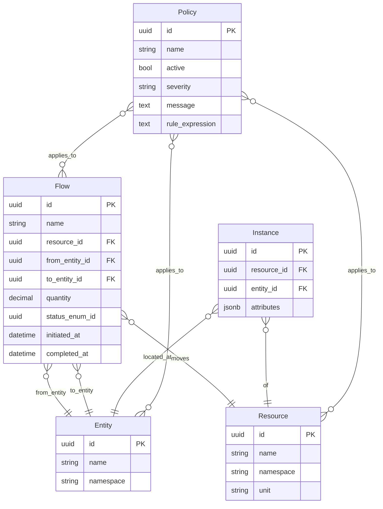

## ER Diagram: SEA DSL Primitives

### Design Rationale
- Captures essential relationships for validation queries (REQ-012).
- Fields such as `status_enum_id` allow linking to enumerations defined elsewhere.

### Related Components
- Consistency constraints elaborated in [sds-data-consistency-model](sds-data-consistency-model.md).
