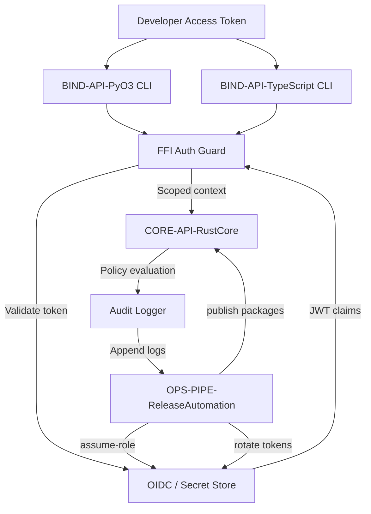

## Authentication & Authorisation Flow

### Design Rationale
- FFI guard ensures tokens validated before core invocation.
- CI release pipeline uses OIDC to avoid long-lived credentials.

### Related Components
- CI/CD specifics described in [sds-deployment-cicd-pipeline](../08-deployment/sds-deployment-cicd-pipeline.md).
