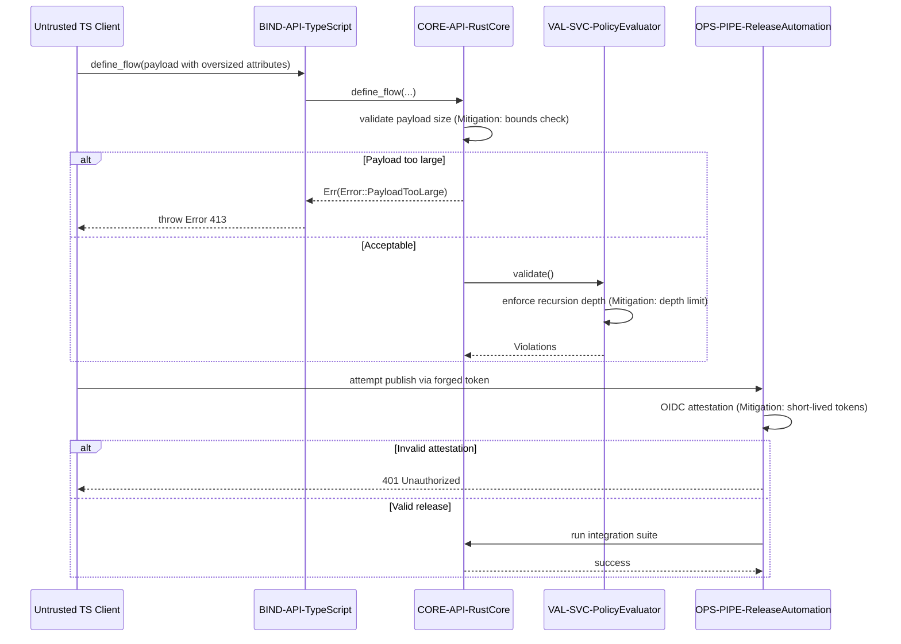

## Threat Scenario Sequence

### Design Rationale
- Captures input validation (size limits) and evaluation recursion guard.
- Shows release pipeline authentication mitigations (OIDC).

### Related Components
- Detailed error mapping in [sds-architecture-error-handling](../03-architecture/sds-architecture-error-handling.md).
