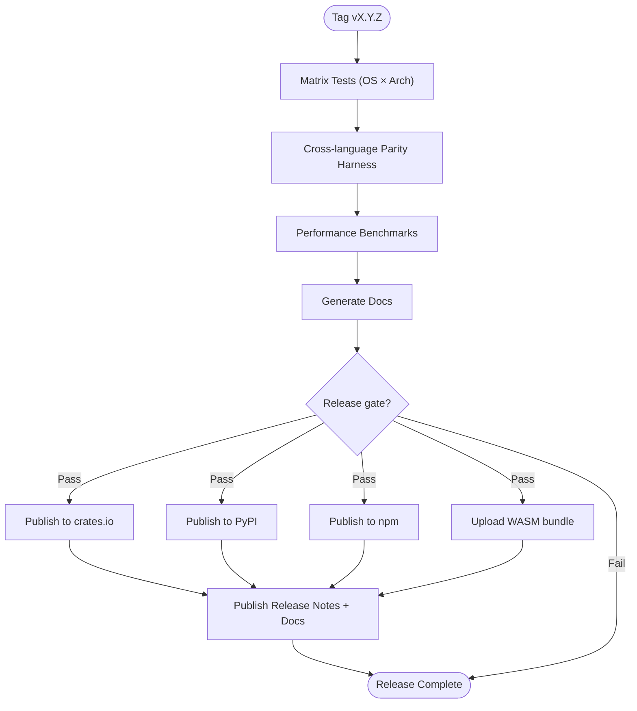

## CI/CD Pipeline Flow

### Design Rationale
- Parity harness gating ensures REQ-015 compliance before releasing.
- Docs generation step enforces REQ-019 documentation update.

### Related Components
- Performance metrics tracked in [sds-deployment-scaling-strategy](sds-deployment-scaling-strategy.md).
