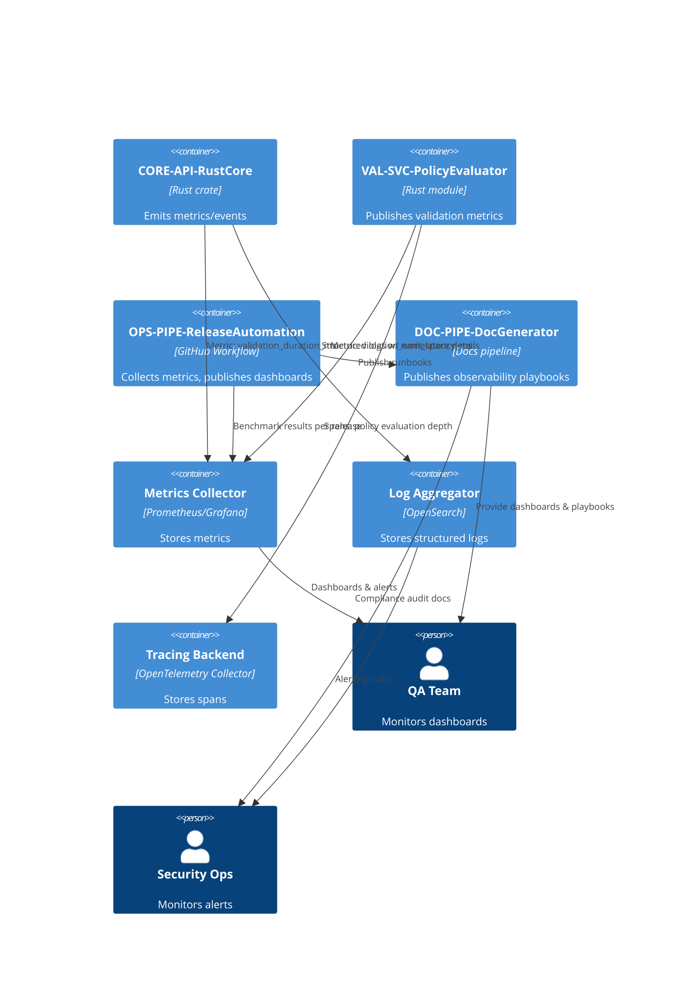

## Observability Integration

### Design Rationale
- Differentiates metrics/logs/traces to pinpoint validation slowdown vs structural errors.
- Observability playbooks ensure docs remain updated (REQ-019).

### Related Components
- Testing integration ensures metrics validated in [sds-testing-strategy](../09-testing/sds-testing-strategy.md).
