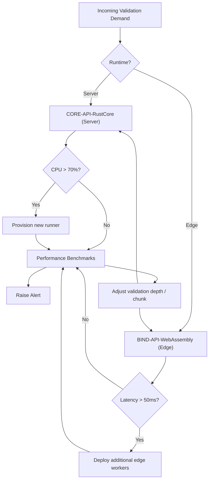

## Scaling & Failover Strategy

### Design Rationale
- Dual-mode scaling: server runners and edge deployments.
- Benchmarks feed auto-tuning to maintain REQ-018 performance thresholds.

### Related Components
- Observability metrics feeding auto-tuning described in [sds-deployment-observability](sds-deployment-observability.md).
