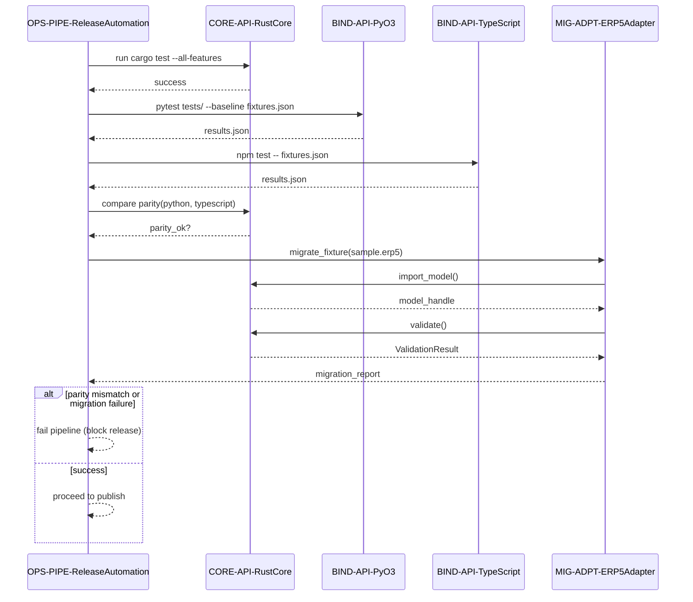

## Integration Test Orchestration

### Design Rationale
- Integration tests chain parity and migration to ensure data correctness before release.
- Fixtures reused to maintain deterministic coverage across languages.

### Related Components
- Migration steps described in [sds-data-migration-strategy](../06-data/sds-data-migration-strategy.md).
