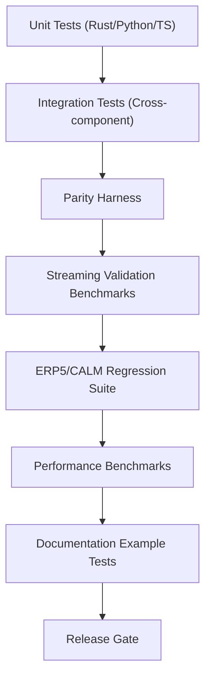

## Testing Strategy Flow

### Design Rationale
- Emphasises parity harness gating prior to streaming/performance tests.
- Documentation examples executed to prevent drift (REQ-019 via docs pipeline).

### Related Components
- Integration scenario specifics in [sds-testing-integration-scenarios](sds-testing-integration-scenarios.md).
