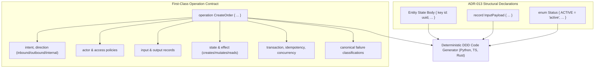

# Explanation: ADR-013 Application Contract Rationale

Why did DomainForge introduce first-class operations, typed entity state bodies, identityless records, enums, and canonical semantic envelopes in ADR-013?

---

## 1. The Historical Limitation: Code Generation Guesswork

Prior to ADR-013, the SEA DSL excelled at capturing enterprise topology:
- Who participates (`Entity`)
- What moves (`Resource`)
- Between whom (`Flow`)
- Under what rules (`Policy`)

However, when code generators attempted to generate production-ready Domain-Driven Design (DDD) domain packages from this topology alone, they hit an architectural wall:
1. **No Typed Entity State**: Entities had no body schema (`Entity "Buyer"` had no fields). Code generators had to inspect example `Instance` records and guess field names and types (e.g. inferring everything as `str`).
2. **Synthesized Method Signatures**: Because there was no concept of an `operation`, code generators synthesized repository and command methods purely from flow shapes. Every flow became an unconfigured method.
3. **No Execution Semantics**: Critical operational properties—such as whether an operation creates or mutates state, what input payload it accepts, how failures are categorized, what transaction boundary applies, and whether idempotency is enforced—had zero representation in the DSL.

As a result, generated code was an incomplete skeleton requiring extensive manual editing, which defeated the purpose of a single source of truth.

---

## 2. The Solution: First-Class Application Contracts

ADR-013 established an authoritative, machine-checkable Application Contract layer directly in the SEA grammar:

### Core Design Distinctions
1. **Entity State vs Record**:
   - An **Entity** has an identity (`key`), represents a persistent aggregate root, and tracks state lifecycle.
   - A **Record** is an identityless data transfer object (DTO) used exclusively for operation inputs, outputs, and structured failure details.
2. **Operations as Single Units of Meaning**:
   An operation explicitly binds the participant actor, input schema, output schema, affected state aggregate, transaction boundary, and idempotency strategy. Code generators produce concrete, typed methods without guessing.
3. **Canonical Semantic Envelope**:
   Seals the resolved application contract with source set hashes, dependency pack signatures, and input fingerprints into a tamper-evident document.

---

## 3. Rejected Alternatives

- **Generic Annotations (`@field`, `@operation`)**: Rejected because generic key-value annotations lack formal parser syntax, type checking, schema validation, and compiler diagnostics.
- **Mapping / Projection Overrides**: Rejected because mapping overrides are intended to choose realization details for existing meaning; they cannot invent meaning that was omitted from the source model.
- **Non-Semantic Profiles**: Rejected because profiles are reserved for non-semantic deployment configuration (port numbers, listen addresses); smuggling business types into profiles violates separation of concerns.

---

## Source Trail
- `docs/specs/ADR-013-sea-application-contract.md` — Formal architectural decision record
- `docs/reference/sea-application-contract.md` — Normative field-by-field specification
- `domainforge-core/src/application/contract.rs` — Rust data model for application contracts
- `domainforge-core/src/application/resolve.rs` — Contract resolution engine
- `domainforge-core/tests/application_contract_tests.rs` — Contract verification suite
