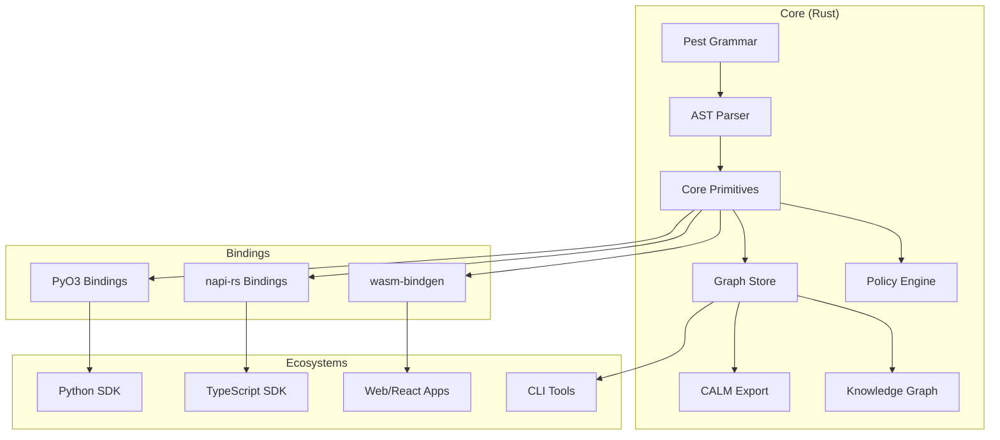

# Architecture Overview

DomainForge (SEA) is built on a **Rust-first, multi-language** architecture designed to provide a single source of truth for semantic modeling while remaining accessible to developers in Python, TypeScript, and the web.

## High-Level Architecture

The system is organized as a central Rust core that projects its functionality outwards to other ecosystems through high-performance bindings.

## Core Components (`sea-core`)

The `sea-core` crate is the canonical implementation of the Semantic Enterprise Architecture DSL.

### 1. Grammar & Parsing

- **Source**: `sea-core/grammar/sea.pest`

- **Technology**: [Pest](https://pest.rs/) (PEG parser)

- **Role**: Defines the authoritative syntax. All language changes start here. The parser generates an Abstract Syntax Tree (AST) which is then lowered into semantic primitives.

### 2. Primitives

- **Location**: `sea-core/src/primitives/`

- **Types**: `Entity`, `Resource`, `Flow`, `Instance`, `Policy`
- **Role**: These are the domain objects. They are rich structs containing metadata, configuration, and relationships. They are designed to be serialized/deserialized and passed across FFI boundaries.

### 3. Graph Store

- **Location**: `sea-core/src/graph/mod.rs`
- **Technology**: `IndexMap` (for deterministic iteration)

- **Role**: Acts as the in-memory database for the model. It resolves references (e.g., linking a Flow to its source Entity) and enables graph traversal algorithms.

### 4. Policy Engine

- **Location**: `sea-core/src/policy/`
- **Logic**: Three-valued logic (True, False, Unknown)
- **Role**: Evaluates constraints against the model. It handles type inference and expression evaluation.

## Binding Strategy

We do not reimplement logic in other languages. Instead, we wrap the Rust types.

- **Python**: Uses [PyO3](https://pyo3.rs/). Rust structs are exposed as Python classes. Methods call directly into Rust code.
- **TypeScript**: Uses [napi-rs](https://napi.rs/). High-performance Node.js addons.
 - **WASM**: Uses [wasm-bindgen](https://github.com/rustwasm/wasm-bindgen). Allows the full compiler and policy engine to run in the browser.

## Key Design Principles

1. **Canonical Core**: Business logic exists only in Rust. If a bug is fixed in Core, it is fixed for Python, TS, and CLI simultaneously.
2. **Deterministic Execution**: We use `IndexMap` instead of `HashMap` to ensure that policy evaluation order and export formats are stable across runs.
3. **Zero-Copy (where possible)**: Bindings attempt to reference memory rather than copy it, though serialization is sometimes necessary for complex object graphs.

## See Also

- [Semantic Modeling Concepts](semantic-modeling-concepts.md)
- [Cross-Language Binding Strategy](cross-language-binding-strategy.md)
- [Graph Store Design](graph-store-design.md)
