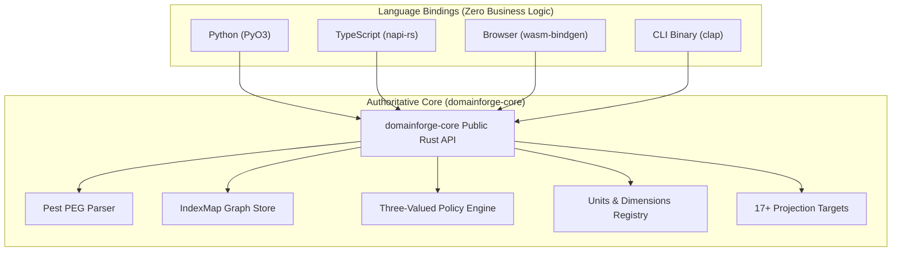

# Explanation: The Canonical Semantic Core Architecture

Why does DomainForge enforce a single, authoritative Rust core with thin foreign-language wrappers, rather than developing native libraries for Python, TypeScript, and Go?

---

## 1. The Problem: The Multi-Language Divergence Trap

In multi-language enterprise developer platforms, companies often attempt to build independent, native SDKs for each supported programming language. For example, a validation engine might be written once in Python for data scientists, once in TypeScript for frontend engineers, and once in Go or Java for backend microservices.

Inevitably, this approach leads to **semantic divergence**:
- Small differences in regex engines cause an identifier accepted in Python to be rejected in Node.js.
- Nuances in floating-point math or decimal libraries produce rounding discrepancies in financial flows.
- Bug fixes applied to the TypeScript library are delayed or forgotten in Python.
- Over time, developers lose trust in the platform because the same model behaves differently depending on which language environment validates it.

---

## 2. The Confirmed Design Rationale: Single Source of Truth

DomainForge resolves this trap by establishing one inviolable invariant: **all business logic, parsing, semantic graph structures, policy evaluation, and dimensional analysis exist solely within the Rust core crate (`domainforge-core`)**.

### Why Rust?
1. **Memory Safety Without Garbage Collection**: Rust provides guaranteed memory safety and deterministic destruction without requiring a runtime garbage collector. This makes it embeddable in any foreign host process (CPython, V8, QuickJS, WebAssembly) without GC-pause interference.
2. **Zero-Overhead FFI**: Rust compiles directly to native C-compatible ABIs. Through PyO3 and napi-rs, host languages call directly into compiled machine code with near-zero overhead.
3. **WebAssembly as a First-Class Target**: Rust compiles cleanly to `wasm32-unknown-unknown`, allowing the identical compiler and policy engine to run client-side in the user's web browser.

---

## 3. Rejected Alternatives

- **Re-implementing in Each Target Language**: Rejected immediately due to the insurmountable maintenance burden and guaranteed semantic divergence across releases.
- **Microservice / REST Daemon Architecture**: Running the core as a local background daemon (e.g. over gRPC or HTTP) was rejected because it introduces process lifecycle complexities, port conflicts, socket permissions, and latency overhead that break local CLI and embedded library use cases.
- **C/C++ Core**: Rejected because memory unsafety (use-after-free, buffer overflows) introduces catastrophic vulnerabilities into an engine responsible for evaluating security and compliance rules.

---

## 4. Consequences & Trade-Offs

### Advantages
- **100% Cross-Language Parity**: If a test passes in Rust, it behaves identically in Python, TypeScript, and WebAssembly.
- **Rapid Feature Velocity**: New primitives, grammar rules, or validation constraints are implemented once in Rust and become instantly available to all language bindings.
- **Enterprise Verification**: Running `just all-tests` validates the entire cross-language ecosystem in seconds.

### Costs & Trade-Offs
- **Toolchain Complexity**: Developers contributing to the bindings must have Rust, Cargo, Python (with maturin), and Node.js/Bun installed locally.
- **Build Times**: Compiling native C-extensions takes longer than building pure interpreted Python or TypeScript scripts.
- **FFI Boundary Marshalling**: Data passing between the host language and Rust must cross the FFI boundary, which requires careful serialization design (e.g. `serde-wasm-bindgen`).

---

## Source Trail
- `domainforge-core/src/lib.rs` — Authoritative crate root and public re-exports
- `domainforge-core/src/python/` — PyO3 CPython extension module
- `domainforge-core/src/typescript/` — napi-rs Node-API native addon
- `domainforge-core/src/wasm/` — wasm-bindgen browser integration
- `justfile:50` — `just all-tests` recipe verifying parity across all language suites
