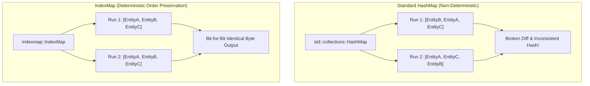

# Explanation: Determinism & The `IndexMap` Invariant

Why is `std::collections::HashMap` strictly forbidden in DomainForge for storing domain concepts, and why is `indexmap::IndexMap` mandatory across the entire Graph Store and Projection Engine?

---

## 1. The Problem: Non-Deterministic Hashing & Dirty Git Diffs

In the Rust standard library, `std::collections::HashMap` is designed with cryptographic security in mind. It uses the SipHash algorithm with a randomly generated 128-bit key initialized per-process.

This means:
1. Two separate executions of the same program with the exact same input data will insert keys into `HashMap` buckets in different orders.
2. Iterating over a `HashMap` (`for (k, v) in map.iter()`) produces elements in **arbitrary, pseudo-random order**.

In a compiler or code generation platform, non-deterministic iteration is catastrophic:
- If you project a model into BPMN XML or Python code twice in a row, the tags or classes appear in different orders each time.
- Automated CI pipelines generate noisy, meaningless Git diffs where lines simply swapped places.
- Cryptographic content hashes (such as `source_graph_hash` or `meaning_fingerprint`) fluctuate randomly between rebuilds, making reproducible builds impossible.

---

## 2. The Confirmed Solution: `indexmap::IndexMap`

DomainForge enforces a strict repository-wide invariant: **`IndexMap` is used for all policy-relevant collections, graph stores, and projection emission pipelines**.



### Key Properties of `IndexMap`
1. **Insertion-Order Preservation**: Iteration follows the exact order in which entities, resources, and policies were authored in the source `.sea` file or inserted into the graph.
2. **Fast Hash Lookups**: Provides $O(1)$ amortized average lookup time by key (`ConceptId`), matching `HashMap` lookup performance.
3. **Deterministic Serialization**: When serialized to JSON, YAML, or XML, properties and elements always appear in predictable sequence.

---

## 3. Code Conventions (Anti-Pattern vs Correct)

```rust
// ❌ WRONG: HashMap causes non-deterministic policy evaluation and unstable outputs
use std::collections::HashMap;
pub struct Graph {
    entities: HashMap<ConceptId, Entity>,
    flows: HashMap<ConceptId, Flow>,
}

// ✅ CORRECT: IndexMap preserves insertion order deterministically
use indexmap::IndexMap;
pub struct Graph {
    entities: IndexMap<ConceptId, Entity>,
    flows: IndexMap<ConceptId, Flow>,
}
```

---

## 4. Verification in CI

The `CLAIM-DETERMINISM` and `CLAIM-PACK-FINGERPRINT` proofs in [PROOFS.md](../../PROOFS.md) verify this property automatically:
- `bash scripts/prove/canonical.sh` projects the same fixture twice in two isolated directories with a pinned `--created-at` timestamp and executes `diff -r`. The diff must be completely empty.
- `tests/phase_14_determinism_tests.rs` tests graph iteration stability across 8 consecutive re-projections.

---

## Source Trail
- `domainforge-core/src/graph/mod.rs:34` — `Graph` struct defining all collections as `IndexMap`
- `domainforge-core/src/concept_id.rs` — Deterministic UUID v5 keys
- `domainforge-core/tests/phase_14_determinism_tests.rs` — Determinism regression tests
- `scripts/prove/canonical.sh` — Automated byte-comparison proof script
