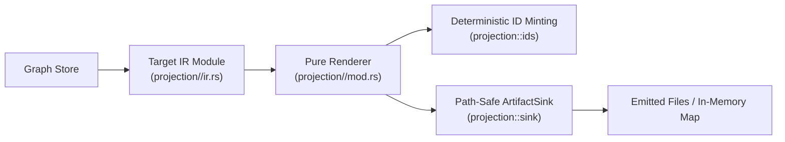

# Explanation: The Operator Family Pattern (ADR-011)

Why are DomainForge's 17+ projection targets decoupled using the **Operator Family Pattern**, and how does this pattern allow the system to scale to dozens of external toolchains without architectural degradation?

---

## 1. The Challenge: Projection Sprawl & Inconsistency

As an enterprise semantic modeling engine grows, demand rises to project models into an ever-expanding array of external toolchains:
- Enterprise architecture tools (FINOS CALM, ArchiMate 3.0)
- Process and workflow engines (BPMN 2.0, CMMN 1.1)
- Knowledge graphs (RDF Turtle, JSON-LD, OWL)
- Formal verification engines (TLA+, Lean 4, Alloy)
- Event brokers (CloudEvents, AsyncAPI)
- AI development frameworks (BAML, DSPy, ZenML)
- Typed programming languages (Python, TypeScript, Rust)

If each export target is built as an ad-hoc script with its own naming conventions, file-writing mechanisms, and ID generators, the codebase quickly devolves into an unmaintainable tangle of conflicting outputs and leaky abstractions.

---

## 2. The Solution: The Operator Family Pattern

[ADR-011](../specs/ADR-011-operator-backed-projection-families.md) introduces the **Operator Family Pattern**. An "operator family" is a class of external tooling that operates over a specific semantic projection of the model.

Every operator family in DomainForge adheres to an identical, uniform kernel structure:

### The Six Mandatory Components of Every Family
1. **Target-Specific Intermediate Representation (IR)**: Translates generic graph concepts into target-native constructs (e.g. converting flows into BPMN `SequenceFlow` elements).
2. **Pure Renderer**: A stateless rendering function `emit(&graph, &config, &mut ArtifactSink)`. Renderers are read-only and never mutate the graph.
3. **Shared ID Minting (`ids.rs`)**: Element IDs are generated via xxh64 hashing (seed 42) of a family tag and concept parts joined with `U+0001`, preventing cross-family ID collisions.
4. **Path-Safe Artifact Sink (`ArtifactSink`)**: All file emissions route through an abstraction that enforces directory containment, preventing path traversal attacks.
5. **Standard Proving Fixture**: Every family is tested against `fixtures/projection_cell/basic/model.sea`.
6. **External Toolchain Gate Script**: Each family is verified in CI using its ecosystem's native toolchain (e.g. SANY+TLC for TLA+, official JSON schema for AsyncAPI, `mypy` for Python, `tsc` for TypeScript).

---

## 3. Architectural Benefits

- **Isolation**: Adding or updating one projection family cannot affect the behavior or stability of another.
- **Byte-Level Determinism**: By routing all ID generation through `ids.rs` and writing timestamps through a pinned `--created-at` parameter, every family produces byte-identical files on every run.
- **WASM Gating**: Projection families are compiled conditionally. The WASM bundle excludes heavy projection renderers by default to satisfy browser bundle size limits (< 2.5 MB).

---

## Source Trail
- `docs/specs/ADR-011-operator-backed-projection-families.md` — Formal architectural decision record
- `domainforge-core/src/projection/mod.rs` — Projections engine facade
- `domainforge-core/src/projection/ids.rs` — Shared deterministic ID hashing kernel
- `domainforge-core/src/projection/sink.rs` — Path-safe `ArtifactSink`
- `docs/projection-families.md` — Complete reference table of operator families
- `PROOFS.md` — Toolchain verification status ledger
