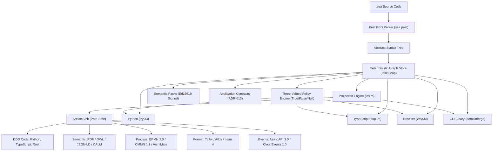

# DomainForge Technical Knowledge System

Welcome to the **DomainForge** technical documentation system. DomainForge is a deterministic intermediate representation (IR) compiler and semantic reasoning engine for enterprise systems architecture. It captures organizational meaning—actors, flows, resources, operational contracts, and business rules—in a human-readable domain-specific language (SEA DSL) and projects that meaning into 17+ external operational ecosystems.

---

## 🧭 Navigation by Intent

Choose the entry point that matches your current goal:

| I want to... | Recommended Path | Key Resource |
|---|---|---|
| **Understand what this is in 5 minutes** | Fast orientation, initial mental model, and first journey. | [Orientation](orientation.md) |
| **Learn the conceptual foundations** | Deep mental model, domain vocabulary, and core abstractions. | [Mental Model](mental-model.md) |
| **Explore the technical architecture** | Subsystems, runtime topology, data transformations, and invariants. | [System Architecture](architecture.md) |
| **Find where something is implemented** | Complete map of symbols, files, and crate locations. | [Source Map](source-map.md) |
| **Follow an end-to-end execution trace** | Step-by-step code paths for parsing, validation, and projection. | [Workflows](workflows/parse-and-validate.md) |
| **Build a working model hands-on** | Step-by-step tutorial creating a real domain model. | [First SEA Model Tutorial](tutorials/01-first-sea-model.md) |
| **Solve a specific task or extend the engine** | How-to guides for adding targets, policies, and grammar. | [How-To Guides](how-tos/add-projection-target.md) |
| **Look up CLI flags, grammar, or error codes** | Precision reference documentation for APIs and CLI. | [Technical Reference](reference/cli-reference.md) |
| **Diagnose an error or validation failure** | Troubleshooting playbook for common issues and fixes. | [Troubleshooting Guide](troubleshooting.md) |

---

## 🏗️ Architecture at a Glance

DomainForge enforces a strict **canonical core** pattern: the authoritative engine is written entirely in Rust, while Python, TypeScript, and WebAssembly bindings wrap the Rust core with zero business logic duplication.



---

## 📚 Diátaxis Documentation Structure

Our documentation strictly follows the **Diátaxis framework**, cleanly separating learning, problem-solving, understanding, and reference:

```text
docs/
├── orientation.md                   # Quickstart Orientation & 5-minute mental track
├── mental-model.md                  # Conceptual model and domain vocabulary
├── architecture.md                  # Comprehensive architectural specification
├── documentation-map.md             # Complete index of all pages and metadata
├── source-map.md                    # Symbol-level code traceability catalog
├── troubleshooting.md               # Operational failure diagnosis and fixes
│
├── subsystems/                      # Deep architectural subsystem guides
├── workflows/                       # Dynamic end-to-end execution traces
├── explanations/                    # Architectural decisions, rationale, and invariants
├── tutorials/                       # Guided hands-on learning experiences
├── how-tos/                         # Goal-oriented recipe guides for maintainers
└── reference/                       # Precision specifications, grammar, CLI, & error codes
```

---

## ⚖️ Verifiable Technical Truth

DomainForge maintains a machine-checked proof ledger in [PROOFS.md](../PROOFS.md). Every public claim made about projection validity, determinism, or schema conformance is provable via `just prove`, generating machine-readable evidence in `evidence/latest/proof.json`.
