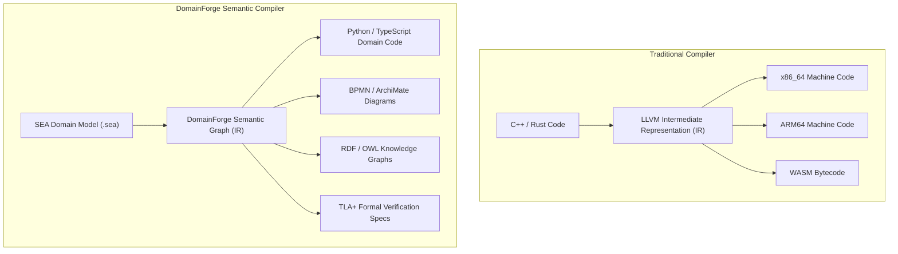
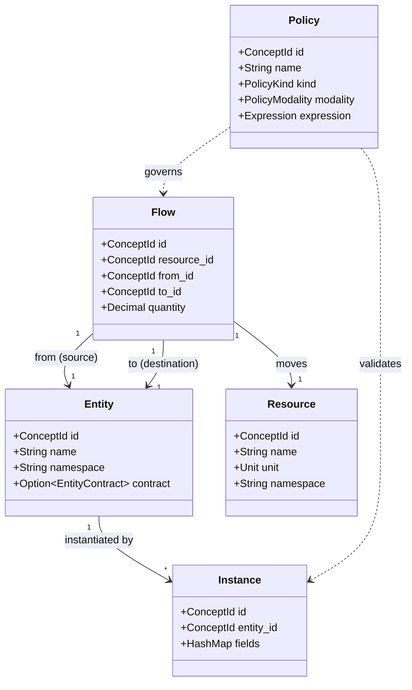

# DomainForge Mental Model

This document explains the conceptual foundations and abstractions of DomainForge. It is designed to give you a deep understanding of *what* the system models and *why* its abstractions are structured the way they are, without getting lost in parsing or FFI code.

---

## 1. The Core Analogy: A Compiler for Organizational Meaning

In traditional computer science, a compiler translates human-written high-level programming language code into an **Intermediate Representation (IR)** before lowering that IR into machine code for various targets (x86_64, ARM64, WASM).



**Returning from the analogy to the concrete system**:
DomainForge is literally an optimizing compiler whose "source language" is the **SEA DSL**, whose "IR" is the in-memory **`Graph` of semantic primitives**, and whose "backend targets" are **operator families** projecting to code, diagrams, schemas, and proofs.

By compiling organizational meaning once, you eliminate the catastrophic drift that occurs when engineers, analysts, and auditors manually maintain separate copies of the same domain rules.

---

## 2. The Core Primitives

DomainForge models reality through a small, cohesive set of primitives:



### 1. Entities: The Actors
An **Entity** represents an autonomous participant, actor, service boundary, or aggregate root.
- **Identity**: Every entity is identified by a `ConceptId` generated via UUID v5 from its namespace and name.
- **State Schema (ADR-013)**: An entity may declare typed state fields with a designated primary `key`.
- *Example*: `Entity "Warehouse" in logistics`

### 2. Resources: What Moves
A **Resource** represents a discrete asset, material, message, token, or currency that moves between entities.
- **Dimensions & Units**: Resources bind to physical or financial units (e.g. `USD`, `kg`, `meters`, `records`).
- *Example*: `Resource "Payment" USD in finance`

### 3. Flows: The Directed Movement
A **Flow** captures the transfer of a quantified resource from one entity to another.
- **IDs vs References**: A Flow does not store object references; it stores the `ConceptId` of the source entity, target entity, and resource.
- **Distinct Events**: Two flows with identical resource, source, target, and quantity represent distinct physical movements and are assigned unique identities.
- *Example*: `Flow "Payment" from "Buyer" to "Supplier" quantity 100`

### 4. Instances: Concrete Reality
An **Instance** represents a specific, instantiated record of an Entity containing concrete field values.
- **Schema Validation**: The graph checks instances against their entity's schema, enforcing types (`int`, `string`, `decimal`, `uuid`, `timestamp`), nullability (`optional`), and scalar constraints (`min_length`, `max`, `pattern`).
- *Example*:
  ```sea
  Instance vendor_acme of "Vendor" {
    name: "Acme Corp",
    credit_limit: 50000 "USD"
  }
  ```

### 5. Policies: Executable Invariants
A **Policy** is a business rule, compliance requirement, or structural constraint.
- **Modalities**: Expressed as `Obligation` (must be true), `Prohibition` (must not be true), or `Permission`.
- **Quantification**: Can quantify over entire collections: `forall f in flows: (...)` or `exists i in instances: (...)`.
- *Example*:
  ```sea
  policy max_exposure per Constraint Obligation priority 1
    as:
      sum(f in flows where f.resource = "Loan": f.quantity) <= 1000000
  ```

---

## 3. The Role of Three-Valued Logic

Why does DomainForge use SQL-like Kleene **Three-Valued Logic (`True`, `False`, `Null`/`Unknown`)** instead of standard two-valued booleans?

In enterprise architecture, information is frequently **partial** or **distributed**:
- An entity instance may lack an optional field (e.g., `tax_id` is missing).
- A sub-department may not have registered its approval status yet.
- A policy may test an attribute of a newly connected service that is not yet populated.

In a strict two-valued system, missing data must evaluate to either `True` or `False`. If it defaults to `False`, the policy engine emits a false violation (sounding alarms for incomplete records). If it defaults to `True`, it creates a false-positive security grant (authorizing unverified requests).

Three-valued logic prevents both failures:
- `True and Null` $\rightarrow$ `Null`
- `False and Null` $\rightarrow$ `False` (safe short-circuit)
- `not Null` $\rightarrow$ `Null`

When validation runs, only expressions that evaluate to **`False`** trigger violations. Expressions evaluating to `Null` are reported as `Unknown`, guiding operators to provide missing data without treating the system as compromised.

---

## 4. Architectural Invariants

Every subsystem in DomainForge respects four non-negotiable invariants:

1. **Determinism over Speed**: Given identical inputs, DomainForge produces identical outputs bit-for-bit across different platforms (Linux, macOS, Windows, WASM). `std::collections::HashMap` is banned; `IndexMap` is mandatory.
2. **Pure Lowering**: Projection targets never modify the semantic model. Projections are pure functions: $P(Graph) \rightarrow Artifacts$.
3. **No Hidden State**: The model contains no hidden magical defaults. If a flow requires a currency, the unit must be explicitly declared or inherit from a registered dimension.
4. **Thin FFI**: Foreign language wrappers (Python, TypeScript, WASM) only translate types; they contain zero domain verification logic.

---

## Source Trail
- `domainforge-core/src/primitives/` — Definitions of `Entity`, `Resource`, `Flow`, `Instance`, `Policy`
- `domainforge-core/src/graph/mod.rs` — In-memory storage of primitives in `IndexMap`
- `domainforge-core/src/policy/three_valued.rs` — `ThreeValuedBool` Kleene truth operations
- `domainforge-core/src/concept_id.rs` — Deterministic content addressing
