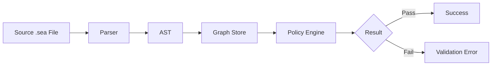

# Policy Evaluation Logic

The policy engine is the brain of DomainForge. It verifies that an architecture model adheres to defined rules. This document explains how policies are parsed, evaluated, and enforced.

## Evaluation Flow

## Expression Parsing

Policies are written in a subset of the SEA DSL designed for logic. Expressions are parsed into an expression tree defined in `sea-core/src/policy/expression.rs`.

Common expression types:
- **Quantifiers**: `forall`, `exists`
- **Comparisons**: `==`, `!=`, `>`, `<`
- **Logical Operators**: `and`, `or`, `not`, `implies`
- **Property Access**: `f.from.type`

## Variable Binding

When a quantifier is evaluated (e.g., `forall f in Flow`), the engine:
1. Iterates deterministically over the collection (`Flow`).
2. Binds the current item to the variable name (`f`).
3. Evaluates the inner expression body with this context.

## Evaluation Order

Evaluation is strictly deterministic due to the use of `IndexMap` in the underlying graph store.
1. **Global Scope**: Constants and global definitions are loaded.
2. **Policy Iteration**: Policies are evaluated in the order they appear in the source file (or import order).
3. **Short-Circuiting**:
   - `forall`: Stops at the first `False` result (returns `False`).
   - `exists`: Stops at the first `True` result (returns `True`).

## Three-Valued Logic

The engine uses Kleene's three-valued logic (`True`, `False`, `Unknown`).
- If a property is missing (e.g., `f.encryption`), the comparison returns `Unknown` rather than crashing or defaulting to false.
- This allows policies to distinguish between "bad architecture" (False) and "incomplete architecture" (Unknown).

## Side Effects

Policy evaluation is **read-only**. It cannot modify the graph. It produces a list of `ValidationResult` objects, which contain:
- The policy name.
- The result (Pass/Fail/Unknown).
- A trace of the specific elements that caused a failure (e.g., the specific Flow that violated the rule).

## See Also

- [Three-Valued Logic](three-valued-logic.md)
- [Graph Store Design](graph-store-design.md)
