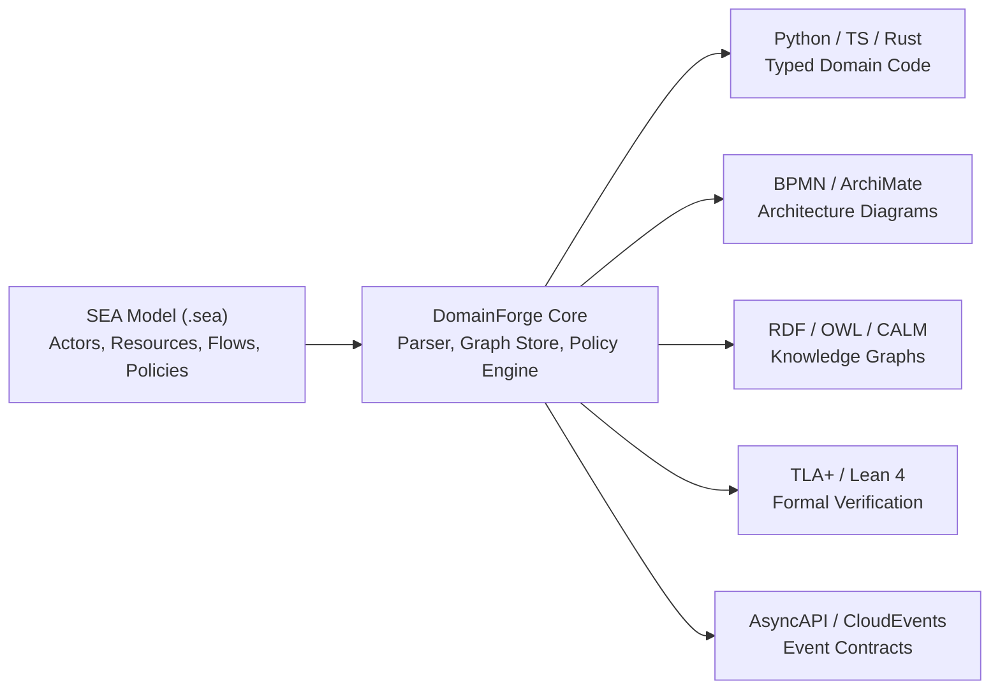

# Orientation: The 5-Minute Fast Track

If you are new to DomainForge, this guide gives you the mental model, vocabulary, and understanding you need in five minutes without drowning in implementation details.

---

## 1. What This Project Is

**DomainForge** is a compiler and reasoning engine for enterprise systems architecture.

In traditional software development, enterprise business rules and architecture models live in disconnected silos: prose requirements documents, TypeScript frontend validations, Python backend services, architectural diagrams, and compliance audit spreadsheets. When business logic changes, developers must manually update all five places, inevitably leading to drift and system failure.

DomainForge replaces this folklore with an executable, single source of truth:
1. You write your domain—actors, resources, flows, operational contracts, and business policies—in a concise, readable language called **SEA (Semantic Enterprise Architecture)**.
2. The DomainForge engine parses and validates your model with mathematical determinism.
3. It deterministically projects your model into 17+ external operational formats: Python/TypeScript/Rust domain code, BPMN 2.0 diagrams, FINOS CALM architecture models, RDF knowledge graphs, AsyncAPI specifications, and TLA+ formal verification proofs.

---

## 2. The System in One Picture



---

## 3. The 7 Concepts You Need First

1. **Entity**: A participant, actor, or boundary in your organization (e.g., `Buyer`, `Supplier`, `Warehouse`).
2. **Resource**: An asset, currency, token, or data payload that entities exchange (e.g., `PurchaseOrder`, `Payment`, `AuditLog`).
3. **Flow**: The movement of a specific quantity of a resource from a source entity to a destination entity (e.g., transfer 100 `USD` from `Buyer` to `Supplier`).
4. **Policy**: An executable constraint or obligation governing flows and state (e.g., "Every purchase order over $10,000 must be approved before payment").
5. **Three-Valued Logic**: The policy engine uses `True`, `False`, and `Null` (`Unknown`). If data is missing or not applicable, the system yields `Unknown` instead of creating false positives.
6. **Semantic Pack**: A cryptographically signed, frozen JSON dictionary of approved organizational vocabulary, preventing naming drift across multiple teams and repositories.
7. **Projection**: An automatic, deterministic export of the semantic graph into a specific external technology format via an operator family.

---

## 4. A Representative Journey: From Model to Artifacts

Here is an end-to-end walkthrough of a real procurement model:

### Step 1: Declare the Domain (`procurement.sea`)
```sea
@namespace "procurement"
@version "1.0.0"

Entity "Buyer" in procurement
Entity "Supplier" in procurement

Resource "Payment" USD in procurement

Flow "Payment" from "Buyer" to "Supplier" quantity 500

policy require_approval per Constraint Obligation priority 1
  @rationale "All payments must be formally approved"
  as:
    1 = 1
```

### Step 2: Validate the Model
Run the CLI validator:
```bash
domainforge validate procurement.sea
```
The engine parses the file, builds an in-memory graph, verifies units and dimensions (ensuring `USD` is a registered currency), and executes all policies using three-valued logic.

### Step 3: Project to Target Ecosystems
Project to a production-ready Python DDD package:
```bash
domainforge project --format domain-python procurement.sea ./out-python
```
The projection engine generates a complete, typed Python package (`aggregates.py`, `commands.py`, `events.py`, `ports/`) where the `require_approval` policy is generated as an un-skippable assertion inside the `Payment.transfer_to_supplier()` method!

Project the exact same model to BPMN process XML:
```bash
domainforge project --format bpmn procurement.sea ./out-bpmn
```
Now your enterprise architects and business analysts can open `process.bpmn` in standard modeling tools (Camunda, Signavio) and view the identical flow.

---

## 5. Where to Go Next

Choose your next destination based on your role:

- **"I want to explore the conceptual architecture deeper"**<br>
  👉 Continue to the [Mental Model](mental-model.md).
- **"I want to write and run code right now"**<br>
  👉 Follow the [First SEA Model Tutorial](tutorials/01-first-sea-model.md).
- **"I need to understand the codebase and contribute"**<br>
  👉 Study the [System Architecture](architecture.md) and [Source Map](source-map.md).
- **"I am looking for exact syntax or CLI options"**<br>
  👉 Jump to the [CLI Reference](reference/cli-reference.md) or [DSL Grammar Reference](reference/dsl-grammar-reference.md).
