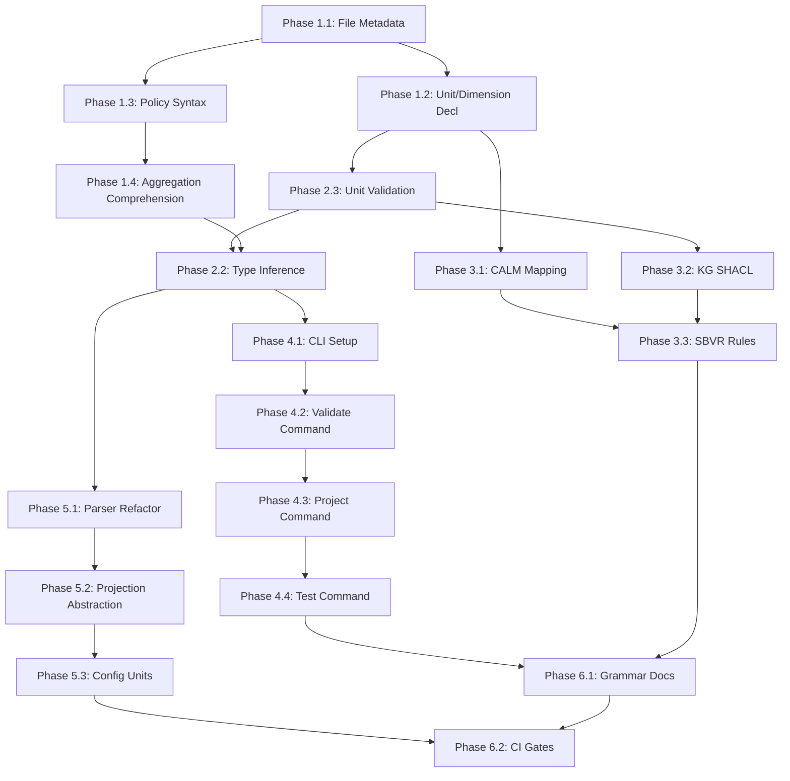

# SEA DSL Enhancement: Hardening and Feature Implementation

## Overview

This plan implements all recommendations from the current state analysis to harden the SEA DSL framework. The plan addresses determinism, policy metadata, richer operators, aggregation improvements, unit/dimension handling, projection scaffolds, and comprehensive error handling.

### Key Objectives

1. **Enhance DSL surface syntax** with file-level metadata, unit/dimension declarations, and policy modality annotations
2. **Strengthen determinism** through explicit quantifier expansion and stable evaluation order
3. **Improve aggregation functions** with inline filtering and comprehension syntax
4. **Formalize projection mappings** with normative tables and SHACL shapes
5. **Build production-grade CLI** with validation, projection, and testing commands
6. **Eliminate technical debt** identified in parser, evaluation, and projection modules

---

## Task Breakdown

### Phase 1: Grammar and Parser Enhancement

#### Task 1.1: File-Level Metadata Support

**Objective**: Add header annotations for namespace, version, and ownership to reduce repetition and improve scoping.

**Changes**:
- **Grammar** (`sea-core/grammar/sea.pest`):
  - Add `file_header` rule for `@namespace`, `@version`, `@owner` annotations
  - Update `program` rule to parse optional header before declarations
  - Add `annotation` rule pattern: `"@" ~ annotation_name ~ string_literal`

- **Parser AST** (`sea-core/src/parser/ast.rs`):
  - Add `FileMetadata` struct with `namespace`, `version`, `owner` fields
  - Add `Ast::metadata` field
  - Update `parse_source()` to extract header metadata
  - Implement resolution rule: declaration-level overrides file defaults

- **Graph Builder**:
  - Apply file metadata defaults when creating entities/resources/policies
  - Preserve explicit declaration-level metadata

**Example Syntax**:
```
@namespace "com.acme.finance"
@version "2.2.0"
@owner "team-payments"

Entity "Vendor" in procurement
Resource "Money" unit "USD" in finance
```

#### Task 1.2: Unit and Dimension Declaration Syntax

**Objective**: Allow authors to declare custom dimensions and units in DSL files.

**Changes**:
- **Grammar** (`sea-core/grammar/sea.pest`):
  - Add `dimension_decl` rule: `Dimension string_literal`
  - Add `unit_decl` rule: `Unit string_literal of string_literal factor number base string_literal`
  - Update `declaration` to include `dimension_decl | unit_decl`
  - Add optional unit suffix to `number`: `number ~ identifier?` for quantity literals

- **Parser AST** (`sea-core/src/parser/ast.rs`):
  - Add `AstNode::Dimension { name }`
  - Add `AstNode::UnitDeclaration { symbol, dimension, factor, base_unit }`
  - Add `QuantityLiteral { value, unit }` variant

- **Parser to Graph** (`sea-core/src/parser/mod.rs`):
  - Register custom dimensions/units in global registry during graph construction
  - Validate unit literals against registry

- **Units Module** (`sea-core/src/units/mod.rs`):
  - Add `UnitRegistry::register_dimension(name)`
  - Add validation for duplicate dimension/unit names

**Example Syntax**:
```
Dimension "Currency"
Unit "USD" of "Currency" factor 1 base "USD"
Unit "EUR" of "Currency" factor 1.07 base "USD"

Resource "Money" unit "USD" in finance

Flow "Payment" from "AP" to "Vendor" quantity 1_500 "USD"
```

#### Task 1.3: Policy Modality and Priority Syntax

**Objective**: Expose policy metadata (modality, kind, priority, rationale, tags) in DSL syntax.

**Changes**:
- **Grammar** (`sea-core/grammar/sea.pest`):
  - Extend `policy_decl` rule: `Policy identifier per policy_kind policy_modality priority number annotations? as: expression`
  - Add `policy_kind` rule: `Constraint | Derivation | Obligation`
  - Add `policy_modality` rule: `Obligation | Prohibition | Permission`
  - Add `policy_annotation` rule: `@rationale string_literal | @tags string_list`

- **Parser AST** (`sea-core/src/parser/ast.rs`):
  - Add `PolicyMetadata` struct with `kind`, `modality`, `priority`, `rationale`, `tags`
  - Update `AstNode::Policy` to include metadata fields

- **Policy Core** (`sea-core/src/policy/core.rs`):
  - Already has fields; wire parser to populate them
  - Add `Policy::with_metadata()` builder

**Example Syntax**:
```
Policy ap_cap per Constraint Obligation priority 5
  @rationale "Limit vendor exposure"
  @tags ["sox", "payments"]
as:
  sum(f in flows where f.resource="Money": f.quantity) <= 5_000
```

#### Task 1.4: Aggregation Comprehension Syntax

**Objective**: Add inline filtering to aggregation functions with comprehension notation.

**Changes**:
- **Grammar** (`sea-core/grammar/sea.pest`):
  - Extend `aggregation_expr` rule: `aggregate_fn "(" identifier "in" collection "where" expression ":" expression ")"`
  - Support legacy syntax: `aggregate_fn "(" collection ("." identifier)? ")"`

- **Parser AST** (`sea-core/src/parser/ast.rs`):
  - Add `AggregationExpression::Comprehension { function, variable, collection, predicate, projection }`
  - Maintain backward compatibility with existing `Aggregation` variant

- **Policy Expression** (`sea-core/src/policy/expression.rs`):
  - Add `Expression::AggregationComprehension` variant
  - Implement evaluation: filter collection by predicate, project field, apply function

**Example Syntax**:
```
sum(f in flows where f.resource = "Money" and f.to.name = "VendorX": f.quantity as "USD")
count(e in entities where e.domain = "logistics")
avg(r in resources where r.dimension = "Currency": r.quantity)
```

---

### Phase 2: Determinism and Type Safety

#### Task 2.1: Explicit Quantifier Expansion Logging

**Objective**: Make quantifier expansion transparent and auditable for debugging.

**Changes**:
- **Quantifier Module** (`sea-core/src/policy/quantifier.rs`):
  - Add `QuantifierExpansionTrace` struct to capture expansion steps
  - Add `expand_with_trace()` method that returns `(Expression, QuantifierExpansionTrace)`
  - Log collection size, substituted variables, and generated sub-expressions

- **Validation Error** (`sea-core/src/validation_error.rs`):
  - Add `DeterminismError::NonDeterministicCollection { collection, hint }` variant
  - Add `DeterminismError::InfiniteExpansion { quantifier, hint }` variant

- **Graph Module** (`sea-core/src/graph/mod.rs`):
  - Document IndexMap guarantee for stable iteration order
  - Add `Graph::verify_deterministic()` method for CI checks

#### Task 2.2: Static Type Inference Pass

**Objective**: Add pre-evaluation type checking to catch errors early.

**Changes**:
- **New Module** (`sea-core/src/type_system/mod.rs`):
  - Add `SeaType` enum: `Boolean`, `Number { dimension, unit }`, `String`, `Entity`, `Resource`, `Flow`, `Collection { element_type }`
  - Add `TypeContext` struct to track variable bindings
  - Add `infer_type(expression, context) -> Result<SeaType, TypeError>` function

- **Validation Error**:
  - Already has `TypeError` variant; extend with `expected_type` and `found_type` fields

- **Parser to Graph**:
  - Call type inference after AST construction
  - Reject programs with type errors before creating graph

**Type Rules**:
- Comparison operators require compatible types (same dimension for numbers)
- Arithmetic operators require numeric operands with dimension compatibility
- Quantifiers introduce typed variable bindings
- Aggregations require compatible collection element types

#### Task 2.3: Unit Dimension Validation

**Objective**: Enforce dimensional consistency in expressions during type checking.

**Changes**:
- **Type System** (`sea-core/src/type_system/mod.rs`):
  - Add `check_dimensional_consistency(left_type, right_type, op) -> Result<SeaType, UnitError>`
  - Disallow addition/subtraction across different dimensions
  - Allow comparison only within same dimension
  - Require explicit `as "unit"` coercion for cross-unit operations

- **Expression Evaluation** (`sea-core/src/policy/expression.rs`):
  - Add `Expression::UnitCoercion { expression, target_unit }` variant
  - Evaluate coercion by calling `UnitRegistry::convert()`

- **Units Module** (`sea-core/src/units/mod.rs`):
  - Add `Dimension::is_compatible(other)` method
  - Add `UnitError::DimensionalMismatch { left, right, operation }` variant

**Example**:
```rust
// Valid: same dimension
sum(flows.quantity as "USD") + 500 "USD"

// Invalid: different dimensions
sum(flows.quantity as "kg") + 100 "USD"  // Error: IncompatibleDimensions
```

---

### Phase 3: Projection Formalization

#### Task 3.1: CALM Normative Mapping Table

**Objective**: Create formal specification for SEA-to-CALM projection.

**Changes**:
- **New File** (`sea-core/schemas/calm-mapping-v2.json`):
  - Define mapping rules: Entity → Node{type: Actor}, Resource → Node{type: Resource}, Flow → Relationship{type: flow}
  - Specify metadata preservation rules
  - Define unit/dimension encoding in CALM metadata

- **CALM Export** (`sea-core/src/calm/export.rs`):
  - Validate exports against mapping spec
  - Add `CalmNode::validate_schema()` method
  - Add unit metadata: `{ "sea:unit": "USD", "sea:dimension": "Currency" }`

- **CALM Import** (`sea-core/src/calm/import.rs`):
  - Implement full reverse transformation
  - Parse unit metadata back to SEA primitives
  - Validate imported data against mapping table

#### Task 3.2: Knowledge Graph SHACL Shapes

**Objective**: Generate SHACL validation shapes for KG exports.

**Changes**:
- **KG Module** (`sea-core/src/kg.rs`):
  - Add `generate_shacl_shapes(graph) -> Vec<ShaclShape>` function
  - Create shapes for:
    - `sea:Entity`: required rdfs:label, sea:namespace
    - `sea:Resource`: required sea:unit, sea:dimension
    - `sea:Flow`: required sea:quantity, sea:from, sea:to
  - Add cardinality constraints (min/max counts)
  - Add datatype constraints (xsd:decimal for quantities)

- **SHACL Property** (extend existing):
  - Add `sh:class` for object property ranges
  - Add `sh:nodeKind` for literal vs IRI validation

- **Export Function** (`to_turtle()`):
  - Include SHACL shapes in exported Turtle files
  - Separate section with `# SHACL Shapes` comment

**Example SHACL**:
```turtle
sea:ResourceShape a sh:NodeShape ;
    sh:targetClass sea:Resource ;
    sh:property [
        sh:path rdfs:label ;
        sh:datatype xsd:string ;
        sh:minCount 1 ;
        sh:maxCount 1 ;
    ] ;
    sh:property [
        sh:path sea:unit ;
        sh:datatype xsd:string ;
        sh:minCount 1 ;
    ] .
```

#### Task 3.3: SBVR Business Rules Export

**Objective**: Complete SBVR export by including policy rules.

**Changes**:
- **SBVR Module** (`sea-core/src/sbvr.rs`):
  - Add `export_policy(policy) -> SbvrBusinessRule` function
  - Map `DeonticModality` to SBVR `RuleType`
  - Map `Expression` to SBVR structured English patterns:
    - `ForAll` → "It is obligatory that each ..."
    - `Exists` → "It is permitted that some ..."
    - Comparison → "It is necessary that [quantity] is less than [threshold]"

- **SBVR Model**:
  - Extend `SbvrBusinessRule` with `modality`, `priority` fields
  - Add `expression_text` field for natural language rendering

- **Expression to SBVR Text**:
  - Add `expression_to_sbvr_text(expr) -> String` function
  - Use templates for common patterns

**Example**:
```xml
<BusinessRule id="rule-1" name="ap_cap">
    <ruleType>Obligation</ruleType>
    <modality>Obligation</modality>
    <priority>5</priority>
    <expression>It is obligatory that the sum of flows where resource equals "Money" and destination equals "VendorX" is less than or equal to 5000 USD.</expression>
</BusinessRule>
```

---

### Phase 4: Command-Line Interface

#### Task 4.1: CLI Framework Setup

**Objective**: Create production-grade CLI with subcommands for validation, projection, and testing.

**Changes**:
- **New Crate** (`sea-cli/`):
  - Add to workspace in root `Cargo.toml`
  - Dependencies: `clap` (4.x), `clap_derive`, `anyhow`, `env_logger`, `colored`

- **CLI Entry Point** (`sea-cli/src/main.rs`):
  - Define `SeaCliArgs` with subcommands: `validate`, `project`, `test`, `check`
  - Configure colored output and log levels
  - Parse args and dispatch to command handlers

- **Subcommand Modules** (`sea-cli/src/commands/`):
  - `mod.rs`: Re-exports
  - `validate.rs`: Parse and validate SEA files
  - `project.rs`: Convert to CALM/KG/SBVR
  - `test.rs`: Evaluate policies against sample graphs
  - `check.rs`: Run all validations (parse + type + dimension + determinism)

#### Task 4.2: Validate Command

**Objective**: Implement `sea validate <file>` with comprehensive error reporting.

**Changes**:
- **Validate Command** (`sea-cli/src/commands/validate.rs`):
  - Parse input file with `parser::parse()`
  - Collect all errors (syntax, type, unit, scope)
  - Format errors with line/column, color-coded severity
  - Exit with code 1 if any errors, 0 if clean

- **Error Formatter** (`sea-cli/src/format/error.rs`):
  - Add `format_validation_error(error, source_code) -> String`
  - Include source code snippet with error marker
  - Add suggestions/hints when available
  - Color-code: red for errors, yellow for warnings

**Example Output**:
```
Error: Type mismatch at line 15, column 23
  |
15|   sum(flows.quantity as "kg") + 100 "USD"
  |                                     ^^^^^ expected dimension Currency, found Mass
  |
Suggestion: Convert to compatible unit or use separate expressions
```

#### Task 4.3: Project Command

**Objective**: Implement `sea project --format [calm|kg|sbvr] <input> <output>` for format conversion.

**Changes**:
- **Project Command** (`sea-cli/src/commands/project.rs`):
  - Add `--format` flag: `calm`, `kg-turtle`, `kg-xml`, `sbvr-xml`, `sbvr-json`
  - Parse input SEA file to graph
  - Call appropriate projection module
  - Write output to file or stdout

- **Projection Validation**:
  - For CALM: validate against JSON schema
  - For KG: validate Turtle syntax
  - For SBVR: validate XML well-formedness

- **Round-Trip Testing**:
  - Add `--round-trip` flag to validate import after export
  - Compare original vs round-tripped graph

**Example Usage**:
```bash
sea project --format calm input.sea output.calm.json
sea project --format kg-turtle input.sea output.ttl
sea project --format sbvr-xml input.sea output.sbvr.xml --round-trip
```

#### Task 4.4: Test Command

**Objective**: Implement `sea test <policy-file> <graph-file>` to evaluate policies against test graphs.

**Changes**:
- **Test Command** (`sea-cli/src/commands/test.rs`):
  - Load policy from SEA file
  - Load graph from JSON/CALM file
  - Evaluate each policy and report results
  - Show violations with context

- **Test Report Format**:
  - Summary: X/Y policies passed
  - Per-policy details: expression, result, violations
  - Color-coded: green for satisfied, red for violated

- **Test Fixtures**:
  - Support loading multiple test cases from directory
  - Generate test coverage report

**Example Output**:
```
Running 3 policies against test graph...

✓ Policy "ap_cap" - PASSED
  Expression: sum(f in flows where f.resource="Money": f.quantity) <= 5_000
  Result: 3_200 <= 5_000

✗ Policy "unique_vendor" - FAILED
  Expression: exists_unique v in entities where v.domain="vendor"
  Violations:
    - Found 2 entities matching predicate (expected exactly 1)

Summary: 2/3 policies passed (66.7%)
```

---

### Phase 5: Technical Debt Elimination

#### Task 5.1: Parser Refactoring

**Objective**: Reduce repetitive code in parser AST building and improve error handling.

**Changes**:
- **Parser AST** (`sea-core/src/parser/ast.rs`):
  - Extract common patterns into generic helpers:
    - `parse_named_declaration(pair, node_type) -> AstNode`
    - `parse_optional_namespace(pair) -> Option<String>`
    - `parse_metadata_fields(pairs) -> HashMap<String, JsonValue>`

- **Error Recovery**:
  - Add `ParseError::with_suggestion(message, suggestion)`
  - Implement partial parsing: continue after errors to find multiple issues

- **Code Reduction**:
  - Replace copy-paste in `parse_entity`, `parse_resource`, etc. with trait-based approach
  - Use builder pattern for complex AST nodes

#### Task 5.2: Projection Module Abstraction

**Objective**: Eliminate copy-paste in CALM/KG/SBVR export functions.

**Changes**:
- **New Trait** (`sea-core/src/projection/mod.rs`):
  - Define `ProjectionExporter` trait:
    ```rust
    pub trait ProjectionExporter {
        type Output;
        fn export_entity(&self, entity: &Entity) -> Self::Output;
        fn export_resource(&self, resource: &Resource) -> Self::Output;
        fn export_flow(&self, flow: &Flow) -> Self::Output;
        fn export_instance(&self, instance: &Instance) -> Self::Output;
    }
    ```
  - Implement trait for `CalmExporter`, `KgExporter`, `SbvrExporter`

- **Generic Export Pipeline**:
  - Add `export_graph<E: ProjectionExporter>(graph, exporter) -> E::Output`
  - Iterate over primitives and call exporter methods

- **Benefits**:
  - Centralized iteration logic
  - Easy to add new projection formats
  - Consistent metadata handling

#### Task 5.3: Configuration-Driven Unit Registry

**Objective**: Move hardcoded units to external configuration.

**Changes**:
- **New File** (`sea-core/config/units.yaml`):
  - Define dimensions and units in YAML format:
    ```yaml
    dimensions:
      - name: Currency
        base_unit: USD
        units:
          - symbol: USD
            name: US Dollar
            factor: 1.0
          - symbol: EUR
            name: Euro
            factor: 1.07
    ```

- **Units Module** (`sea-core/src/units/mod.rs`):
  - Add `UnitRegistry::from_yaml(path)` constructor
  - Lazy-load from embedded config or external file
  - Add `register_from_config()` method

- **Benefits**:
  - Extensible without code changes
  - Easy to maintain currency conversion factors
  - Support for custom organization-specific units

#### Task 5.4: Expression Optimization

**Objective**: Add constant folding and common sub-expression elimination.

**Changes**:
- **New Module** (`sea-core/src/policy/optimizer.rs`):
  - Add `optimize_expression(expr) -> Expression` function
  - Implement transformations:
    - Constant folding: `2 + 3` → `5`
    - Boolean simplification: `true and X` → `X`
    - Dead code elimination: `false and X` → `false`
    - Common sub-expression elimination

- **Policy Evaluation**:
  - Call optimizer before evaluation
  - Cache optimized expressions in `Policy` struct

- **Benchmarks** (`sea-core/benches/expression_optimization.rs`):
  - Measure performance improvement on large expressions
  - Target: 2x speedup for deeply nested quantifiers

#### Task 5.5: Enhanced Test Coverage

**Objective**: Add property-based tests and fuzzing for parser robustness.

**Changes**:
- **Property Tests** (`sea-core/tests/property_tests.rs`):
  - Use `proptest` to generate random valid ASTs
  - Verify round-trip: AST → DSL → AST
  - Verify projection round-trip: Graph → CALM → Graph

- **Fuzz Testing** (`sea-core/fuzz/`):
  - Use `cargo-fuzz` to test parser with random inputs
  - Target: no panics or crashes
  - Collect corpus of interesting test cases

- **Edge Cases**:
  - Unicode identifiers with combining characters
  - Deeply nested expressions (100+ levels)
  - Large collections (1M+ elements)
  - Unit conversions with extreme factors

---

### Phase 6: Documentation and CI Integration

#### Task 6.1: Grammar Documentation

**Objective**: Generate formal grammar documentation with examples.

**Changes**:
- **New File** (`docs/reference/grammar-reference.md`):
  - Document each grammar rule with syntax and semantics
  - Provide examples for each construct
  - Include EBNF notation alongside Pest grammar

- **Inline Comments** (`sea-core/grammar/sea.pest`):
  - Add comprehensive comments explaining design choices
  - Link to grammar reference doc

#### Task 6.2: CI Validation Gates

**Objective**: Enforce validation checks in CI pipeline.

**Changes**:
- **New Workflow** (`.github/workflows/sea-validation.yml`):
  - Run `sea check` on all example files
  - Fail build on validation errors
  - Run projection round-trip tests
  - Generate coverage report

- **Pre-commit Hook** (`.github/hooks/pre-commit`):
  - Run `sea check` on staged `.sea` files
  - Block commit if validation fails

- **Merge Requirements**:
  - All policies must evaluate successfully against test graphs
  - No projection drift vs main branch

#### Task 6.3: API Documentation

**Objective**: Generate comprehensive Rust API docs.

**Changes**:
- **Doc Comments**:
  - Add module-level docs to all public modules
  - Add examples to all public functions
  - Document error conditions

- **Doc Tests**:
  - Add testable examples in doc comments
  - Verify all examples compile and pass

- **Generate Docs** (`cargo doc --all-features --no-deps`):
  - Publish to GitHub Pages
  - Include KaTeX for mathematical notation

---

## Implementation Order

### Critical Path



### Recommended Sequence

1. **Foundation** (Phases 1.1, 1.2, 2.3): Establish core syntax and validation
2. **Policy Features** (Phases 1.3, 1.4, 2.2): Complete policy authoring UX
3. **CLI** (Phase 4): Deliver user-facing tools early
4. **Projections** (Phase 3): Formalize external integrations
5. **Refactoring** (Phase 5): Clean up technical debt
6. **Documentation** (Phase 6): Finalize for production

---

## Success Criteria

### Functional Requirements

- [ ] Authors can declare units/dimensions inline in DSL files
- [ ] File-level metadata eliminates repetitive namespace declarations
- [ ] Policy syntax includes modality, priority, and rationale
- [ ] Aggregations support inline predicates with comprehension syntax
- [ ] Type checker catches dimension mismatches before evaluation
- [ ] CLI validates files with actionable error messages
- [ ] Projections validate against formal schemas (CALM JSON, SHACL, SBVR XSD)
- [ ] Round-trip projections preserve semantic equivalence

### Non-Functional Requirements

- [ ] Parser handles 100K+ line files without stack overflow
- [ ] Expression evaluation is deterministic across platforms
- [ ] Unit registry supports 1000+ custom units without performance degradation
- [ ] CLI responds in <100ms for typical files (<1K lines)
- [ ] Error messages include source location, suggestion, and fix-it hints
- [ ] All public APIs have comprehensive documentation
- [ ] Test coverage >90% for core modules (parser, policy, units)

### Quality Gates

- [ ] Zero compilation warnings in CI
- [ ] All tests pass on Linux, macOS, Windows
- [ ] No clippy lints at `pedantic` level
- [ ] Fuzz testing runs for 1M+ iterations without panics
- [ ] Property tests verify 10K+ random inputs
- [ ] Documentation builds without errors
- [ ] Example files in `examples/` validate successfully

---

## Risk Mitigation

### Breaking Changes

**Risk**: Grammar changes may break existing DSL files.

**Mitigation**:
- Maintain backward compatibility for 1 major version
- Add deprecation warnings for old syntax
- Provide automated migration tool: `sea migrate old.sea --output new.sea`

### Performance Regression

**Risk**: Type inference and optimization add evaluation overhead.

**Mitigation**:
- Benchmark before and after each phase
- Gate expensive checks behind `--strict` flag
- Cache inference results per file

### Projection Drift

**Risk**: CALM/KG/SBVR exports diverge from specification.

**Mitigation**:
- Lock schema versions in `Cargo.toml`
- Run schema validation in CI
- Maintain compatibility test suite with frozen fixtures

---

## Deliverables

### Code Artifacts

1. **Enhanced Grammar** (`sea-core/grammar/sea.pest`) with metadata, units, policy syntax
2. **Type System** (`sea-core/src/type_system/`) with inference and validation
3. **CLI Tool** (`sea-cli/src/`) with validate, project, test, check commands
4. **Projection Specs** (`sea-core/schemas/`) with CALM mapping, SHACL shapes
5. **Configuration** (`sea-core/config/units.yaml`) with extensible unit definitions

### Documentation

1. **Grammar Reference** (`docs/reference/grammar-reference.md`)
2. **API Documentation** (generated by `cargo doc`)
3. **User Guide** (`docs/user-guide/`) with examples and tutorials
4. **Migration Guide** (`docs/migration/v0-to-v1.md`)

### Infrastructure

1. **CI Workflows** (`.github/workflows/`) with validation gates
2. **Pre-commit Hooks** for local validation
3. **Benchmark Suite** (`sea-core/benches/`) for performance tracking

---

## Dependencies and Constraints

### External Dependencies

- **Pest**: Grammar definition and parsing (version locked to 2.7)
- **Clap**: CLI argument parsing (4.x)
- **IndexMap**: Deterministic collection ordering (2.x)
- **Decimal**: Precise arithmetic (1.33)

### Internal Dependencies

- Unit system must be implemented before type inference (dimension validation)
- Parser metadata support required before CLI can populate defaults
- Projection specs required before round-trip testing

### Assumptions

- Rust 1.77+ available in all environments
- YAML configuration is acceptable for unit definitions
- JSON Schema 2020-12 for CALM validation
- SHACL Core for KG validation (not SHACL-SPARQL)

---

## Open Questions

1. **Composite Units**: Should we support derived units (e.g., `kg/m^2`, `USD/hour`)?
   - **Impact**: Major grammar extension
   - **Recommendation**: Defer to Phase 2 after user feedback

2. **Import System**: Should DSL files support imports/modules?
   - **Impact**: Requires namespace resolution and circular dependency detection
   - **Recommendation**: Add in separate plan after CLI stabilizes

3. **Localization**: Should error messages support i18n?
   - **Impact**: Additional infrastructure for message catalogs
   - **Recommendation**: English-only for v1, add i18n in v2

4. **Editor Integration**: Should we provide LSP server?
   - **Impact**: Significant effort (500+ LOC)
   - **Recommendation**: Separate plan; use CLI for now

---

## Appendix: Technical Specifications

### Grammar EBNF (Subset)

```ebnf
program       ::= file_header? declaration*
file_header   ::= annotation*
annotation    ::= '@' ('namespace' | 'version' | 'owner') string_literal
declaration   ::= entity_decl | resource_decl | flow_decl | policy_decl | dimension_decl | unit_decl
dimension_decl ::= 'Dimension' string_literal
unit_decl     ::= 'Unit' string_literal 'of' string_literal 'factor' number 'base' string_literal
policy_decl   ::= 'Policy' identifier ('per' policy_kind policy_modality 'priority' number)? policy_annotation* 'as' ':' expression
policy_annotation ::= '@rationale' string_literal | '@tags' string_array
aggregation_expr ::= aggregate_fn '(' (simple_agg | comprehension_agg) ')'
comprehension_agg ::= identifier 'in' collection 'where' expression ':' expression ('as' string_literal)?
```

### Type System Rules (Informal)

```
Γ ⊢ n : Number(Dimensionless)  [number literal]
Γ ⊢ n unit : Number(dim(unit))  [quantity literal]
Γ ⊢ s : String  [string literal]
Γ ⊢ e1 : Number(d), e2 : Number(d) ⇒ Γ ⊢ e1 + e2 : Number(d)  [addition requires same dimension]
Γ ⊢ e1 : Number(d1), e2 : Number(d2), d1 ≠ d2 ⇒ Γ ⊢ e1 + e2 : TypeError  [dimension mismatch]
Γ ⊢ e : Number(d), u ∈ units(d) ⇒ Γ ⊢ e as u : Number(d)  [unit coercion within dimension]
```

### Projection Mapping (CALM)

| SEA Primitive | CALM Element | Mapping Rules |
|---------------|--------------|---------------|
| Entity | CalmNode | `type = Actor`, `metadata["sea:namespace"]` |
| Resource | CalmNode | `type = Resource`, `metadata["sea:unit"]`, `metadata["sea:dimension"]` |
| Flow | CalmRelationship | `type = Flow`, `details { resource, quantity }`, `parties = SourceDestination` |
| Instance | (CalmNode, CalmRelationship) | Node for instance, relationship for ownership |
| Policy | CalmNode | `type = Constraint`, `metadata["sea:expression"]` |

### Error Code Schema

```json
{
  "error_codes": {
    "E001": "Syntax error",
    "E002": "Type mismatch",
    "E003": "Unit dimension mismatch",
    "E004": "Undefined reference",
    "E005": "Duplicate declaration",
    "E006": "Scope error",
    "E007": "Determinism violation",
    "E008": "Invalid expression"
  }
}
```

---

## Conclusion

This plan addresses all recommendations from the current state analysis with a structured approach that prioritizes user-facing features (CLI, error messages) while systematically eliminating technical debt. The phased implementation allows for iterative testing and feedback, ensuring each component is production-ready before moving to the next.

The resulting system will provide:
- **Deterministic evaluation** through stable collection ordering and explicit expansion
- **Rich authoring UX** with file-level metadata, inline units, and policy annotations
- **Robust validation** with type inference, dimension checking, and comprehensive error reporting
- **Formal projections** backed by schemas and round-trip testing
- **Production-grade tooling** via CLI with validation, projection, and testing commands

All changes maintain backward compatibility where possible and include migration paths for breaking changes.
