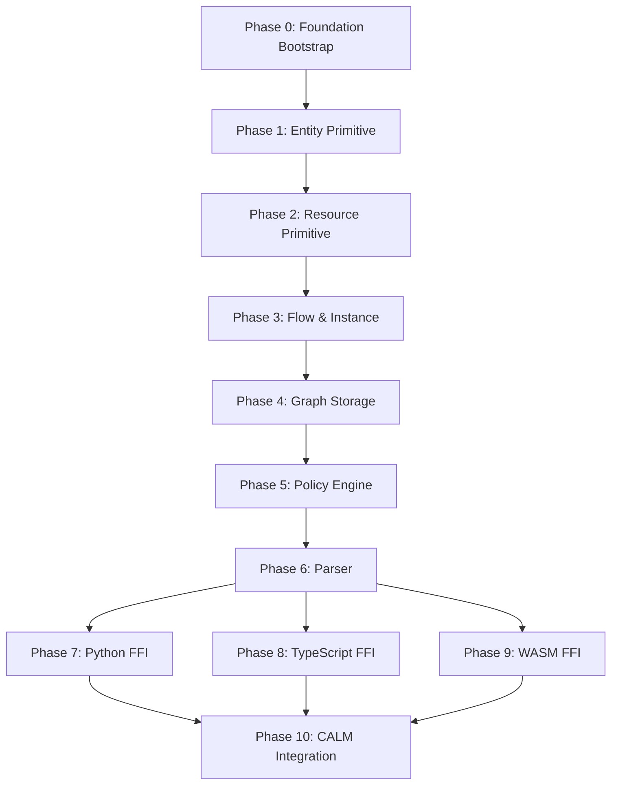

# 📋 DomainForge Implementation Plans - Index

**Last Updated:** 2025-11-07
**Status:** In Progress - Phase 0 Ready for Execution

---

## Overview

This directory contains incremental implementation plans for the DomainForge SEA DSL project. Each phase is designed to be executable independently, following TDD principles and maintaining audit trails.

> **Philosophy: Crawl → Walk → Run**

Start with the absolute minimum, validate thoroughly, then incrementally add complexity.

---

## Phase Roadmap



---

## Phase Catalog

| # | Phase | Status | MVP | Duration | Dependencies | Traceability |
|---|-------|--------|-----|----------|--------------|--------------|
| 0 | [Foundation Bootstrap](./Phase%200:%20Foundation%20Bootstrap.md) | ✅ Ready | ✅ | 4-6h | None | ADR-002, PRD-005 |
| 1 | [Entity Primitive](./Phase%201:%20Entity%20Primitive.md) | 📝 Draft | ✅ | 3-4h | Phase 0 | ADR-005, PRD-002, SDS-002 |
| 2 | [Resource Primitive](./Phase%202:%20Resource%20Primitive.md) | 📝 Draft | ✅ | 3-4h | Phase 1 | ADR-005, PRD-002, SDS-003 |
| 3 | [Flow & Instance Primitives](./Phase%203:%20Flow%20and%20Instance.md) | 📝 Draft | ✅ | 6-8h | Phase 2 | ADR-005, PRD-002, SDS-004 |
| 4 | [Graph Storage](./Phase%204:%20Graph%20Storage.md) | 🔜 Planned | ✅ | 8-10h | Phase 3 | ADR-003, PRD-004, SDS-005 |
| 5 | [Policy Engine](./Phase%205:%20Policy%20Engine.md) | 🔜 Planned | ✅ | 10-12h | Phase 4 | ADR-004, PRD-003, SDS-006 |
| 6 | [Parser Implementation](./Phase%206:%20Parser.md) | 🔜 Planned | ✅ | 12-16h | Phase 5 | ADR-004, PRD-003, SDS-007 |
| 7 | [Python Bindings (PyO3)](./Phase%207:%20Python%20Bindings.md) | 🔜 Planned | ✅ | 8-10h | Phase 6 | ADR-002, ADR-007, PRD-006, SDS-009 |
| 8 | [TypeScript Bindings](./Phase%208:%20TypeScript%20Bindings.md) | 🔜 Planned | ✅ | 8-10h | Phase 6 | ADR-002, ADR-007, PRD-007, SDS-010 |
| 9 | [WASM Bindings](./Phase%209:%20WASM%20Bindings.md) | 🔜 Planned | ✅ | 6-8h | Phase 6 | ADR-002, ADR-007, PRD-008, SDS-011 |
| 10 | [CALM Integration](./Phase%2010:%20CALM%20Integration.md) | 🔜 Planned | ⬜ Post-MVP | 10-12h | Phases 7,8,9 | ADR-006, PRD-014, SDS-013 |

**Total MVP Effort Estimate:** 68-88 hours

---

## Execution Strategy

### Sequential Foundation (Phases 0-6)

These phases **must** be completed in order:

1. **Phase 0**: Bootstrap workspace infrastructure
2. **Phase 1**: Implement first primitive (Entity) - validates TDD approach
3. **Phase 2**: Add second primitive (Resource) - validates pattern reusability
4. **Phase 3**: Complete primitives (Flow, Instance) - validates five-primitive model
5. **Phase 4**: Build graph storage - enables relationship queries
6. **Phase 5**: Implement policy engine - enables business rules
7. **Phase 6**: Add parser - enables DSL syntax

### Parallel Language Bindings (Phases 7-9)

After Phase 6, these can run **in parallel**:

- **Phase 7**: Python bindings (PyO3)
- **Phase 8**: TypeScript bindings (napi-rs)
- **Phase 9**: WASM bindings (wit-bindgen)

### Final Integration (Phase 10)

**Phase 10** (CALM) requires all language bindings complete.

---

## TDD Workflow (Every Phase)

Each phase follows strict TDD cycles:

```txt
RED → GREEN → REFACTOR → VALIDATE
 ↓       ↓         ↓          ↓
Tests  Minimal  Improve    Full
Fail   Implementation Quality  Regression
```

### Cycle Pattern

Every phase is broken into **cycles** (A, B, C, A1, B2, etc.):

- **Cycle A**: Foundation setup
- **Cycle B**: Core implementation
- **Cycle C**: Integration
- **Cycle A1**: Refinement
- **Cycle B2**: Edge cases
- **Cycle C2**: Documentation

---

## Status Definitions

| Symbol | Status | Meaning |
|--------|--------|---------|
| ✅ | Ready | Fully planned, ready to execute |
| 🚧 | In Progress | Currently being implemented |
| 📝 | Draft | Documented but needs review |
| 🔜 | Planned | Stub created, to be detailed |
| ⏸️ | Blocked | Waiting on dependency |
| ✔️ | Complete | Implemented and validated |
| ⏳ | Pending | Pending action or awaiting resources/review |

---

## Phase Generation Strategy

To manage context window effectively, plans are generated incrementally:

**Batch 1 (Current):**

- ✅ Phase 0: Complete
- ⏳ Phase 1-3: Generate next (foundation primitives)

**Batch 2 (After 1-3 validated):**

- Phase 4-6: Core functionality

**Batch 3 (After 4-6 validated):**

- Phase 7-10: Language bindings and integration

---

## Quick Links

### Project Documentation

- [📐 Architecture Decision Records (ADRs)](../specs/adr.md)
- [📋 Product Requirements (PRDs)](../specs/prd.md)
- [🔧 Software Design Specs (SDS)](../specs/sds.md)
- [🔗 Traceability Matrix](../specs/traceability-matrix.md)

### Implementation Guidelines

- [📘 TDD Plan Template](./PLAN_TEMPLATE.md)
- [🧠 DSL Implementation Instructions](../../context/DSL_instructions.md)
- [⚙️ Rust Architecture Details](../../context/Rust_details.md)

---

## Validation Checklist (Per Phase)

Before marking any phase complete:

- [ ] All tests pass (`cargo test`)
- [ ] Code quality verified (`cargo clippy -- -D warnings`)
- [ ] Documentation generated (`cargo doc --no-deps`)
- [ ] Coverage >80% (`cargo tarpaulin`)
- [ ] ADR/PRD/SDS traceability documented
- [ ] Git commits reference phase and cycle
- [ ] Audit artifacts stored

---

## Risk Management

### Common Risks Across Phases

| Risk | Mitigation | Owner |
|------|------------|-------|
| Scope creep | Strict phase boundaries, defer features | Planning |
| Test flakiness | Deterministic fixtures, seed control | Testing |
| Dependency drift | Pin versions in Cargo.lock | DevOps |
| Documentation lag | Generate from code comments | Documentation |
| Context window overflow | Incremental plan generation | AI Agent |

---

## Next Actions

1. **Execute Phase 0** - Foundation Bootstrap
2. **Generate Phase 1-3 Plans** - Foundation primitives (Entity, Resource, Flow/Instance)
3. **Validate Approach** - Review Phase 1 implementation before scaling
4. **Generate Phase 4-6 Plans** - Core functionality (Graph, Policy, Parser)
5. **Generate Phase 7-10 Plans** - Language bindings and integration

---

**Current Focus:** Phase 0 execution → Phase 1 plan generation

**Last Updated:** 2025-11-07 by AI Implementation Planner
