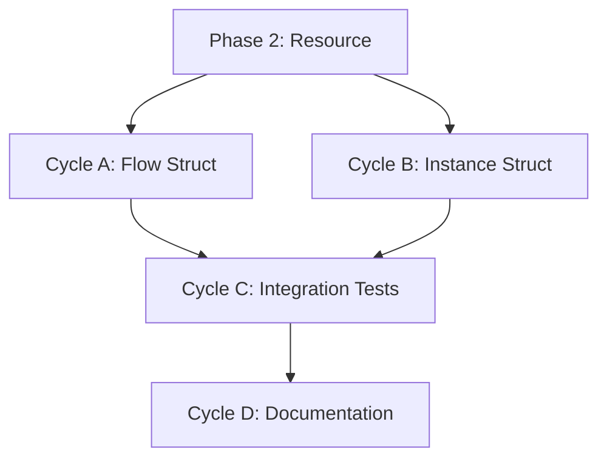

# 🧭 Phase 3: Flow & Instance Primitives

**Status:** Draft
**Revision Date:** 2025-11-07
**Aligned With:** ADR-005 (Five Primitives), PRD-002 (Universal Primitives), SDS-004 (Flow/Instance Specification)

---

## 1. Objectives and Context

**Goal:** Implement the remaining two primitives (Flow and Instance) to complete the five-primitive foundation.

**Scope Boundaries:**

- ✅ Flow struct (resource transfer between entities)
- ✅ Instance struct (physical resource instances at locations)
- ✅ References to Entity and Resource (via UUID)
- ✅ Complete test coverage (>80%)
- ✅ Serialization/deserialization
- ❌ NO graph traversal yet (Phase 4)
- ❌ NO validation rules (Phase 5)
- ❌ NO parser integration (Phase 6)

**Dependencies:**

- **Prerequisite:** Phase 2 complete (Entity + Resource exist)
- **Blocks:** Phase 4 (Graph storage requires all primitives)

**Key Deliverables:**

- `Flow::new(resource, from, to, quantity)`
- `Instance::new(resource, entity)`

---

## 2. Global Parallelization & Dependencies Overview

### Parallelization Matrix

| Component | Can Run Parallel With | Shared Artifacts | Coordination Notes |
|-----------|---------------------|------------------|-------------------|
| Phase 3 | None (sequential) | `sea-core` crate | Completes primitives |

### High-Level Dependency Map



---

## 3. Global Dependencies Table

| Dependency Type | Depends On | Description | Resolution Trigger |
|----------------|-----------|-------------|-------------------|
| Upstream Phase | Phase 2 | Entity + Resource must exist | Phase 2 tests GREEN |
| Cross-Primitive | Entity, Resource | Flow references both | UUIDs available |

---

## 4. Cycles Overview (MECE)

### Phase 3: Flow & Instance Primitives

**Objective:** Complete the five-primitive model
**Coordinator:** Core Development Team
**Traceability Goal:** 100% of SDS-004 requirements covered

#### ✅ Phase Checklist

- [ ] Define Flow struct — _Updated By:_ <Agent / Date>
- [ ] Define Instance struct — _Updated By:_ <Pending>
- [ ] Add cross-primitive integration tests — _Updated By:_ <Pending>
- [ ] Generate documentation — _Updated By:_ <Pending>

#### Cycle Summary Table

| Cycle | Owner | Branch | Depends On | Parallel | Audit Artifacts |
|-------|-------|--------|------------|----------|-----------------|
| A | Core Dev | `feat/phase3-flow` | Phase 2 | B (Instance) | Flow tests |
| B | Core Dev | `feat/phase3-instance` | Phase 2 | A (Flow) | Instance tests |
| C | Core Dev | `feat/phase3-integration` | A, B | None | Integration tests |
| D | Docs | `feat/phase3-docs` | C | None | Generated rustdoc |

---

### Cycle A — Flow Primitive

**Owner:** Core Development
**Branch:** `feat/phase3-flow`

#### Cycle A — RED Phase

**Tests** (in `sea-core/tests/flow_tests.rs`):

```rust
use sea_core::primitives::{Entity, Resource, Flow};
use rust_decimal::Decimal;

#[test]
fn test_flow_new_stores_references() {
    let warehouse = Entity::new_with_namespace("Warehouse", "default");
    let factory = Entity::new_with_namespace("Factory", "default");
    let product = Resource::new_with_namespace("Widget", "units", "default");

    let flow = Flow::new(
        product.id().clone(),
        warehouse.id().clone(),
        factory.id().clone(),
        Decimal::from(100)
    );

    assert_eq!(flow.quantity(), Decimal::from(100));
}

#[test]
fn test_flow_references_are_valid_uuids() {
    let flow = Flow::new(
        uuid::Uuid::new_v4(),
        uuid::Uuid::new_v4(),
        uuid::Uuid::new_v4(),
        Decimal::from(50)
    );

    assert!(flow.resource_id().to_string().len() > 0);
}
```

#### Cycle A — GREEN Phase

**Implementation** (in `sea-core/src/primitives/flow.rs`):

```rust
use serde::{Deserialize, Serialize};
use uuid::Uuid;
use rust_decimal::Decimal;
use std::collections::HashMap;
use serde_json::Value;

/// Represents a transfer of a resource between two entities.
///
/// Flows are the "MOVEMENT" in enterprise models - they capture
/// the transfer of resources from one entity to another.
///
/// # Examples
///
/// ```
/// use sea_core::primitives::{Entity, Resource, Flow};
/// use rust_decimal::Decimal;
///
/// let warehouse = Entity::new_with_namespace("Warehouse", "default");
/// let factory = Entity::new_with_namespace("Factory", "default");
/// let steel = Resource::new_with_namespace("Steel", "kg", "default");
///
/// let shipment = Flow::new(
///     steel.id().clone(),
///     warehouse.id().clone(),
///     factory.id().clone(),
///     Decimal::from(1000)
/// );
/// ```
#[derive(Debug, Clone, PartialEq, Serialize, Deserialize)]
pub struct Flow {
    id: Uuid,
    resource_id: Uuid,
    from_entity_id: Uuid,
    to_entity_id: Uuid,
    quantity: Decimal,
    namespace: Option<String>,
    attributes: HashMap<String, Value>,
}

impl Flow {
    /// Creates a new Flow with a generated UUID.
    pub fn new(
        resource_id: Uuid,
        from_entity_id: Uuid,
        to_entity_id: Uuid,
        quantity: Decimal
    ) -> Self {
        Self {
            id: Uuid::new_v4(),
            resource_id,
            from_entity_id,
            to_entity_id,
            quantity,
            namespace: None,
            attributes: HashMap::new(),
        }
    }

    pub fn id(&self) -> &Uuid { &self.id }
    pub fn resource_id(&self) -> &Uuid { &self.resource_id }
    pub fn from_entity_id(&self) -> &Uuid { &self.from_entity_id }
    pub fn to_entity_id(&self) -> &Uuid { &self.to_entity_id }
    pub fn quantity(&self) -> Decimal { self.quantity }
    pub fn namespace(&self) -> Option<&str> { self.namespace.as_deref() }

    pub fn set_attribute(&mut self, key: impl Into<String>, value: Value) {
        self.attributes.insert(key.into(), value);
    }

    pub fn get_attribute(&self, key: &str) -> Option<&Value> {
        self.attributes.get(key)
    }
}
```

**Update Cargo.toml to add rust_decimal:**

```toml
[dependencies]
rust_decimal = "1.33"
```

**Label:** → **A-GREEN**

---

### Cycle B — Instance Primitive

**Owner:** Core Development
**Branch:** `feat/phase3-instance`

#### Cycle B — RED Phase

**Tests** (in `sea-core/tests/instance_tests.rs`):

```rust
use sea_core::primitives::{Entity, Resource, Instance};

#[test]
fn test_instance_new_stores_references() {
    let warehouse = Entity::new_with_namespace("Warehouse", "default");
    let camera = Resource::new_with_namespace("Camera", "units", "default");

    let instance = Instance::new(
        camera.id().clone(),
        warehouse.id().clone()
    );

    assert_eq!(instance.resource_id(), camera.id());
    assert_eq!(instance.entity_id(), warehouse.id());
}
```

#### Cycle B — GREEN Phase

**Implementation** (in `sea-core/src/primitives/instance.rs`):

```rust
use serde::{Deserialize, Serialize};
use uuid::Uuid;
use std::collections::HashMap;
use serde_json::Value;

/// Represents a physical instance of a resource at a specific entity location.
///
/// # Examples
///
/// ```
/// use sea_core::primitives::{Entity, Resource, Instance};
///
/// let warehouse = Entity::new_with_namespace("Warehouse A", "default");
/// let product = Resource::new_with_namespace("Camera", "units", "default");
///
/// let camera_123 = Instance::new(
///     product.id().clone(),
///     warehouse.id().clone()
/// );
/// ```
#[derive(Debug, Clone, PartialEq, Serialize, Deserialize)]
pub struct Instance {
    id: Uuid,
    resource_id: Uuid,
    entity_id: Uuid,
    namespace: Option<String>,
    attributes: HashMap<String, Value>,
}

impl Instance {
    /// Creates a new Instance with a generated UUID.
    pub fn new(resource_id: Uuid, entity_id: Uuid) -> Self {
        Self {
            id: Uuid::new_v4(),
            resource_id,
            entity_id,
            namespace: None,
            attributes: HashMap::new(),
        }
    }

    pub fn id(&self) -> &Uuid { &self.id }
    pub fn resource_id(&self) -> &Uuid { &self.resource_id }
    pub fn entity_id(&self) -> &Uuid { &self.entity_id }
    pub fn namespace(&self) -> Option<&str> { self.namespace.as_deref() }

    pub fn set_attribute(&mut self, key: impl Into<String>, value: Value) {
        self.attributes.insert(key.into(), value);
    }

    pub fn get_attribute(&self, key: &str) -> Option<&Value> {
        self.attributes.get(key)
    }
}
```

**Update `sea-core/src/primitives/mod.rs`:**

```rust
pub mod entity;
pub mod resource;
pub mod flow;
pub mod instance;

pub use entity::Entity;
pub use resource::Resource;
pub use flow::Flow;
pub use instance::Instance;
```

**Label:** → **B-GREEN**

---

### Cycle C — Integration Tests

**Owner:** Core Development
**Branch:** `feat/phase3-integration`

#### Tests

Create `sea-core/tests/primitives_integration_tests.rs`:

```rust
use sea_core::primitives::{Entity, Resource, Flow, Instance};
use rust_decimal::Decimal;

#[test]
fn test_complete_supply_chain_model() {
    // Entities
    let supplier = Entity::new_with_namespace("Supplier", "default");
    let warehouse = Entity::new_with_namespace("Warehouse", "default");
    let factory = Entity::new_with_namespace("Factory", "default");

    // Resources
    let steel = Resource::new_with_namespace("Steel", "kg", "default");
    let camera = Resource::new_with_namespace("Camera", "units", "default");

    // Flows
    let steel_shipment = Flow::new(
        steel.id().clone(),
        supplier.id().clone(),
        warehouse.id().clone(),
        Decimal::from(5000)
    );

    // Instances
    let camera_instance = Instance::new(
        camera.id().clone(),
        warehouse.id().clone()
    );

    // Verify all primitives work together
    assert!(steel_shipment.quantity() > Decimal::ZERO);
    assert_eq!(camera_instance.entity_id(), warehouse.id());
}
```

**Label:** → **C-GREEN**

---

### Cycle D — Documentation

**Owner:** Documentation Team

```bash
cargo doc --no-deps --open
```

**Label:** → **D-GREEN**

---

## 5. Summary

**Phase 3** completes the five-primitive foundation:

✅ **Achieved:**

- Flow primitive (resource transfers)
- Instance primitive (physical instances)
- All five primitives implemented
- Integration tests validate cross-primitive usage

✅ **Next Phase:** Phase 4 - Graph Storage (enables relationship queries)

**Traceability:** ADR-005 ✓ | PRD-002 ✓ | SDS-004 ✓
