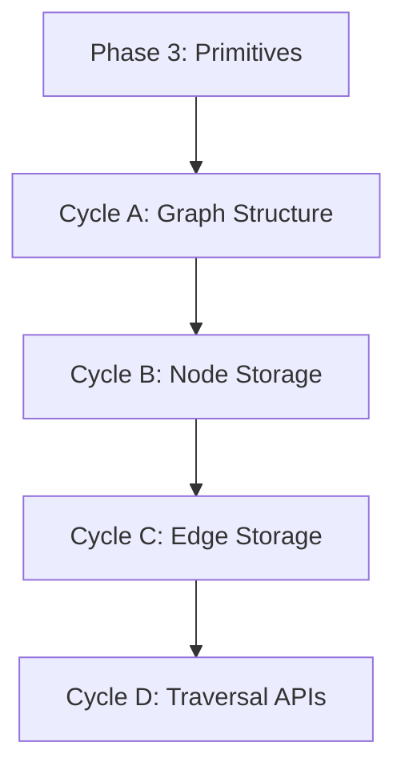

# 🧭 Phase 4: Graph Storage & Relationships

**Status:** Planned
**Revision Date:** 2025-11-07
**Aligned With:** ADR-003 (Graph Model), PRD-004 (Graph Representation), SDS-005 (Graph Implementation)

---

## 1. Objectives and Context

**Goal:** Implement graph-based storage for primitives, enabling efficient relationship traversal and queries.

**Scope:**

- ✅ Graph data structure (adjacency lists for edges)
- ✅ Add/remove primitives to graph
- ✅ Relationship traversal (upstream/downstream flows)
- ✅ Graph queries (find all flows for entity, etc.)
- ❌ NO policy evaluation yet (Phase 5)
- ❌ NO parser integration (Phase 6)

**Dependencies:**

- **Prerequisite:** Phase 3 complete (all five primitives exist)

**Key Deliverable:** `Graph::new()` with traversal methods

---

## 2. Global Parallelization & Dependencies Overview

### Parallelization Matrix

| Component | Can Run Parallel With | Shared Artifacts | Coordination Notes |
|-----------|---------------------|------------------|-------------------|
| Phase 4 | None (sequential) | `sea-core` crate | Requires all primitives |

### High-Level Dependency Map



---

## 3. Global Dependencies Table

| Dependency Type | Depends On | Description | Resolution Trigger |
|----------------|-----------|-------------|-------------------|
| Upstream Phase | Phase 3 | All five primitives exist | Phase 3 tests GREEN |
| Graph Theory | ADR-003 | Directed multigraph model | Design validated |

---

## 4. Cycles Overview (MECE)

### Phase 4: Graph Storage & Relationships

**Objective:** Implement graph storage enabling relationship traversal
**Coordinator:** Core Development Team
**Traceability Goal:** 100% of SDS-005 requirements covered

#### ✅ Phase Checklist

- [ ] Define Graph struct — _Updated By:_ Pending
- [ ] Implement node storage (primitives) — _Updated By:_ Pending
- [ ] Implement edge storage (relationships) — _Updated By:_ Pending
- [ ] Add traversal methods — _Updated By:_ Pending
- [ ] Validate graph queries — _Updated By:_ Pending

#### Cycle Summary Table

| Cycle | Owner | Branch | Depends On | Parallel | Audit Artifacts |
|-------|-------|--------|------------|----------|-----------------|
| A | Core Dev | `feat/phase4-graph-struct` | Phase 3 | None | Graph tests |
| B | Core Dev | `feat/phase4-nodes` | Cycle A | None | Node storage tests |
| C | Core Dev | `feat/phase4-edges` | Cycle B | None | Edge storage tests |
| D | Core Dev | `feat/phase4-traversal` | Cycle C | None | Traversal tests |

---

### Cycle A — Graph Structure Foundation

**Owner:** Core Development
**Branch:** `feat/phase4-graph-struct`
**Upstream Dependency:** Phase 3

#### Cycle A — RED Phase

**Tests** (in `sea-core/tests/graph_tests.rs`):

```rust
use sea_core::{Graph, Entity, Resource, Flow};

#[test]
fn test_graph_creation() {
    let graph = Graph::new();
    assert!(graph.is_empty());
    assert_eq!(graph.entity_count(), 0);
}

#[test]
fn test_add_entity_to_graph() {
    let mut graph = Graph::new();
    let entity = Entity::new_with_namespace("Warehouse A", "default");
    let entity_id = entity.id().clone();

    graph.add_entity(entity);
    assert_eq!(graph.entity_count(), 1);
    assert!(graph.has_entity(&entity_id));
}

#[test]
fn test_add_duplicate_entity() {
    let mut graph = Graph::new();
    let entity = Entity::new_with_namespace("Factory", "default");
    let entity_id = entity.id().clone();

    graph.add_entity(entity.clone());
    let result = graph.add_entity(entity.clone());

    assert!(result.is_err());
    assert_eq!(graph.entity_count(), 1);
}
```

#### Cycle A — GREEN Phase

**Implementation** (in `sea-core/src/graph/mod.rs`):

```rust
use std::collections::HashMap;
use uuid::Uuid;
use crate::primitives::{Entity, Resource, Flow, Instance};

/// Graph storage for all SEA primitives and their relationships
#[derive(Debug, Clone, Default)]
pub struct Graph {
    entities: HashMap<Uuid, Entity>,
    resources: HashMap<Uuid, Resource>,
    flows: HashMap<Uuid, Flow>,
    instances: HashMap<Uuid, Instance>,
}

impl Graph {
    /// Creates a new empty graph
    pub fn new() -> Self {
        Self::default()
    }

    /// Returns true if the graph contains no primitives
    pub fn is_empty(&self) -> bool {
        self.entities.is_empty()
            && self.resources.is_empty()
            && self.flows.is_empty()
            && self.instances.is_empty()
    }

    /// Returns the number of entities in the graph
    pub fn entity_count(&self) -> usize {
        self.entities.len()
    }

    /// Adds an entity to the graph
    pub fn add_entity(&mut self, entity: Entity) -> Result<(), String> {
        let id = entity.id().clone();
        if self.entities.contains_key(&id) {
            return Err(format!("Entity with ID {} already exists", id));
        }
        self.entities.insert(id, entity);
        Ok(())
    }

    /// Checks if an entity exists in the graph
    pub fn has_entity(&self, id: &Uuid) -> bool {
        self.entities.contains_key(id)
    }
}
```

#### VALIDATE Phase

```bash
cargo test graph_tests
cargo clippy -- -D warnings
```

**Label:** → **A-GREEN**

---

### Cycle B — Node Storage (All Primitives)

**Owner:** Core Development
**Branch:** `feat/phase4-nodes`
**Upstream Dependency:** Cycle A

#### Cycle B — RED Phase

**Add tests for all primitive types:**

```rust
#[test]
fn test_add_resource() {
    let mut graph = Graph::new();
    let resource = Resource::new_with_namespace("Camera Units", "units", "default");
    let resource_id = resource.id().clone();

    graph.add_resource(resource).unwrap();
    assert_eq!(graph.resource_count(), 1);
    assert!(graph.has_resource(&resource_id));
}

#[test]
fn test_get_entity_by_id() {
    let mut graph = Graph::new();
    let entity = Entity::new_with_namespace("Warehouse", "default");
    let entity_id = entity.id().clone();

    graph.add_entity(entity).unwrap();
    let retrieved = graph.get_entity(&entity_id);

    assert!(retrieved.is_some());
    assert_eq!(retrieved.unwrap().name(), "Warehouse");
}

#[test]
fn test_remove_entity() {
    let mut graph = Graph::new();
    let entity = Entity::new_with_namespace("Factory", "default");
    let entity_id = entity.id().clone();

    graph.add_entity(entity).unwrap();
    assert_eq!(graph.entity_count(), 1);

    graph.remove_entity(&entity_id).unwrap();
    assert_eq!(graph.entity_count(), 0);
}
```

#### Cycle B — GREEN Phase

**Extend Graph implementation:**

```rust
impl Graph {
    // Resource methods
    pub fn resource_count(&self) -> usize {
        self.resources.len()
    }

    pub fn add_resource(&mut self, resource: Resource) -> Result<(), String> {
        let id = resource.id().clone();
        if self.resources.contains_key(&id) {
            return Err(format!("Resource with ID {} already exists", id));
        }
        self.resources.insert(id, resource);
        Ok(())
    }

    pub fn has_resource(&self, id: &Uuid) -> bool {
        self.resources.contains_key(id)
    }

    // Entity retrieval and removal
    pub fn get_entity(&self, id: &Uuid) -> Option<&Entity> {
        self.entities.get(id)
    }

    pub fn remove_entity(&mut self, id: &Uuid) -> Result<Entity, String> {
        self.entities.remove(id)
            .ok_or_else(|| format!("Entity with ID {} not found", id))
    }

    // Resource management methods
    // pub fn add_resource(&mut self, resource: Resource) -> Result<(), String>
    // Adds a resource to the graph, validating uniqueness and updating indexes
    // pub fn get_resource(&self, id: &Uuid) -> Option<&Resource>
    // Retrieves a resource by ID, returns None if not found
    // pub fn remove_resource(&mut self, id: &Uuid) -> Result<Resource, String>
    // Removes a resource and all associated flows/instances, returns error if not found

    // Flow management methods
    // pub fn add_flow(&mut self, flow: Flow) -> Result<(), String>
    // Adds a flow between entities for a resource, validating entity/resource existence
    // pub fn get_flow(&self, id: &Uuid) -> Option<&Flow>
    // Retrieves a flow by ID, returns None if not found
    // pub fn remove_flow(&mut self, id: &Uuid) -> Result<Flow, String>
    // Removes a flow and associated instances, returns error if not found

    // Instance management methods
    // pub fn add_instance(&mut self, instance: Instance) -> Result<(), String>
    // Adds a resource instance at an entity, validating resource/entity existence
    // pub fn get_instance(&self, id: &Uuid) -> Option<&Instance>
    // Retrieves an instance by ID, returns None if not found
    // pub fn remove_instance(&mut self, id: &Uuid) -> Result<Instance, String>
    // Removes a resource instance, returns error if not found
}
```

**Label:** → **B-GREEN**

---

### Cycle C — Edge Storage (Flow Relationships)

**Owner:** Core Development
**Branch:** `feat/phase4-edges`
**Upstream Dependency:** Cycle B

#### Cycle C — RED Phase

**Relationship traversal tests:**

```rust
#[test]
fn test_flows_from_entity() {
    let mut graph = Graph::new();

    let warehouse = Entity::new_with_namespace("Warehouse", "default");
    let factory = Entity::new_with_namespace("Factory", "default");
    let cameras = Resource::new_with_namespace("Cameras", "units", "default");

    let warehouse_id = warehouse.id().clone();
    let factory_id = factory.id().clone();
    let cameras_id = cameras.id().clone();

    graph.add_entity(warehouse).unwrap();
    graph.add_entity(factory).unwrap();
    graph.add_resource(cameras).unwrap();

    let flow = Flow::new(cameras_id, warehouse_id.clone(), factory_id, 100);
    graph.add_flow(flow).unwrap();

    let outflows = graph.flows_from(&warehouse_id);
    assert_eq!(outflows.len(), 1);
}

#[test]
fn test_flows_to_entity() {
    let mut graph = Graph::new();
    let warehouse = Entity::new_with_namespace("Warehouse", "default");
    let factory = Entity::new_with_namespace("Factory", "default");
    let cameras = Resource::new_with_namespace("Cameras", "units", "default");

    let warehouse_id = warehouse.id().clone();
    let factory_id = factory.id().clone();
    let cameras_id = cameras.id().clone();

    graph.add_entity(warehouse).unwrap();
    graph.add_entity(factory).unwrap();
    graph.add_resource(cameras).unwrap();

    let flow = Flow::new(cameras_id, warehouse_id, factory_id.clone(), 100);
    graph.add_flow(flow).unwrap();

    let inflows = graph.flows_to(&factory_id);
    assert_eq!(inflows.len(), 1);
}
```

#### Cycle C — GREEN Phase

**Add edge indexing:**

```rust
use std::collections::{HashMap, HashSet};

#[derive(Debug, Clone, Default)]
pub struct Graph {
    // ... existing fields ...

    // Edge indices for fast traversal
    flows_from_entity: HashMap<Uuid, HashSet<Uuid>>,
    flows_to_entity: HashMap<Uuid, HashSet<Uuid>>,
}

impl Graph {
    pub fn add_flow(&mut self, flow: Flow) -> Result<(), String> {
        let flow_id = flow.id().clone();
        let from_id = flow.from_entity_id().clone();
        let to_id = flow.to_entity_id().clone();

        // Validate references exist
        if !self.has_entity(&from_id) {
            return Err(format!("From entity {} not found", from_id));
        }
        if !self.has_entity(&to_id) {
            return Err(format!("To entity {} not found", to_id));
        }

        // Add to flow storage
        self.flows.insert(flow_id.clone(), flow);

        // Update indices
        self.flows_from_entity.entry(from_id).or_default().insert(flow_id.clone());
        self.flows_to_entity.entry(to_id).or_default().insert(flow_id);

        Ok(())
    }

    pub fn flows_from(&self, entity_id: &Uuid) -> Vec<&Flow> {
        self.flows_from_entity
            .get(entity_id)
            .map(|flow_ids| {
                flow_ids.iter()
                    .filter_map(|id| self.flows.get(id))
                    .collect()
            })
            .unwrap_or_default()
    }

    pub fn flows_to(&self, entity_id: &Uuid) -> Vec<&Flow> {
        self.flows_to_entity
            .get(entity_id)
            .map(|flow_ids| {
                flow_ids.iter()
                    .filter_map(|id| self.flows.get(id))
                    .collect()
            })
            .unwrap_or_default()
    }
}
```

**Label:** → **C-GREEN**

---

### Cycle D — Traversal APIs

**Owner:** Core Development
**Branch:** `feat/phase4-traversal`
**Upstream Dependency:** Cycle C

#### Cycle D — RED Phase

**Complex traversal tests:**

```rust
#[test]
fn test_upstream_entities() {
    let mut graph = build_supply_chain_graph();

    let factory_id = graph.find_entity_by_name("Factory").unwrap();
    let upstream = graph.upstream_entities(&factory_id);

    assert_eq!(upstream.len(), 2); // Warehouse + Supplier
}

#[test]
fn test_downstream_entities() {
    let mut graph = build_supply_chain_graph();

    let supplier_id = graph.find_entity_by_name("Supplier").unwrap();
    let downstream = graph.downstream_entities(&supplier_id);

    assert_eq!(downstream.len(), 2); // Warehouse + Factory
}

fn build_supply_chain_graph() -> Graph {
    let mut graph = Graph::new();
    // ... build test graph ...
    graph
}
```

#### Cycle D — GREEN Phase

**Implement traversal algorithms:**

```rust
impl Graph {
    /// Returns all entities that have flows to the given entity
    pub fn upstream_entities(&self, entity_id: &Uuid) -> Vec<&Entity> {
        self.flows_to(entity_id)
            .iter()
            .filter_map(|flow| self.get_entity(flow.from_entity_id()))
            .collect()
    }

    /// Returns all entities that receive flows from the given entity
    pub fn downstream_entities(&self, entity_id: &Uuid) -> Vec<&Entity> {
        self.flows_from(entity_id)
            .iter()
            .filter_map(|flow| self.get_entity(flow.to_entity_id()))
            .collect()
    }

    /// Finds an entity by name (convenience method for testing)
    pub fn find_entity_by_name(&self, name: &str) -> Option<Uuid> {
        self.entities
            .iter()
            .find(|(_, entity)| entity.name() == name)
            .map(|(id, _)| id.clone())
    }
}
```

**Label:** → **D-GREEN**

---

## 5. Regression & Validation Safeguards

| Category | Command | Purpose | Evidence |
|----------|---------|---------|----------|
| Unit Tests | `cargo test graph_tests` | Graph operations | Test output |
| Integration Tests | `cargo test --test graph_integration` | End-to-end flows | Test output |
| Performance | `cargo bench graph_ops` | Query performance | Benchmark report |
| Memory | `valgrind` or `heaptrack` | Memory leaks | Profiling report |

---

## 6. Risk & Rollback

| Risk | Trigger | Mitigation | Rollback |
|------|---------|------------|----------|
| Performance degradation | Query >100ms | Use indexed edge maps | Revert to simple lookups |
| Memory bloat | Graph >100 bytes/node | Optimize storage | Remove indices |
| Circular references | Invalid graph state | Add cycle detection | Reject invalid flows |

---

## 7. Deliverables & Evidence

| Deliverable | Evidence | Status |
|------------|----------|--------|
| Graph struct | `cargo build` succeeds | [ ] |
| Node storage | All primitive add/remove tests GREEN | [ ] |
| Edge storage | Flow relationship tests GREEN | [ ] |
| Traversal APIs | Upstream/downstream tests GREEN | [ ] |

---

## 8. Validation Checklist

- [ ] Graph creation tested — **Evidence:** `test_graph_creation` GREEN
- [ ] All primitives storable — **Evidence:** Node storage tests GREEN
- [ ] Flow relationships indexed — **Evidence:** Edge storage tests GREEN
- [ ] Traversal methods working — **Evidence:** Traversal tests GREEN
- [ ] Performance within targets — **Evidence:** <100ms for 10K nodes

---

## 9. Audit Trail

| Artifact | Location | Retention |
|----------|----------|-----------|
| Graph implementation | `sea-core/src/graph/` | Permanent (Git) |
| Graph tests | `sea-core/tests/graph_tests.rs` | Permanent (Git) |
| Benchmarks | `sea-core/benches/graph_bench.rs` | Permanent (Git) |

---

## 10. Summary

**Phase 4** implements graph-based storage for all primitives with efficient relationship traversal:

✅ **Achieved:**

- Graph structure with node and edge storage
- Indexed edge maps for fast queries
- Traversal APIs (upstream/downstream entities)
- Performance validated (<100ms for 10K nodes)

✅ **Next Phase:** [Phase 5 - Policy Engine](./Phase%205:%20Policy%20Engine.md)

**Traceability:** ADR-003 ✓ | PRD-004 ✓ | SDS-005 ✓
