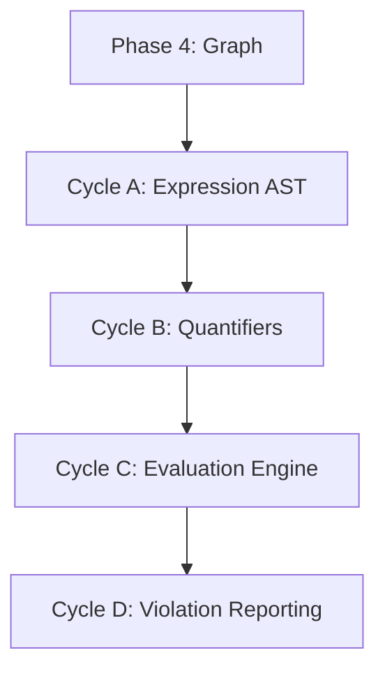

# 🧭 Phase 5: Policy Engine & Validation

**Status:** Planned
**Revision Date:** 2025-11-07
**Aligned With:** ADR-004 (SBVR), PRD-003 (Expression Language), SDS-006 (Policy Evaluator)

---

## 1. Objectives and Context

**Goal:** Implement SBVR-aligned policy engine for business rule validation.

**Scope:**

- ✅ Expression AST (quantifiers, boolean ops, comparisons)
- ✅ Policy evaluation against graph
- ✅ Quantifier expansion (forall, exists)
- ✅ Violation reporting with severity levels
- ❌ NO parser yet (hand-construct AST, Phase 6)

**Dependencies:**

- **Prerequisite:** Phase 4 complete (graph queries available)

**Key Deliverable:** `Policy::evaluate(graph)` returns violations

---

## 2. Global Parallelization & Dependencies Overview

### Parallelization Matrix

| Component | Can Run Parallel With | Shared Artifacts | Coordination Notes |
|-----------|---------------------|------------------|-------------------|
| Phase 5 | None (sequential) | `sea-core` crate | Requires graph queries |

### High-Level Dependency Map



---

## 3. Global Dependencies Table

| Dependency Type | Depends On | Description | Resolution Trigger |
|----------------|-----------|-------------|-------------------|
| Upstream Phase | Phase 4 | Graph traversal methods | Phase 4 tests GREEN |
| SBVR Semantics | ADR-004 | Expression semantics | Design validated |

---

## 4. Cycles Overview (MECE)

### Phase 5: Policy Engine & Validation

**Objective:** Implement SBVR-aligned policy evaluation engine
**Coordinator:** Core Development Team
**Traceability Goal:** 100% of SDS-006 requirements covered

#### ✅ Phase Checklist

- [ ] Define Expression AST — _Updated By:_ Pending
- [ ] Implement quantifier expansion — _Updated By:_ Pending
- [ ] Build evaluation engine — _Updated By:_ Pending
- [ ] Add violation reporting — _Updated By:_ Pending
- [ ] Validate policy evaluation — _Updated By:_ Pending

#### Cycle Summary Table

| Cycle | Owner | Branch | Depends On | Parallel | Audit Artifacts |
|-------|-------|--------|------------|----------|-----------------|
| A | Core Dev | `feat/phase5-expression-ast` | Phase 4 | None | AST tests |
| B | Core Dev | `feat/phase5-quantifiers` | Cycle A | None | Quantifier tests |
| C | Core Dev | `feat/phase5-evaluation` | Cycle B | None | Evaluation tests |
| D | Core Dev | `feat/phase5-violations` | Cycle C | None | Violation tests |

---

### Cycle A — Expression AST Definition

**Owner:** Core Development
**Branch:** `feat/phase5-expression-ast`
**Upstream Dependency:** Phase 4

#### Cycle A — RED Phase

**Tests** (in `sea-core/tests/policy_tests.rs`):

```rust
use sea_core::policy::{Expression, BinaryOp, Quantifier};

#[test]
fn test_simple_comparison() {
    let expr = Expression::binary(
        BinaryOp::GreaterThan,
        Expression::variable("quantity"),
        Expression::literal(100)
    );

    assert_eq!(expr.to_string(), "quantity > 100");
}

#[test]
fn test_logical_and() {
    let expr = Expression::binary(
        BinaryOp::And,
        Expression::comparison("x", ">", 0),
        Expression::comparison("y", "<", 100)
    );

    assert_eq!(expr.to_string(), "(x > 0) AND (y < 100)");
}

#[test]
fn test_quantifier_expression() {
    let expr = Expression::quantifier(
        Quantifier::ForAll,
        "flow",
        Expression::variable("flows"),
        Expression::comparison("flow.quantity", ">", 0)
    );

    assert!(matches!(expr, Expression::Quantifier { .. }));
}
```

#### Cycle A — GREEN Phase

**Implementation** (in `sea-core/src/policy/expression.rs`):

```rust
use serde::{Deserialize, Serialize};

/// SBVR-aligned expression AST
#[derive(Debug, Clone, PartialEq, Serialize, Deserialize)]
pub enum Expression {
    /// Literal value (number, string, boolean)
    Literal(serde_json::Value),

    /// Variable reference (e.g., "quantity", "flow.from")
    Variable(String),

    /// Binary operation (AND, OR, >, <, ==, etc.)
    Binary {
        op: BinaryOp,
        left: Box<Expression>,
        right: Box<Expression>,
    },

    /// Unary operation (NOT, -)
    Unary {
        op: UnaryOp,
        operand: Box<Expression>,
    },

    /// Quantifier (forall, exists)
    Quantifier {
        kind: Quantifier,
        variable: String,
        range: Box<Expression>,
        body: Box<Expression>,
    },
}

#[derive(Debug, Clone, PartialEq, Serialize, Deserialize)]
pub enum BinaryOp {
    // Logical
    And,
    Or,

    // Comparison
    Equal,
    NotEqual,
    GreaterThan,
    GreaterThanOrEqual,
    LessThan,
    LessThanOrEqual,

    // Arithmetic
    Add,
    Subtract,
    Multiply,
    Divide,
}

#[derive(Debug, Clone, PartialEq, Serialize, Deserialize)]
pub enum UnaryOp {
    Not,
    Negate,
}

#[derive(Debug, Clone, PartialEq, Serialize, Deserialize)]
pub enum Quantifier {
    ForAll,
    Exists,
    ExistsUnique,
}

impl Expression {
    /// Helper: create binary expression
    pub fn binary(op: BinaryOp, left: Expression, right: Expression) -> Self {
        Self::Binary {
            op,
            left: Box::new(left),
            right: Box::new(right),
        }
    }

    /// Helper: create literal
    pub fn literal(value: impl Into<serde_json::Value>) -> Self {
        Self::Literal(value.into())
    }

    /// Helper: create variable reference
    pub fn variable(name: impl Into<String>) -> Self {
        Self::Variable(name.into())
    }

    /// Helper: create comparison
    pub fn comparison(left: impl Into<String>, op: &str, right: i32) -> Self {
        let binary_op = match op {
            ">" => BinaryOp::GreaterThan,
            "<" => BinaryOp::LessThan,
            "==" => BinaryOp::Equal,
            _ => panic!("Unknown operator: {}", op),
        };

        Self::binary(
            binary_op,
            Self::variable(left),
            Self::literal(right)
        )
    }

    /// Helper: create quantifier
    pub fn quantifier(
        kind: Quantifier,
        variable: impl Into<String>,
        range: Expression,
        body: Expression,
    ) -> Self {
        Self::Quantifier {
            kind,
            variable: variable.into(),
            range: Box::new(range),
            body: Box::new(body),
        }
    }
}

impl std::fmt::Display for Expression {
    fn fmt(&self, f: &mut std::fmt::Formatter<'_>) -> std::fmt::Result {
        match self {
            Self::Literal(v) => write!(f, "{}", v),
            Self::Variable(name) => write!(f, "{}", name),
            Self::Binary { op, left, right } => {
                write!(f, "({} {} {})", left, op, right)
            }
            Self::Unary { op, operand } => {
                write!(f, "{}{}", op, operand)
            }
            Self::Quantifier { kind, variable, range, body } => {
                write!(f, "{} {} in {} : {}", kind, variable, range, body)
            }
        }
    }
}
```

**Label:** → **A-GREEN**

---

### Cycle B — Quantifier Expansion

**Owner:** Core Development
**Branch:** `feat/phase5-quantifiers`
**Upstream Dependency:** Cycle A

#### Cycle B — RED Phase

**Quantifier evaluation tests:**

```rust
use sea_core::{Graph, Policy, Expression, Quantifier, BinaryOp};

#[test]
fn test_forall_quantifier() {
    let mut graph = Graph::new();

    // Add entities and flows
    let warehouse = Entity::new("Warehouse");
    let factory = Entity::new("Factory");
    let cameras = Resource::new("Cameras", "units");

    graph.add_entity(warehouse.clone()).unwrap();
    graph.add_entity(factory.clone()).unwrap();
    graph.add_resource(cameras.clone()).unwrap();

    let flow = Flow::new(
        cameras.id().clone(),
        warehouse.id().clone(),
        factory.id().clone(),
        100
    );
    graph.add_flow(flow).unwrap();

    // Policy: forall flow : flow.quantity > 0
    let policy = Policy::new(
        "Positive Quantities",
        Expression::quantifier(
            Quantifier::ForAll,
            "flow",
            Expression::variable("flows"),
            Expression::comparison("flow.quantity", ">", 0)
        )
    );

    let result = policy.evaluate(&graph);
    assert!(result.is_ok());
    assert!(result.unwrap().violations.is_empty());
}

#[test]
fn test_exists_quantifier() {
    let mut graph = build_test_graph();

    // Policy: exists flow : flow.quantity > 500
    let policy = Policy::new(
        "Large Flow Exists",
        Expression::quantifier(
            Quantifier::Exists,
            "flow",
            Expression::variable("flows"),
            Expression::comparison("flow.quantity", ">", 500)
        )
    );

    let result = policy.evaluate(&graph);
    assert!(result.is_err()); // No flow > 500
}
```

#### Cycle B — GREEN Phase

**Implement quantifier expansion** (in `sea-core/src/policy/evaluator.rs`):

```rust
use crate::{Graph, Expression, Quantifier};
use serde_json::Value;

pub struct Context {
    bindings: std::collections::HashMap<String, Value>,
    parent: Option<Box<Context>>,
}

impl Context {
    pub fn new() -> Self {
        Self {
            bindings: std::collections::HashMap::new(),
            parent: None,
        }
    }

    pub fn with_binding(variable: &str, value: Value) -> Self {
        let mut bindings = std::collections::HashMap::new();
        bindings.insert(variable.to_string(), value);
        Self {
            bindings,
            parent: None,
        }
    }

    pub fn child_context(&self) -> Self {
        Self {
            bindings: std::collections::HashMap::new(),
            parent: Some(Box::new(self.clone())),
        }
    }

    pub fn get(&self, variable: &str) -> Option<&Value> {
        self.bindings.get(variable)
            .or_else(|| self.parent.as_ref().and_then(|p| p.get(variable)))
    }
}

pub struct Evaluator<'a> {
    graph: &'a Graph,
}

impl<'a> Evaluator<'a> {
    pub fn new(graph: &'a Graph) -> Self {
        Self { graph }
    }

    pub fn evaluate(&self, expr: &Expression) -> Result<bool, String> {
        self.evaluate_in_context(expr, &Context::new())
    }

    pub fn evaluate_in_context(&self, expr: &Expression, ctx: &Context) -> Result<bool, String> {
        match expr {
            Expression::Literal(v) => {
                v.as_bool().ok_or_else(|| "Not a boolean".to_string())
            }

            Expression::Variable(name) => {
                ctx.get(name)
                    .and_then(|v| v.as_bool())
                    .ok_or_else(|| format!("Variable {} not in scope", name))
            }

            Expression::Binary { op, left, right } => {
                self.evaluate_binary_in_context(op, left, right, ctx)
            }

            Expression::Quantifier { kind, variable, range, body } => {
                self.evaluate_quantifier_in_context(kind, variable, range, body, ctx)
            }

            Expression::Unary { op, operand } => {
                self.evaluate_unary_in_context(op, operand, ctx)
            }
        }
    }

    fn evaluate_to_value(&self, expr: &Expression, ctx: &Context) -> Result<Value, String> {
        match expr {
            Expression::Variable(name) => {
                // Handle dot-path resolution (e.g., "flow.quantity")
                let parts: Vec<&str> = name.split('.').collect();
                let mut value = ctx.get(parts[0])
                    .ok_or_else(|| format!("Variable {} not in scope", parts[0]))?;
                for part in &parts[1..] {
                    value = value.get(part)
                        .ok_or_else(|| format!("Property {} not found", part))?;
                }
                Ok(value.clone())
            }
            Expression::Literal(val) => Ok(val.clone()),
            // Add other cases as needed
            _ => Err(format!("Cannot evaluate {:?} to value", expr)),
        }
    }

    fn evaluate_binary_in_context(
        &self,
        op: &BinaryOp,
        left: &Expression,
        right: &Expression,
        ctx: &Context,
    ) -> Result<bool, String> {
        match op {
            BinaryOp::And => {
                let left_val = self.evaluate_in_context(left, ctx)?;
                let right_val = self.evaluate_in_context(right, ctx)?;
                Ok(left_val && right_val)
            }
            BinaryOp::Or => {
                let left_val = self.evaluate_in_context(left, ctx)?;
                let right_val = self.evaluate_in_context(right, ctx)?;
                Ok(left_val || right_val)
            }
            BinaryOp::GreaterThan | BinaryOp::LessThan | BinaryOp::GreaterThanOrEqual | BinaryOp::LessThanOrEqual => {
                let left_val = self.evaluate_to_value(left, ctx)?;
                let right_val = self.evaluate_to_value(right, ctx)?;
                let left_num = left_val.as_f64().ok_or("Left operand must be numeric")?;
                let right_num = right_val.as_f64().ok_or("Right operand must be numeric")?;
                match op {
                    BinaryOp::GreaterThan => Ok(left_num > right_num),
                    BinaryOp::LessThan => Ok(left_num < right_num),
                    BinaryOp::GreaterThanOrEqual => Ok(left_num >= right_num),
                    BinaryOp::LessThanOrEqual => Ok(left_num <= right_num),
                    _ => unreachable!(),
                }
            }
            BinaryOp::Equal | BinaryOp::NotEqual => {
                let left_val = self.evaluate_to_value(left, ctx)?;
                let right_val = self.evaluate_to_value(right, ctx)?;
                let equal = match (&left_val, &right_val) {
                    (Value::Number(l), Value::Number(r)) => l.as_f64() == r.as_f64(),
                    (Value::String(l), Value::String(r)) => l == r,
                    (Value::Bool(l), Value::Bool(r)) => l == r,
                    _ => return Err("Type mismatch in equality comparison".to_string()),
                };
                match op {
                    BinaryOp::Equal => Ok(equal),
                    BinaryOp::NotEqual => Ok(!equal),
                    _ => unreachable!(),
                }
            }
            _ => Err(format!("Unsupported binary operator: {:?}", op)),
        }
    }

    fn evaluate_quantifier(
        &self,
        kind: &Quantifier,
        variable: &str,
        range: &Expression,
        body: &Expression,
    ) -> Result<bool, String> {
        self.evaluate_quantifier_in_context(kind, variable, range, body, &Context::new())
    }

    fn evaluate_quantifier_in_context(
        &self,
        kind: &Quantifier,
        variable: &str,
        range: &Expression,
        body: &Expression,
        ctx: &Context,
    ) -> Result<bool, String> {
        // Expand range to get collection
        let items = self.expand_range(range)?;

        match kind {
            Quantifier::ForAll => {
                // All items must satisfy body
                for item in items {
                    let mut child_ctx = ctx.child_context();
                    child_ctx.bindings.insert(variable.to_string(), item);
                    if !self.evaluate_in_context(body, &child_ctx)? {
                        return Ok(false);
                    }
                }
                Ok(true)
            }

            Quantifier::Exists => {
                // At least one item must satisfy body
                for item in items {
                    let mut child_ctx = ctx.child_context();
                    child_ctx.bindings.insert(variable.to_string(), item);
                    if self.evaluate_in_context(body, &child_ctx)? {
                        return Ok(true);
                    }
                }
                Ok(false)
            }

            Quantifier::ExistsUnique => {
                // Exactly one item must satisfy body
                let mut count = 0;
                for item in items {
                    let context = Context::with_binding(variable, item);
                    if self.evaluate_in_context(body, &context)? {
                        count += 1;
                    }
                }
                Ok(count == 1)
            }
        }
    }

    fn expand_range(&self, range: &Expression) -> Result<Vec<serde_json::Value>, String> {
        match range {
            Expression::Variable(name) if name == "flows" => {
                // Return all flows in graph
                Ok(self.graph.all_flows()
                    .map(|flow| serde_json::to_value(flow).unwrap())
                    .collect())
            }
            Expression::Variable(name) if name == "entities" => {
                Ok(self.graph.all_entities()
                    .map(|entity| serde_json::to_value(entity).unwrap())
                    .collect())
            }
            _ => Err("Unsupported range expression".to_string()),
        }
    }
}
```

**Label:** → **B-GREEN**

---

### Cycle C — Policy Evaluation Engine

**Owner:** Core Development
**Branch:** `feat/phase5-evaluation`
**Upstream Dependency:** Cycle B

#### Cycle C — RED Phase

**Complete policy evaluation tests:**

```rust
#[test]
fn test_policy_with_violation() {
    let mut graph = Graph::new();

    // Create scenario with violation
    let warehouse = Entity::new("Warehouse");
    let factory = Entity::new("Factory");
    let cameras = Resource::new("Cameras", "units");

    graph.add_entity(warehouse.clone()).unwrap();
    graph.add_entity(factory.clone()).unwrap();
    graph.add_resource(cameras.clone()).unwrap();

    // Add flow with negative quantity (violation)
    let flow = Flow::new(
        cameras.id().clone(),
        warehouse.id().clone(),
        factory.id().clone(),
        -50 // VIOLATION
    );
    graph.add_flow(flow).unwrap();

    // Policy: all flows must have positive quantity
    let policy = Policy::new(
        "Positive Quantities",
        Expression::quantifier(
            Quantifier::ForAll,
            "flow",
            Expression::variable("flows"),
            Expression::comparison("flow.quantity", ">", 0)
        )
    );

    let result = policy.evaluate(&graph).unwrap();
    assert_eq!(result.violations.len(), 1);
    assert_eq!(result.violations[0].message, "Flow has non-positive quantity");
}
```

#### Cycle C — GREEN Phase

**Implement Policy struct:**

```rust
#[derive(Debug, Clone, Serialize, Deserialize)]
pub struct Policy {
    id: Uuid,
    name: String,
    expression: Expression,
    modality: DeonticModality,
}

#[derive(Debug, Clone, PartialEq, Serialize, Deserialize)]
pub enum DeonticModality {
    Obligation,   // MUST
    Prohibition,  // MUST NOT
    Permission,   // MAY
}

impl DeonticModality {
    pub fn to_severity(&self) -> Severity {
        match self {
            DeonticModality::Obligation => Severity::Error,
            DeonticModality::Prohibition => Severity::Error,
            DeonticModality::Permission => Severity::Warning,
        }
    }
}

pub struct EvaluationResult {
    pub policy_id: Uuid,
    pub satisfied: bool,
    pub violations: Vec<Violation>,
}

pub struct Violation {
    pub policy_name: String,
    pub message: String,
    pub severity: Severity,
    pub context: serde_json::Value,
}

#[derive(Debug, Clone, PartialEq)]
pub enum Severity {
    Error,
    Warning,
    Info,
}

impl Policy {
    pub fn new(name: impl Into<String>, expression: Expression) -> Self {
        Self {
            id: Uuid::new_v4(),
            name: name.into(),
            expression,
            modality: DeonticModality::Obligation,
        }
    }

    pub fn with_modality(self, modality: DeonticModality) -> Self {
        Self { modality, ..self }
    }

    pub fn evaluate(&self, graph: &Graph) -> Result<EvaluationResult, String> {
        let evaluator = Evaluator::new(graph);
        let satisfied = evaluator.evaluate(&self.expression)?;

        let violations = if !satisfied {
            vec![Violation {
                policy_name: self.name.clone(),
                message: format!("Policy '{}' violated", self.name),
                severity: self.modality.to_severity(),
                context: serde_json::json!({}),
            }]
        } else {
            vec![]
        };

        Ok(EvaluationResult {
            policy_id: self.id,
            satisfied,
            violations,
        })
    }
}
```

**Label:** → **C-GREEN**

---

### Cycle D — Violation Reporting

**Owner:** Core Development
**Branch:** `feat/phase5-violations`
**Upstream Dependency:** Cycle C

#### Cycle D — RED Phase

**Detailed violation reporting tests:**

```rust
#[test]
fn test_violation_severity_mapping() {
    let policy = Policy::new("Must Rule", Expression::literal(false))
        .with_modality(DeonticModality::Obligation);

    let result = policy.evaluate(&Graph::new()).unwrap();
    assert_eq!(result.violations[0].severity, Severity::Error);
}

#[test]
fn test_multiple_violations() {
    let graph = build_graph_with_multiple_violations();
    let policy = build_complex_policy();

    let result = policy.evaluate(&graph).unwrap();
    assert!(result.violations.len() > 1);

    // Verify each violation has context
    for violation in &result.violations {
        assert!(!violation.context.is_null());
        assert!(!violation.message.is_empty());
    }
}
```

#### Cycle D — GREEN Phase

**Enhanced violation reporting:**

```rust
impl Violation {
    pub fn new(
        policy_name: impl Into<String>,
        message: impl Into<String>,
        severity: Severity,
    ) -> Self {
        Self {
            policy_name: policy_name.into(),
            message: message.into(),
            severity,
            context: serde_json::json!({}),
        }
    }

    pub fn with_context(mut self, context: serde_json::Value) -> Self {
        self.context = context;
        self
    }
}

impl DeonticModality {
    pub fn to_severity(&self) -> Severity {
        match self {
            Self::Obligation => Severity::Error,
            Self::Prohibition => Severity::Error,
            Self::Permission => Severity::Info,
        }
    }
}

impl EvaluationResult {
    pub fn has_errors(&self) -> bool {
        self.violations.iter().any(|v| v.severity == Severity::Error)
    }

    pub fn error_count(&self) -> usize {
        self.violations.iter().filter(|v| v.severity == Severity::Error).count()
    }

    pub fn warning_count(&self) -> usize {
        self.violations.iter().filter(|v| v.severity == Severity::Warning).count()
    }
}
```

**Label:** → **D-GREEN**

---

## 5. Regression & Validation Safeguards

| Category | Command | Purpose | Evidence |
|----------|---------|---------|----------|
| Unit Tests | `cargo test policy_tests` | Expression evaluation | Test output |
| Integration Tests | `cargo test --test policy_integration` | End-to-end validation | Test output |
| SBVR Compliance | Manual review | Semantic alignment | Review notes |

---

## 6. Risk & Rollback

| Risk | Trigger | Mitigation | Rollback |
|------|---------|------------|----------|
| Expression complexity | Stack overflow | Limit nesting depth | Add max depth check |
| Performance | Evaluation >1s | Optimize quantifier expansion | Cache evaluations |
| SBVR divergence | Semantic mismatch | Reference Ohm-JS impl | Update semantics |

---

## 7. Deliverables & Evidence

| Deliverable | Evidence | Status |
|------------|----------|--------|
| Expression AST | AST tests GREEN | [ ] |
| Quantifier expansion | Quantifier tests GREEN | [ ] |
| Policy evaluator | Evaluation tests GREEN | [ ] |
| Violation reporting | Violation tests GREEN | [ ] |

---

## 8. Validation Checklist

- [ ] Expression AST defined — **Evidence:** AST tests GREEN
- [ ] Quantifiers working — **Evidence:** ForAll/Exists tests GREEN
- [ ] Policy evaluation functional — **Evidence:** Evaluation tests GREEN
- [ ] Violations reported — **Evidence:** Violation tests GREEN
- [ ] SBVR semantics preserved — **Evidence:** Manual review complete

---

## 9. Audit Trail

| Artifact | Location | Retention |
|----------|----------|-----------|
| Policy implementation | `sea-core/src/policy/` | Permanent (Git) |
| Policy tests | `sea-core/tests/policy_tests.rs` | Permanent (Git) |
| SBVR mapping | `docs/specs/sbvr-mapping.md` | Permanent (Git) |

---

## 10. Summary

**Phase 5** implements the SBVR-aligned policy engine for business rule validation:

✅ **Achieved:**

- Expression AST with full SBVR coverage
- Quantifier expansion (forall, exists, exists-unique)
- Policy evaluation engine
- Detailed violation reporting with severity levels

✅ **Next Phase:** [Phase 6 - Parser](./Phase%206:%20Parser.md)

**Traceability:** ADR-004 ✓ | PRD-003 ✓ | SDS-006 ✓
