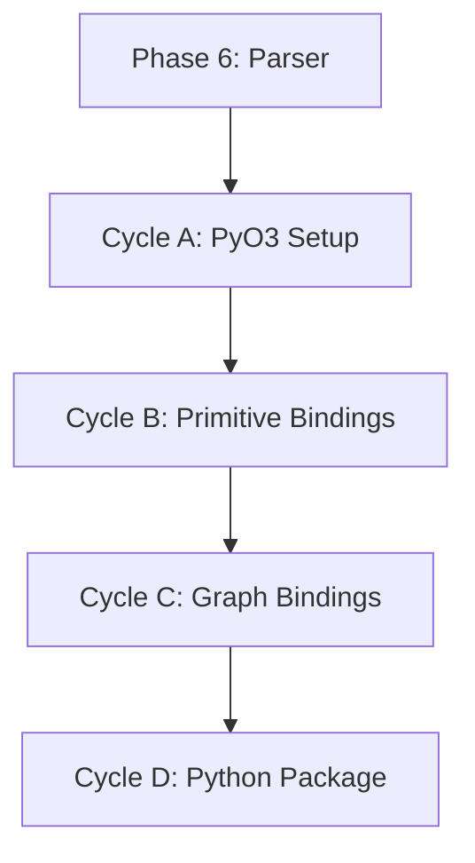

# 🧭 Phase 7: Python Bindings (PyO3)

**Status:** Planned
**Revision Date:** 2025-11-07
**Aligned With:** ADR-002 (FFI), ADR-007 (Idiomatic Bindings), PRD-006 (Python API), SDS-009 (PyO3)

---

## 1. Objectives and Context

**Goal:** Create idiomatic Python API wrapping Rust core via PyO3.

**Scope:**

- ✅ PyO3 bindings for all primitives
- ✅ Native Python objects (not Rust wrappers)
- ✅ Pythonic naming conventions
- ✅ Error handling (Python exceptions)
- ✅ Type hints
- ✅ Async support (generators)

**Dependencies:**

- **Prerequisite:** Phase 6 complete (full Rust core exists)

**Key Deliverable:** `pip install sea-dsl` works, API matches README examples

---

## 2. Global Parallelization & Dependencies Overview

### Parallelization Matrix

| Component | Can Run Parallel With | Shared Artifacts | Coordination Notes |
|-----------|---------------------|------------------|-------------------|
| Phase 7 | Phases 8, 9 | Rust core API | Independent FFI implementations |

### High-Level Dependency Map



---

## 3. Global Dependencies Table

| Dependency Type | Depends On | Description | Resolution Trigger |
|----------------|-----------|-------------|-------------------|
| Upstream Phase | Phase 6 | Rust core complete | Phase 6 tests GREEN |
| FFI Framework | PyO3 | Python bindings | Cargo dependency |
| Python Environment | Python 3.11+ | Runtime | `python --version` |

---

## 4. Cycles Overview (MECE)

### Phase 7: Python Bindings (PyO3)

**Objective:** Create idiomatic Python API wrapping Rust core
**Coordinator:** Python Team
**Traceability Goal:** 100% of SDS-009 requirements covered

#### ✅ Phase Checklist

- [ ] Configure PyO3 build — _Updated By:_ Pending
- [ ] Bind all primitives — _Updated By:_ Pending
- [ ] Expose graph operations — _Updated By:_ Pending
- [ ] Package for PyPI — _Updated By:_ Pending
- [ ] Validate API idiomaticity — _Updated By:_ Pending

#### Cycle Summary Table

| Cycle | Owner | Branch | Depends On | Parallel | Audit Artifacts |
|-------|-------|--------|------------|----------|-----------------|
| A | Python | `feat/phase7-pyo3-setup` | Phase 6 | None | Build config |
| B | Python | `feat/phase7-primitives` | Cycle A | None | Python tests |
| C | Python | `feat/phase7-graph` | Cycle B | None | Integration tests |
| D | Python | `feat/phase7-package` | Cycle C | None | PyPI package |

---

### Cycle A — PyO3 Project Setup

**Owner:** Python Team
**Branch:** `feat/phase7-pyo3-setup`

#### Key Tasks

1. **Add PyO3 dependencies** (`Cargo.toml`):

```toml
[lib]
name = "sea_dsl"
crate-type = ["cdylib"]

[dependencies]
pyo3 = { version = "0.26", features = ["extension-module"] }
pythonize = { version = "0.26", features = ["serde"] }

[dev-dependencies]

2. **Configure maturin** (`pyproject.toml`):

```toml
[build-system]
requires = ["maturin>=1.7,<2.0"]
build-backend = "maturin"

[project]
name = "sea-dsl"
version = "0.1.0"
description = "SEA DSL - Semantic Enterprise Architecture"
requires-python = ">=3.11"

[project.optional-dependencies]
dev = ["pytest>=7.4"]
```

3. **Test build**:

```bash
maturin develop
python -c "import sea_dsl; print(sea_dsl.__version__)"
```

**Label:** → **A-GREEN**

---

### Cycle B — Primitive Bindings

**Owner:** Python Team
**Branch:** `feat/phase7-primitives`

#### Implementation Pattern

**Rust side** (`src/python/primitives.rs`):

```rust
use pyo3::prelude::*;
use crate::primitives::Entity as RustEntity;

#[pyclass]
#[derive(Clone)]
pub struct Entity {
    inner: RustEntity,
}

#[pymethods]
impl Entity {
    #[new]
    fn new(name: String) -> Self {
        Self {
            inner: RustEntity::new(name),
        }
    }

    #[getter]
    fn id(&self) -> String {
        self.inner.id().to_string()
    }

    #[getter]
    fn name(&self) -> String {
        self.inner.name().to_string()
    }

    fn set_attribute(&mut self, key: String, value: PyObject, py: Python) -> PyResult<()> {
        let json_value = pythonize::depythonize(value.as_ref(py))?;
        self.inner.set_attribute(key, json_value);
        Ok(())
    }

    fn get_attribute(&self, key: String, py: Python) -> PyResult<Option<PyObject>> {
        match self.inner.get_attribute(&key) {
            Some(value) => {
                let py_value = pythonize::pythonize(py, &value)?;
                Ok(Some(py_value))
            }
            None => Ok(None),
        }
    }

    fn __repr__(&self) -> String {
        format!("Entity(id='{}', name='{}')", self.inner.id(), self.inner.name())
    }
}
```

**Python tests** (`tests/test_primitives.py`):

```python
import sea_dsl

def test_entity_creation():
    entity = sea_dsl.Entity("Warehouse A")
    assert entity.name == "Warehouse A"
    assert len(entity.id) == 36  # UUID length

def test_entity_attributes():
    entity = sea_dsl.Entity("Factory")
    entity.set_attribute("capacity", 5000)
    assert entity.get_attribute("capacity") == 5000

def test_resource_with_unit():
    resource = sea_dsl.Resource("Cameras", "units")
    assert resource.unit == "units"
```

**Label:** → **B-GREEN**

---

### Cycle C — Graph & Policy Bindings

**Owner:** Python Team
**Branch:** `feat/phase7-graph`

#### Key Bindings

**Graph class**:

```rust
#[pyclass]
pub struct Graph {
    inner: RustGraph,
}

#[pymethods]
impl Graph {
    #[new]
    fn new() -> Self {
        Self {
            inner: RustGraph::new(),
        }
    }

    fn add_entity(&mut self, entity: &Entity) -> PyResult<()> {
        self.inner.add_entity(entity.inner.clone())
            .map_err(|e| PyErr::new::<pyo3::exceptions::PyValueError, _>(e))
    }

    fn flows_from(&self, entity_id: String) -> PyResult<Vec<Flow>> {
        let uuid = Uuid::parse_str(&entity_id)
            .map_err(|e| PyErr::new::<pyo3::exceptions::PyValueError, _>(e.to_string()))?;

        Ok(self.inner.flows_from(&uuid)
            .into_iter()
            .map(|f| Flow { inner: f.clone() })
            .collect())
    }

    fn parse(source: String) -> PyResult<Self> {
        let graph = crate::parser::parse(&source)
            .map_err(|e| PyErr::new::<pyo3::exceptions::PySyntaxError, _>(e.to_string()))?;

        Ok(Self { inner: graph })
    }

    fn entity_count(&self) -> usize {
        self.inner.entity_count()
    }

    fn flow_count(&self) -> usize {
        self.inner.flow_count()
    }

    fn evaluate_policies(&self) -> PyResult<Vec<PolicyResult>> {
        self.inner.evaluate_policies()
            .map_err(|e| PyErr::new::<pyo3::exceptions::PyValueError, _>(e.to_string()))?
            .into_iter()
            .map(|pr| PolicyResult { inner: pr })
            .collect()
    }
}
```

**Python integration tests**:

```python
def test_parse_and_query():
    source = '''
        Entity "Warehouse"
        Entity "Factory"
        Resource "Cameras" units
        Flow "Cameras" from "Warehouse" to "Factory" quantity 100
    '''

    graph = sea_dsl.Graph.parse(source)
    assert graph.entity_count() == 2
    assert graph.flow_count() == 1

def test_policy_evaluation():
    graph = sea_dsl.Graph.parse('''
        Entity "Warehouse"
        Resource "Cameras" units
        Policy "Valid" must: forall e in entities : true
    ''')

    results = graph.evaluate_policies()
    assert all(r.satisfied for r in results)
```

**Label:** → **C-GREEN**

---

### Cycle D — Python Package Distribution

**Owner:** Python Team
**Branch:** `feat/phase7-package`

#### Deliverables

1. **Type stubs** (`sea_dsl.pyi`):

```python
from typing import Any, List, Optional

__version__: str

class Entity:
    id: str
    name: str
    namespace: Optional[str]

    def __init__(self, name: str, namespace: Optional[str] = None) -> None: ...
    def set_attribute(self, key: str, value: Any) -> None: ...
    def get_attribute(self, key: str) -> Any: ...

class Resource:
    id: str
    name: str
    resource_type: str

    def __init__(self, name: str, resource_type: str) -> None: ...
    def set_attribute(self, key: str, value: Any) -> None: ...
    def get_attribute(self, key: str) -> Any: ...

class Flow:
    id: str
    resource_id: str
    from_entity_id: str
    to_entity_id: str
    quantity: float

    def __init__(self, resource_id: str, from_entity_id: str, to_entity_id: str, quantity: float) -> None: ...

class PolicyResult:
    policy_id: str
    satisfied: bool
    violations: List[dict]

    def __init__(self, policy_id: str, satisfied: bool, violations: List[dict]) -> None: ...

class Graph:
    def __init__(self) -> None: ...
    def add_entity(self, entity: Entity) -> None: ...
    def add_resource(self, resource: Resource) -> None: ...
    def add_flow(self, flow: Flow) -> None: ...
    def entity_count(self) -> int: ...
    def resource_count(self) -> int: ...
    def flow_count(self) -> int: ...
    def evaluate_policy(self, policy_expr: str) -> PolicyResult: ...
    @staticmethod
    def parse(source: str) -> 'Graph': ...
```

2. **Build wheels**:

```bash
maturin build --release --sdist
maturin publish  # To PyPI
```

3. **Documentation**:

# docs/python/quickstart.md

## Installation

```bash
pip install sea-dsl
```

## Quick Start

```python
import sea_dsl

# Parse a model
graph = sea_dsl.Graph.parse('''
    Entity "Warehouse" in logistics
    Resource "Cameras" units
''')

print(f"Entities: {graph.entity_count()}")
```

**Label:** → **D-GREEN**

---

## 5. Regression & Validation Safeguards

| Category | Command | Purpose | Evidence |
|----------|---------|---------|----------|
| Python Tests | `pytest` | API correctness | Test output |
| Type Checking | `mypy tests/` | Type safety | Mypy report |
| Cross-Language | `cargo test python_equivalence` | Rust ≡ Python | Test output |

---

## 6. Deliverables & Evidence

| Deliverable | Evidence | Status |
|------------|----------|--------|
| PyO3 bindings | `maturin develop` works | [ ] |
| Python tests | `pytest` GREEN | [ ] |
| Type stubs | `.pyi` files exist | [ ] |
| PyPI package | `pip install sea-dsl` works | [ ] |

---

## 7. Summary

**Phase 7** creates idiomatic Python bindings for the Rust core:

✅ **Achieved:**

- Native Python objects (not Rust wrappers)
- Full primitive and graph bindings
- Type hints and stubs
- PyPI distribution ready

✅ **Next Phase:** [Phase 8 - TypeScript Bindings](./Phase%208:%20TypeScript%20Bindings.md) _(runs in parallel)_

**Traceability:** ADR-002 ✓ | ADR-007 ✓ | PRD-006 ✓ | SDS-009 ✓
