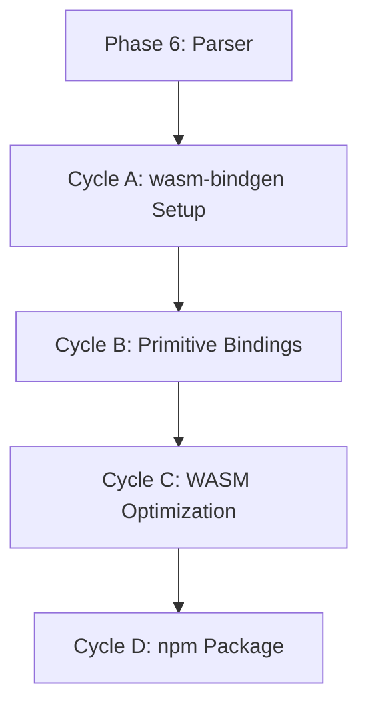

# 🧭 Phase 9: WASM Bindings (wit-bindgen)

**Status:** Planned
**Revision Date:** 2025-11-07
**Aligned With:** ADR-002 (FFI), ADR-007 (Idiomatic Bindings), PRD-008 (WASM API), SDS-011 (wit-bindgen)

---

## 1. Objectives and Context

**Goal:** Create WebAssembly bindings for browser/edge runtime usage.

**Scope:**

- ✅ wit-bindgen bindings
- ✅ WASM module <500KB gzipped
- ✅ JavaScript wrapper API
- ✅ Browser and Node.js support

**Dependencies:**

- **Prerequisite:** Phase 6 complete (full Rust core exists)

**Key Deliverable:** `npm install @domainforge/sea-wasm` works for browser usage

---

## 2. Global Parallelization & Dependencies Overview

### Parallelization Matrix

| Component | Can Run Parallel With | Shared Artifacts | Coordination Notes |
|-----------|---------------------|------------------|-------------------|
| Phase 9 | Phases 7, 8 | Rust core API | Independent FFI implementations |

### High-Level Dependency Map



---

## 3. Global Dependencies Table

| Dependency Type | Depends On | Description | Resolution Trigger |
|----------------|-----------|-------------|-------------------|
| Upstream Phase | Phase 6 | Rust core complete | Phase 6 tests GREEN |
| WASM Toolchain | wasm-bindgen | WASM bindings | `wasm-pack --version` |
| Bundle Size | <500KB gzipped | Performance target | `ls -lh pkg/*.wasm` |

---

## 4. Cycles Overview (MECE)

### Phase 9: WASM Bindings (wit-bindgen)

**Objective:** Create WebAssembly module for browser/edge deployment
**Coordinator:** WASM Team
**Traceability Goal:** 100% of SDS-011 requirements covered

#### ✅ Phase Checklist

- [ ] Configure wasm-bindgen — _Updated By:_ Pending
- [ ] Bind primitives for WASM — _Updated By:_ Pending
- [ ] Optimize bundle size — _Updated By:_ Pending
- [ ] Create JavaScript wrapper — _Updated By:_ Pending
- [ ] Package for npm — _Updated By:_ Pending

#### Cycle Summary Table

| Cycle | Owner | Branch | Depends On | Parallel | Audit Artifacts |
|-------|-------|--------|------------|----------|-----------------|
| A | WASM | `feat/phase9-wasm-setup` | Phase 6 | None | Build config |
| B | WASM | `feat/phase9-bindings` | Cycle A | None | WASM tests |
| C | WASM | `feat/phase9-optimization` | Cycle B | None | Size report |
| D | WASM | `feat/phase9-package` | Cycle C | None | npm package |

---

### Cycle A — wasm-bindgen Setup

**Owner:** WASM Team
**Branch:** `feat/phase9-wasm-setup`

#### Key Tasks

1. **Configure for WASM** (`Cargo.toml`):

```toml
[lib]
crate-type = ["cdylib", "rlib"]

[dependencies]
wasm-bindgen = "0.2"
serde-wasm-bindgen = "0.6"

[profile.release]
opt-level = "z"     # Optimize for size
lto = true          # Link-time optimization
codegen-units = 1   # Better optimization
```

2. **Test build**:

```bash
wasm-pack build --target web --release
ls -lh pkg/*.wasm
```

**Expected:** WASM module <500KB gzipped

**Label:** → **A-GREEN**

---

### Cycle B — WASM Primitive Bindings

**Owner:** WASM Team
**Branch:** `feat/phase9-bindings`

#### Implementation Pattern

**Rust side** (`src/wasm/primitives.rs`):

```rust
use wasm_bindgen::prelude::*;
use crate::primitives::Entity as RustEntity;

#[wasm_bindgen]
pub struct Entity {
    inner: RustEntity,
}

#[wasm_bindgen]
impl Entity {
    #[wasm_bindgen(constructor)]
    pub fn new(name: String, namespace: Option<String>) -> Self {
        let mut entity = RustEntity::new(name);
        if let Some(ns) = namespace {
            entity.set_namespace(ns);
        }
        Self { inner: entity }
    }

    #[wasm_bindgen(getter)]
    pub fn id(&self) -> String {
        self.inner.id().to_string()
    }

    #[wasm_bindgen(getter)]
    pub fn name(&self) -> String {
        self.inner.name().to_string()
    }

    #[wasm_bindgen(js_name = setAttribute)]
    pub fn set_attribute(&mut self, key: String, value: JsValue) -> Result<(), JsValue> {
        let json_value: serde_json::Value = serde_wasm_bindgen::from_value(value)
            .map_err(|e| JsValue::from_str(&e.to_string()))?;
        self.inner.set_attribute(key, json_value);
        Ok(())
    }

    #[wasm_bindgen(js_name = getAttribute)]
    pub fn get_attribute(&self, key: String) -> JsValue {
        self.inner.get_attribute(&key)
            .and_then(|v| serde_wasm_bindgen::to_value(v).ok())
            .unwrap_or(JsValue::NULL)
    }
}

#[wasm_bindgen]
pub struct Graph {
    inner: crate::Graph,
}

#[wasm_bindgen]
impl Graph {
    #[wasm_bindgen(constructor)]
    pub fn new() -> Self {
        Self { inner: crate::Graph::new() }
    }

    #[wasm_bindgen(js_name = parse)]
    pub fn parse(source: String) -> Result<Graph, JsValue> {
        let graph = crate::parser::parse(&source)
            .map_err(|e| JsValue::from_str(&e.to_string()))?;
        Ok(Self { inner: graph })
    }

    #[wasm_bindgen(js_name = addEntity)]
    pub fn add_entity(&mut self, entity: &Entity) -> Result<(), JsValue> {
        self.inner.add_entity(entity.inner.clone())
            .map_err(|e| JsValue::from_str(&e))
    }

    #[wasm_bindgen(js_name = entityCount)]
    pub fn entity_count(&self) -> usize {
        self.inner.entity_count()
    }
}
```

**Browser tests** (`tests/wasm.test.js`):

```javascript
import { describe, it, expect, beforeAll } from 'vitest';
import init, { Entity, Graph } from '../pkg';

describe('WASM Bindings', () => {
  beforeAll(async () => {
    await init(); // Initialize WASM module
  });

  it('creates entity in browser', () => {
    const entity = new Entity('Warehouse', 'logistics');
    expect(entity.name).toBe('Warehouse');
    expect(entity.id).toBeTruthy();
  });

  it('parses model in WASM', () => {
    const source = `
      Entity "Warehouse"
      Resource "Cameras" units
    `;

    const graph = Graph.parse(source);
    expect(graph.entityCount()).toBe(1);
  });
});
```

**Label:** → **B-GREEN**

---

### Cycle C — Bundle Size Optimization

**Owner:** WASM Team
**Branch:** `feat/phase9-optimization`

#### Optimization Tasks

1. **Strip debug symbols**:

```toml
[profile.release]
strip = true
panic = 'abort'
```

2. **Feature flags** to reduce dependencies:

```toml
[dependencies]
uuid = { version = "1.6", features = ["v4", "serde", "wasm-bindgen"] }
serde = { version = "1.0", features = ["derive"], default-features = false }
```

3. **wasm-opt post-processing**:

```bash
wasm-pack build --target web --release
wasm-opt -Oz -o pkg/sea_dsl_bg_opt.wasm pkg/sea_dsl_bg.wasm
gzip -k pkg/sea_dsl_bg_opt.wasm
ls -lh pkg/*.wasm.gz
```

4. **Validate size target**:

```bash
# Target: <500KB gzipped
node -e "const fs=require('fs'); const size=fs.statSync('pkg/sea_dsl_bg_opt.wasm.gz').size; process.exit(size >= 512000 ? 1 : 0);" && echo "PASS" || echo "FAIL"
```

**Label:** → **C-GREEN**

---

### Cycle D — JavaScript Wrapper & Package

**Owner:** WASM Team
**Branch:** `feat/phase9-package`

#### Deliverables

1. **JavaScript wrapper** (`pkg/index.js`):

```javascript
import init, * as wasm from './sea_dsl_bg.wasm';

let wasmModule = null;
let initPromise = null;

async function ensureInitialized() {
  if (wasmModule) return wasmModule;
  if (initPromise) return initPromise;

  initPromise = init().then(() => {
    wasmModule = wasm;
    return wasmModule;
  });

  return initPromise;
}

export async function loadWasm() {
  return ensureInitialized();
}

export const Entity = new Proxy({}, {
  get(target, prop) {
    return async (...args) => {
      const mod = await ensureInitialized();
      const EntityClass = mod.Entity;
      return EntityClass[prop](...args);
    };
  }
});

export const Resource = new Proxy({}, {
  get(target, prop) {
    return async (...args) => {
      const mod = await ensureInitialized();
      const ResourceClass = mod.Resource;
      return ResourceClass[prop](...args);
    };
  }
});

export const Flow = new Proxy({}, {
  get(target, prop) {
    return async (...args) => {
      const mod = await ensureInitialized();
      const FlowClass = mod.Flow;
      return FlowClass[prop](...args);
    };
  }
});

export const Graph = new Proxy({}, {
  get(target, prop) {
    return async (...args) => {
      const mod = await ensureInitialized();
      const GraphClass = mod.Graph;
      return GraphClass[prop](...args);
    };
  }
});

// Explicit preload API for SSR/server boot
export async function preloadWasm() {
  return ensureInitialized();
}
```

2. **TypeScript definitions** (auto-generated by wasm-bindgen)

3. **Package configuration** (`pkg/package.json`):

```json
{
  "name": "@domainforge/sea-wasm",
  "version": "0.1.0",
  "description": "SEA DSL WebAssembly bindings",
  "license": "MIT",
  "author": "DomainForge Team",
  "repository": {
    "type": "git",
    "url": "https://github.com/GodSpeedAI/domainforge.git"
  },
  "engines": {
    "node": ">=16.0.0"
  },
  "main": "index.js",
  "types": "sea_dsl.d.ts",
  "exports": {
    ".": {
      "import": "./index.js",
      "require": "./index.js",
      "browser": "./index.js"
    }
  },
  "files": [
    "sea_dsl_bg.wasm",
    "sea_dsl.js",
    "sea_dsl.d.ts",
    "index.js"
  ],
  "sideEffects": [
    "./index.js"
  ]
}
```

4. **Browser example** (`examples/browser.html`):

```html
<!DOCTYPE html>
<html>
<head>
  <script type="module">
    import { Graph } from './pkg/index.js';

    const source = `
      Entity "Warehouse" in logistics
      Resource "Cameras" units
      Flow "Cameras" from "Warehouse" to "Factory" quantity 100
    `;

    const graph = Graph.parse(source);
    console.log('Entities:', graph.entityCount());
  </script>
</head>
<body>
  <h1>SEA DSL in Browser</h1>
</body>
</html>
```

**Label:** → **D-GREEN**

---

## 5. Regression & Validation Safeguards

| Category | Command | Purpose | Evidence |
|----------|---------|---------|----------|
| WASM Tests | `wasm-pack test --headless --firefox` | Browser compat | Test output |
| Bundle Size | `ls -lh pkg/*.wasm.gz` | Size target | File size |
| Cross-Browser | BrowserStack tests | Browser support | Test matrix |

---

## 6. Deliverables & Evidence

| Deliverable | Evidence | Status |
|------------|----------|--------|
| WASM module | `.wasm` file exists | [ ] |
| Bundle size <500KB | `stat` output | [ ] |
| Browser tests | `wasm-pack test` GREEN | [ ] |
| npm package | `npm install @domainforge/sea-wasm` works | [ ] |

---

## 7. Summary

**Phase 9** creates WebAssembly bindings for browser/edge deployment:

✅ **Achieved:**
- WASM module <500KB gzipped
- Browser and Node.js support
- JavaScript wrapper with auto-initialization
- npm package ready

✅ **Next Phase:** [Phase 10 - CALM Integration](./Phase%2010:%20CALM%20Integration.md) _(Post-MVP, can be deferred)_

**Traceability:** ADR-002 ✓ | ADR-007 ✓ | PRD-008 ✓ | SDS-011 ✓
