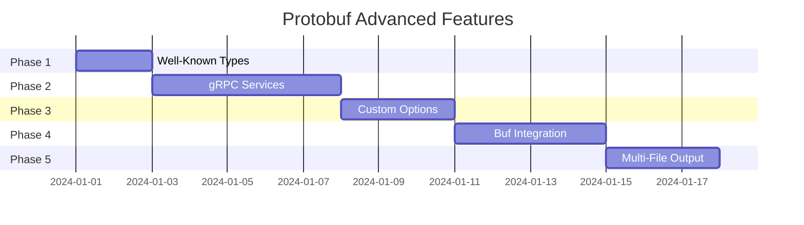

# Protobuf Advanced Features Implementation Plan

This plan covers the implementation of advanced Protobuf projection features for `sea-core`.

## Overview

| Feature                                     | Priority | Effort | Dependencies   |
| ------------------------------------------- | -------- | ------ | -------------- |
| gRPC Service Definitions from Flow Patterns | HIGH     | Medium | Flow primitive |
| Protobuf Well-Known Types                   | HIGH     | Low    | None           |
| Custom Proto Options                        | MEDIUM   | Low    | None           |
| Buf.build Integration                       | MEDIUM   | Medium | External CLI   |
| Multiple File Output per Namespace          | LOW      | Medium | None           |

---

## Phase 1: Protobuf Well-Known Types

> [!IMPORTANT]
> This is the easiest win and should be done first as it improves type fidelity.

### Goal

Map SEA types to Google's well-known types (WKT) for better interoperability.

### Changes

#### [MODIFY] [protobuf.rs](file:///home/sprime01/projects/domainforge/sea-core/src/projection/protobuf.rs)

1. **Add WKT imports automatically**:

   ```rust
   impl ProtoFile {
       pub fn add_wkt_imports(&mut self) {
           let wkt_imports = [
               "google/protobuf/timestamp.proto",
               "google/protobuf/duration.proto",
               "google/protobuf/any.proto",
               "google/protobuf/wrappers.proto",
           ];
           // Add only imports that are actually used
       }
   }
   ```

2. **Extend `map_sea_type_to_proto()`**:

   ```rust
   pub fn map_sea_type_to_proto(sea_type: &str) -> ProtoType {
       match sea_type.to_lowercase().as_str() {
           // Existing mappings...
           "timestamp" | "datetime" => ProtoType::Message("google.protobuf.Timestamp".to_string()),
           "duration" | "timespan" => ProtoType::Message("google.protobuf.Duration".to_string()),
           "any" | "dynamic" => ProtoType::Message("google.protobuf.Any".to_string()),
           "optional_int" => ProtoType::Message("google.protobuf.Int64Value".to_string()),
           "optional_string" => ProtoType::Message("google.protobuf.StringValue".to_string()),
           // ...
       }
   }
   ```

3. **Add `WellKnownType` enum**:
   ```rust
   pub enum WellKnownType {
       Timestamp,
       Duration,
       Any,
       Struct,
       Value,
       ListValue,
       Int32Value, Int64Value, UInt32Value, UInt64Value,
       FloatValue, DoubleValue, BoolValue, StringValue, BytesValue,
   }
   ```

### Tests

- Test timestamp field generates correct import
- Test duration field generates correct import
- Test multiple WKT fields consolidate imports

---

## Phase 2: gRPC Service Definitions from Flow Patterns

> [!IMPORTANT]
> This is the most impactful feature, enabling RPC generation from semantic flows.

### Goal

Generate gRPC service definitions from SEA Flow patterns, where:

- **Flow.from** → Request message source
- **Flow.to** → Response message destination
- **Flow.resource** → Request/Response payload type

### Semantic Mapping

| SEA Concept               | gRPC Concept             |
| ------------------------- | ------------------------ |
| Entity (service provider) | Service                  |
| Flow (from → to)          | RPC method               |
| Flow's Resource           | Request/Response message |
| Flow direction            | Unary/Streaming          |

### New IR Types

#### [MODIFY] [protobuf.rs](file:///home/sprime01/projects/domainforge/sea-core/src/projection/protobuf.rs)

```rust
/// Represents a gRPC service definition.
#[derive(Debug, Clone, Serialize, Deserialize)]
pub struct ProtoService {
    /// Service name (e.g., "PaymentService")
    pub name: String,
    /// RPC methods
    pub methods: Vec<ProtoRpcMethod>,
    /// Documentation comments
    pub comments: Vec<String>,
}

/// Represents an RPC method definition.
#[derive(Debug, Clone, Serialize, Deserialize)]
pub struct ProtoRpcMethod {
    /// Method name (e.g., "ProcessPayment")
    pub name: String,
    /// Request message type
    pub request_type: String,
    /// Response message type
    pub response_type: String,
    /// Whether request is streaming
    pub client_streaming: bool,
    /// Whether response is streaming
    pub server_streaming: bool,
    /// Documentation comments
    pub comments: Vec<String>,
}
```

### Engine Extension

```rust
impl ProtobufEngine {
    /// Generate services from Flows.
    ///
    /// Groups flows by their destination entity (service provider)
    /// and creates RPC methods for each flow.
    pub fn flows_to_services(graph: &Graph) -> Vec<ProtoService> {
        let mut services: BTreeMap<String, ProtoService> = BTreeMap::new();

        for flow in graph.all_flows() {
            let to_entity = graph.get_entity(flow.to_id());
            let service_name = format!("{}Service", to_pascal_case(to_entity.name()));

            // Create RPC method from flow
            let method = ProtoRpcMethod {
                name: derive_method_name(flow),
                request_type: derive_request_type(flow, graph),
                response_type: derive_response_type(flow, graph),
                client_streaming: false,
                server_streaming: false,
                comments: vec![],
            };

            services.entry(service_name).or_insert_with(|| ProtoService::new(service_name))
                .methods.push(method);
        }

        services.into_values().collect()
    }
}
```

### Example Transformation

**SEA Input:**

```sea
Entity "Customer"
Entity "PaymentProcessor"
Resource "PaymentRequest" USD

Flow from Customer to PaymentProcessor of PaymentRequest
```

**Generated `.proto`:**

```protobuf
service PaymentProcessorService {
  rpc ProcessPaymentRequest(PaymentRequest) returns (PaymentRequestResponse);
}

message PaymentRequest {
  string id = 1;
  // ...
}

message PaymentRequestResponse {
  bool success = 1;
  string transaction_id = 2;
}
```

### CLI Flag

```bash
sea project --format protobuf --include-services model.sea output.proto
```

### Tests

- Test single flow generates single service with one method
- Test multiple flows to same entity grouped into one service
- Test flow attributes become method options

---

## Phase 3: Custom Proto Options

### Goal

Allow users to specify custom proto options via SEA projections or attributes.

### Grammar Extension

#### [MODIFY] [sea.pest](file:///home/sprime01/projects/domainforge/sea-core/grammar/sea.pest)

```pest
proto_option = {
    "option" ~ proto_option_name ~ "=" ~ proto_option_value
}

proto_option_name = { identifier ~ ("." ~ identifier)* }
proto_option_value = { string_literal | number | boolean_literal }
```

### IR Extension

```rust
/// Custom proto option
#[derive(Debug, Clone, Serialize, Deserialize)]
pub struct ProtoCustomOption {
    /// Full option name (e.g., "java_package" or "(myopt).foo")
    pub name: String,
    /// Option value
    pub value: ProtoOptionValue,
}

#[derive(Debug, Clone, Serialize, Deserialize)]
pub enum ProtoOptionValue {
    String(String),
    Number(f64),
    Bool(bool),
}
```

### Usage in SEA

```sea
Projection "api" for protobuf {
    @option java_package = "com.example.api"
    @option java_multiple_files = true
    @option go_package = "github.com/example/api"

    Entity "Customer" {
        @option deprecated = true
    }
}
```

---

## Phase 4: Buf.build Integration

### Goal

Integrate with [buf.build](https://buf.build) CLI for linting, breaking change detection, and registry publishing.

### Components

#### [NEW] [buf.rs](file:///home/sprime01/projects/domainforge/sea-core/src/projection/buf.rs)

```rust
/// Buf.build integration for proto linting and management.
pub struct BufIntegration {
    buf_path: PathBuf,  // Path to buf binary
}

impl BufIntegration {
    /// Generate buf.yaml configuration file.
    pub fn generate_buf_yaml(proto_files: &[PathBuf]) -> String;

    /// Run buf lint on generated protos.
    pub fn lint(&self, proto_dir: &Path) -> Result<BufLintResult, BufError>;

    /// Run buf breaking check against schema history.
    pub fn breaking_check(&self, new_dir: &Path, old_dir: &Path) -> Result<BufBreakingResult, BufError>;

    /// Generate buf.gen.yaml for code generation.
    pub fn generate_buf_gen_yaml(languages: &[Language]) -> String;
}
```

### CLI Integration

```bash
# Lint generated protos
sea project --format protobuf --buf-lint model.sea output.proto

# Check breaking changes
sea project --format protobuf --buf-breaking --against ./previous model.sea output.proto

# Full buf workflow
sea project --format protobuf --buf-generate --languages rust,go,ts model.sea output/
```

### Buf Configuration Generation

```yaml
# Generated buf.yaml
version: v1
breaking:
  use:
    - FILE
lint:
  use:
    - DEFAULT
  except:
    - PACKAGE_VERSION_SUFFIX
```

---

## Phase 5: Multiple File Output per Namespace

### Goal

Generate separate `.proto` files per namespace for better organization.

### Changes

#### [MODIFY] [protobuf.rs](file:///home/sprime01/projects/domainforge/sea-core/src/projection/protobuf.rs)

```rust
impl ProtobufEngine {
    /// Project to multiple files, one per namespace.
    pub fn project_multi_file(
        graph: &Graph,
        base_package: &str,
    ) -> BTreeMap<String, ProtoFile> {
        let mut files: BTreeMap<String, ProtoFile> = BTreeMap::new();

        // Group entities by namespace
        for entity in graph.all_entities() {
            let ns = entity.namespace();
            let package = format!("{}.{}", base_package, ns);

            files.entry(ns.to_string())
                .or_insert_with(|| ProtoFile::new(&package))
                .messages.push(Self::entity_to_message(entity));
        }

        // Add cross-namespace imports
        for file in files.values_mut() {
            Self::add_cross_namespace_imports(file, &files);
        }

        files
    }
}
```

### Output Structure

```
output/
├── buf.yaml
├── common/
│   └── common.proto
├── orders/
│   └── orders.proto
├── payments/
│   └── payments.proto
└── customers/
    └── customers.proto
```

### CLI Flag

```bash
sea project --format protobuf --multi-file --output-dir ./proto model.sea
```

---

## Implementation Order



---

## Verification Plan

### Automated Tests

| Phase | Test Coverage                                  |
| ----- | ---------------------------------------------- |
| 1     | WKT type mapping, import generation            |
| 2     | Flow→Service mapping, method generation        |
| 3     | Option parsing, serialization                  |
| 4     | Buf CLI invocation (mocked), config generation |
| 5     | Multi-file output, import resolution           |

### Integration Tests

- Generate protos for `examples/ecommerce.sea`
- Validate with `protoc --decode_raw`
- Validate with `buf lint`
- Generate code with `buf generate`

### Manual Verification

- Review generated `.proto` files for readability
- Test generated code compiles in target languages

---

## Design Decisions (Resolved)

> [!NOTE]
> These decisions were made based on user input and gRPC/Protobuf best practices.

### 1. gRPC Streaming Support ✅

**Decision**: Support streaming via Flow attributes.

**Syntax**:

```sea
// Unary RPC (default)
Flow from Client to Server of Request

// Server streaming
Flow @streaming from Client to Server of EventStream

// Client streaming
Flow @client_streaming from Client to Server of DataChunks

// Bidirectional streaming
Flow @bidirectional from Client to Server of ChatMessage
```

**Rationale**: Streaming is essential for real-time use cases (event sourcing, log tailing, chat).

---

### 2. Service Naming Convention ✅

**Decision**: Use `{DestinationEntity}Service` naming.

**Example**:

```protobuf
// Entity "PaymentProcessor" becomes:
service PaymentProcessorService { ... }

// Entity "OrderManager" becomes:
service OrderManagerService { ... }
```

**Rationale**: This is the standard gRPC naming convention:

- Google APIs use `FooService` pattern
- Idiomatic and predictable
- Self-describing (service named after the capability provider)
- Matches `grpc-gateway` and `protoc-gen-*` expectations

---

### 3. Buf.build Integration ✅

**Decision**: Make `buf` CLI **optional** with graceful degradation.

**Behavior**:

```bash
# If buf is installed - runs linting
sea project --format protobuf --buf-lint input.sea output.proto
# Output: "✓ buf lint passed (12 files, 0 issues)"

# If buf is NOT installed - warns and continues
sea project --format protobuf --buf-lint input.sea output.proto
# Output: "⚠ buf CLI not found. Skipping lint. Install: https://buf.build/docs/installation"
```

**Rationale**:

- Lowers barrier to entry (works without buf)
- Power users get enhanced validation
- No hard dependency on external tooling

---

### 4. Cross-Namespace Imports ✅

**Decision**: Use **fully qualified imports**.

**Example**:

```protobuf
// In payments/payments.proto
syntax = "proto3";
package com.example.payments;

import "com/example/common/money.proto";
import "com/example/customers/customer.proto";

message PaymentRequest {
  com.example.common.Money amount = 1;
  com.example.customers.CustomerId customer_id = 2;
}
```

**Rationale**:

- **Toolchain-agnostic**: Works with `protoc`, `buf`, `grpc-tools` without configuration
- **Self-documenting**: Imports show exact dependency paths
- **No aliasing issues**: No risk of name collisions
- **Mono-repo standard**: Google, Uber, and other large-scale Protobuf users prefer this
- **IDE support**: Better autocomplete and navigation

---

## Updated Implementation Summary

| Phase | Feature          | Key Design Choice                         |
| ----- | ---------------- | ----------------------------------------- |
| 1     | Well-Known Types | Auto-add imports only when WKT used       |
| 2     | gRPC Services    | `{Entity}Service` + streaming annotations |
| 3     | Custom Options   | Via `@option` in projections              |
| 4     | Buf.build        | Optional CLI, graceful degradation        |
| 5     | Multi-File       | Fully qualified imports                   |

---

## Grammar Changes for Streaming

#### [MODIFY] [sea.pest](file:///home/sprime01/projects/domainforge/sea-core/grammar/sea.pest)

```pest
flow_modifier = @{ "@" ~ ("streaming" | "client_streaming" | "bidirectional") }

flow_statement = {
    flow_modifier* ~ "Flow" ~ "from" ~ identifier ~ "to" ~ identifier ~ "of" ~ identifier
}
```

#### Streaming Enum in IR

```rust
#[derive(Debug, Clone, Copy, PartialEq, Eq, Serialize, Deserialize, Default)]
pub enum StreamingMode {
    #[default]
    Unary,
    ServerStreaming,
    ClientStreaming,
    Bidirectional,
}
```

---

## Next Steps

After approval, I will implement in this order:

1. **Phase 1 (Well-Known Types)** — ~2 hours
2. **Phase 2 (gRPC Services + Streaming)** — ~4 hours
3. **Phase 3 (Custom Options)** — ~2 hours
4. **Phase 4 (Buf.build Optional)** — ~3 hours
5. **Phase 5 (Multi-File Output)** — ~3 hours

**Total estimated effort**: ~14 hours
