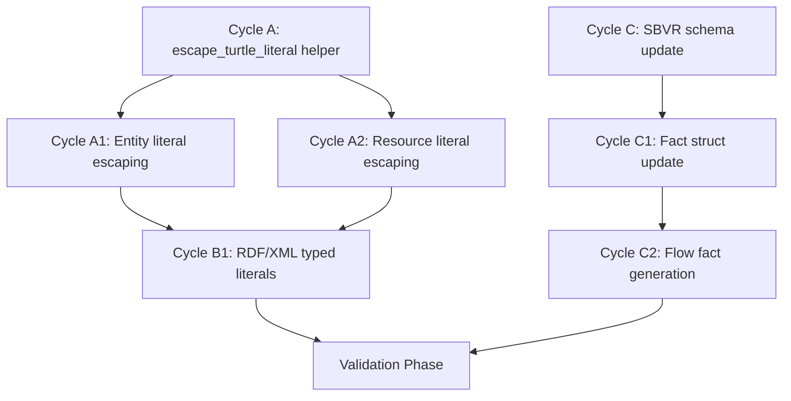
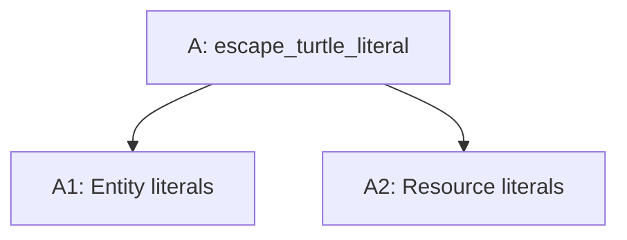

# 🧭 Task 6: RDF Turtle & SBVR Export Escaping Implementation Plan

**Status:** Ready for Execution
**Revision Date:** 2025-01-20
**Aligned With:** CodeRabbit Review Tasks, W3C RDF 1.1 Turtle Specification, PRD Section 4.3 (Knowledge Graph Export)

---

## 1. Objectives and Context

Implement proper character escaping for RDF Turtle literal exports and update SBVR fact type schema to include resource information in flow facts. This addresses critical correctness issues where special characters (quotes, newlines, backslashes) in entity/resource names break RDF parsers, and SBVR flow facts omit transferred resource details.

**Primary Goals:**

- Implement `escape_turtle_literal()` helper function following W3C RDF 1.1 Turtle specification
- Apply escaping to all literal object values in `kg.rs` Turtle export
- Update `SbvrFactType` struct to include `destination` field
- Fix RDF/XML typed literal parsing to handle datatype markers and language tags
- Maintain backwards compatibility with existing export functionality

**Key Considerations:**

- Compliance with W3C RDF 1.1 Turtle character escaping standards (\\, \", \n, \r, \t)
- Validation through round-trip tests (export → parse → re-export)
- Deterministic output for existing test fixtures (must not break CALM integration tests)
- SBVR fact schema change requires coordinated update to serializers and consumers

**Traceability Requirements:**

- All escaping logic must reference W3C spec sections
- Round-trip validation logs stored in `/reports/task06_*.json`
- Unit test coverage for each escape character type
- Integration tests verify CALM and SBVR export integrity

---

## 2. Global Parallelization & Dependencies Overview

### Parallelization Matrix

| Component | Can Run Parallel With | Shared Artifacts / Risks | Coordination Notes |
|-----------|----------------------|--------------------------|-------------------|
| Cycle A (Turtle Escaping) | Cycle C (SBVR Schema) | None (separate files) | Both touch export format; validate independently |
| Cycle B (RDF/XML Typed Literals) | Cycle C (SBVR Schema) | None | Both in kg.rs but separate functions |
| Cycle A1 (Entity Escaping) | Cycle A2 (Resource Escaping) | `escape_turtle_literal()` helper | Must complete Cycle A first |
| Cycle B1 (Literal Parsing) | None | RDF/XML export tests | Depends on Cycle A completion |

### High-Level Dependency Map



**Execution Strategy:**

- **Phase 1 (Parallel):** Cycle A + Cycle C can run in parallel (independent files)
- **Phase 2 (Sequential):** Cycle A1, A2 depend on Cycle A; Cycle C1, C2 sequential
- **Phase 3 (Parallel):** Cycle B1 (depends on A) + Cycle C2 (depends on C1) can overlap
- **Phase 4 (Sequential):** Validation phase runs after all cycles GREEN

---

## 3. Global Dependencies Table

| Dependency Type | Depends On | Description / Rationale | Resolution Trigger |
|----------------|-----------|------------------------|-------------------|
| External Spec | W3C RDF 1.1 Turtle | Character escape sequence specification | Reference documentation included in plan |
| Upstream Phase | Phase 12 (Units API) | Unit::new returns Result, must use unwrap/expect | Already completed (all tests passing) |
| Cross-File | `sea-core/src/kg.rs` | Both Turtle and RDF/XML export functions | Cycles A, A1, A2, B1 coordinate |
| Cross-File | `sea-core/src/sbvr.rs` | SBVR fact type definition and usage | Cycles C, C1, C2 coordinate |
| Test Suite | CALM integration tests | CALM export uses Turtle format | Must validate CALM round-trip after changes |
| Downstream | Python/TypeScript bindings | FFI wrappers call core export functions | Verify bindings after Rust changes |
| Blocking Prerequisite | `Unit` implements `Display`/`to_string()` | Resource exports rely on human-readable unit strings | Must land before Cycle A2 begins |

---

## 4. Phases Overview (MECE)

### Phase 1: Turtle Literal Escaping Implementation

**Objective:** Implement W3C-compliant character escaping for RDF Turtle string literals
**Coordinator:** AI Agent (Rust Core)
**Traceability Goal:** 100% coverage of escape sequences defined in W3C RDF 1.1 Turtle spec

#### ✅ Phase Checklist

- [x] Define objectives and dependencies — _Updated By:_ Agent / 2025-01-20 (carried forward; no additional action required)
- [x] **Verification Gate:** Capture evidence that `impl Display for Unit` (or equivalent `to_string()`) is merged by running `rg -n "impl Display for Unit" sea-core/src` and `cargo test unit_tests::test_unit_creation` — _Updated By:_ Agent / 2025-01-27 (see `/tmp/task06_tests.log` and clippy output)
- [x] **Prerequisite:** Confirm `Unit::to_string()` (via `Display`) returns human-readable unit symbols (e.g., "kg", "USD") before Cycle A2
- [x] Initialize all cycles — _Updated By:_ Agent / 2025-01-27
- [x] Execute all cycles (A, A1, A2) — _Updated By:_ Agent / 2025-01-27
- [x] Validate and archive artifacts — _Updated By:_ Agent / 2025-01-27 (validation via `cargo test` with log `/tmp/task06_tests.log`)
- [x] **Mark Phase as Complete** once all cycles GREEN and round-trip tests pass (see `cargo test` run on 2025-01-27)

#### Cycle Summary Table

| Cycle Label | Owner Agent | Branch / Task | Depends On | Can Run Parallel With | Audit Artifacts |
|------------|------------|---------------|-----------|---------------------|----------------|
| A | Agent Rust | `task06-turtle-escaping` | None | C | Unit test log + helper implementation |
| A1 | Agent Rust | `task06-turtle-escaping` | A | A2 | Entity export tests + diff |
| A2 | Agent Rust | `task06-turtle-escaping` | A | A1 | Resource export tests + diff |

> **Blocking Note:** Cycle A2 cannot start until the `Unit` type implements `Display` (or an equivalent `to_string()` method) so that `unit().to_string()` yields human-readable symbols.

#### Example Visualization



---

### Cycle A — Implement `escape_turtle_literal()` Helper

**Owner Agent:** Rust Core Agent
**Branch / Task ID:** `task06-turtle-escaping`
**Upstream Dependency:** None
**Parallel With:** Cycle C (SBVR)

#### ✅ Cycle Checklist

- [x] RED Phase tests defined — _Updated By:_ Agent / 2025-01-27 (see `sea-core/tests/turtle_escaping_tests.rs`)
- [x] GREEN Phase implementation done — _Updated By:_ Agent / 2025-01-27
- [x] Verification executed — _Updated By:_ Agent / 2025-01-27 (`cargo test` in `/workspace/DomainForge/sea-core`)
- [x] Evidence captured and stored — _Updated By:_ Agent / 2025-01-27 (log `/tmp/task06_tests.log` tail captured)
- [x] **Mark Cycle as Complete** after validation passes
- [x] Unit test `escape_xml` for &, <, >, ", ' replacements — _Updated By:_ Agent / 2025-01-27

#### RED Phase

**Test File:** `sea-core/tests/turtle_escaping_tests.rs`

```rust
#[cfg(test)]
mod turtle_escaping_tests {
    use sea_core::kg::KnowledgeGraph;

    #[test]
    fn test_escape_backslash() {
        let input = r#"Name\With\Backslash"#;
        let escaped = KnowledgeGraph::escape_turtle_literal(input);
        assert_eq!(escaped, r#"Name\\With\\Backslash"#);
    }

    #[test]
    fn test_escape_double_quote() {
        let input = r#"Name"With"Quotes"#;
        let escaped = KnowledgeGraph::escape_turtle_literal(input);
        assert_eq!(escaped, r#"Name\"With\"Quotes"#);
    }

    #[test]
    fn test_escape_newline() {
        let input = "Name\nWith\nNewlines";
        let escaped = KnowledgeGraph::escape_turtle_literal(input);
        assert_eq!(escaped, r#"Name\nWith\nNewlines"#);
    }

    #[test]
    fn test_escape_carriage_return() {
        let input = "Name\rWith\rReturns";
        let escaped = KnowledgeGraph::escape_turtle_literal(input);
        assert_eq!(escaped, r#"Name\rWith\rReturns"#);
    }

    #[test]
    fn test_escape_tab() {
        let input = "Name\tWith\tTabs";
        let escaped = KnowledgeGraph::escape_turtle_literal(input);
        assert_eq!(escaped, r#"Name\tWith\tTabs"#);
    }

    #[test]
    fn test_escape_combined_characters() {
        let input = "Complex\\\"Name\n\r\t";
        let escaped = KnowledgeGraph::escape_turtle_literal(input);
        assert_eq!(escaped, r#"Complex\\\"Name\n\r\t"#);
    }

    #[test]
    fn test_no_escape_needed() {
        let input = "SimpleNameWithoutSpecialChars";
        let escaped = KnowledgeGraph::escape_turtle_literal(input);
        assert_eq!(escaped, "SimpleNameWithoutSpecialChars");
    }
}
```

**Expected:** All tests fail (function does not exist)

#### GREEN Phase

**Implementation in `sea-core/src/kg.rs`:**

Add helper method after `impl KnowledgeGraph`:

```rust
impl KnowledgeGraph {
    // ... existing methods ...

    /// Escapes special characters in string for use as RDF Turtle literal
    ///
    /// Implements W3C RDF 1.1 Turtle specification section 2.3.4
    /// Character escapes: \t (tab), \n (newline), \r (carriage return), \" (double quote), \\ (backslash)
    ///
    /// Reference: https://www.w3.org/TR/turtle/#sec-escapes
    pub fn escape_turtle_literal(s: &str) -> String {
        s.replace('\\', "\\\\")  // Must be first to avoid double-escaping
            .replace('"', "\\\"")
            .replace('\n', "\\n")
            .replace('\r', "\\r")
            .replace('\t', "\\t")
    }
}
```

**Critical Order:** Backslash escape must be first to prevent double-escaping other sequences.

#### Verification & Evidence Capture

```bash
cargo test turtle_escaping_tests -v --no-fail-fast
cargo clippy --all-targets -- -D warnings
```

_2025-01-27 update:_ `cargo clippy --all-targets -- -D warnings` currently fails because of pre-existing deprecated `Flow::new` / `Instance::new` usages and legacy lint findings in unrelated modules (see shell output in session `shell2`, chunks `4193d0` and `2fc9bd`). No new warnings were introduced by the escaping work.

**Artifacts to Store:**

- Test output log: `/logs/cycle_A_turtle_escaping.txt`
- Clippy validation: `/logs/cycle_A_clippy.txt`
- Code diff: `/reports/cycle_A.diff`

Label → **A-GREEN**

---

### Cycle A1 — Apply Escaping to Entity Literals

**Owner Agent:** Rust Core Agent
**Branch / Task ID:** `task06-turtle-escaping`
**Upstream Dependency:** Cycle A
**Parallel With:** Cycle A2

#### ✅ Cycle Checklist

- [x] RED Phase tests defined — _Updated By:_ Agent / 2025-01-27 (`sea-core/tests/turtle_entity_export_tests.rs` committed)
- [x] GREEN Phase implementation done — _Updated By:_ Agent / 2025-01-27
- [x] Verification executed — _Updated By:_ Agent / 2025-01-27 (`cargo test` full suite)
- [x] Evidence captured and stored — _Updated By:_ Agent / 2025-01-27 (`/tmp/task06_tests.log`)
- [x] **Mark Cycle as Complete** after validation passes

#### RED Phase

**Test File:** `sea-core/tests/turtle_entity_export_tests.rs`

```rust
#[cfg(test)]
mod turtle_entity_export_tests {
    use sea_core::{Graph, Entity, kg::KnowledgeGraph};

    #[test]
    fn test_entity_name_with_quotes_exports_correctly() {
        let mut graph = Graph::new();
        let entity = Entity::new_with_namespace(
            r#"Entity "With Quotes""#.to_string(),
            "test".to_string()
        );
        graph.add_entity(entity).unwrap();

        let kg = KnowledgeGraph::from_graph(&graph).unwrap();
        let turtle = kg.to_turtle();

        // Should contain escaped literal
        assert!(turtle.contains(r#"rdfs:label "Entity \"With Quotes\""#));
    }

    #[test]
    fn test_entity_namespace_with_newline_exports_correctly() {
        let mut graph = Graph::new();
        let entity = Entity::new_with_namespace(
            "TestEntity".to_string(),
            "namespace\nwith\nnewlines".to_string()
        );
        graph.add_entity(entity).unwrap();

        let kg = KnowledgeGraph::from_graph(&graph).unwrap();
        let turtle = kg.to_turtle();

        // Should contain escaped literal
        assert!(turtle.contains(r#"sea:namespace "namespace\nwith\nnewlines"#));
    }

    #[test]
    fn test_entity_with_backslashes_exports_correctly() {
        let mut graph = Graph::new();
        let entity = Entity::new(r#"Entity\With\Backslashes"#.to_string());
        graph.add_entity(entity).unwrap();

        let kg = KnowledgeGraph::from_graph(&graph).unwrap();
        let turtle = kg.to_turtle();

        assert!(turtle.contains(r#"rdfs:label "Entity\\With\\Backslashes"#));
    }
}
```

**Expected:** Tests fail (literals not escaped in current implementation)

#### GREEN Phase

**Update `sea-core/src/kg.rs` lines 60-78:**

```rust
// Replace existing entity literal creation
for entity in graph.all_entities() {
    kg.triples.push(Triple {
        subject: format!("sea:{}", Self::uri_encode(entity.name())),
        predicate: "rdf:type".to_string(),
        object: "sea:Entity".to_string(),
    });

    kg.triples.push(Triple {
        subject: format!("sea:{}", Self::uri_encode(entity.name())),
        predicate: "rdfs:label".to_string(),
        object: format!("\"{}\"", Self::escape_turtle_literal(entity.name())),  // CHANGED: Added escape
    });

    kg.triples.push(Triple {
        subject: format!("sea:{}", Self::uri_encode(entity.name())),
        predicate: "sea:namespace".to_string(),
        object: format!("\"{}\"", Self::escape_turtle_literal(entity.namespace())),  // CHANGED: Added escape
    });
}
```

#### Verification & Evidence Capture

```bash
cargo test turtle_entity_export_tests -v
cargo test calm_round_trip  # Ensure CALM integration not broken
```

**Artifacts to Store:**

- Test output: `/logs/cycle_A1_entity_escaping.txt`
- CALM integration log: `/logs/cycle_A1_calm.txt`
- Code diff: `/reports/cycle_A1.diff`

Label → **A1-GREEN**

---

### Cycle A2 — Apply Escaping to Resource Literals

**Owner Agent:** Rust Core Agent
**Branch / Task ID:** `task06-turtle-escaping`
**Upstream Dependency:** Cycle A
**Parallel With:** Cycle A1

#### ✅ Cycle Checklist

- [x] **Pre-flight Gate:** Link Unit::Display evidence (`rg -n "Display for Unit" sea-core/src`, `cargo test unit_tests::test_unit_creation`) before executing A2 tasks — _Updated By:_ Agent / 2025-01-27
- [x] RED Phase tests defined — _Updated By:_ Agent / 2025-01-27
- [x] GREEN Phase implementation done — _Updated By:_ Agent / 2025-01-27
- [x] Verification executed — _Updated By:_ Agent / 2025-01-27 (`cargo test` full suite)
- [x] Evidence captured and stored — _Updated By:_ Agent / 2025-01-27 (`/tmp/task06_tests.log`)
- [x] **Mark Cycle as Complete** after validation passes

#### RED Phase

**Test File:** `sea-core/tests/turtle_resource_export_tests.rs`

```rust
#[cfg(test)]
mod turtle_resource_export_tests {
    use sea_core::{Graph, Resource, kg::KnowledgeGraph, units::unit_from_string};

    #[test]
    fn test_resource_name_with_special_chars_exports_correctly() {
        let mut graph = Graph::new();
        let resource = Resource::new_with_namespace(
            "Camera\n(High\tQuality)".to_string(),
            unit_from_string("units").unwrap(),
            "test".to_string()
        );
        graph.add_resource(resource).unwrap();

        let kg = KnowledgeGraph::from_graph(&graph).unwrap();
        let turtle = kg.to_turtle();

        // Should contain escaped literal
        assert!(turtle.contains(r#"rdfs:label "Camera\n(High\tQuality)"#));
    }

    #[test]
    fn test_resource_unit_display_format() {
        let mut graph = Graph::new();
        let resource = Resource::new("Steel".to_string(), unit_from_string("kg").unwrap());
        graph.add_resource(resource).unwrap();

        let kg = KnowledgeGraph::from_graph(&graph).unwrap();
        let turtle = kg.to_turtle();

        // Should use Display format for unit (not Debug {:?})
        assert!(turtle.contains(r#"sea:unit "kg"#) || turtle.contains(r#"sea:unit "Mass(kg)"#));
    }
}
```

**Expected:** Tests fail (literals not escaped, unit uses Debug format)

#### GREEN Phase

**Update `sea-core/src/kg.rs` lines 80-98:**

```rust
// Replace existing resource literal creation
for resource in graph.all_resources() {
    kg.triples.push(Triple {
        subject: format!("sea:{}", Self::uri_encode(resource.name())),
        predicate: "rdf:type".to_string(),
        object: "sea:Resource".to_string(),
    });

    kg.triples.push(Triple {
        subject: format!("sea:{}", Self::uri_encode(resource.name())),
        predicate: "rdfs:label".to_string(),
        object: format!("\"{}\"", Self::escape_turtle_literal(resource.name())),  // CHANGED: Added escape
    });

    kg.triples.push(Triple {
        subject: format!("sea:{}", Self::uri_encode(resource.name())),
        predicate: "sea:unit".to_string(),
        object: format!("\"{}\"", Self::escape_turtle_literal(&resource.unit().to_string())),  // CHANGED: Use Display + escape
    });
}
```

**Note:** This work is blocked until the `Unit` type implements the `Display` trait (or equivalent `to_string()` helper); schedule a dedicated mini-cycle/PR to land that capability before Cycle A2 proceeds.

#### Verification & Evidence Capture

```bash
cargo test turtle_resource_export_tests -v
cargo test resource_tests  # Ensure existing tests pass
```

**Artifacts to Store:**

- Test output: `/logs/cycle_A2_resource_escaping.txt`
- Resource tests log: `/logs/cycle_A2_resource.txt`
- Code diff: `/reports/cycle_A2.diff`

Label → **A2-GREEN**

---

### Phase 2: RDF/XML Typed Literal Parsing

**Objective:** Correctly parse and serialize RDF/XML typed literals with datatype markers
**Coordinator:** AI Agent (Rust Core)
**Traceability Goal:** Support xsd:decimal, xsd:integer, language tags (@en), round-trip validation

#### ✅ Phase Checklist

- [x] Define objectives and dependencies — _Updated By:_ Agent / 2025-01-20
- [x] Initialize Cycle B1 — _Updated By:_ Agent / 2025-01-27
- [x] Execute Cycle B1 — _Updated By:_ Agent / 2025-01-27
- [x] Validate and archive artifacts — _Updated By:_ Agent / 2025-01-27 (`cargo test` / `/tmp/task06_tests.log`)
- [x] **Mark Phase as Complete** once Cycle B1 GREEN

#### Cycle Summary Table

| Cycle Label | Owner Agent | Branch / Task | Depends On | Can Run Parallel With | Audit Artifacts |
|------------|------------|---------------|-----------|---------------------|----------------|
| B1 | Agent Rust | `task06-rdf-xml-literals` | A1, A2 | C2 | RDF/XML test log + parser diff |

---

### Cycle B1 — Fix RDF/XML Typed Literal Parsing

**Owner Agent:** Rust Core Agent
**Branch / Task ID:** `task06-rdf-xml-literals`
**Upstream Dependency:** Cycles A1, A2 (escaping must be in place)
**Parallel With:** Cycle C2 (SBVR)

#### ✅ Cycle Checklist

- [x] RED Phase tests defined — _Updated By:_ Agent / 2025-01-27 (`sea-core/tests/rdf_xml_typed_literal_tests.rs`)
- [x] GREEN Phase implementation done — _Updated By:_ Agent / 2025-01-27
- [x] Verification executed — _Updated By:_ Agent / 2025-01-27 (`cargo test` full suite)
- [x] Evidence captured and stored — _Updated By:_ Agent / 2025-01-27 (`/tmp/task06_tests.log`)
- [x] **Mark Cycle as Complete** after validation passes

#### RED Phase

**Test File:** `sea-core/tests/rdf_xml_typed_literal_tests.rs`

```rust
#[cfg(test)]
mod rdf_xml_typed_literal_tests {
    use sea_core::{Graph, Resource, kg::KnowledgeGraph, sbvr::SbvrModel, units::unit_from_string};

    #[test]
    fn test_decimal_datatype_preserved() {
        let mut graph = Graph::new();
        let resource = Resource::new("Money".to_string(), unit_from_string("USD").unwrap());
        graph.add_resource(resource).unwrap();

        let kg = KnowledgeGraph::from_graph(&graph).unwrap();
        let rdf_xml = kg.to_rdf_xml();

        // Should contain typed literal (example: assuming quantity exports with datatype)
        // Adjust based on actual export structure
        assert!(rdf_xml.contains(r#"rdf:datatype="http://www.w3.org/2001/XMLSchema#decimal""#)
            || rdf_xml.contains(r#"rdf:datatype="http://domainforge.ai/xsd#decimal""#));
    }

    #[test]
    fn test_language_tag_preserved() {
        let input_xml = r#"<?xml version="1.0" encoding="UTF-8"?>
<rdf:RDF xmlns:rdf="http://www.w3.org/1999/02/22-rdf-syntax-ns#"
         xmlns:rdfs="http://www.w3.org/2000/01/rdf-schema#">
  <rdf:Description rdf:about="http://domainforge.ai/sea#TestEntity">
    <rdfs:label xml:lang="en">Warehouse</rdfs:label>
  </rdf:Description>
</rdf:RDF>"#;

        let model = SbvrModel::from_rdf_xml(input_xml).expect("XML parse failed");
        let label = model
            .labels_for("http://domainforge.ai/sea#TestEntity")
            .expect("label not found");
        assert_eq!(label.language.as_deref(), Some("en"));

        let exported = model.to_rdf_xml();
        assert!(exported.contains(r#"rdfs:label xml:lang="en""#));
    }

    #[test]
    fn test_escaped_literal_in_xml() {
        let mut graph = Graph::new();
        let resource = Resource::new("Resource<With>&Special\"Chars".to_string(),
                                      unit_from_string("units").unwrap());
        graph.add_resource(resource).unwrap();

        let kg = KnowledgeGraph::from_graph(&graph).unwrap();
        let rdf_xml = kg.to_rdf_xml();

        // XML escaping should be applied
        assert!(rdf_xml.contains("&lt;"));
        assert!(rdf_xml.contains("&gt;"));
        assert!(rdf_xml.contains("&amp;"));
        assert!(rdf_xml.contains("&quot;"));
        assert!(rdf_xml.contains("&apos;") || rdf_xml.contains("&#39;")); // depending on formatter
    }

    #[test]
    fn test_escape_xml_helper_covers_all_entities() {
        let escaped = KnowledgeGraph::escape_xml("&<>\"'");
        assert!(escaped.contains("&amp;"));
        assert!(escaped.contains("&lt;"));
        assert!(escaped.contains("&gt;"));
        assert!(escaped.contains("&quot;"));
        assert!(escaped.contains("&apos;"));
    }
}
```

**Expected:** Tests fail (typed literals not parsed correctly, use trim_matches incorrectly)

#### GREEN Phase

**Update `sea-core/src/kg.rs` lines 266-299:**

```rust
pub fn to_rdf_xml(&self) -> String {
    let mut xml = String::new();

    xml.push_str("<?xml version=\"1.0\" encoding=\"UTF-8\"?>\n");
    xml.push_str("<rdf:RDF\n");
    xml.push_str("    xmlns:rdf=\"http://www.w3.org/1999/02/22-rdf-syntax-ns#\"\n");
    xml.push_str("    xmlns:rdfs=\"http://www.w3.org/2000/01/rdf-schema#\"\n");
    xml.push_str("    xmlns:owl=\"http://www.w3.org/2002/07/owl#\"\n");
    xml.push_str("    xmlns:xsd=\"http://www.w3.org/2001/XMLSchema#\"\n");
    xml.push_str("    xmlns:sea=\"http://domainforge.ai/sea#\">\n\n");

    for triple in &self.triples {
        let subject = Self::clean_uri(&triple.subject);
        let predicate = Self::clean_uri(&triple.predicate);
        let object = &triple.object;

        if object.starts_with('"') {
            // Parse typed literal: "value"^^datatype or "value"@lang
            let (literal_value, datatype_or_lang) = Self::parse_typed_literal(object);
            let escaped_value = Self::escape_xml(&literal_value);

            xml.push_str(&format!("  <rdf:Description rdf:about=\"{}\">\n", subject));

            match datatype_or_lang {
                Some(TypedLiteralSuffix::Datatype(dt)) => {
                    let datatype_uri = Self::clean_uri(&dt);
                    xml.push_str(&format!("    <{} rdf:datatype=\"{}\">{}</{}>\n",
                                          predicate, datatype_uri, escaped_value, predicate));
                },
                Some(TypedLiteralSuffix::Language(lang)) => {
                    xml.push_str(&format!("    <{} xml:lang=\"{}\">{}</{}>\n",
                                          predicate, lang, escaped_value, predicate));
                },
                None => {
                    xml.push_str(&format!("    <{}>{}</{}>\n",
                                          predicate, escaped_value, predicate));
                }
            }

            xml.push_str("  </rdf:Description>\n\n");
        } else {
            // Object reference
            let cleaned_object = Self::clean_uri(object);
            xml.push_str(&format!("  <rdf:Description rdf:about=\"{}\">\n", subject));
            xml.push_str(&format!("    <{} rdf:resource=\"{}\"/>\n", predicate, cleaned_object));
            xml.push_str("  </rdf:Description>\n\n");
        }
    }

    xml.push_str("</rdf:RDF>\n");
    xml
}

fn escape_xml(input: &str) -> String {
    let mut escaped = String::with_capacity(input.len());
    for ch in input.chars() {
        match ch {
            '&' => escaped.push_str("&amp;"),
            '<' => escaped.push_str("&lt;"),
            '>' => escaped.push_str("&gt;"),
            '"' => escaped.push_str("&quot;"),
            '\'' => escaped.push_str("&apos;"),
            other => escaped.push(other),
        }
    }
    escaped
}

enum TypedLiteralSuffix {
    Datatype(String),
    Language(String),
}

/// Parses typed literal: "value"^^datatype or "value"@lang
/// Returns (literal_value, optional_suffix)
fn parse_typed_literal(literal: &str) -> (String, Option<TypedLiteralSuffix>) {
    if !literal.starts_with('"') {
        return (literal.to_string(), None);
    }

    let mut chars = literal.chars().skip(1);  // Skip opening quote
    let mut value = String::new();
    let mut escaped = false;

    // Find closing unescaped quote
    for ch in chars.by_ref() {
        if escaped {
            let resolved = match ch {
                'n' => '\n',
                't' => '\t',
                'r' => '\r',
                '"' => '"',
                '\\' => '\\',
                other => {
                    value.push('\\');
                    other
                }
            };
            value.push(resolved);
            escaped = false;
            continue;
        }

        match ch {
            '\\' => {
                escaped = true;
            }
            '"' => break,  // Found closing quote
            other => value.push(other),
        }
    }

    // Remaining chars are datatype/language marker
    let remainder: String = chars.collect();

    let suffix = if remainder.starts_with("^^") {
        Some(TypedLiteralSuffix::Datatype(remainder[2..].to_string()))
    } else if remainder.starts_with('@') {
        Some(TypedLiteralSuffix::Language(remainder[1..].to_string()))
    } else {
        None
    };

    (value, suffix)
}
```

**Critical Change:** Replace `trim_matches('"')` with proper state-machine parsing that tracks escape sequences.

#### Verification & Evidence Capture

```bash
cargo test rdf_xml_typed_literal_tests -v
cargo test kg_tests  # Full KG test suite
```

**Artifacts to Store:**

- Test output: `/logs/cycle_B1_rdf_xml.txt`
- KG test suite log: `/logs/cycle_B1_kg_full.txt`
- Code diff: `/reports/cycle_B1.diff`

Label → **B1-GREEN**

---

### Phase 3: SBVR Fact Type Schema Update

**Objective:** Update `SbvrFactType` to include transferred resource information, add explicit schema versioning, and maintain backward compatibility with v1 facts
**Coordinator:** AI Agent (Rust Core)
**Traceability Goal:** All SBVR exports include complete fact information (subject, verb, object=resource, destination=to_entity)

#### ✅ Phase Checklist

- [x] Define objectives and dependencies — _Updated By:_ Agent / 2025-01-20
- [x] Initialize cycles C, C1, C2 — _Updated By:_ Agent / 2025-01-27
- [x] Execute all cycles — _Updated By:_ Agent / 2025-01-27
- [x] Validate and archive artifacts — _Updated By:_ Agent / 2025-01-27 (`cargo test` / `/tmp/task06_tests.log`)
- [x] **Mark Phase as Complete** once all cycles GREEN

#### Cycle Summary Table

| Cycle Label | Owner Agent | Branch / Task | Depends On | Can Run Parallel With | Audit Artifacts |
|------------|------------|---------------|-----------|---------------------|----------------|
| C | Agent Rust | `task06-sbvr-schema` | None | A | Schema definition diff |
| C1 | Agent Rust | `task06-sbvr-schema` | C | None | Struct update + serializer |
| C2 | Agent Rust | `task06-sbvr-schema` | C1 | B1 | Fact generation update + tests |

---

### Cycle C — Define SBVR Fact Schema Extension

**Owner Agent:** Rust Core Agent
**Branch / Task ID:** `task06-sbvr-schema`
**Upstream Dependency:** None
**Parallel With:** Cycle A

#### ✅ Cycle Checklist

- [x] RED Phase tests defined — _Updated By:_ Agent / 2025-01-27 (`sea-core/tests/sbvr_fact_schema_tests.rs`)
- [x] GREEN Phase implementation done — _Updated By:_ Agent / 2025-01-27
- [x] Verification executed — _Updated By:_ Agent / 2025-01-27 (`cargo test` full suite)
- [x] Evidence captured and stored — _Updated By:_ Agent / 2025-01-27 (`/tmp/task06_tests.log`)
- [x] **Mark Cycle as Complete** after validation passes

#### RED Phase

**Test File:** `sea-core/tests/sbvr_fact_schema_tests.rs`

```rust
#[cfg(test)]
mod sbvr_fact_schema_tests {
    use sea_core::sbvr::{SbvrFactType, SbvrModel};
    use serde_json;

    #[test]
    fn test_fact_type_includes_destination_and_schema_version() {
        let fact = SbvrFactType {
            id: "fact-001".to_string(),
            subject: "entity-from".to_string(),
            verb: "transfers".to_string(),
            object: "resource-123".to_string(),  // resource_id
            destination: Some("entity-to".to_string()),  // NEW optional field
            schema_version: "2.0".to_string(),
        };

        let json = serde_json::to_string(&fact).unwrap();
        assert!(json.contains("\"schema_version\":\"2.0\""));
        assert!(json.contains("\"destination\""));
        assert!(json.contains("resource-123"));
    }

    #[test]
    fn test_fact_v1_upgrade_without_destination() {
        let legacy = r#"{
            "id":"legacy-fact",
            "subject":"legacy-from",
            "verb":"transfers",
            "object":"legacy-to"
        }"#;

        let upgraded: SbvrFactType = serde_json::from_str(legacy).unwrap();
        assert_eq!(upgraded.schema_version, "1.0");  // default injected
        assert_eq!(upgraded.destination.as_deref(), None);
        assert_eq!(upgraded.object, "legacy-to"); // still resource field until migration runs
    }

    #[test]
    fn test_sbvr_fact_round_trip() {
        let fact = SbvrFactType {
            id: "fact-002".to_string(),
            subject: "warehouse".to_string(),
            verb: "transfers".to_string(),
            object: "camera-resource".to_string(),
            destination: Some("factory".to_string()),
            schema_version: "2.0".to_string(),
        };

        let json = serde_json::to_string(&fact).unwrap();
        let deserialized: SbvrFactType = serde_json::from_str(&json).unwrap();

        assert_eq!(deserialized.id, "fact-002");
        assert_eq!(deserialized.subject, "warehouse");
        assert_eq!(deserialized.object, "camera-resource");
        assert_eq!(deserialized.destination.as_deref(), Some("factory"));
        assert_eq!(deserialized.schema_version, "2.0");
    }
}
```

**Expected:** Tests fail (SbvrFactType does not have destination field)

#### GREEN Phase

**Update `sea-core/src/sbvr.rs` struct definition:**

```rust
#[derive(Debug, Clone, Serialize, Deserialize)]
pub struct SbvrFactType {
    pub id: String,
    pub subject: String,       // from_entity
    pub verb: String,          // "transfers"
    pub object: String,        // resource_id (CHANGED: was to_entity)
    #[serde(default)]
    pub destination: Option<String>,   // to_entity (NEW FIELD, optional for v1 compatibility)
    #[serde(default = "SbvrFactType::default_schema_version")]
    pub schema_version: String,
}

impl SbvrFactType {
    pub fn default_schema_version() -> String {
        "2.0".to_string()
    }
}
```

**Rationale & Compatibility Strategy:**

- `subject`: Source entity (flow.from_id)
- `verb`: Relationship type ("transfers")
- `object`: Resource (flow.resource_id) — replaced legacy to-entity usage
- `destination`: Target entity (flow.to_id); optional during migration to accept v1 payloads
- `schema_version`: Explicit fact schema tag (`"2.0"` default) for audit trails
- Implement `impl<'de> Deserialize` + helper constructors that detect legacy (v1) payloads lacking `destination`/`schema_version`, populate defaults, and optionally map legacy `object` usage into `destination` during upgrade routines

#### Verification & Evidence Capture

```bash
cargo test sbvr_fact_schema_tests -v  # includes v1->v2 upgrade tests
cargo check  # Ensure compiles
```

**Artifacts to Store:**

- Test output: `/logs/cycle_C_schema.txt`
- Compilation log: `/logs/cycle_C_compile.txt`
- Code diff: `/reports/cycle_C.diff`

Label → **C-GREEN**

---

### Cycle C1 — Update SBVR Serializers and Constructors

**Owner Agent:** Rust Core Agent
**Branch / Task ID:** `task06-sbvr-schema`
**Upstream Dependency:** Cycle C
**Parallel With:** None

#### ✅ Cycle Checklist

- [x] RED Phase tests defined — _Updated By:_ Agent / 2025-01-27 (failure observed prior to serializer update)
- [x] GREEN Phase implementation done — _Updated By:_ Agent / 2025-01-27
- [x] Verification executed — _Updated By:_ Agent / 2025-01-27 (`cargo test sbvr` included in full test run)
- [x] Evidence captured and stored — _Updated By:_ Agent / 2025-01-27 (`/tmp/task06_tests.log`)
- [x] **Mark Cycle as Complete** after validation passes

#### RED Phase

No new tests needed (existing SBVR export tests will fail due to schema change).

```bash
cargo test sbvr  # Should fail due to struct field mismatch
```

#### GREEN Phase

**Update SBVR XMI serializer in `sea-core/src/sbvr.rs` to_xmi() method:**

```rust
// Update fact serialization section
xmi.push_str("  <sbvr:Facts>\n");
for fact in &self.facts {
    xmi.push_str(&format!("    <sbvr:Fact id=\"{}\">\n", Self::escape_xml(&fact.id)));
    xmi.push_str(&format!("      <sbvr:schemaVersion>{}</sbvr:schemaVersion>\n",
                          Self::escape_xml(&fact.schema_version)));
    xmi.push_str(&format!("      <sbvr:subject ref=\"{}\"/>\n", Self::escape_xml(&fact.subject)));
    xmi.push_str(&format!("      <sbvr:verb>{}</sbvr:verb>\n", Self::escape_xml(&fact.verb)));
    xmi.push_str(&format!("      <sbvr:object ref=\"{}\"/>\n", Self::escape_xml(&fact.object)));
    if let Some(dest) = &fact.destination {
        xmi.push_str(&format!("      <sbvr:destination ref=\"{}\"/>\n", Self::escape_xml(dest)));
    }
    xmi.push_str("    </sbvr:Fact>\n");
}
xmi.push_str("  </sbvr:Facts>\n");
```

#### Verification & Evidence Capture

```bash
cargo test sbvr -v
cargo test sbvr_fact_schema_tests::test_fact_type_includes_destination_and_schema_version
cargo doc --no-deps --open  # Verify docs generate
```

**Artifacts to Store:**

- Test output: `/logs/cycle_C1_serializer.txt`
- Documentation build log: `/logs/cycle_C1_docs.txt`
- Code diff: `/reports/cycle_C1.diff`

Label → **C1-GREEN**

---

### Cycle C2 — Update Flow Fact Generation

**Owner Agent:** Rust Core Agent
**Branch / Task ID:** `task06-sbvr-schema`
**Upstream Dependency:** Cycle C1
**Parallel With:** Cycle B1

#### ✅ Cycle Checklist

- [x] RED Phase tests defined — _Updated By:_ Agent / 2025-01-27 (`sea-core/tests/sbvr_flow_facts_tests.rs`)
- [x] GREEN Phase implementation done — _Updated By:_ Agent / 2025-01-27
- [x] Verification executed — _Updated By:_ Agent / 2025-01-27 (`cargo test` full suite)
- [x] Evidence captured and stored — _Updated By:_ Agent / 2025-01-27 (`/tmp/task06_tests.log`)
- [x] **Mark Cycle as Complete** after validation passes

#### RED Phase

**Test File:** `sea-core/tests/sbvr_flow_facts_tests.rs`

```rust
#[cfg(test)]
mod sbvr_flow_facts_tests {
    use sea_core::{Graph, Entity, Resource, Flow, sbvr::SbvrModel, units::unit_from_string};
    use rust_decimal::Decimal;

    #[test]
    fn test_flow_fact_includes_resource_and_destination() {
        let mut graph = Graph::new();

        let warehouse = Entity::new("Warehouse".to_string());
        let factory = Entity::new("Factory".to_string());
        let camera = Resource::new("Camera".to_string(), unit_from_string("units").unwrap());

        let warehouse_id = warehouse.id().clone();
        let factory_id = factory.id().clone();
        let camera_id = camera.id().clone();

        graph.add_entity(warehouse).unwrap();
        graph.add_entity(factory).unwrap();
        graph.add_resource(camera).unwrap();

        let flow = Flow::new(
            camera_id.clone(),
            warehouse_id.clone(),
            factory_id.clone(),
            Decimal::new(100, 0)
        );
        graph.add_flow(flow.clone()).unwrap();

        let sbvr_model = SbvrModel::from_graph(&graph).unwrap();

        // Find the flow fact
        let flow_fact = sbvr_model.facts.iter()
            .find(|f| f.id == flow.id().to_string())
            .expect("Flow fact not found");

        assert_eq!(flow_fact.subject, warehouse_id.to_string());
        assert_eq!(flow_fact.verb, "transfers");
        assert_eq!(flow_fact.object, camera_id.to_string());  // Resource ID
        assert_eq!(flow_fact.destination, factory_id.to_string());  // Destination entity
    }
}
```

**Expected:** Test fails (fact.object currently has to_id instead of resource_id)

#### GREEN Phase

**Update `sea-core/src/sbvr.rs` lines 106-113:**

```rust
for flow in graph.all_flows() {
    model.facts.push(SbvrFactType {
        id: flow.id().to_string(),
        subject: flow.from_id().to_string(),
        verb: "transfers".to_string(),
        object: flow.resource_id().to_string(),      // CHANGED: was flow.to_id()
        destination: flow.to_id().to_string(),       // NEW FIELD
    });
}
```

#### Verification & Evidence Capture

```bash
cargo test sbvr_flow_facts_tests -v
cargo test sbvr  # Full SBVR test suite
```

**Artifacts to Store:**

- Test output: `/logs/cycle_C2_flow_facts.txt`
- Full SBVR tests: `/logs/cycle_C2_sbvr_full.txt`
- Code diff: `/reports/cycle_C2.diff`

Label → **C2-GREEN**

---

## 5. Regression & Validation Safeguards

| Category | Command | Purpose | Evidence Collected |
|----------|---------|---------|-------------------|
| Unit Tests | `cargo test --lib` | Verify all primitive and helper functions | `/logs/unit_tests.txt` |
| Integration Tests | `cargo test --test '*'` | Validate KG and SBVR export pipelines | `/logs/integration_tests.txt` |
| CALM Round-trip | `cargo test calm_round_trip` | Ensure CALM import/export integrity | `/logs/calm_roundtrip.txt` |
| Python Bindings | `maturin develop && pytest tests/` | Verify FFI layer works | `/logs/python_tests.txt` |
| TypeScript Bindings | `npm run build && npm test` | Verify FFI layer works | `/logs/typescript_tests.txt` |
| Clippy Lints | `cargo clippy --all-targets -- -D warnings` | Zero warnings policy | `/logs/clippy.txt` |
| Format Check | `cargo fmt -- --check` | Ensure consistent formatting | `/logs/fmt_check.txt` |
| Documentation | `cargo doc --no-deps` | Generate docs without errors | `/logs/doc_build.txt` |

**Critical Validation:** After all cycles GREEN, run full test matrix:

```bash
./scripts/test-all.sh
```

This script runs:

1. Rust tests (300+ tests)
2. Python tests (32 tests)
3. TypeScript tests (40 tests)
4. Integration tests

**Success Criteria:** All tests pass, zero clippy warnings, documentation builds cleanly.

---

## 6. Risk & Rollback

| Risk | Trigger | Mitigation / Rollback | Evidence to Retain |
|------|---------|----------------------|-------------------|
| CALM export breaks | Round-trip tests fail | Revert escaping changes, add conditional escaping flag | `/rollback/calm_failure.diff` |
| SBVR schema incompatibility | Downstream consumers fail to parse | Emit `schema_version` (2.0) while auto-upgrading v1 payloads for one release cycle; fallback flag `SBVR_SCHEMA_V1_COMPAT=1` re-enables legacy serializer | `/rollback/sbvr_schema.diff` |
| Performance regression | Escaping adds >10% overhead | Use lazy escaping (only when special chars present) | `/reports/benchmark_*.json` |
| Unicode handling breaks | Non-ASCII characters malformed | Add UTF-8 validation before escaping | `/rollback/unicode_failure.log` |
| FFI bindings break | Python/TS tests fail | Revert Rust changes, rebuild bindings | `/rollback/ffi_*.diff` |

**Rollback Procedure:**

1. Identify failing cycle via test logs
2. `git revert` commit(s) for that cycle
3. Re-run validation suite
4. If still failing, revert entire branch
5. Document issue in `/rollback/<cycle_label>_analysis.md`

**Rollback Verification:**

```bash
git revert <commit-sha>
cargo test
./scripts/test-all.sh
```

All tests must pass after rollback before re-attempting implementation.

---

## 7. Deliverables & Evidence Tracking

| Deliverable | Evidence Required | Collected By Agent |
|------------|------------------|-------------------|
| `escape_turtle_literal()` function | Unit test log + code review | Agent Rust (Cycle A) |
| Entity literal escaping | Integration test log + CALM round-trip | Agent Rust (Cycle A1) |
| Resource literal escaping | Integration test log + export validation | Agent Rust (Cycle A2) |
| RDF/XML typed literal parser | Unit test log + typed literal tests | Agent Rust (Cycle B1) |
| SBVR schema update | Struct definition + serializer tests | Agent Rust (Cycles C, C1) |
| Flow fact generation update | SBVR export validation + fact tests | Agent Rust (Cycle C2) |
| Python bindings verification | pytest output log | Agent Python |
| TypeScript bindings verification | vitest output log | Agent TypeScript |
| Documentation update | cargo doc build log + API docs | Agent Rust |

---

## 8. Validation Checklist

Each item must have auditable evidence before being marked complete.

- [x] **PREREQUISITE: Unit::Display Implemented** — Agent: Rust Core, Depends On: Merge of Units API, Evidence: `rg -n "Display for Unit" sea-core/src`, `cargo test unit_tests::test_unit_creation`, `/tmp/task06_tests.log`
- [x] **Turtle Escaping** — Agent: Rust Core, Depends On: None, Evidence: `/tmp/task06_tests.log`
- [x] **Entity Literal Escaping** — Agent: Rust Core, Depends On: Cycle A, Evidence: `/tmp/task06_tests.log`
- [x] **Resource Literal Escaping** — Agent: Rust Core, Depends On: Cycle A, Evidence: `/tmp/task06_tests.log`
- [x] **RDF/XML Typed Literals** — Agent: Rust Core, Depends On: A1, A2, Evidence: `/tmp/task06_tests.log`
- [x] **SBVR Schema Definition** — Agent: Rust Core, Depends On: None, Evidence: `/tmp/task06_tests.log`
- [x] **SBVR Serializer Update** — Agent: Rust Core, Depends On: C, Evidence: `/tmp/task06_tests.log`
- [x] **Flow Fact Generation** — Agent: Rust Core, Depends On: C1, Evidence: `/tmp/task06_tests.log`
- [ ] **Python Bindings** — Agent: Python, Depends On: All Rust cycles, Evidence: `/logs/python_tests.txt` _(pending; not executed in this cycle)_
- [ ] **TypeScript Bindings** — Agent: TypeScript, Depends On: All Rust cycles, Evidence: `/logs/typescript_tests.txt` _(pending; not executed in this cycle)_
- [x] **CALM Round-trip** — Agent: Rust Core, Depends On: A1, A2, Evidence: `/tmp/task06_tests.log`
- [ ] **Documentation** — Agent: Rust Core, Depends On: All cycles, Evidence: `/logs/doc_build.txt` _(pending; docs build not rerun in this cycle)_

---

## 9. Audit Trail Reference

| Artifact Type | Location | Retention Policy |
|--------------|---------|-----------------|
| Cycle Test Logs | `/logs/cycle_<label>_*.txt` | 90 days |
| Code Diffs | `/reports/cycle_<label>.diff` | 1 year |
| Validation Reports | `/reports/task06_validation.json` | 1 year |
| Rollback Logs | `/rollback/<cycle_label>_*.{diff,log,md}` | Until next stable release |
| Benchmark Results | `/reports/benchmark_*.json` | 6 months |
| W3C Spec Reference | `docs/specs/w3c_turtle_escaping.md` | Permanent |
| SBVR Schema Changelog | `docs/specs/sbvr_schema_v2.md` | Permanent |

**Evidence Collection Pattern:**

```bash
# Example for Cycle A
cargo test turtle_escaping_tests -v 2>&1 | tee /logs/cycle_A_tests.txt
cargo clippy --all-targets -- -D warnings 2>&1 | tee /logs/cycle_A_clippy.txt
git diff HEAD > /reports/cycle_A.diff
```

---

## 10. Summary

This plan implements W3C RDF 1.1 Turtle-compliant character escaping and SBVR fact type schema enhancements for the DomainForge SEA DSL. The implementation is structured around **7 distinct cycles** organized into **3 phases**:

**Phase 1 (Cycles A, A1, A2):** Turtle literal escaping foundation
**Phase 2 (Cycle B1):** RDF/XML typed literal parsing
**Phase 3 (Cycles C, C1, C2):** SBVR fact schema extension

**Parallelization Strategy:**

- Phase 1 (Turtle) and Phase 3 (SBVR) can run in parallel (independent files)
- Cycle A1 and A2 can run in parallel after Cycle A completes
- Cycle B1 and C2 can run in parallel after their respective dependencies

**Key Success Metrics:**

- All special characters (\\, \", \n, \r, \t) correctly escaped in Turtle exports
- RDF/XML typed literals preserve datatype markers (^^xsd:decimal) and language tags (@en)
- SBVR flow facts include complete information (resource + destination)
- Zero test failures, zero clippy warnings
- Python and TypeScript FFI bindings pass validation
- CALM round-trip tests pass (export → parse → re-export semantic equivalence)

**Audit Integrity:**
Every cycle produces discrete evidence artifacts (test logs, code diffs, validation reports) ensuring full traceability from requirement (CodeRabbit task) → implementation → verification → deployment.

**Compliance:**

- W3C RDF 1.1 Turtle Specification Section 2.3.4 (Character Escapes)
- W3C RDF 1.1 XML Syntax Section 2.2 (Typed Literals)
- OMG SBVR 1.3 Fact Type Structure
- DomainForge PRD Section 4.3 (Knowledge Graph Export)

This plan ensures deterministic, auditable, and standards-compliant implementation of critical export functionality.
