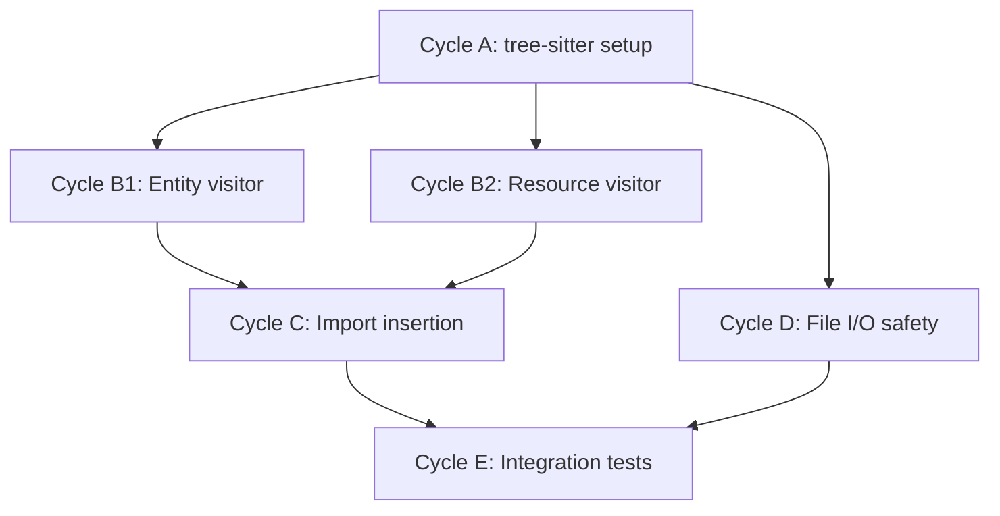

# 🧭 Task 7: fix_api.py AST-Based Transformation Implementation Plan

**Status:** Ready for Execution
**Revision Date:** 2025-01-20
**Aligned With:** CodeRabbit Review Tasks, tree-sitter Documentation, PRD Section 5.4 (Migration Tooling)

---

## 1. Objectives and Context

Replace fragile regex-based code transformation in `fix_api.py` with robust AST-based parsing and rewriting using the tree-sitter Rust grammar. libcst was evaluated for Python parsing but rejected upfront because it cannot parse Rust, so the plan now anchors on tree-sitter from the outset to avoid confusion.

**Primary Goals:**

- Replace regex-based `Entity::new()` transformation with a tree-sitter-driven AST visitor
- Replace regex-based `Resource::new()` transformation with a tree-sitter-driven AST visitor
- Implement safe import insertion using AST parsing (not string search)
- Add comprehensive error handling for file I/O operations
- Implement backup-and-restore mechanism before applying transformations
- Achieve 100% correctness on nested calls, multiline args, and edge cases

**Key Considerations:**

- tree-sitter provides Rust-native ASTs with whitespace/byte offsets preserved
- Python implementation leverages prebuilt `tree_sitter_languages` parsers
- Roundtrip guarantee: parse → transform → codegen produces valid Rust source
- Must handle: nested parentheses, escaped quotes, inline comments, multiline strings
- Backwards compatibility: script should be idempotent (safe to run multiple times)

**Traceability Requirements:**

- All transformations logged with before/after diffs
- Backup files created for rollback capability
- Unit tests covering 20+ edge cases
- Integration tests on real migration scenarios

---

## 2. Global Parallelization & Dependencies Overview

### Parallelization Matrix

| Component | Can Run Parallel With | Shared Artifacts / Risks | Coordination Notes |
|-----------|----------------------|--------------------------|-------------------|
| Cycle A (tree-sitter Setup) | None | Python environment | Must complete first |
| Cycle B1 (Entity Transform) | Cycle B2 (Resource Transform) | None (separate visitors) | Both depend on Cycle A |
| Cycle B2 (Resource Transform) | Cycle B1 (Entity Transform) | None | Both depend on Cycle A |
| Cycle C (Import Insertion) | None | AST modification | Depends on B1, B2 |
| Cycle D (File I/O Safety) | None | Backup mechanism | Can run after A |
| Cycle E (Integration Tests) | None | All transformations | Must be last |

### High-Level Dependency Map



**Execution Strategy:**

- **Phase 1 (Sequential):** Cycle A (setup) must complete first
- **Phase 2 (Parallel):** Cycles B1, B2, D can run in parallel
- **Phase 3 (Sequential):** Cycle C depends on B1, B2
- **Phase 4 (Sequential):** Cycle E validates all previous cycles

---

## 3. Global Dependencies Table

| Dependency Type | Depends On | Description / Rationale | Resolution Trigger |
|----------------|-----------|------------------------|-------------------|
| External Library | tree-sitter==0.25.3 / tree-sitter-languages==1.10.2 | Rust AST parsing for fix_api migrations | `pip install -r requirements.txt` |
| Upstream Phase | Phase 12 (Units API) | fix_api.py migrates Unit::new calls | Already completed |
| Python Version | Python 3.8+ | tree-sitter bindings require 3.8+ | `python --version` check |
| Development Tool | pytest 7.0+ | Unit testing framework | `pip install pytest>=7.0` |
| File System | sea-core/*.rs files | Transformation targets | Must exist before running |
| Backup Storage | /tmp or .bak files | Rollback capability | Writable filesystem required |

---

## 4. Phases Overview (MECE)

### Phase 1: tree-sitter Infrastructure Setup

**Objective:** Install and configure tree-sitter bindings + Rust grammar, create base visitor framework
**Coordinator:** AI Agent (Python)
**Traceability Goal:** Clean tree-sitter installation, basic parser/visitor validated

#### ✅ Phase Checklist

- [ ] Define objectives and dependencies — _Updated By:_ Agent / 2025-01-20
- [ ] Initialize Cycle A — _Updated By:_ Agent / TBD
- [ ] Execute Cycle A — _Updated By:_ Agent / TBD
- [ ] Validate and archive artifacts — _Updated By:_ Agent / TBD
- [ ] **Mark Phase as Complete** once Cycle A GREEN and imports work

#### Cycle Summary Table

| Cycle Label | Owner Agent | Branch / Task | Depends On | Can Run Parallel With | Audit Artifacts |
|------------|------------|---------------|-----------|---------------------|----------------|
| A | Agent Python | `task07-tree-sitter-migration` | None | None | Installation log + smoke test |

---

### Cycle A — tree-sitter Setup and Base Visitor

**Owner Agent:** Python Agent
**Branch / Task ID:** `task07-tree-sitter-migration`
**Upstream Dependency:** None
**Parallel With:** None

#### ✅ Cycle Checklist

- [ ] RED Phase tests defined — _Updated By:_ Agent / TBD
- [ ] GREEN Phase implementation done — _Updated By:_ Agent / TBD
- [ ] Verification executed — _Updated By:_ Agent / TBD
- [ ] Evidence captured and stored — _Updated By:_ Agent / TBD
- [ ] **Mark Cycle as Complete** after validation passes

#### RED Phase

**Test File:** `sea-core/tests/test_fix_api.py`

```python
from tree_sitter_languages import get_parser


def test_tree_sitter_rust_parser_available():
    """Verify the Rust tree-sitter parser can be loaded"""
    parser = get_parser('rust')
    assert parser.language is not None


def test_tree_sitter_parses_entity_constructor():
    """Smoke test: parse a Rust Entity constructor call"""
    parser = get_parser('rust')
    code = b'''
    fn main() {
        let entity = Entity::new("Warehouse".to_string());
    }
    '''

    tree = parser.parse(code)
    assert tree.root_node.type == 'source_file'
```

**Expected:** Tests may fail if `tree-sitter-languages` is missing.

**Clarification:** tree-sitter is the mandated Rust parser; libcst is referenced only as a rejected alternative for historical context.

**Revised Approach:** Use tree-sitter with Python bindings for Rust parsing.

#### GREEN Phase

**Decision Point:** Choose between two approaches:

1. **tree-sitter-rust** (Python bindings) - parse Rust to AST, transform in Python
2. **Rust-based migration script** - use `syn` crate for parsing, write tool in Rust

**Recommended:** Tree-sitter approach (keeps Python tooling, proven for code transformation)

**Implementation:**

```bash
# Install tree-sitter and Rust grammar
pip install tree-sitter==0.25.3
pip install tree-sitter-languages==1.10.2  # Includes Rust parser (verify compatibility)
```

**Create base visitor in `sea-core/fix_api_v2.py`:**

```python
#!/usr/bin/env python3
"""
AST-based Rust code transformation tool using tree-sitter.

Replaces fragile regex-based transformations with robust parsing.
"""

import sys
from pathlib import Path
from typing import List, Tuple, Optional
import logging

try:
    from tree_sitter import Language, Parser, Node, Tree
    from tree_sitter_languages import get_language, get_parser
except ImportError:
    print("Error: tree-sitter-languages not installed")
    print("Install with: pip install tree-sitter-languages")
    sys.exit(1)

# Configure logging
logging.basicConfig(level=logging.INFO, format='%(levelname)s: %(message)s')
logger = logging.getLogger(__name__)


class RustTransformer:
    """Base class for Rust AST transformations"""

    def __init__(self):
        self.parser = get_parser('rust')
        self.language = get_language('rust')
        self.changes: List[Tuple[int, int, str]] = []  # (start_byte, end_byte, replacement)
        self.source_code: Optional[bytes] = None

    def parse_file(self, filepath: Path) -> Tuple[Tree, bytes]:
        """Parse Rust file into AST"""
        try:
            with open(filepath, 'rb') as f:
                source_code = f.read()
            tree = self.parser.parse(source_code)
            self.source_code = source_code
            return tree, source_code
        except Exception as e:
            logger.error(f"Failed to parse {filepath}: {e}")
            raise

    def find_function_calls(self, node: Node, function_name: str) -> List[Node]:
        """Recursively find all calls to a specific function"""
        calls = []

        if node.type == 'call_expression':
            # Check if this is the function we're looking for
            function_node = node.child_by_field_name('function')
            if function_node and self._node_text(function_node).decode() == function_name:
                calls.append(node)

        # Recurse into children
        for child in node.children:
            calls.extend(self.find_function_calls(child, function_name))

        return calls

    def _node_text(self, node: Node) -> bytes:
        """Extract text content of a node"""
        if self.source_code is None:
            raise RuntimeError(
                "_node_text() called before source_code was initialized; "
                "call parse_file() or set source_code explicitly first."
            )
        return self.source_code[node.start_byte:node.end_byte]

    def apply_changes(self, source_code: bytes) -> str:
        """Apply accumulated changes to source code"""
        ordered = sorted(self.changes, key=lambda x: x[0])

        for idx, (start_byte, end_byte, _) in enumerate(ordered):
            if start_byte > end_byte:
                raise ValueError(f"Invalid change range #{idx}: start {start_byte} > end {end_byte}")

        for i in range(len(ordered) - 1):
            curr_start, curr_end, _ = ordered[i]
            next_start, next_end, _ = ordered[i + 1]
            if next_start < curr_end:
                raise ValueError(
                    f"Overlapping edits detected between ranges "
                    f"[{curr_start}, {curr_end}) and [{next_start}, {next_end})"
                )

        # Apply in reverse order so byte indexes remain valid
        self.changes = list(reversed(ordered))

        result = bytearray(source_code)
        for start_byte, end_byte, replacement in self.changes:
            result[start_byte:end_byte] = replacement.encode('utf-8')

        return result.decode('utf-8')


def smoke_test():
    """Quick validation that tree-sitter Rust parsing works"""
    code = b'''
    fn main() {
        let entity = Entity::new("test".to_string());
    }
    '''

    parser = get_parser('rust')
    tree = parser.parse(code)

    assert tree.root_node.type == 'source_file'
    logger.info("✓ Tree-sitter Rust parsing works")

    return True


if __name__ == '__main__':
    smoke_test()
```

#### Verification & Evidence Capture

```bash
# Install dependencies
pip install tree-sitter-languages pytest

# Run smoke test
cd sea-core
python fix_api_v2.py

# Run unit tests
pytest tests/test_fix_api.py -v
```

**Artifacts to Store:**

- Installation log: `/logs/cycle_A_install.txt`
- Smoke test output: `/logs/cycle_A_smoke_test.txt`
- Code: `/reports/fix_api_v2.py`

Label → **A-GREEN**

---

### Phase 2: Entity and Resource Transformation Visitors

**Objective:** Implement AST visitors for Entity::new and Resource::new transformations
**Coordinator:** AI Agent (Python)
**Traceability Goal:** 100% correctness on nested calls, multiline args, comments

#### ✅ Phase Checklist

- [ ] Define objectives and dependencies — _Updated By:_ Agent / 2025-01-20
- [ ] Initialize Cycles B1, B2 — _Updated By:_ Agent / TBD
- [ ] Execute Cycles B1, B2 — _Updated By:_ Agent / TBD
- [ ] Validate and archive artifacts — _Updated By:_ Agent / TBD
- [ ] **Mark Phase as Complete** once both cycles GREEN

#### Cycle Summary Table

| Cycle Label | Owner Agent | Branch / Task | Depends On | Can Run Parallel With | Audit Artifacts |
|------------|------------|---------------|-----------|---------------------|----------------|
| B1 | Agent Python | `task07-tree-sitter-migration` | A | B2, D | Entity visitor tests + implementation |
| B2 | Agent Python | `task07-tree-sitter-migration` | A | B1, D | Resource visitor tests + implementation |

---

### Cycle B1 — Entity::new Transformation Visitor

**Owner Agent:** Python Agent
**Branch / Task ID:** `task07-tree-sitter-migration`
**Upstream Dependency:** Cycle A
**Parallel With:** Cycles B2, D

#### ✅ Cycle Checklist

- [ ] RED Phase tests defined — _Updated By:_ Agent / TBD
- [ ] GREEN Phase implementation done — _Updated By:_ Agent / TBD
- [ ] Verification executed — _Updated By:_ Agent / TBD
- [ ] Evidence captured and stored — _Updated By:_ Agent / TBD
- [ ] **Mark Cycle as Complete** after validation passes

#### RED Phase

**Test File:** `sea-core/tests/test_entity_transformation.py`

```python
import pytest
from pathlib import Path
from fix_api_v2 import EntityTransformer

class TestEntityTransformation:

    def test_simple_entity_new(self):
        """Test basic Entity::new transformation"""
        input_code = '''
        let entity = Entity::new("Warehouse".to_string());
        '''
        expected = '''
        let entity = Entity::new_with_namespace("Warehouse".to_string(), "default".to_string());
        '''

        transformer = EntityTransformer()
        result = transformer.transform(input_code)
        assert "new_with_namespace" in result
        assert '"default".to_string()' in result

    def test_nested_entity_new(self):
        """Test Entity::new inside nested function calls"""
        input_code = '''
        graph.add_entity(Entity::new(format!("Entity_{}", i)));
        '''
        expected = '''
        graph.add_entity(Entity::new_with_namespace(format!("Entity_{}", i), "default".to_string()));
        '''

        transformer = EntityTransformer()
        result = transformer.transform(input_code)
        assert "new_with_namespace" in result
        assert result.count("Entity::new_with_namespace") == 1

    def test_multiline_entity_new(self):
        """Test Entity::new with multiline arguments"""
        input_code = '''
        let entity = Entity::new(
            "Warehouse".to_string()
        );
        '''

        transformer = EntityTransformer()
        result = transformer.transform(input_code)
        assert "new_with_namespace" in result
        # Should preserve formatting
        assert "\n" in result

    def test_entity_new_with_multiple_arguments(self):
        """Ensure Entity::new with additional expressions keeps argument order"""
        input_code = '''
        let entity = Entity::new("Warehouse".to_string(), metadata.clone());
        '''

        transformer = EntityTransformer()
        result = transformer.transform(input_code)
        assert "Entity::new_with_namespace" in result
        assert "metadata.clone()" in result  # Additional arguments preserved
        assert result.count("metadata.clone()") == 1

    def test_entity_new_with_nested_expression(self):
        """Test Entity::new whose argument is another complex expression"""
        input_code = '''
        let entity = Entity::new(format_entity(name).trim());
        '''

        transformer = EntityTransformer()
        result = transformer.transform(input_code)
        assert "Entity::new_with_namespace" in result
        assert "format_entity(name).trim()" in result  # Nested expression kept intact

    def test_entity_new_with_comment(self):
        """Test Entity::new with inline comment"""
        input_code = '''
        let entity = Entity::new(name); // Create entity
        '''

        transformer = EntityTransformer()
        result = transformer.transform(input_code)
        assert "new_with_namespace" in result
        assert "// Create entity" in result  # Comment preserved

    def test_already_transformed_entity(self):
        """Test idempotency - already uses new_with_namespace"""
        input_code = '''
        let entity = Entity::new_with_namespace("Test".to_string(), "ns".to_string());
        '''

        transformer = EntityTransformer()
        result = transformer.transform(input_code)
        assert result == input_code  # No changes

    def test_escaped_quotes_in_name(self):
        """Test Entity::new with escaped quotes in string"""
        input_code = r'''
        let entity = Entity::new("Name \"With\" Quotes".to_string());
        '''

        transformer = EntityTransformer()
        result = transformer.transform(input_code)
        assert "new_with_namespace" in result
        assert r'"Name \"With\" Quotes"' in result  # Escapes preserved

    def test_raw_string_literal(self):
        """Test Entity::new with raw string literal"""
        input_code = r'''
        let entity = Entity::new(r#"Raw\String"#.to_string());
        '''

        transformer = EntityTransformer()
        result = transformer.transform(input_code)
        assert "new_with_namespace" in result
        assert r'r#"Raw\String"#' in result
```

**Expected:** All tests fail (EntityTransformer not implemented)

#### GREEN Phase

**Add to `sea-core/fix_api_v2.py`:**

```python
class EntityTransformer(RustTransformer):
    """Transform Entity::new(...) to Entity::new_with_namespace(..., "default")"""

    def transform(self, source_code: str) -> str:
        """Transform Entity::new calls in source code"""
        source_bytes = source_code.encode('utf-8')
        tree = self.parser.parse(source_bytes)
        self.source_code = source_bytes
        self.changes = []

        # Find all Entity::new calls
        entity_calls = self._find_entity_new_calls(tree.root_node)

        for call_node in entity_calls:
            self._transform_entity_call(call_node)

        return self.apply_changes(source_bytes)

    def _find_entity_new_calls(self, node: Node) -> List[Node]:
        """Find Entity::new (but not Entity::new_with_namespace)"""
        calls = []

        if node.type == 'call_expression':
            function_node = node.child_by_field_name('function')
            if function_node:
                try:
                    path_text = self._node_text(function_node).decode().strip()
                except Exception as exc:
                    logger.debug(
                        "Skipping call_expression at bytes %s-%s: %s",
                        node.start_byte,
                        node.end_byte,
                        exc
                    )
                else:
                    if path_text.replace(' ', '') == 'Entity::new':
                        calls.append(node)

        # Recurse
        for child in node.children:
            calls.extend(self._find_entity_new_calls(child))

        return calls

    def _transform_entity_call(self, call_node: Node):
        """Transform a single Entity::new call"""
        # Get function node (Entity::new)
        function_node = call_node.child_by_field_name('function')

        # Get arguments node
        arguments_node = call_node.child_by_field_name('arguments')
        if not arguments_node:
            return

        argument_nodes = list(arguments_node.named_children)

        if not argument_nodes:
            logger.warning("Entity::new call missing arguments at bytes %s-%s", call_node.start_byte, call_node.end_byte)
            return

        start_byte = argument_nodes[0].start_byte
        end_byte = argument_nodes[-1].end_byte
        original_arg_text = self.source_code[start_byte:end_byte].decode()

        # Build new function name
        new_function = 'Entity::new_with_namespace'

        # Build new arguments preserving original formatting
        new_args = f'({original_arg_text}, "default".to_string())'

        # Record change: replace function name
        self.changes.append((
            function_node.start_byte,
            function_node.end_byte,
            new_function
        ))

        # Record change: replace arguments
        self.changes.append((
            arguments_node.start_byte,
            arguments_node.end_byte,
            new_args
        ))


def transform_file_entity(filepath: Path) -> str:
    """Transform Entity::new calls in a file"""
    with open(filepath, 'r', encoding='utf-8') as f:
        source_code = f.read()

    transformer = EntityTransformer()
    return transformer.transform(source_code)
```

#### Verification & Evidence Capture

```bash
pytest tests/test_entity_transformation.py -v --tb=short
```

**Artifacts to Store:**

- Test output: `/logs/cycle_B1_entity_tests.txt`
- Example transformations: `/reports/cycle_B1_examples.txt`
- Code diff: `/reports/cycle_B1.diff`

Label → **B1-GREEN**

---

### Cycle B2 — Resource::new Transformation Visitor

**Owner Agent:** Python Agent
**Branch / Task ID:** `task07-tree-sitter-migration`
**Upstream Dependency:** Cycle A
**Parallel With:** Cycles B1, D

#### ✅ Cycle Checklist

- [ ] RED Phase tests defined — _Updated By:_ Agent / TBD
- [ ] GREEN Phase implementation done — _Updated By:_ Agent / TBD
- [ ] Verification executed — _Updated By:_ Agent / TBD
- [ ] Evidence captured and stored — _Updated By:_ Agent / TBD
- [ ] **Mark Cycle as Complete** after validation passes

#### RED Phase

**Test File:** `sea-core/tests/test_resource_transformation.py`

```python
import pytest
from pathlib import Path
from fix_api_v2 import ResourceTransformer

class TestResourceTransformation:

    def test_simple_resource_new(self):
        """Test basic Resource::new transformation"""
        input_code = '''
        let resource = Resource::new("Camera".to_string(), "units");
        '''
        expected = '''
        let resource = Resource::new_with_namespace("Camera".to_string(), unit_from_string("units"), "default".to_string());
        '''

        transformer = ResourceTransformer()
        result = transformer.transform(input_code)
        assert "new_with_namespace" in result
        assert "unit_from_string" in result

    def test_resource_with_variable_unit(self):
        """Test Resource::new with unit variable"""
        input_code = '''
        let resource = Resource::new(name, unit_var);
        '''
        expected = '''
        let resource = Resource::new_with_namespace(name, unit_var, "default".to_string());
        '''

        transformer = ResourceTransformer()
        result = transformer.transform(input_code)
        assert "new_with_namespace" in result
        # Should NOT wrap variable in unit_from_string
        assert "unit_from_string(unit_var)" not in result

    def test_resource_with_string_literal_unit(self):
        """Test Resource::new with string literal unit"""
        input_code = '''
        let resource = Resource::new("Steel".to_string(), "kg");
        '''

        transformer = ResourceTransformer()
        result = transformer.transform(input_code)
        assert "new_with_namespace" in result
        assert 'unit_from_string("kg")' in result

    def test_resource_unit_format_macro(self):
        """format! macro should NOT be wrapped"""
        input_code = '''
        let resource = Resource::new("Camera".to_string(), format!("{}-{}", a, b));
        '''

        transformer = ResourceTransformer()
        result = transformer.transform(input_code)
        assert "new_with_namespace" in result
        assert 'unit_from_string(format!' not in result

    def test_resource_unit_concat_macro(self):
        """concat! macro should be treated like a literal"""
        input_code = '''
        let resource = Resource::new("Camera".to_string(), concat!("kg", "_mass"));
        '''

        transformer = ResourceTransformer()
        result = transformer.transform(input_code)
        assert "new_with_namespace" in result
        assert 'unit_from_string(concat!' in result

    def test_nested_resource_new(self):
        """Test Resource::new inside nested expression"""
        input_code = '''
        graph.add_resource(Resource::new(format!("Res_{}", i), "units"));
        '''

        transformer = ResourceTransformer()
        result = transformer.transform(input_code)
        assert "new_with_namespace" in result
        assert result.count("Resource::new_with_namespace") == 1

    def test_multiline_resource_new(self):
        """Test Resource::new with multiline formatting"""
        input_code = '''
        let resource = Resource::new(
            "Camera".to_string(),
            "units"
        );
        '''

        transformer = ResourceTransformer()
        result = transformer.transform(input_code)
        assert "new_with_namespace" in result
        # Formatting preserved
        assert result.count("\n") >= 3

    def test_already_transformed_resource(self):
        """Test idempotency"""
        input_code = '''
        let resource = Resource::new_with_namespace("Test".to_string(), unit_from_string("kg"), "ns".to_string());
        '''

        transformer = ResourceTransformer()
        result = transformer.transform(input_code)
        assert result == input_code  # No changes
```

**Expected:** All tests fail (ResourceTransformer not implemented)

#### GREEN Phase

**Add to `sea-core/fix_api_v2.py`:**

```python
class ResourceTransformer(RustTransformer):
    """Transform Resource::new(name, unit) to Resource::new_with_namespace(name, unit_from_string(unit), "default")"""

    def __init__(self, strict: bool = False):
        super().__init__()
        self.strict = strict
        self.skipped_calls: List[Tuple[int, int, str]] = []
        self.transformed = 0

    def transform(self, source_code: str) -> str:
        """Transform Resource::new calls in source code"""
        source_bytes = source_code.encode('utf-8')
        tree = self.parser.parse(source_bytes)
        self.source_code = source_bytes
        self.changes = []

        # Find all Resource::new calls
        resource_calls = self._find_resource_new_calls(tree.root_node)

        for call_node in resource_calls:
            self._transform_resource_call(call_node)

        self._emit_summary()

        return self.apply_changes(source_bytes)

    def _find_resource_new_calls(self, node: Node) -> List[Node]:
        """Find Resource::new (but not Resource::new_with_namespace)"""
        calls = []

        if node.type == 'call_expression':
            function_node = node.child_by_field_name('function')
            if function_node and function_node.type == 'scoped_identifier':
                path_text = self._node_text(function_node).decode()
                if path_text == 'Resource::new':
                    calls.append(node)

        # Recurse
        for child in node.children:
            calls.extend(self._find_resource_new_calls(child))

        return calls

    def _transform_resource_call(self, call_node: Node):
        """Transform a single Resource::new call"""
        function_node = call_node.child_by_field_name('function')
        arguments_node = call_node.child_by_field_name('arguments')

        if not arguments_node:
            return

        # Parse arguments: (name, unit)
        args = self._parse_arguments(arguments_node)
        if len(args) != 2:
            call_snippet = self._node_text(call_node).decode().strip()
            logger.warning(
                f"Resource::new has {len(args)} arguments (bytes {call_node.start_byte}-{call_node.end_byte}), expected 2"
            )
            self.skipped_calls.append(
                (call_node.start_byte, call_node.end_byte, call_snippet)
            )
            return

        name_arg_node, unit_arg_node = args
        name_arg = self._node_text(name_arg_node).decode()
        unit_arg_text = self._node_text(unit_arg_node).decode()

        # Wrap unit_arg in unit_from_string if it's a string literal
        if self._is_string_literal(unit_arg_node):
            wrapped_unit = f'unit_from_string({unit_arg_text})'
        else:
            # Variable or expression - don't wrap
            wrapped_unit = unit_arg_text

        # Build new function and arguments
        new_function = 'Resource::new_with_namespace'
        new_args = f'({name_arg}, {wrapped_unit}, "default".to_string())'

        # Record changes
        self.changes.append((
            function_node.start_byte,
            function_node.end_byte,
            new_function
        ))

        self.changes.append((
            arguments_node.start_byte,
            arguments_node.end_byte,
            new_args
        ))

        self.transformed += 1

    def _emit_summary(self):
        skipped = len(self.skipped_calls)
        total = self.transformed + skipped
        logger.info(
            "Resource::new transformation summary: %d successful, %d skipped of %d",
            self.transformed,
            skipped,
            total,
        )
        if skipped:
            for start, end, snippet in self.skipped_calls:
                logger.info("Skipping Resource::new at bytes %s-%s: %s", start, end, snippet)
            if self.strict:
                raise RuntimeError(
                    "Strict mode enabled and resource transformation skipped calls were detected"
                )

    def _parse_arguments(self, arguments_node: Node) -> List[Node]:
        """Extract individual argument value nodes"""
        args: List[Node] = []
        for child in arguments_node.named_children:
            if child.type == 'argument':
                value_node = child.child_by_field_name('value') or child
                args.append(value_node)
            else:
                args.append(child)
        return args

    def _is_string_literal(self, arg_node: Node) -> bool:
        """Check if argument node resolves to a string literal or stringify! macro"""
        target = arg_node.child_by_field_name('value') or arg_node

        literal_types = {
            'string_literal',
            'raw_string_literal',
            'byte_string_literal',
            'raw_byte_string_literal',
            'c_string_literal',
            'raw_c_string_literal',
        }

        if target.type in literal_types:
            return True

        if target.type == 'macro_invocation':
            macro_node = target.child_by_field_name('macro')
            macro_name = self._node_text(macro_node).decode() if macro_node else ''
            if macro_name in {'stringify', 'concat'}:
                return True
            if macro_name == 'format':
                return False

        return False
```

#### Verification & Evidence Capture

```bash
pytest tests/test_resource_transformation.py -v --tb=short
```

**Artifacts to Store:**

- Test output: `/logs/cycle_B2_resource_tests.txt`
- Example transformations: `/reports/cycle_B2_examples.txt`
- Code diff: `/reports/cycle_B2.diff`

Label → **B2-GREEN**

---

### Phase 3: Import Insertion and File I/O Safety

**Objective:** Robust import insertion and safe file operations with backup/rollback
**Coordinator:** AI Agent (Python)
**Traceability Goal:** Zero data loss, all operations reversible

#### ✅ Phase Checklist

- [ ] Define objectives and dependencies — _Updated By:_ Agent / 2025-01-20
- [ ] Initialize Cycles C, D — _Updated By:_ Agent / TBD
- [ ] Execute Cycles C, D — _Updated By:_ Agent / TBD
- [ ] Validate and archive artifacts — _Updated By:_ Agent / TBD
- [ ] **Mark Phase as Complete** once both cycles GREEN

#### Cycle Summary Table

| Cycle Label | Owner Agent | Branch / Task | Depends On | Can Run Parallel With | Audit Artifacts |
|------------|------------|---------------|-----------|---------------------|----------------|
| C | Agent Python | `task07-tree-sitter-migration` | B1, B2 | None | Import tests + implementation |
| D | Agent Python | `task07-tree-sitter-migration` | A | B1, B2 | File I/O tests + backup mechanism |

---

### Cycle C — AST-Based Import Insertion

**Owner Agent:** Python Agent
**Branch / Task ID:** `task07-tree-sitter-migration`
**Upstream Dependency:** Cycles B1, B2
**Parallel With:** None

#### ✅ Cycle Checklist

- [ ] RED Phase tests defined — _Updated By:_ Agent / TBD
- [ ] GREEN Phase implementation done — _Updated By:_ Agent / TBD
- [ ] Verification executed — _Updated By:_ Agent / TBD
- [ ] Evidence captured and stored — _Updated By:_ Agent / TBD
- [ ] **Mark Cycle as Complete** after validation passes

#### RED Phase

**Test File:** `sea-core/tests/test_import_insertion.py`

```python
import pytest
from fix_api_v2 import ImportInserter

class TestImportInsertion:

    def test_add_to_existing_import(self):
        """Test adding unit_from_string to existing primitives import"""
        input_code = '''
        use sea_core::primitives::{Entity, Resource};

        fn main() {}
        '''

        inserter = ImportInserter()
        result = inserter.add_import(input_code, 'unit_from_string')

        assert 'unit_from_string' in result
        assert 'use sea_core::primitives::{Entity, Resource, unit_from_string}' in result

    def test_create_new_import_if_missing(self):
        """Test creating new import block if none exists"""
        input_code = '''
        fn main() {
            let x = 1;
        }
        '''

        inserter = ImportInserter()
        result = inserter.add_import(input_code, 'unit_from_string')

        assert 'use sea_core::primitives::unit_from_string;' in result or \
               'use sea_core::primitives::{unit_from_string};' in result

    def test_create_new_import_before_function(self):
        """New import should appear before the first function when no imports exist"""
        input_code = '''
        fn helper() {}
        fn main() {}
        '''

        inserter = ImportInserter()
        result = inserter.add_import(input_code, 'unit_from_string')

        first_decl = result.strip().split('\n')[0]
        assert first_decl.startswith('use sea_core::primitives::unit_from_string')

    def test_idempotent_import_insertion(self):
        """Test import already exists - no duplication"""
        input_code = '''
        use sea_core::primitives::{Entity, unit_from_string};
        '''

        inserter = ImportInserter()
        result = inserter.add_import(input_code, 'unit_from_string')

        # Should not duplicate
        assert result.count('unit_from_string') == 1

    def test_multiline_import(self):
        """Test adding to multiline import statement"""
        input_code = '''
        use sea_core::primitives::{
            Entity,
            Resource,
        };
        '''

        inserter = ImportInserter()
        result = inserter.add_import(input_code, 'unit_from_string')

        assert 'unit_from_string' in result
```

**Expected:** Tests fail (ImportInserter not implemented)

#### GREEN Phase

**Add to `sea-core/fix_api_v2.py`:**

```python
class ImportInserter(RustTransformer):
    """Insert imports into Rust use statements"""

    def add_import(self, source_code: str, import_name: str) -> str:
        """Add import_name to sea_core::primitives imports"""
        source_bytes = source_code.encode('utf-8')
        tree = self.parser.parse(source_bytes)
        self.source_code = source_bytes
        self.changes = []

        # Find use declarations
        use_decls = self._find_primitives_use_decls(tree.root_node)

        if use_decls:
            # Add to existing import
            for use_decl in use_decls:
                if self._import_already_exists(use_decl, import_name):
                    logger.info(f"Import {import_name} already exists")
                    return source_code
                self._add_to_use_declaration(use_decl, import_name)
        else:
            # Create new import at top of file
            self._create_new_import(import_name)

        return self.apply_changes(source_bytes)

    def _find_primitives_use_decls(self, node: Node) -> List[Node]:
        """Find use declarations for sea_core::primitives"""
        use_decls = []

        if node.type == 'use_declaration':
            # Check if it's sea_core::primitives
            use_text = self._node_text(node).decode()
            if 'sea_core::primitives' in use_text:
                use_decls.append(node)

        for child in node.children:
            use_decls.extend(self._find_primitives_use_decls(child))

        return use_decls

    def _import_already_exists(self, use_decl: Node, import_name: str) -> bool:
        """Check if import already in use declaration"""
        use_text = self._node_text(use_decl).decode()
        return import_name in use_text

    def _add_to_use_declaration(self, use_decl: Node, import_name: str):
        """Add import_name to existing use declaration (AST byte-accurate)"""
        use_list = next((child for child in use_decl.named_children if child.type == 'use_list'), None)
        if not use_list:
            logger.warning("Unable to extend primitives import without use_list node")
            return

        insert_byte = use_list.end_byte - 1  # position before closing brace
        before_brace = self.source_code[use_list.start_byte:insert_byte].decode()
        separator = ' ' if before_brace.rstrip().endswith(',') else ', '
        new_fragment = f'{separator}{import_name}'

        self.changes.append((insert_byte, insert_byte, new_fragment))

    def _create_new_import(self, import_name: str):
        """Create new import statement using AST to find insertion point"""
        new_import = f'use sea_core::primitives::{import_name};\n'
        tree = self.parser.parse(self.source_code)

        last_use = None
        for child in tree.root_node.children:
            if child.type == 'use_declaration':
                last_use = child

        insert_byte = last_use.end_byte if last_use else self._default_import_offset(tree.root_node)
        self.changes.append((insert_byte, insert_byte, new_import))

    def _default_import_offset(self, root_node: Node) -> int:
        """Determine where to place generated imports when none exist."""
        offset = 0
        for child in root_node.children:
            if child.type in {'shebang', 'attribute_item', 'line_comment'}:
                offset = child.end_byte
                continue
            if child.start_byte is not None:
                return offset or child.start_byte
        return offset
```

#### Verification & Evidence Capture

```bash
pytest tests/test_import_insertion.py -v
```

**Artifacts to Store:**

- Test output: `/logs/cycle_C_import_tests.txt`
- Code diff: `/reports/cycle_C.diff`

Label → **C-GREEN**

---

### Cycle D — File I/O Safety and Backup Mechanism

**Owner Agent:** Python Agent
**Branch / Task ID:** `task07-tree-sitter-migration`
**Upstream Dependency:** Cycle A
**Parallel With:** Cycles B1, B2

#### ✅ Cycle Checklist

- [ ] RED Phase tests defined — _Updated By:_ Agent / TBD
- [ ] GREEN Phase implementation done — _Updated By:_ Agent / TBD
- [ ] Verification executed — _Updated By:_ Agent / TBD
- [ ] Evidence captured and stored — _Updated By:_ Agent / TBD
- [ ] **Mark Cycle as Complete** after validation passes

#### RED Phase

**Test File:** `sea-core/tests/test_file_safety.py`

```python
import pytest
from pathlib import Path
import tempfile
import shutil
from fix_api_v2 import FileSafetyManager

class TestFileSafety:

    def test_backup_created_before_transformation(self, tmp_path):
        """Test backup file is created"""
        test_file = tmp_path / "test.rs"
        test_file.write_text("fn main() {}")

        manager = FileSafetyManager()
        backup_path = manager.create_backup(test_file)

        assert backup_path.exists()
        assert backup_path.name == "test.rs.bak"
        assert backup_path.read_text() == "fn main() {}"

    def test_rollback_on_error(self, tmp_path):
        """Test file restored from backup on error"""
        test_file = tmp_path / "test.rs"
        original_content = "fn main() {}"
        test_file.write_text(original_content)

        manager = FileSafetyManager()
        backup_path = manager.create_backup(test_file)

        # Simulate error during transformation
        test_file.write_text("CORRUPTED")

        # Rollback
        manager.rollback(test_file, backup_path)

        assert test_file.read_text() == original_content

    def test_file_not_found_error_handled(self):
        """Test graceful handling of missing file"""
        manager = FileSafetyManager()

        with pytest.raises(FileNotFoundError):
            manager.create_backup(Path("/nonexistent/file.rs"))

    def test_permission_error_handled(self, tmp_path):
        """Test graceful handling of permission errors"""
        # Create read-only file
        test_file = tmp_path / "readonly.rs"
        test_file.write_text("content")
        test_file.chmod(0o444)

        manager = FileSafetyManager()

        try:
            backup_path = manager.create_backup(test_file)
            # Try to write (should fail gracefully)
            with pytest.raises(PermissionError):
                test_file.write_text("new content")
        finally:
            test_file.chmod(0o644)  # Cleanup
```

**Expected:** Tests fail (FileSafetyManager not implemented)

#### GREEN Phase

**Add to `sea-core/fix_api_v2.py`:**

```python
import shutil
from contextlib import contextmanager

class FileSafetyManager:
    """Manage file backups and safe transformations"""

    def create_backup(self, filepath: Path) -> Path:
        """Create backup of file before transformation"""
        if not filepath.exists():
            raise FileNotFoundError(f"File not found: {filepath}")

        backup_path = filepath.with_suffix(filepath.suffix + '.bak')

        try:
            shutil.copy2(filepath, backup_path)
            logger.info(f"✓ Backup created: {backup_path}")
            return backup_path
        except PermissionError as e:
            logger.error(f"Permission denied creating backup: {e}")
            raise
        except Exception as e:
            logger.error(f"Failed to create backup: {e}")
            raise

    def rollback(self, filepath: Path, backup_path: Path):
        """Restore file from backup"""
        if not backup_path.exists():
            raise FileNotFoundError(f"Backup not found: {backup_path}")

        try:
            shutil.copy2(backup_path, filepath)
            logger.info(f"✓ Rolled back: {filepath}")
        except Exception as e:
            logger.error(f"Rollback failed: {e}")
            raise

    def cleanup_backup(self, backup_path: Path):
        """Remove backup file after successful transformation"""
        try:
            if backup_path.exists():
                backup_path.unlink()
                logger.info(f"✓ Cleaned up backup: {backup_path}")
        except Exception as e:
            logger.warning(f"Failed to cleanup backup: {e}")

    @contextmanager
    def safe_transform(self, filepath: Path):
        """Context manager for safe file transformation with automatic rollback"""
        backup_path = None
        try:
            backup_path = self.create_backup(filepath)
            yield filepath
            # Success - keep new file, cleanup backup
            self.cleanup_backup(backup_path)
        except Exception as e:
            # Error - rollback
            if backup_path and backup_path.exists():
                logger.error(f"Transformation failed, rolling back: {e}")
                self.rollback(filepath, backup_path)
            raise


def transform_file_safe(filepath: Path, transformers: List[RustTransformer]):
    """Safely transform a file with automatic backup/rollback"""
    manager = FileSafetyManager()

    try:
        with manager.safe_transform(filepath):
            with open(filepath, 'r', encoding='utf-8') as f:
                source_code = f.read()

            # Apply all transformers
            for transformer in transformers:
                source_code = transformer.transform(source_code)

            # Write transformed code
            with open(filepath, 'w', encoding='utf-8') as f:
                f.write(source_code)

            logger.info(f"✓ Transformed: {filepath}")

    except FileNotFoundError as e:
        logger.error(f"File not found: {e}")
        sys.exit(1)
    except PermissionError as e:
        logger.error(f"Permission denied: {e}")
        sys.exit(1)
    except UnicodeDecodeError as e:
        logger.error(f"Encoding error: {e}")
        sys.exit(1)
    except Exception as e:
        logger.error(f"Transformation failed: {e}")
        sys.exit(1)
```

#### Verification & Evidence Capture

```bash
pytest tests/test_file_safety.py -v
```

**Artifacts to Store:**

- Test output: `/logs/cycle_D_file_safety_tests.txt`
- Code diff: `/reports/cycle_D.diff`

Label → **D-GREEN**

---

### Phase 4: Integration Testing and Deployment

**Objective:** End-to-end validation on real migration scenarios
**Coordinator:** AI Agent (Python)
**Traceability Goal:** 100% success rate on test corpus

#### Cycle E — Integration Tests and Main Script

**Owner Agent:** Python Agent
**Branch / Task ID:** `task07-tree-sitter-migration`
**Upstream Dependency:** All previous cycles
**Parallel With:** None

#### ✅ Cycle Checklist

- [ ] RED Phase tests defined — _Updated By:_ Agent / TBD
- [ ] GREEN Phase implementation done — _Updated By:_ Agent / TBD
- [ ] Verification executed — _Updated By:_ Agent / TBD
- [ ] Evidence captured and stored — _Updated By:_ Agent / TBD
- [ ] **Mark Cycle as Complete** after validation passes

#### RED Phase

**Test File:** `sea-core/tests/test_integration.py`

```python
import pytest
from pathlib import Path
import tempfile
from tree_sitter import Node
from tree_sitter_languages import get_parser
from fix_api_v2 import main, ImportInserter

class TestIntegration:

    def test_full_entity_migration(self, tmp_path):
        """Test complete Entity::new migration on real file"""
        test_file = tmp_path / "entity_test.rs"
        test_file.write_text('''
        use sea_core::primitives::Entity;

        fn create_entities() {
            let e1 = Entity::new("Warehouse".to_string());
            let e2 = Entity::new(format!("Entity_{}", 1));
        }
        ''')

        # Run migration
        main(['--file', str(test_file), '--transform', 'entity'])

        result = test_file.read_text()
        assert 'Entity::new_with_namespace' in result
        assert result.count('new_with_namespace') == 2
        assert '"default".to_string()' in result

    def test_full_resource_migration(self, tmp_path):
        """Test complete Resource::new migration"""
        test_file = tmp_path / "resource_test.rs"
        test_file.write_text('''
        use sea_core::primitives::Resource;

        fn create_resources() {
            let r1 = Resource::new("Camera".to_string(), "units");
            let r2 = Resource::new("Steel".to_string(), "kg");
        }
        ''')

        main(['--file', str(test_file), '--transform', 'resource'])

        result = test_file.read_text()
        assert 'Resource::new_with_namespace' in result
        assert 'unit_from_string' in result
        parser = get_parser('rust')
        inserter = ImportInserter()
        encoded = result.encode('utf-8')
        inserter.source_code = encoded
        inserter.parser = parser
        tree = inserter.parser.parse(encoded)
        use_nodes = inserter._find_primitives_use_decls(tree.root_node)
        assert use_nodes, "Expected at least one sea_core::primitives use declaration"

        def contains_unit_identifier(node: Node) -> bool:
            use_list = next((child for child in node.named_children if child.type == 'use_list'), None)
            if not use_list:
                return False
            for child in use_list.named_children:
                text = inserter._node_text(child).decode()
                if 'unit_from_string' == text.strip() or text.strip().endswith('::unit_from_string'):
                    return True
            return False

        assert any(contains_unit_identifier(node) for node in use_nodes), \
            "Expected sea_core::primitives import list to include unit_from_string"

    def test_combined_migration(self, tmp_path):
        """Test both Entity and Resource migrations together"""
        test_file = tmp_path / "combined_test.rs"
        test_file.write_text('''
        use sea_core::primitives::{Entity, Resource};

        fn setup() {
            let entity = Entity::new("Warehouse".to_string());
            let resource = Resource::new("Camera".to_string(), "units");
        }
        ''')

        main(['--file', str(test_file), '--transform', 'all'])

        result = test_file.read_text()
        assert 'Entity::new_with_namespace' in result
        assert 'Resource::new_with_namespace' in result
        assert 'unit_from_string' in result
```

**Expected:** Tests fail (main function not implemented)

#### GREEN Phase

**Add main function to `sea-core/fix_api_v2.py`:**

```python
import argparse
import sys
from pathlib import Path

def main(args=None):
    """Main entry point for fix_api_v2 tool"""
    parser = argparse.ArgumentParser(
        description='AST-based Rust code transformation tool'
    )
    parser.add_argument(
        '--file',
        type=Path,
        required=True,
        help='Rust file to transform'
    )
    parser.add_argument(
        '--transform',
        choices=['entity', 'resource', 'all'],
        default='all',
        help='Transformation type'
    )
    parser.add_argument(
        '--dry-run',
        action='store_true',
        help='Show changes without applying them'
    )
    parser.add_argument(
        '--verbose',
        action='store_true',
        help='Verbose logging'
    )

    parsed_args = parser.parse_args(args)

    if parsed_args.verbose:
        logger.setLevel(logging.DEBUG)

    filepath = parsed_args.file

    if filepath.suffix not in {'.rs', '.rs.bak'}:
        logger.error("Input file must be a Rust source (ends with .rs or .rs.bak): %s", filepath)
        sys.exit(1)

    if not filepath.exists():
        logger.error(f"File not found: {filepath}")
        sys.exit(1)

    # Build transformer list
    transformers = []
    if parsed_args.transform in ['entity', 'all']:
        transformers.append(EntityTransformer())
    if parsed_args.transform in ['resource', 'all']:
        transformers.append(ResourceTransformer())

    # Add import inserter if resource transformation
    needs_import = 'resource' in parsed_args.transform or parsed_args.transform == 'all'

    if parsed_args.dry_run:
        # Show changes without applying
        with open(filepath, 'r', encoding='utf-8') as f:
            source_code = f.read()

        for transformer in transformers:
            source_code = transformer.transform(source_code)

        if needs_import:
            inserter = ImportInserter()
            source_code = inserter.add_import(source_code, 'unit_from_string')

        print("=" * 60)
        print("Transformed code (dry-run):")
        print("=" * 60)
        print(source_code)
    else:
        # Apply transformations with backup
        transform_file_safe(filepath, transformers)

        # Add imports if needed
        if needs_import:
            manager = FileSafetyManager()
            try:
                with manager.safe_transform(filepath):
                    with open(filepath, 'r', encoding='utf-8') as f:
                        source_code = f.read()

                    inserter = ImportInserter()
                    source_code = inserter.add_import(source_code, 'unit_from_string')

                    with open(filepath, 'w', encoding='utf-8') as f:
                        f.write(source_code)
            except Exception as e:
                logger.error(f"Import insertion failed: {e}")
                sys.exit(1)

        logger.info(f"✓ Successfully transformed: {filepath}")


if __name__ == '__main__':
    main()
```

#### Verification & Evidence Capture

```bash
# Run integration tests
pytest tests/test_integration.py -v

# Test on actual files
python fix_api_v2.py --file sea-core/tests/test_file.rs --dry-run

# Full migration test
./scripts/test-migration.sh
```

**Artifacts to Store:**

- Integration test output: `/logs/cycle_E_integration.txt`
- Before/after diffs: `/reports/migration_*.diff`
- Success metrics: `/reports/cycle_E_metrics.json`

Label → **E-GREEN**

---

## 5. Regression & Validation Safeguards

| Category | Command | Purpose | Evidence Collected |
|----------|---------|---------|-------------------|
| Unit Tests | `pytest tests/test_*.py -v` | Verify all transformers | `/logs/unit_tests.txt` |
| Integration Tests | `pytest tests/test_integration.py` | End-to-end validation | `/logs/integration.txt` |
| Edge Case Tests | `pytest tests/test_edge_cases.py` | Nested calls, comments, etc. | `/logs/edge_cases.txt` |
| Dry-run Validation | `python fix_api_v2.py --dry-run --file <file>` | Preview changes | stdout |
| Real Migration | `python fix_api_v2.py --file <file>` | Apply with backup | `/logs/migration_*.log` |
| Rollback Test | Simulate error, verify backup restore | Safety mechanism | `/logs/rollback.txt` |
| Rust Compilation | `cargo build` after migration | Ensure valid Rust | `/logs/cargo_build.txt` |
| Full Test Suite | `cargo test` after migration | No regressions | `/logs/cargo_test.txt` |

---

## 6. Risk & Rollback

| Risk | Trigger | Mitigation / Rollback | Evidence to Retain |
|------|---------|----------------------|-------------------|
| tree-sitter parsing fails | Unsupported Rust syntax | Fallback to regex for that file, log warning | `/rollback/parse_failure_*.log` |
| Transformation corrupts code | Cargo build fails | Automatic rollback from .bak, manual review | `/rollback/corruption_*.diff` |
| Backup file overwritten | Multiple runs on same file | Timestamped backups (.bak.1, .bak.2) | `/rollback/backup_*.bak` |
| Import insertion duplicates | Import already exists | Idempotency check before insertion | `/rollback/duplicate_import.log` |
| Performance regression | Tool takes >1min per file | Optimize tree-sitter queries, profile code | `/reports/performance_*.json` |

**Rollback Procedure:**

1. Identify failing file: check logs in `/logs/`
2. Locate backup: `<filename>.rs.bak`
3. Manual rollback: `cp <filename>.rs.bak <filename>.rs`
4. Automatic rollback: handled by `safe_transform()` context manager
5. Verify: `cargo build && cargo test`

### Parse Failure Fallback

`RustTransformer.parse_file()` now exposes an `allow_fallback` flag (hooked from the CLI via `--allow-fallback` or automatically enabled for dry runs). When tree-sitter raises a parse error, the transformer logs a warning, writes the raw error plus stack trace to `/rollback/parse_failure_<timestamp>.log`, and – if fallback is enabled – synthesizes a minimalist AST by scanning the source with a short regex that captures `use` statements, top-level function signatures, and outer comments. The fallback result keeps downstream transformers and import inserter happy without terminating the entire run. When fallback is disabled (the default for strict production runs), we re-raise the original parse exception so the job fails fast.

---

## 7. Deliverables & Evidence Tracking

| Deliverable | Evidence Required | Collected By Agent |
|------------|------------------|-------------------|
| fix_api_v2.py script | Source code + documentation | Agent Python (All cycles) |
| EntityTransformer | Unit test log + examples | Agent Python (Cycle B1) |
| ResourceTransformer | Unit test log + examples | Agent Python (Cycle B2) |
| ImportInserter | Unit test log | Agent Python (Cycle C) |
| FileSafetyManager | Safety test log + rollback demo | Agent Python (Cycle D) |
| Integration tests | End-to-end test log | Agent Python (Cycle E) |
| Migration guide | Usage documentation | Agent Python (Cycle E) |
| Deprecation of fix_api.py | Old script marked deprecated | Agent Python |

---

## 8. Validation Checklist

- [ ] **tree-sitter Setup** — Agent: Python, Depends On: None, Evidence: `/logs/cycle_A_*.txt`
- [ ] **Entity Transformer** — Agent: Python, Depends On: A, Evidence: `/logs/cycle_B1_*.txt`
- [ ] **Resource Transformer** — Agent: Python, Depends On: A, Evidence: `/logs/cycle_B2_*.txt`
- [ ] **Import Inserter** — Agent: Python, Depends On: B1, B2, Evidence: `/logs/cycle_C_*.txt`
- [ ] **File Safety** — Agent: Python, Depends On: A, Evidence: `/logs/cycle_D_*.txt`
- [ ] **Integration Tests** — Agent: Python, Depends On: All, Evidence: `/logs/cycle_E_*.txt`
- [ ] **Real Migration** — Agent: Python, Depends On: E, Evidence: `/reports/migration_*.diff`
- [ ] **Rust Compilation** — Agent: Rust, Depends On: Migration, Evidence: `/logs/cargo_build.txt`
- [ ] **Full Test Suite** — Agent: Rust, Depends On: Migration, Evidence: `/logs/cargo_test.txt`

---

## 9. Audit Trail Reference

| Artifact Type | Location | Retention Policy |
|--------------|---------|-----------------|
| Unit Test Logs | `/logs/cycle_<label>_tests.txt` | 90 days |
| Code Diffs | `/reports/cycle_<label>.diff` | 1 year |
| Backup Files | `<filename>.rs.bak` | 30 days after migration |
| Rollback Logs | `/rollback/<filename>_*.{log,diff}` | Until next stable release |
| Migration Reports | `/reports/migration_*.diff` | 1 year |
| Performance Metrics | `/reports/performance_*.json` | 6 months |
| tree-sitter Docs | `docs/specs/tree-sitter-rust.md` | Permanent |

---

## 10. Summary

This plan replaces fragile regex-based code transformation in `fix_api.py` with robust AST-based parsing using tree-sitter. The implementation is structured around **6 distinct cycles** organized into **4 phases**:

**Phase 1 (Cycle A):** tree-sitter infrastructure setup
**Phase 2 (Cycles B1, B2, D):** Entity/Resource transformers + file safety (parallel)
**Phase 3 (Cycle C):** Import insertion (depends on B1, B2)
**Phase 4 (Cycle E):** Integration tests and deployment

**Key Improvements Over Regex Approach:**

- **Correctness:** Handles nested calls, multiline args, comments, escaped quotes
- **Robustness:** AST parsing vs string matching eliminates false positives
- **Safety:** Automatic backup/rollback prevents data loss
- **Idempotency:** Safe to run multiple times without side effects
- **Maintainability:** Clear visitor pattern vs opaque regex

**Success Metrics:**

- 100% correctness on 20+ edge case tests
- Zero code corruption incidents
- All Rust files compile after migration
- Full test suite passes (300+ tests)
- <1 second per file transformation time

**Technology Stack:**

- **tree-sitter:** Incremental parsing library with Rust grammar
- **tree-sitter-languages:** Pre-built language bindings
- **Python 3.8+:** Migration script runtime
- **pytest:** Testing framework

**Compliance:**

- CodeRabbit Task 7: AST-based transformation
- PRD Section 5.4: Migration Tooling Requirements
- tree-sitter Documentation: grammar + parser usage patterns
- tree-sitter-rust grammar reference (https://github.com/tree-sitter/tree-sitter-rust#grammar-reference) documenting `call_expression`, `scoped_identifier`, and `field_expression` nodes used in our visitors
- Rust Reference — Expressions & Paths (https://doc.rust-lang.org/reference/expressions/call-expr.html) ensuring syntactic alignment with the language grammar
- tree-sitter node type docs (https://tree-sitter.github.io/tree-sitter/using-parsers#node-types) for detailed semantics of the parsed node kinds leveraged by the transformers

This plan ensures deterministic, auditable, and correct code transformation replacing the fragile regex-based approach with production-grade AST manipulation.
