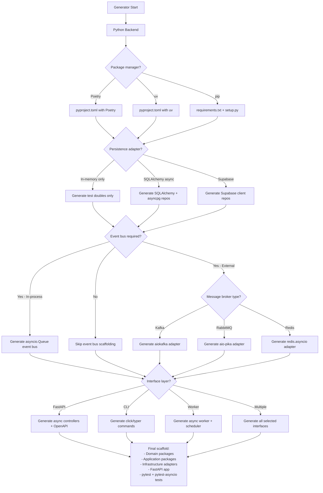

# SEA → DDD / Hexagonal Mapping (Python)

This document maps the SEA DSL primitives (Entity, Resource, Flow, Instance, Policy) to the domain-driven design and hexagonal architecture artifacts that the Python backend generators scaffold by default.

> **🎉 November 2025 Update**: Updated with latest SEA API changes - namespace now returns `str` (not `Optional[str]`), new constructor patterns (`new()` vs `new_with_namespace()`), IndexMap for deterministic iteration, multiline string support, and 342 tests passing.

## Summary (one-liner)

- Entity -> Domain Entity / Aggregate Root (dataclass or attrs)
- Resource -> Domain Value Object (frozen dataclass) or Entity (context-dependent)
- Flow -> Aggregate method / Flow Aggregate + Domain Event (async operations)
- Instance -> Domain Entity (physical instance) or frozen dataclass depending on mutability
- Policy -> Specification (Protocol), Domain Service, or runtime validator (Pydantic/attrs)

## Recent SEA API Changes (November 2025)

**Breaking Changes:**
- `namespace()` now returns `str` instead of `Optional[str]` (always returns "default" if unspecified)
- Constructors changed: Use `Entity.new(name)` for default namespace, `Entity.new_with_namespace(name, ns)` for explicit
- Flow constructor takes `ConceptId` values (not references) - clone before passing
- All quantities use `Decimal` type for precision

**New Features:**
- **Multiline string support**: Parser accepts `"""..."""` syntax for entity/resource names
- **IndexMap storage**: Graph uses IndexMap for deterministic iteration (reproducible results)
- **ValidationError helpers**: Convenience constructors like `undefined_entity()`, `unit_mismatch()`
- **CALM integration**: Full bidirectional conversion for architecture-as-code
- **342 tests passing**: Comprehensive test coverage across all primitives

## Mapping details

### 1) Entity

- **DDD role**: Domain Entity (often an Aggregate Root with identity and lifecycle).
- **Python patterns**: `@dataclass` with `id: UUID`, equality by identity, methods for behavior.
- **SEA API**: `Entity.new(name)` for default namespace, `Entity.new_with_namespace(name, ns)` for explicit
- **Key change**: `namespace()` always returns `str` (not `Optional[str]`), defaults to "default"
- **Typical generated artifacts**: `entities/`, `aggregates/`, `factories/`, domain errors, unit tests.
- **Location in generated projects**: `libs/{domain}/domain/{domain}_domain/entities/` and `libs/{domain}/domain/{domain}_domain/aggregates/`.
- **Example SEA → Python DDD**: SEA `Entity "Warehouse"` → `Warehouse` aggregate root with `WarehouseId` value object (frozen dataclass).

**Generated example:**

```python
# entities/warehouse.py
from dataclasses import dataclass
from uuid import UUID

@dataclass
class Warehouse:
    id: UUID
    name: str
    namespace: str = "default"  # Always present, never None

    def __eq__(self, other):
        if not isinstance(other, Warehouse):
            return False
        return self.id == other.id

    def __post_init__(self):
        # namespace is always a string
        assert isinstance(self.namespace, str), "namespace must be str"
```

### 2) Resource

- **DDD role**: Usually a Value Object (frozen dataclass for immutability) but can be an Entity when it has identity or lifecycle.
- **Python patterns**: `@dataclass(frozen=True)` for VOs, `@dataclass` for entities with repos.
- **Typical generated artifacts**: `value_objects/resource_type.py` or `entities/resource.py` + repository Protocol.
- **Location in generated projects**: `libs/{domain}/domain/{domain}_domain/value_objects/` or `libs/{domain}/domain/{domain}_domain/entities/resource/`.
- **Example SEA → Python DDD**: SEA `Resource "Camera" units` → `CameraType` frozen dataclass and optionally `Resource` entity for tracked inventory.

**Generated example (Value Object):**

```python
# value_objects/camera_type.py
from dataclasses import dataclass

@dataclass(frozen=True)
class CameraType:
    name: str
    unit: str = "units"

    def __post_init__(self):
        if not self.name:
            raise ValueError("Camera type name required")
```

**Generated example (Entity with identity):**

```python
# entities/resource.py
from dataclasses import dataclass
from uuid import UUID

@dataclass
class Resource:
    id: UUID
    name: str
    unit: str
    namespace: str = "default"  # Always present, never None
```

### 3) Flow

- **DDD role**: Represents transfer/relationship between entities — modeled as Aggregate method or separate Aggregate with async operations.
- **Python patterns**: Async methods on aggregates, domain events (dataclass), use-cases orchestrate via UoW.
- **SEA API**: `Flow.new(resource_id, from_id, to_id, quantity)` - takes `ConceptId` values (clone before passing)
- **Key change**: Constructor takes `ConceptId` parameters with `.clone()`, uses `Decimal` for quantities, IndexMap ensures deterministic iteration
- **Typical generated artifacts**: aggregate methods (`async def transfer`), domain events (`events/flow_created.py`), use-cases with async UoW.
- **Location in generated projects**: `libs/{domain}/domain/{domain}_domain/aggregates/`, `events/`, and `libs/{domain}/application/{domain}_application/use_cases/`.
- **Example SEA → Python DDD**: SEA `Flow` → `async def transfer()` on `InventoryAggregate` + `FlowCreatedEvent` (dataclass) published via EventBus.

**Generated example:**

```python
# aggregates/inventory_aggregate.py
from dataclasses import dataclass
from uuid import UUID
from decimal import Decimal

@dataclass
class InventoryAggregate:
    id: UUID
    location_id: UUID

    async def transfer(self, resource_id: UUID, to_location: UUID, quantity: Decimal):
        # Validation logic
        # Clone ConceptIds when creating Flow in SEA
        event = FlowCreatedEvent(
            aggregate_id=self.id,
            resource_id=resource_id,  # In real SEA: resource_id.clone()
            from_location=self.location_id,
            to_location=to_location,
            quantity=quantity  # Always Decimal for precision
        )
        # Emit event (handled by use-case via EventBus)
        return event
```

### 4) Instance

- **DDD role**: Concrete instance of a resource at an entity — usually a Domain Entity with identity and lifecycle.
- **Python patterns**: `@dataclass` with `id`, repository Protocol, optional async lifecycle methods.
- **Typical generated artifacts**: `entities/instance.py`, repository ports, mappers, tests.
- **Location in generated projects**: `libs/{domain}/domain/{domain}_domain/entities/instance/` and `libs/{domain}/application/{domain}_application/ports/instance_repository.py` (Protocol).
- **Example SEA → Python DDD**: SEA `Instance` → `CameraInstance` dataclass with `serial`, `resource_id`, `entity_id` and lifecycle methods.

**Generated example:**

```python
# entities/instance.py
from dataclasses import dataclass
from uuid import UUID

@dataclass
class CameraInstance:
    id: UUID
    resource_id: UUID
    entity_id: UUID
    serial: str | None = None

    def move_to(self, new_entity_id: UUID):
        self.entity_id = new_entity_id
        # Return domain event
```

### 5) Policy

- **DDD role**: Implemented as Specifications (Protocol), Domain Services, or runtime validators (Pydantic/attrs validators).
- **Python patterns**: `typing.Protocol` for specifications, domain service functions, Pydantic validators for compile-time checks.
- **Typical generated artifacts**: `specifications/{policy_name}_spec.py` (Protocol with `is_satisfied_by`), `services/policy_engine.py`, integration with UoW commit hooks.
- **Location in generated projects**: `libs/{domain}/domain/{domain}_domain/specifications/` or `libs/{domain}/domain/{domain}_domain/services/policy_engine.py`.
- **Example SEA → Python DDD**: SEA `Policy min_quantity` → `MinimumQuantitySpecification` Protocol or `PolicyEngine` domain service that runs post-commit and emits events.

**Generated example (Specification):**

```python
# specifications/minimum_quantity_spec.py
from typing import Protocol
from ..entities.flow import Flow

class MinimumQuantitySpecification(Protocol):
    def is_satisfied_by(self, flow: Flow) -> bool:
        return flow.quantity >= 10
```

**Generated example (Domain Service):**

```python
# services/policy_engine.py
from typing import List
from ..events.policy_violation import PolicyViolationEvent

class PolicyEngine:
    async def evaluate_policies(self, flows: List[Flow]) -> List[PolicyViolationEvent]:
        violations = []
        for flow in flows:
            if flow.quantity < 10:
                violations.append(PolicyViolationEvent(
                    flow_id=flow.id,
                    policy="min_quantity",
                    severity="error",
                    message=f"Flow quantity {flow.quantity} below minimum 10"
                ))
        return violations
```

## Cross-cutting mapping (ports, adapters, UoW, EventBus)

### Ports (secondary/outbound)

- **Python pattern**: `typing.Protocol` classes in `application/ports/`.
- **Generated artifacts**: `order_repository.py`, `unit_of_work.py`, `event_bus.py` as Protocols.
- **Location**: `libs/{domain}/application/{domain}_application/ports/`.

**Example:**

```python
# ports/unit_of_work.py
from typing import Protocol

class UnitOfWork(Protocol):
    async def __aenter__(self): ...
    async def __aexit__(self, exc_type, exc_val, exc_tb): ...
    async def commit(self): ...
    async def rollback(self): ...
```

### Adapters (infrastructure)

- **Python patterns**: Concrete classes implementing Protocols, async context managers for UoW.
- **Generated artifacts**: `in_memory_order_repo.py`, `sqlalchemy_order_repo.py`, `in_memory_uow.py`, `kafka_event_bus.py`.
- **Location**: `libs/{domain}/infrastructure/{domain}_infrastructure/adapters/{in_memory,sqlalchemy,kafka}/`.

**Example:**

```python
# adapters/in_memory/in_memory_uow.py
class InMemoryUnitOfWork:
    async def __aenter__(self):
        # Begin transaction
        return self

    async def __aexit__(self, exc_type, exc_val, exc_tb):
        if exc_type:
            await self.rollback()
        else:
            await self.commit()

    async def commit(self):
        # Commit in-memory changes
        pass

    async def rollback(self):
        # Rollback changes
        pass
```

### Unit of Work

- **Python pattern**: Async context manager (`async with uow:`) for transactional boundaries.
- **Generated artifacts**: Protocol in application, implementations in infrastructure (in-memory, SQLAlchemy, Supabase).

### Event Bus

- **Python pattern**: Protocol with `async def publish/subscribe`, implementations use `asyncio.Queue` or Kafka/Rabbit clients.
- **Generated artifacts**: `EventBus` Protocol, `InMemoryEventBus` (asyncio.Queue), `KafkaEventBus` skeleton.

**Example:**

```python
# adapters/in_memory/in_memory_event_bus.py
import asyncio
from typing import Callable, Dict, List

class InMemoryEventBus:
    def __init__(self):
        self._handlers: Dict[str, List[Callable]] = {}
        self._queue = asyncio.Queue()

    async def publish(self, event):
        event_type = type(event).__name__
        await self._queue.put((event_type, event))

    def subscribe(self, event_type: str, handler: Callable):
        if event_type not in self._handlers:
            self._handlers[event_type] = []
        self._handlers[event_type].append(handler)
```

## Where artifacts appear in a typical generated project

- **Domain**: `libs/{domain}/domain/{domain}_domain/{entities,value_objects,aggregates,events,specifications,services,factories,errors}/`
- **Application**: `libs/{domain}/application/{domain}_application/{use_cases,dto,ports}/` (includes Pydantic DTOs)
- **Infrastructure**: `libs/{domain}/infrastructure/{domain}_infrastructure/adapters/{in_memory,sqlalchemy,kafka}/` and `mappers/`
- **Interface**: `apps/{domain}-api/` or `libs/{domain}/interface/http/` with FastAPI controllers, routers, schemas

## Design notes and generator choices

- **Resource duality**: Default to frozen dataclass (VO). If identity/tracking needed, switch to dataclass Entity + repository Protocol.
- **Flow modelling**: Simple flows → aggregate methods. Complex flows with lifecycle → separate aggregate + async use-case + event stream.
- **Policy enforcement**: Specifications (Protocols) for simple rules. Domain service (`PolicyEngine`) for complex evaluation. Run in UoW commit phase or post-commit via EventBus.
- **Async-first**: All IO operations (repos, UoW, EventBus) use `async/await`. FastAPI controllers use async route handlers.

## Quick mapping reference table

| SEA Primitive | Default Python DDD Element(s) | Generated artifact examples | API Changes (Nov 2025) |
|---|---|---|---|
| Entity | Aggregate Root / Entity (dataclass) | `entities/order.py`, `aggregates/order_aggregate.py` | `new()` vs `new_with_namespace()`, namespace always `str` |
| Resource | Value Object (frozen dataclass) or Entity | `value_objects/resource_type.py`, `entities/resource.py` | Constructor patterns, namespace always `str` |
| Flow | Aggregate async method / Flow Aggregate + Event | `aggregates/inventory_aggregate.py.transfer()`, `events/flow_created.py` | Takes `ConceptId` values with `.clone()`, uses `Decimal` |
| Instance | Domain Entity (dataclass) | `entities/instance.py` with `serial`, repo Protocol | Constructor patterns, namespace always `str` |
| Policy | Specification (Protocol) / Domain Service | `specifications/min_quantity_spec.py`, `services/policy_engine.py` | ValidationError helpers, deterministic evaluation |

## Verification & extension

- Generators produce `pytest` unit tests, in-memory adapters, and example use-cases.
- Extensions (projections, sagas, search adapters) are opt-in generator options.
- All async code tested with `pytest-asyncio`.
- **Deterministic behavior**: SEA uses IndexMap for graph storage, ensuring reproducible results. Generated code should maintain iteration order consistency.

---

## Key Design Considerations (November 2025)

### Deterministic Iteration
SEA's IndexMap storage guarantees stable iteration order for:
- Policy evaluation (consistent results across runs)
- Event ordering (deterministic event emission)
- Query results (reproducible outputs)

**Python DDD mapping impact**:
- Use `dict` (Python 3.7+) which preserves insertion order
- Repository implementations should maintain consistent ordering
- Domain services should produce deterministic results for same inputs

### ConceptId Ownership
SEA Flow constructors take `ConceptId` values (not references):
- Use `.clone()` when passing IDs to Flow constructors in SEA integration
- Generated aggregates should copy IDs when creating child entities
- Domain events should capture ID values at event creation time
- Type hints: Use `UUID` in Python (ConceptId maps to UUID in FFI)

### Namespace Handling
All SEA primitives have namespace that defaults to "default":
- Generated entities should include `namespace: str = "default"` (not `Optional[str]`)
- Domain services should support namespace filtering for multi-tenant scenarios
- Repositories should use composite keys: `(namespace, id)`
- Pydantic DTOs should validate namespace as non-empty string

### Decimal Precision
SEA uses `Decimal` for all quantities:
- Generated value objects for money/quantities should use `decimal.Decimal`
- Avoid `float` for financial calculations
- Pydantic models should use `condecimal()` for validation
- SQLAlchemy columns should use `NUMERIC` type

---

## Generator Configuration Decision Trees (Python)

The following Mermaid diagrams guide AI agents through the generator prompt/option choices for each SEA primitive with Python-specific patterns.

### 1. Entity Mapping Decision Tree (Python)

```mermaid
flowchart TD
    A[SEA Entity] --> B{Has children or<br/>complex lifecycle?}
    B -->|Yes| C[Generate as Aggregate Root]
    B -->|No| D[Generate as simple Entity]

    C --> E[Scaffold:<br/>- aggregates/&#123;entity&#125;_aggregate.py<br/>- entities/&#123;entity&#125;_id.py frozen dataclass<br/>- factories/&#123;entity&#125;_factory.py<br/>- Repository Protocol<br/>- Domain events dataclasses]

    D --> F[Scaffold:<br/>- entities/&#123;entity&#125;.py dataclass<br/>- entities/&#123;entity&#125;_id.py frozen dataclass<br/>- Repository Protocol<br/>- pytest unit tests]

    E --> G{Namespace provided?}
    F --> G

    G -->|Yes| H[Add namespace field<br/>Group in libs/&#123;namespace&#125;/&#123;entity&#125;]
    G -->|No| I[Single domain lib<br/>libs/&#123;entity&#125;/domain]
```



### 2. Resource Mapping Decision Tree (Python)

```mermaid
flowchart TD
    A[SEA Resource] --> B{Does Resource have<br/>identity/serial or<br/>lifecycle states?}

    B -->|No - Pure type/unit| C[Generate as frozen dataclass]
    B -->|Yes - Tracked instances| D[Generate as dataclass Entity]

    C --> E{Multiple resource<br/>types in domain?}
    D --> F{Resource has<br/>complex behavior?}

    E -->|Yes| G[Scaffold:<br/>- value_objects/resource_type.py<br/>- Enum or Literal type<br/>- attrs validators for unit]
    E -->|No| H[Scaffold:<br/>- value_objects/&#123;resource_name&#125;.py<br/>- frozen dataclass with unit<br/>- __post_init__ validation]

    F -->|Yes| I[Generate as Aggregate Root:<br/>- aggregates/&#123;resource&#125;_aggregate.py<br/>- Repository Protocol<br/>- Domain events for state changes]
    F -->|No| J[Generate as Entity:<br/>- entities/&#123;resource&#125;.py dataclass<br/>- Repository Protocol<br/>- Instance collection methods]

    G --> K[Usage: embedded in Entities/Aggregates]
    H --> K
    I --> L[Usage: standalone aggregate with async repo]
    J --> L
```



### 3. Flow Mapping Decision Tree (Python)

```mermaid
flowchart TD
    A[SEA Flow] --> B{Flow has own<br/>lifecycle, status,<br/>or audit trail?}

    B -->|Yes - Complex| C[Generate as separate Aggregate]
    B -->|No - Simple transfer| D[Generate as Aggregate async method]

    C --> E{Flow is asynchronous<br/>or multi-step?}
    D --> F{Multiple flow types<br/>between same entities?}

    E -->|Yes| G[Scaffold:<br/>- aggregates/flow_aggregate.py<br/>- Flow state machine dataclass<br/>- events/flow_&#123;started,completed,failed&#125;.py<br/>- Repository Protocol<br/>- Async saga/process manager option]
    E -->|No| H[Scaffold:<br/>- aggregates/flow_aggregate.py<br/>- events/flow_created.py<br/>- Repository Protocol<br/>- Basic transfer validation]

    F -->|Yes| I[Scaffold multiple async methods:<br/>- &#123;entity&#125;_aggregate.transfer_&#123;type&#125;<br/>- Domain events per flow type]
    F -->|No| J[Scaffold single async method:<br/>- &#123;entity&#125;_aggregate.transfer<br/>- events/resource_transferred.py]

    G --> K[Application layer:<br/>- use_cases/execute_flow.py async<br/>- Async UoW context manager<br/>- EventBus.publish await]
    H --> K
    I --> L[Application layer:<br/>- use_cases/transfer_&#123;type&#125;.py async<br/>- UoW + EventBus orchestration]
    J --> L
```



### 4. Instance Mapping Decision Tree (Python)

```mermaid
flowchart TD
    A[SEA Instance] --> B{Instance has<br/>mutable state or<br/>lifecycle events?}

    B -->|Yes| C[Generate as dataclass Entity]
    B -->|No - Immutable record| D[Generate as frozen dataclass]

    C --> E{Instance is child<br/>of aggregate or<br/>independent?}
    D --> F[Scaffold:<br/>- value_objects/instance_record.py<br/>- frozen dataclass with resource_id, entity_id, serial<br/>- __post_init__ validation]

    E -->|Child| G[Scaffold as child entity:<br/>- entities/&#123;parent&#125;/instance.py dataclass<br/>- Managed by parent aggregate<br/>- No separate repository]
    E -->|Independent| H[Scaffold as root entity:<br/>- entities/instance.py dataclass<br/>- Repository Protocol async<br/>- Instance lifecycle events]

    G --> I{Instances tracked<br/>in collections?}
    H --> J{Instance requires<br/>audit/history?}

    I -->|Yes| K[Add collection methods on parent:<br/>- add_instance, remove_instance<br/>- Query methods<br/>- List&#91;Instance&#93; field with validators]
    I -->|No| L[Single instance: Instance &#124; None field]

    J -->|Yes| M[Add event sourcing:<br/>- events/instance_&#123;created,moved,retired&#125;.py<br/>- Event store adapter option]
    J -->|No| N[Standard CRUD events]
```



### 5. Policy Mapping Decision Tree (Python)

```mermaid
flowchart TD
    A[SEA Policy] --> B{Policy evaluates<br/>at runtime or<br/>compile-time?}

    B -->|Runtime| C{Policy references<br/>collections or<br/>aggregations?}
    B -->|Compile-time| D[Generate as Pydantic validator<br/>or type guard]

    C -->|Yes - forall/exists| E[Generate as Domain Service]
    C -->|No - Simple predicate| F[Generate as Specification Protocol]

    E --> G{Policy severity}
    F --> H{Policy used for<br/>queries or validation?}

    G -->|error| I[Scaffold:<br/>- services/policy_engine.py<br/>- async evaluate_policies method<br/>- Raise domain exception on violation<br/>- Run in UoW pre-commit hook]
    G -->|warn/info| J[Scaffold:<br/>- services/policy_engine.py<br/>- async evaluate_policies<br/>- Emit domain event on violation<br/>- Run in UoW post-commit via EventBus]

    H -->|Validation| K[Scaffold:<br/>- specifications/&#123;policy_name&#125;_spec.py<br/>- Protocol with is_satisfied_by<br/>- Used in aggregate invariants]
    H -->|Query| L[Scaffold:<br/>- specifications/&#123;policy_name&#125;_spec.py<br/>- Protocol with to_filter_expression<br/>- Used in repository query methods]

    D --> M[Scaffold:<br/>- Pydantic @field_validator<br/>- Type guards or TypeGuard&#91;T&#93;<br/>- Compile-time enforcement]
```



### 6. Cross-Cutting Configuration Tree (Python)



## Using the Decision Trees (Python-specific)

**For AI Agents:**

1. Parse the SEA model primitives (Entity, Resource, Flow, Instance, Policy)
2. For each primitive, walk the corresponding decision tree:
   - Check for identity/lifecycle indicators → dataclass vs frozen dataclass
   - Analyze complexity (collections, aggregations, state machines) → Protocol vs concrete service
   - Determine async needs → all IO operations use `async/await`
   - Check severity/usage context → Pydantic validator vs runtime Protocol
3. Collect scaffolding choices:
   - Aggregate vs Entity (both dataclass, different responsibilities)
   - frozen dataclass (VO) vs dataclass (Entity)
   - Aggregate method vs separate aggregate (async methods vs aggregate class)
   - Protocol (Specification) vs Domain Service (policy engine)
4. Apply cross-cutting configuration:
   - Package manager (Poetry/uv/pip)
   - Persistence (in-memory/SQLAlchemy/Supabase)
   - Event bus (asyncio.Queue/Kafka/Rabbit)
   - Interface (FastAPI/CLI/Worker)
5. Generate the full Python project structure with proper dependency flow

**Example prompt for AI generator:**

```
Generate a Python DDD project for SEA model with:
- Entity "Warehouse" (namespace: logistics) → Complex lifecycle → Aggregate Root (dataclass)
- Resource "Camera" → Has serial tracking → Entity (dataclass) with async repository Protocol
- Flow "Camera transfer" → Async multi-step → Flow Aggregate with async saga
- Instance "Camera instance" → Child of Flow → Child entity (dataclass in List)
- Policy "min_quantity" (severity: error, uses forall) → Domain Service in UoW hook

Target: Python 3.12+, Package: uv, Persistence: SQLAlchemy + asyncpg, Events: Kafka (aiokafka), Interface: FastAPI
```

**Output:** Full Python package structure with:

- Domain packages with dataclasses, Protocols, frozen dataclasses
- Application packages with async use-cases, Pydantic DTOs, Protocol ports
- Infrastructure with in-memory + SQLAlchemy + aiokafka adapters
- FastAPI app with async controllers and OpenAPI docs
- pytest + pytest-asyncio test suite with fixtures
- pyproject.toml with uv, project.json with Nx targets

---

## Python-Specific Patterns Summary

| Pattern | Implementation | When to use |
|---|---|---|
| Value Object | `@dataclass(frozen=True)` | Immutable domain concepts (Money, Email, ResourceType) |
| Entity | `@dataclass` with `id` field | Identity-rich domain objects (Order, Warehouse, Instance) |
| Aggregate Root | `@dataclass` with methods | Transactional boundary with invariants (OrderAggregate) |
| Domain Event | `@dataclass` | Event emitted by aggregate (OrderCreatedEvent) |
| Specification | `typing.Protocol` with `is_satisfied_by` | Reusable business rule predicates |
| Domain Service | Class with async methods | Stateless logic across aggregates (PolicyEngine) |
| Repository Port | `typing.Protocol` with async methods | Persistence abstraction |
| Unit of Work | `typing.Protocol` with async context manager | Transactional boundary |
| Event Bus | `typing.Protocol` with async publish/subscribe | Event distribution |
| Use Case | Async function or class with `execute` | Application service orchestrating domain |
| DTO | `pydantic.BaseModel` | Input/output schemas with validation |
| Adapter | Concrete class implementing Protocol | Infrastructure implementation |

## Testing Patterns

| Test Type | Tools | Location | Purpose |
|---|---|---|---|
| Unit (Domain) | pytest | `libs/{domain}/domain/tests/unit/` | Pure domain logic |
| Unit (Application) | pytest + pytest-asyncio | `libs/{domain}/application/tests/unit/` | Use-cases with mocked ports |
| Integration | pytest-asyncio + in-memory adapters | `libs/{domain}/infrastructure/tests/integration/` | Adapter contracts + UoW |
| E2E | pytest-asyncio + TestClient | `apps/{domain}-api/tests/e2e/` | Full stack with FastAPI |

---
