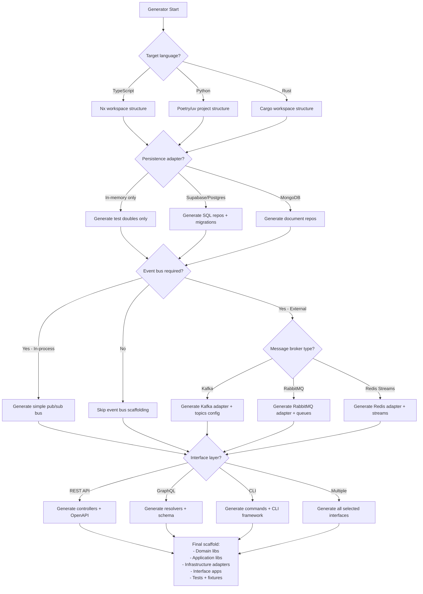

# SEA → DDD / Hexagonal Mapping (TypeScript)

This document maps the SEA DSL primitives (Entity, Resource, Flow, Instance, Policy) to the domain-driven design and hexagonal architecture artifacts that the project generators scaffold by default.

> **🎉 November 2025 Update**: Updated with latest SEA API changes - namespace now returns `string` (not nullable), new constructor patterns (`new()` vs `newWithNamespace()`), IndexMap for deterministic iteration, and multiline string support in parser.

## Summary (one-liner)

- Entity -> Domain Entity / Aggregate Root
- Resource -> Domain Value Object or Domain Entity (context-dependent)
- Flow -> Aggregate relationship / Domain Event / Application orchestration artifact
- Instance -> Domain Entity (physical instance) or VO depending on identity and mutability
- Policy -> Specification, Domain Service or Validation rule (policy engine)

## Recent SEA API Changes (November 2025)

**Breaking Changes:**
- `namespace()` now returns `string` instead of `string | undefined` (always returns "default" if unspecified)
- Constructors changed: Use `Entity.new(name)` for default namespace, `Entity.newWithNamespace(name, ns)` for explicit
- Flow constructor takes `ConceptId` values (not references) - clone before passing
- Methods now return `ConceptId` type instead of raw strings for IDs

**New Features:**
- **Multiline string support**: Parser accepts `"""..."""` syntax for entity/resource names
- **IndexMap storage**: Graph uses IndexMap (not HashMap) for deterministic iteration
- **ValidationError helpers**: Convenience constructors like `undefined_entity()`, `unit_mismatch()`
- **CALM integration**: Full bidirectional conversion for architecture-as-code

## Mapping details

### 1) Entity

- **DDD role**: Domain Entity (often an Aggregate Root where it carries identity and lifecycle).
- **SEA API**: `Entity.new(name)` for default namespace, `Entity.newWithNamespace(name, ns)` for explicit
- **Key change**: `namespace()` always returns `string` (not nullable), defaults to "default"
- **Typical generated artifacts**: `entities/`, `aggregates/`, `factories/`, domain-specific errors, unit tests.
- **Location in generated projects**: `libs/{domain}/domain/src/entities/` and `libs/{domain}/domain/src/aggregates/`.
- **Example SEA → DDD**: SEA `Entity "Warehouse"` → `Warehouse` aggregate root with `WarehouseId` value object.

**Generated example:**

```typescript
// entities/warehouse.entity.ts
export class Warehouse {
  constructor(
    private readonly _id: WarehouseId,
    private _name: string,
    private readonly _namespace: string = 'default'  // Always present
  ) {}

  get id(): WarehouseId { return this._id; }
  get name(): string { return this._name; }
  get namespace(): string { return this._namespace; }  // Never undefined
}
```

### 2) Resource

- **DDD role**: Usually a Value Object (immutable description like a resource type, unit) but can be an Entity when it has identity or lifecycle (e.g., a tracked resource item).
- **SEA API**: `Resource.new(name, unit)` for default namespace, `Resource.newWithNamespace(name, unit, ns)` for explicit
- **Key change**: Constructor pattern split, namespace always returns string
- **Typical generated artifacts**: value objects under `value-objects/` (e.g., `unit`, `resource-type`), or a light `entities/resource` with repo if identity required.
- **Location in generated projects**: `libs/{domain}/domain/src/value-objects/` or `libs/{domain}/domain/src/entities/resource/`.
- **Example SEA → DDD**: SEA `Resource "Camera"` → `CameraType` VO and optionally `Resource` entity for inventory instances.

**Generated example (Value Object):**

```typescript
// value-objects/camera-type.vo.ts
export class CameraType {
  constructor(
    private readonly _name: string,
    private readonly _unit: string = 'units'
  ) {
    if (!_name) throw new Error('Camera type name required');
  }

  get name(): string { return this._name; }
  get unit(): string { return this._unit; }
}
```

### 3) Flow

- **DDD role**: Represents a transfer or relationship between entities — often modeled as part of an Aggregate or as its own Aggregate when it has significant behavior. Flows also drive Domain Events (emit when transfers occur).
- **SEA API**: `Flow.new(resourceId, fromId, toId, quantity)` - takes `ConceptId` values (clone before passing)
- **Key change**: Constructor takes ConceptId parameters (not references), deterministic iteration via IndexMap
- **Typical generated artifacts**: aggregate behavior methods (e.g., `transfer`), domain events (`FlowCreated`, `FlowExecuted`), and application use-cases that orchestrate UoW + repos to perform flows.
- **Location in generated projects**: `libs/{domain}/domain/src/aggregates/`, `events/` and `libs/{domain}/application/src/use-cases/`.
- **Example SEA → DDD**: SEA `Flow` → `Flow` aggregate or `Transfer` operation on `InventoryAggregate` plus `FlowCreatedEvent` published to EventBus.

**Generated example:**

```typescript
// aggregates/inventory.aggregate.ts
export class InventoryAggregate {
  constructor(
    private readonly id: ConceptId,
    private locationId: ConceptId
  ) {}

  transfer(resourceId: ConceptId, toLocation: ConceptId, quantity: number): FlowCreatedEvent {
    // Clone ConceptIds when creating Flow
    const event = new FlowCreatedEvent(
      this.id.clone(),
      resourceId.clone(),
      this.locationId.clone(),
      toLocation.clone(),
      quantity
    );
    return event;
  }
}
```

4) Instance

- DDD role: Concrete instance of a resource at an entity (physical item) — usually a Domain Entity with its own identity and lifecycle.
- Typical generated artifacts: `instances/` entities, repositories, mappers and tests.
- Location in generated projects: `libs/{domain}/domain/src/entities/instance/` and `libs/{domain}/application/src/ports/order-repository.port.ts`-style ports for persistence.
- Example SEA → DDD: SEA `Instance` → `CameraInstance` entity with `serial`, `entityId` and lifecycle commands.

5) Policy

- DDD role: Implemented as Specifications, Domain Services, or the Policy Engine (rule evaluator). Policies validate invariants, produce domain events or raise domain exceptions.
- Typical generated artifacts: `policies/` or `specifications/`, domain-level validators, policy-to-event mappers, and integration with the application `UnitOfWork` and `EventBus`.
- Location in generated projects: `libs/{domain}/domain/src/specifications/` or `libs/{domain}/domain/src/policies/`; application wiring in `libs/{domain}/application/`.
- Example SEA → DDD: SEA `Policy` → `MinimumQuantitySpecification` or `PolicyEngine` that runs after write operations and emits warnings/errors.

## Cross-cutting mapping (ports, adapters, UoW, EventBus)

- Ports (secondary/outbound): repositories, UnitOfWork, EventBus, Cache, External API ports are generated under `libs/{domain}/application/src/ports/` as interfaces/contracts. These remain pure and depend on domain types only.
- Adapters (infrastructure): concrete implementations live in `libs/{domain}/infrastructure/src/adapters/` (in-memory, SQL, supabase, kafka, etc.). They implement ports and include mappers to/from persistence schemas.
- Unit of Work: Generated as a port (`UnitOfWork` contract) plus infrastructure implementations (`in-memory-uow`, `db-uow`) to manage transactional boundaries and ensure atomicity across repository operations.
- Event Bus: Generated contract `EventBus` with `publish`/`subscribe` and sample adapters (in-process bus, Kafka/Rabbit skeletons). Domain events (emitted by aggregates) are published by application services via the EventBus port.

## Where artifacts appear in a typical generated project (example tree excerpts)

- Domain: `libs/{domain}/domain/src/{entities,value-objects,aggregates,events,specifications,factories,errors}`
- Application: `libs/{domain}/application/src/{use-cases,dto,ports,services}` (includes `unit-of-work.port.ts`, `event-bus.port.ts`)
- Infrastructure: `libs/{domain}/infrastructure/src/adapters/{in-memory,postgres,kafka}/` and `mappers/`, `uow` implementations
- Interface: `apps/{domain}-api/src/controllers|routes|dto` or `libs/{domain}/interface/http/` for reusable adapters

## Design notes and generator choices

- Resource duality: the generator will default to modeling `Resource` as a Value Object. If the template prompt indicates identity or inventory behavior, the generator will switch to an Entity + Repository pattern for that resource.
- Flow modelling: small/simple flows are implemented as methods on aggregates (no separate aggregate). Big flows with lifecycle or analytics needs will be generated as separate aggregate + event stream.
- Policy enforcement: policies are generated as Specifications and a Policy Engine shim; the application layer will optionally run policies inside the UnitOfWork commit phase and publish policy violations as domain events.

## Quick mapping reference table

| SEA Primitive | Default DDD Element(s) | Generated artifact examples |
|---|---:|---|
| Entity | Aggregate Root / Entity | `entities/Order`, `aggregates/OrderAggregate` |
| Resource | Value Object (or Entity if identity) | `value-objects/ResourceType`, `entities/Resource` |
| Flow | Aggregate operation / Flow Aggregate + Domain Event | `aggregates/InventoryAggregate.transfer()`, `events/FlowCreatedEvent` |
| Instance | Domain Entity (instance) | `entities/Instance` with `serial` and repo |
| Policy | Specification / Domain Service / Policy Engine | `specifications/MinQuantitySpec`, `policies/policy-engine` |

## Verification & extension

- The generator produces unit tests, in-memory adapters, and example use cases for all the above so teams can validate behavior quickly. Extensions (projections, sagas/process-managers, search adapters) are opt-in generator options.
- **Deterministic behavior**: SEA uses IndexMap (not HashMap) for graph storage, ensuring reproducible results across runs. Generated DDD code should maintain iteration order consistency for policy evaluation and event ordering.

---

## Key Design Considerations (November 2025)

### Deterministic Iteration
SEA's IndexMap storage guarantees stable iteration order for:
- Policy evaluation (consistent results across runs)
- Event ordering (deterministic event emission)
- Query results (reproducible outputs)

**DDD mapping impact**: Generated repositories should preserve insertion order where possible. Use `Map` with insertion order (ES6+) instead of plain objects for collections in generated TypeScript code.

### ConceptId Ownership
SEA Flow constructors take `ConceptId` values (not references):
- Generated aggregates should clone IDs when passing to child entities
- Value objects should use readonly ID fields
- Domain events should capture ID values at event creation time

### Namespace Handling
All SEA primitives have a namespace that defaults to "default":
- Generated entities should include namespace as required field (not optional)
- Domain services should support namespace filtering for multi-tenant scenarios
- Repositories should index by (namespace, id) composite keys
- Resource scaffolding should mirror the runtime API: use the namespace-aware constructors and default to "default" so generated DTOs never expose `undefined`.

---

## Generator Configuration Decision Trees

The following Mermaid diagrams guide AI agents (and humans) through the generator prompt/option choices for each SEA primitive. Use these trees to determine the correct scaffolding strategy based on domain characteristics.

### 1. Entity Mapping Decision Tree

```mermaid
flowchart TD
    A[SEA Entity] --> B{Has children or<br/>complex lifecycle?}
    B -->|Yes| C[Generate as Aggregate Root]
    B -->|No| D[Generate as simple Entity]

    C --> E[Scaffold:<br/>- aggregates/&#123;entity&#125;-aggregate.ts<br/>- entities/&#123;entity&#125;-id.ts VO<br/>- factories/&#123;entity&#125;-factory.ts<br/>- Repository port<br/>- Domain events]

    D --> F[Scaffold:<br/>- entities/&#123;entity&#125;.ts<br/>- entities/&#123;entity&#125;-id.ts VO<br/>- Repository port<br/>- Basic unit tests]

    E --> G{Namespace provided?}
    F --> G

    G -->|Yes| H[Add namespace field<br/>Group in libs/&#123;namespace&#125;/&#123;entity&#125;]
    G -->|No| I[Single domain lib<br/>libs/&#123;entity&#125;/domain]
```



### 2. Resource Mapping Decision Tree

```mermaid
flowchart TD
    A[SEA Resource] --> B{Does Resource have<br/>identity/serial or<br/>lifecycle states?}

    B -->|No - Pure type/unit| C[Generate as Value Object]
    B -->|Yes - Tracked instances| D[Generate as Entity]

    C --> E{Multiple resource<br/>types in domain?}
    D --> F{Resource has<br/>complex behavior?}

    E -->|Yes| G[Scaffold:<br/>- value-objects/resource-type.ts<br/>- Enum or union type<br/>- Unit validation logic]
    E -->|No| H[Scaffold:<br/>- value-objects/&#123;resource-name&#125;.ts<br/>- Immutable struct with unit]

    F -->|Yes| I[Generate as Aggregate Root:<br/>- aggregates/&#123;resource&#125;-aggregate.ts<br/>- Repository port<br/>- Domain events for state changes]
    F -->|No| J[Generate as Entity:<br/>- entities/&#123;resource&#125;.ts<br/>- Repository port<br/>- Instance collection methods]

    G --> K[Usage: embedded in Entities/Aggregates]
    H --> K
    I --> L[Usage: standalone aggregate with repo]
    J --> L
```



### 3. Flow Mapping Decision Tree

```mermaid
flowchart TD
    A[SEA Flow] --> B{Flow has own<br/>lifecycle, status,<br/>or audit trail?}

    B -->|Yes - Complex| C[Generate as separate Aggregate]
    B -->|No - Simple transfer| D[Generate as Aggregate method]

    C --> E{Flow is asynchronous<br/>or multi-step?}
    D --> F{Multiple flow types<br/>between same entities?}

    E -->|Yes| G[Scaffold:<br/>- aggregates/flow-aggregate.ts<br/>- Flow state machine<br/>- events/flow-&#123;started,completed,failed&#125;.event.ts<br/>- Repository + port<br/>- Process manager / saga option]
    E -->|No| H[Scaffold:<br/>- aggregates/flow-aggregate.ts<br/>- events/flow-created.event.ts<br/>- Repository + port<br/>- Basic transfer validation]

    F -->|Yes| I[Scaffold multiple methods:<br/>- &#123;entity&#125;-aggregate.transfer&#123;Type&#125;<br/>- Domain events per flow type]
    F -->|No| J[Scaffold single method:<br/>- &#123;entity&#125;-aggregate.transfer<br/>- events/resource-transferred.event.ts]

    G --> K[Application layer:<br/>- use-cases/execute-flow.usecase.ts<br/>- Saga/process-manager if async]
    H --> K
    I --> L[Application layer:<br/>- use-cases/transfer-&#123;type&#125;.usecase.ts<br/>- UoW orchestration]
    J --> L
```



### 4. Instance Mapping Decision Tree

```mermaid
flowchart TD
    A[SEA Instance] --> B{Instance has<br/>mutable state or<br/>lifecycle events?}

    B -->|Yes| C[Generate as Entity]
    B -->|No - Immutable record| D[Generate as Value Object]

    C --> E{Instance is child<br/>of aggregate or<br/>independent?}
    D --> F[Scaffold:<br/>- value-objects/instance-record.ts<br/>- Immutable with resourceId, entityId, serial<br/>- Validation only]

    E -->|Child| G[Scaffold as child entity:<br/>- entities/&#123;parent&#125;/instance.ts<br/>- Managed by parent aggregate<br/>- No separate repository]
    E -->|Independent| H[Scaffold as root entity:<br/>- entities/instance.ts<br/>- Repository port<br/>- Instance lifecycle events]

    G --> I{Instances tracked<br/>in collections?}
    H --> J{Instance requires<br/>audit/history?}

    I -->|Yes| K[Add collection methods on parent:<br/>- addInstance, removeInstance<br/>- Query methods<br/>- Collection invariants]
    I -->|No| L[Single instance reference on parent]

    J -->|Yes| M[Add event sourcing:<br/>- events/instance-&#123;created,moved,retired&#125;.event.ts<br/>- Event store adapter option]
    J -->|No| N[Standard CRUD events]
```



### 5. Policy Mapping Decision Tree

```mermaid
flowchart TD
    A[SEA Policy] --> B{Policy evaluates<br/>at runtime or<br/>compile-time?}

    B -->|Runtime| C{Policy references<br/>collections or<br/>aggregations?}
    B -->|Compile-time| D[Generate as Type constraint<br/>or validation decorator]

    C -->|Yes - forall/exists| E[Generate as Domain Service]
    C -->|No - Simple predicate| F[Generate as Specification]

    E --> G{Policy severity}
    F --> H{Policy used for<br/>queries or validation?}

    G -->|error| I[Scaffold:<br/>- policies/policy-engine.ts<br/>- Policy evaluator with collection access<br/>- Throw domain exception on violation<br/>- Run in UoW pre-commit hook]
    G -->|warn/info| J[Scaffold:<br/>- policies/policy-engine.ts<br/>- Policy evaluator<br/>- Emit domain event on violation<br/>- Run in UoW post-commit]

    H -->|Validation| K[Scaffold:<br/>- specifications/&#123;policy-name&#125;-spec.ts<br/>- isSatisfiedBy method<br/>- Used in aggregate invariants]
    H -->|Query| L[Scaffold:<br/>- specifications/&#123;policy-name&#125;-spec.ts<br/>- toExpression method for repos<br/>- Used in application query services]

    D --> M[Scaffold:<br/>- Type guards or Zod/Yup schema<br/>- Compile-time enforcement<br/>- No runtime policy engine]
```



### 6. Cross-Cutting Configuration Tree



## Using the Decision Trees

**For AI Agents:**

1. Parse the SEA model primitives (Entity, Resource, Flow, Instance, Policy)
2. For each primitive, walk the corresponding decision tree using domain metadata:
   - Check for identity/lifecycle indicators
   - Analyze complexity (collections, aggregations, state machines)
   - Determine severity/usage context
3. Collect scaffolding choices (Aggregate vs Entity, VO vs Entity, method vs aggregate)
4. Apply cross-cutting configuration (language, persistence, events, interface)
5. Generate the full project structure with proper dependency flow

**Example prompt for AI generator:**

```
Generate a DDD project for SEA model with:
- Entity "Warehouse" (namespace: logistics) → Complex lifecycle → Aggregate Root
- Resource "Camera" → Has serial tracking → Entity with repository
- Flow "Camera transfer" → Async multi-step → Flow Aggregate with saga
- Instance "Camera instance" → Child of Flow → Child entity
- Policy "min_quantity" (severity: error, uses forall) → Domain Service in UoW hook

Target: TypeScript, Persistence: Supabase, Events: Kafka, Interface: REST + GraphQL
```

**Output:** Full Nx workspace with proper libs, adapters, and wiring per decision tree paths.

---
