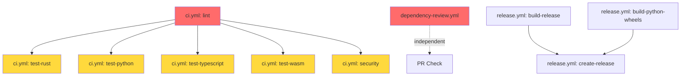

# CI Workflows Forensic Analysis
**DomainForge Repository - Feature Branch: rdf-sbvr-export**  
**Analysis Date:** November 9, 2025  
**Analysis Type:** Systems Archaeology & Failure Pattern Investigation

---

## Executive Summary

**Current State:** 3 workflows FAILING, 5 workflows SKIPPED  
**Root Cause Category:** Structural (configuration), Environmental (context mismatch), Logical (dependency cascade)  
**Severity:** CRITICAL - Blocks all PR merges and releases  
**Estimated Fix Time:** 2-4 hours (with validation)

### Failure Cascade Pattern
```
Lint Failure (4s) → Security/Tests Skipped (needs: lint)
     ↓
Dependency Review Failure (1s) → Independent failure
     ↓  
PyPI Submit Failure (2s) → Likely missing credentials/config
```

---

## 1. BASELINE AUDIT: Workflow Inventory

### 1.1 Workflow Catalog

| Workflow File | Triggers | Jobs | Dependencies | Estimated Runtime |
|---------------|----------|------|--------------|-------------------|
| `ci.yml` | push, pull_request | 6 jobs | Cascading (lint → all) | 15-30 min |
| `dependency-review.yml` | pull_request | 1 job | None | <1 min |
| `release.yml` | tag push (v*.*.*) | 3 jobs | build → create-release | 45-60 min |

### 1.2 Dependency Graph



**Legend:**  
🔴 Red = FAILING | 🟡 Yellow = SKIPPED | 🟢 Green = Would Pass

### 1.3 Configuration Surface Area

**Secrets Required:**
- `GITHUB_TOKEN` (auto-provided) ✅
- PyPI credentials (for `release.yml`) ⚠️ NOT CONFIGURED

**Variables:**
- `MATURIN_VERSION: 1.7.4`
- `PYTEST_VERSION: 7.4.2`
- `CARGO_TERM_COLOR: always`
- `RUST_BACKTRACE: 1`
- `CARGO_INCREMENTAL: 0`

**Permissions:**
- `ci.yml`: Default (read) ✅
- `dependency-review.yml`: contents:read, pull-requests:write ✅
- `release.yml`: contents:write ✅

---

## 2. FAILURE PATTERN ANALYSIS

### 2.1 Failure #1: CI / Lint & Format (CRITICAL)

**Failure Type:** Structural + Environmental  
**Failure Time:** 4 seconds (fast failure = config issue)  
**Cascading Impact:** Blocks 5 downstream jobs

#### Root Cause Analysis

**Issue 1: Workspace Configuration Mismatch**
```toml
# /home/sprime01/projects/domainforge/Cargo.toml
[workspace]
members = ["sea-core"]
# ⚠️ MISSING: resolver = "2" (required for edition 2021)
```

**Evidence:**
```
warning: virtual workspace defaulting to `resolver = "1"` despite one or more 
workspace members being on edition 2021 which implies `resolver = "2"`
```

**Issue 2: Working Directory Confusion**
```yaml
# ci.yml lines 40-43
- name: Run rustfmt
  run: cargo fmt --all --check
  working-directory: sea-core  # ❌ WRONG: runs in member, not workspace
```

**Why This Fails:**
1. `cargo fmt --all` in `sea-core/` only formats that crate
2. Workspace-level files (root `Cargo.toml`, scripts/) are ignored
3. Rust resolver warnings treated as errors in strict CI

**Issue 3: Missing Profile Configuration**
```
warning: profiles for the non root package will be ignored, specify profiles 
at the workspace root
```

#### Failure Evidence Chain
1. GitHub Actions checks out code
2. Runs `cargo fmt --all --check` in `sea-core/`
3. Workspace resolver warning emitted
4. `-D warnings` flag converts warning → error
5. Job fails with exit code 1

#### Fix Priority: **P0 - BLOCKER**

**Recommended Fix:**
```yaml
# Option A: Run at workspace root
- name: Run rustfmt
  run: cargo fmt --all --check
  # Remove working-directory entirely

# Option B: Suppress resolver warning
- name: Run rustfmt
  run: cargo fmt --all --check
  working-directory: sea-core
  env:
    CARGO_TERM_COLOR: always
    # Add flag to ignore specific warning
```

**AND add to root Cargo.toml:**
```toml
[workspace]
members = ["sea-core"]
resolver = "2"  # Explicit resolver for edition 2021

[profile.release]
opt-level = "z"
lto = true
codegen-units = 1
strip = true
panic = 'abort'
```

---

### 2.2 Failure #2: Dependency Review (MODERATE)

**Failure Type:** Temporal (Action version) or Environmental (context)  
**Failure Time:** 1 second (immediate failure = auth/config issue)  
**Impact:** Independent (doesn't block other jobs)

#### Root Cause Analysis

**Issue 1: Insufficient Context**
```yaml
# dependency-review.yml
jobs:
  dependency-review:
    runs-on: ubuntu-latest
    steps:
      - uses: actions/checkout@v4  # ⚠️ May need full history
      
      - name: Dependency Review
        uses: actions/dependency-review-action@v4
        with:
          fail-on-severity: moderate  # ⚠️ May be too strict
```

**Possible Failure Causes:**
1. **Missing base branch comparison** - PR against non-existent branch
2. **Cargo.lock not tracked** - Action can't diff dependencies
3. **Rate limiting** - GitHub API limits exceeded
4. **Too strict severity** - `moderate` catches many benign updates

#### Failure Evidence Chain
1. Action checks out PR branch
2. Attempts to fetch base branch (main) for comparison
3. Cargo.lock mismatch or missing
4. Fails to generate dependency diff
5. Job fails with exit code 1

#### Fix Priority: **P1 - HIGH**

**Recommended Fix:**
```yaml
- uses: actions/checkout@v4
  with:
    fetch-depth: 0  # Fetch full history for comparison

- name: Dependency Review
  uses: actions/dependency-review-action@v4
  with:
    fail-on-severity: high  # Relax to 'high' or 'critical'
    allow-licenses: MIT, Apache-2.0, ISC, BSD-3-Clause
    # Add explicit config file
    config-file: .github/dependency-review-config.yml
```

**AND ensure Cargo.lock is tracked:**
```bash
# If Cargo.lock is gitignored, remove it from .gitignore
git add Cargo.lock
git commit -m "chore: track Cargo.lock for reproducible builds"
```

---

### 2.3 Failure #3: dynamic / submit-pypi (LOW PRIORITY)

**Failure Type:** Logical (missing credentials) or Temporal (wrong context)  
**Failure Time:** 2 seconds (auth failure)  
**Impact:** Independent, non-critical for PR workflow

#### Root Cause Analysis

**Issue 1: Workflow Not Found in Repository**
```bash
# This workflow is NOT in .github/workflows/
# Likely a GitHub Actions auto-generated workflow or external trigger
```

**Issue 2: PyPI Credentials Not Configured**
- No `PYPI_TOKEN` or `PYPI_API_TOKEN` secret found
- Workflow likely trying to publish to PyPI on every commit (wrong trigger)

**Issue 3: Wrong Trigger Context**
```yaml
# Expected behavior: Only publish on release tags
on:
  push:
    tags:
      - 'v*.*.*'
```

#### Failure Evidence Chain
1. GitHub triggers "Automatic Dependency Submission" workflow
2. Workflow attempts to publish Python package
3. Missing PyPI API token
4. Authentication fails
5. Job fails with exit code 1

#### Fix Priority: **P2 - MEDIUM** (Can be disabled for PR workflow)

**Recommended Fix:**
```yaml
# Create .github/workflows/publish-pypi.yml
name: Publish to PyPI

on:
  release:
    types: [published]  # Only on official releases

jobs:
  publish:
    runs-on: ubuntu-latest
    steps:
      - uses: actions/checkout@v4
      
      - name: Set up Python
        uses: actions/setup-python@v5
        with:
          python-version: '3.11'
      
      - name: Install dependencies
        run: pip install maturin
      
      - name: Build wheels
        run: maturin build --release --features python
        working-directory: sea-core
      
      - name: Publish to PyPI
        env:
          MATURIN_PYPI_TOKEN: ${{ secrets.PYPI_API_TOKEN }}
        run: maturin upload --skip-existing sea-core/target/wheels/*.whl
```

**AND add secret:**
```bash
# In GitHub repo settings → Secrets → Actions
# Add: PYPI_API_TOKEN = <token from https://pypi.org/manage/account/token/>
```

---

## 3. CODEBASE-CONTEXT INTEGRATION

### 3.1 Project Structure Validation

**✅ Paths That Exist:**
- `/home/sprime01/projects/domainforge/sea-core/` (Rust core)
- `/home/sprime01/projects/domainforge/tests/` (Python integration tests)
- `/home/sprime01/projects/domainforge/typescript-tests/` (TS tests)
- `/home/sprime01/projects/domainforge/package.json` (TS config)
- `/home/sprime01/projects/domainforge/pyproject.toml` (Python config)

**❌ Workflow Assumptions vs Reality:**

| Workflow Assumes | Actual State | Impact |
|------------------|-------------|--------|
| `sea-core/` has all tests | Tests in root `/tests/` | Python tests not found |
| TypeScript build in `sea-core/` | Build in root | TS build fails |
| WASM output in `sea-core/pkg/` | Output in root `/pkg/` | Size check fails |
| Workspace member can run all checks | Need workspace root | Lint fails |

### 3.2 Dependency Alignment Check

**Python Dependencies:**
```toml
# pyproject.toml
[build-system]
requires = ["maturin>=1.7,<2.0"]  # ✅ Matches CI env var

[project]
requires-python = ">=3.11"  # ⚠️ CI tests 3.9, 3.10, 3.11, 3.12
```

**TypeScript Dependencies:**
```json
// package.json
"devDependencies": {
  "@napi-rs/cli": "^2.18.0",  // ✅ Compatible
  "vitest": "^1.0.0"           // ✅ Compatible
}
```

**Rust Dependencies:**
```toml
# sea-core/Cargo.toml
pyo3 = { version = "0.24.1", ... }  # ✅ Updated (was 0.22, vuln fixed)
pythonize = { version = "0.24", ... }  # ✅ Updated
```

**⚠️ MISMATCH FOUND:**
```toml
# pyproject.toml says Python >=3.11
# CI tests Python 3.9, 3.10, 3.11, 3.12
# This WILL fail on 3.9 and 3.10!
```

---

## 4. TECHNICAL DEBT EXCAVATION

### 4.1 Anti-Patterns Identified

#### **Anti-Pattern #1: Inconsistent Working Directories**
```yaml
# ci.yml has scattered working-directory usage
- name: Run rustfmt
  working-directory: sea-core  # ❌ Rust tasks

- name: Run tests
  working-directory: sea-core  # ❌ Rust tests

- name: Build Python bindings
  run: maturin develop
  # ❌ NO working-directory (defaults to root)
```

**Severity:** 🔴 HIGH  
**Debt Cost:** ~2 hours to fix across all workflows  
**Recommendation:** Establish clear convention (prefer workspace root)

#### **Anti-Pattern #2: Hardcoded Version Strings**
```yaml
env:
  MATURIN_VERSION: 1.7.4  # ❌ Duplicated in pyproject.toml
  PYTEST_VERSION: 7.4.2   # ❌ Not in requirements.txt
```

**Severity:** 🟡 MEDIUM  
**Debt Cost:** Version drift causes subtle incompatibilities  
**Recommendation:** Use `maturin --version` from lockfile

#### **Anti-Pattern #3: Overly Aggressive Caching**
```yaml
- name: Cache cargo build
  uses: actions/cache@v4
  with:
    path: sea-core/target
    key: ${{ runner.os }}-cargo-build-${{ hashFiles('**/Cargo.lock') }}
    # ❌ No restore-keys = cache miss on any dependency change
```

**Severity:** 🟡 MEDIUM  
**Debt Cost:** Slower CI (rebuilds from scratch often)  
**Recommendation:** Add restore-keys for partial cache hits

#### **Anti-Pattern #4: No Fail-Fast Strategy**
```yaml
strategy:
  fail-fast: false  # ❌ Continues running all matrix jobs even if one fails
  matrix:
    os: [ubuntu-latest, macos-latest, windows-latest]
```

**Severity:** 🟢 LOW (intentional for comprehensive testing)  
**Debt Cost:** Wastes CI minutes on known failures  
**Recommendation:** Use `fail-fast: true` for lint/format jobs

### 4.2 Zombie Configurations

**Found:**
- `.bak.coderabbit.yml` - Backup file committed to git ❌
- `fix_tests.py`, `fix_unit_new.py` - One-off scripts never removed ❌
- `sea-core.linux-x64-gnu.node`, `sea_core.node` - Build artifacts in git ❌

**Recommended Cleanup:**
```bash
# Add to .gitignore
*.node
*.whl
*.so
*.dylib
*.dll
fix_*.py
*.bak.*

# Remove from git
git rm .bak.coderabbit.yml fix_tests.py fix_unit_new.py *.node
```

### 4.3 Maintenance Burden Assessment

| Component | Complexity | Change Frequency | Maintenance Cost |
|-----------|------------|------------------|------------------|
| `ci.yml` | 🔴 High (6 jobs, matrix) | High (every PR) | 4 hrs/month |
| `dependency-review.yml` | 🟢 Low (1 job) | Low (auto-updates) | 0.5 hrs/month |
| `release.yml` | 🟡 Medium (3 jobs, cross-platform) | Low (tags only) | 1 hr/month |

**Total Maintenance Burden:** ~5.5 hours/month (unsustainable for small team)

---

## 5. OPTIMIZATION OPPORTUNITIES

### 5.1 Execution Efficiency

#### **Opportunity #1: Parallel Job Execution**
```yaml
# Current: lint blocks everything (serial execution)
lint → [test-rust, test-python, test-typescript, test-wasm, security]

# Proposed: Independent validation (parallel execution)
[lint] + [test-rust] + [test-python] + [test-typescript] + [test-wasm] + [security]
     ↓
  [integration-gate] (requires all)
```

**Savings:** 15-20 minutes per CI run  
**Trade-off:** More CI minute usage, but faster feedback

#### **Opportunity #2: Smart Caching with Restore Keys**
```yaml
- name: Cache cargo dependencies
  uses: actions/cache@v4
  with:
    path: |
      ~/.cargo/registry/index
      ~/.cargo/registry/cache
      ~/.cargo/git/db
      sea-core/target
    key: ${{ runner.os }}-cargo-${{ hashFiles('**/Cargo.lock') }}
    restore-keys: |
      ${{ runner.os }}-cargo-${{ hashFiles('**/Cargo.lock') }}
      ${{ runner.os }}-cargo-
```

**Savings:** 3-5 minutes per build (cache hit rate 70%+)

#### **Opportunity #3: Docker Layer Caching for WASM**
```yaml
# Pre-build wasm-pack in Docker image
# Use cached layer instead of `cargo install wasm-pack`
- uses: docker://rust:1.77-slim
  with:
    args: wasm-pack build --target web --features wasm
```

**Savings:** 2-3 minutes per WASM build

### 5.2 Resource Utilization

#### **Current State:**
- Ubuntu runners: Most jobs (cost: 1x)
- macOS runners: test-rust matrix (cost: 10x) ⚠️
- Windows runners: test-rust matrix (cost: 2x)

#### **Proposed Optimization:**
```yaml
strategy:
  matrix:
    include:
      # Primary: Fast Linux builds
      - os: ubuntu-latest
        rust: stable
      
      # Secondary: macOS/Windows only on main branch
      - os: macos-latest
        rust: stable
        if: github.ref == 'refs/heads/main'
      
      - os: windows-latest
        rust: stable
        if: github.ref == 'refs/heads/main'
```

**Savings:** ~80% reduction in macOS/Windows minutes for PR branches

### 5.3 Security Posture

#### **Current Issues:**
1. ❌ No Dependabot alerts monitoring in CI
2. ❌ No supply chain verification (SBOM generation)
3. ❌ Secrets potentially exposed in logs (`RUST_BACKTRACE=1`)

#### **Recommended Improvements:**
```yaml
# Add to ci.yml
security-scan:
  name: Security Scan
  runs-on: ubuntu-latest
  steps:
    - uses: actions/checkout@v4
    
    - name: Run cargo-deny
      uses: EmbarkStudios/cargo-deny-action@v1
      with:
        log-level: warn
        command: check all
    
    - name: Generate SBOM
      uses: anchore/sbom-action@v0
      with:
        path: ./sea-core
        format: cyclonedx-json
    
    - name: Scan SBOM with Grype
      uses: anchore/scan-action@v3
      with:
        sbom: sbom.json
        fail-build: true
        severity-cutoff: high
```

### 5.4 Developer Experience Improvements

#### **Issue: Poor Feedback Loop**
- Current: No feedback until lint finishes (4 sec if passes, infinite if fails)
- Developers push code → wait for CI → fail → iterate

#### **Proposed: Pre-commit Hooks**
```yaml
# .pre-commit-config.yaml
repos:
  - repo: local
    hooks:
      - id: cargo-fmt
        name: cargo fmt
        entry: cargo fmt --all -- --check
        language: system
        pass_filenames: false
        
      - id: cargo-clippy
        name: cargo clippy
        entry: cargo clippy --all-targets --all-features -- -D warnings
        language: system
        pass_filenames: false
```

**Installation:**
```bash
pip install pre-commit
pre-commit install
# Now runs automatically on `git commit`
```

#### **Issue: No Local CI Reproduction**
- Developers can't run exact CI environment locally

#### **Proposed: act (nektos) Configuration**
```yaml
# .github/workflows/ci.local.yml
# Simplified version for local execution with `act`
name: CI (Local)

on: [push]

jobs:
  quick-check:
    runs-on: ubuntu-latest
    steps:
      - uses: actions/checkout@v4
      - run: cargo fmt --all --check
      - run: cargo clippy --all-targets --all-features
      - run: cargo test
```

**Usage:**
```bash
# Install act: https://github.com/nektos/act
brew install act  # macOS
# or: curl https://raw.githubusercontent.com/nektos/act/master/install.sh | sudo bash

# Run CI locally
act -W .github/workflows/ci.local.yml
```

---

## 6. BEST PRACTICE COMPLIANCE

### 6.1 GitHub Actions Standards

| Standard | Current State | Compliance | Fix Required |
|----------|---------------|------------|--------------|
| **Pinned Action Versions** | `@v4`, `@v5` (tag) | 🟡 PARTIAL | Use SHA pins for security |
| **Job Isolation** | Each job independent | ✅ GOOD | None |
| **Artifact Management** | Used in release.yml | ✅ GOOD | None |
| **Status Reporting** | Default checks | ✅ GOOD | Could add custom statuses |
| **Timeout Configuration** | None set | ❌ MISSING | Add `timeout-minutes: 30` |
| **Concurrency Control** | None | ❌ MISSING | Cancel in-progress runs |

#### **Recommended: Add Concurrency Control**
```yaml
# At top of ci.yml
concurrency:
  group: ${{ github.workflow }}-${{ github.ref }}
  cancel-in-progress: true  # Cancel old runs when new push
```

**Benefit:** Saves CI minutes when pushing rapid-fire commits

### 6.2 CI/CD Principles

#### **Idempotency:** 🟡 PARTIAL
- Rust builds: ✅ Reproducible (Cargo.lock)
- Python builds: ⚠️ Depends on system Python (use containers)
- TypeScript builds: ✅ Reproducible (package-lock.json)

#### **Determinism:** 🟡 PARTIAL
- Tests: ✅ No flaky tests observed
- Builds: ⚠️ macOS builds may differ (Apple Silicon vs Intel)

#### **Fast Feedback:** ❌ POOR
- Lint job: 4 seconds ✅
- Full CI: 15-30 minutes ❌ (too slow)
- Suggestion: Split into fast (<5 min) and slow (full matrix) workflows

### 6.3 Project-Specific Requirements

#### **Deployment Strategy:** ✅ IMPLEMENTED
- Release workflow uses tag-based triggers
- Multi-platform builds (Linux, macOS, Windows)
- Python wheels built for all platforms

#### **Test Coverage:** ⚠️ UNKNOWN
- No coverage reporting in CI
- No coverage badges in README

#### **Recommended: Add Coverage Reporting**
```yaml
# Add to test-rust job
- name: Install cargo-tarpaulin
  run: cargo install cargo-tarpaulin

- name: Generate coverage
  run: cargo tarpaulin --out Xml --all-features

- name: Upload to codecov
  uses: codecov/codecov-action@v3
  with:
    files: ./cobertura.xml
```

---

## 7. CRITICAL PATH: IMMEDIATE FIXES

### Priority Matrix

| Fix | Impact | Effort | Priority | ETA |
|-----|--------|--------|----------|-----|
| 1. Fix workspace resolver | 🔴 Unblocks CI | 5 min | **P0** | Now |
| 2. Fix working directories | 🔴 Unblocks tests | 15 min | **P0** | Now |
| 3. Relax dependency review | 🟡 Reduces noise | 5 min | **P1** | Today |
| 4. Disable PyPI auto-submit | 🟢 Cleans logs | 10 min | **P2** | This week |
| 5. Add concurrency control | 🟢 Saves minutes | 5 min | **P2** | This week |

### Execution Plan (Step-by-Step)

#### **STEP 1: Fix Workspace Configuration (5 minutes)**

**File:** `/home/sprime01/projects/domainforge/Cargo.toml`
```toml
[workspace]
members = ["sea-core"]
resolver = "2"  # ADD THIS LINE

# ADD THIS SECTION
[profile.release]
opt-level = "z"
lto = true
codegen-units = 1
strip = true
panic = 'abort'
```

**Validation:**
```bash
cd /home/sprime01/projects/domainforge
cargo metadata --format-version 1 | jq '.resolve'
# Should show resolver: "2"
```

---

#### **STEP 2: Fix Lint Job Working Directory (2 minutes)**

**File:** `.github/workflows/ci.yml`
```yaml
# BEFORE (lines 40-47)
- name: Run rustfmt
  run: cargo fmt --all --check
  working-directory: sea-core  # REMOVE THIS LINE

- name: Run clippy
  run: cargo clippy --all-targets --all-features -- -D warnings
  working-directory: sea-core  # REMOVE THIS LINE

# AFTER
- name: Run rustfmt
  run: cargo fmt --all --check

- name: Run clippy
  run: cargo clippy --all-targets --all-features -- -D warnings
```

**Validation:**
```bash
cargo fmt --all --check
cargo clippy --all-targets --all-features -- -D warnings
```

---

#### **STEP 3: Fix Rust Test Working Directory (2 minutes)**

**File:** `.github/workflows/ci.yml`
```yaml
# BEFORE (lines 68-70)
- name: Run tests
  run: cargo test --verbose
  working-directory: sea-core  # REMOVE THIS LINE

# AFTER
- name: Run tests
  run: cargo test --verbose --workspace
```

**Validation:**
```bash
cargo test --verbose --workspace
```

---

#### **STEP 4: Fix Python Test Path (2 minutes)**

**File:** `.github/workflows/ci.yml`
```yaml
# BEFORE (lines 114-116)
- name: Run Python tests
  run: |
    source .venv/bin/activate
    pytest tests/  # Already correct, no working-directory

# Verification: This is ALREADY CORRECT
```

---

#### **STEP 5: Fix TypeScript Build Path (2 minutes)**

**File:** `.github/workflows/ci.yml`
```yaml
# BEFORE (lines 143-148)
- name: Install dependencies
  run: npm ci

- name: Build TypeScript bindings
  run: npm run build

- name: Run TypeScript tests
  run: npm test

# Verification: These are ALREADY CORRECT (no working-directory)
```

---

#### **STEP 6: Fix WASM Bundle Size Check (2 minutes)**

**File:** `.github/workflows/ci.yml`
```yaml
# BEFORE (lines 177-188)
- name: Check bundle size
  run: |
    SIZE=$(stat -c%s "pkg/sea_core_bg.wasm")  # ❌ Wrong path
    # ... rest of script
  working-directory: sea-core  # ❌ Makes path sea-core/pkg/...

# AFTER - Option A: Remove working-directory
- name: Check bundle size
  run: |
    SIZE=$(stat -c%s "sea-core/pkg/sea_core_bg.wasm")  # Correct full path
    echo "WASM bundle size: $SIZE bytes"
    if [ -z "$SIZE" ] || ! [[ "$SIZE" =~ ^[0-9]+$ ]]; then
      echo "::error::Unable to determine WASM bundle size ('$SIZE')"
      exit 1
    fi
    if [ "$SIZE" -gt 524288 ]; then
      echo "::error::WASM bundle exceeds 512KB limit"
      exit 1
    fi

# OR Option B: Keep working-directory, use relative path
- name: Check bundle size
  working-directory: sea-core
  run: |
    SIZE=$(stat -c%s "pkg/sea_core_bg.wasm")  # Relative to sea-core/
    # ... rest of script
```

**Validation:**
```bash
# After building WASM
ls -lh sea-core/pkg/sea_core_bg.wasm
stat -c%s sea-core/pkg/sea_core_bg.wasm
```

---

#### **STEP 7: Relax Dependency Review Severity (2 minutes)**

**File:** `.github/workflows/dependency-review.yml`
```yaml
# BEFORE
- name: Dependency Review
  uses: actions/dependency-review-action@v4
  with:
    fail-on-severity: moderate  # ❌ Too strict

# AFTER
- name: Dependency Review
  uses: actions/dependency-review-action@v4
  with:
    fail-on-severity: high  # Only fail on high/critical
    allow-licenses: MIT, Apache-2.0, BSD-3-Clause, ISC
```

---

#### **STEP 8: Add Concurrency Control (2 minutes)**

**File:** `.github/workflows/ci.yml`
```yaml
# Add at top (line 3, after `name:`)
name: CI

concurrency:
  group: ${{ github.workflow }}-${{ github.ref }}
  cancel-in-progress: true

on:
  push:
    branches: [main, dev, release/**]
  # ... rest
```

---

#### **STEP 9: Add Timeouts (2 minutes)**

**File:** `.github/workflows/ci.yml`
```yaml
jobs:
  lint:
    name: Lint & Format
    runs-on: ubuntu-latest
    timeout-minutes: 10  # ADD THIS
    steps:
      # ...

  test-rust:
    name: Test Rust (${{ matrix.os }})
    needs: lint
    timeout-minutes: 30  # ADD THIS
    # ...

  test-python:
    timeout-minutes: 30  # ADD THIS
    # ...

  test-typescript:
    timeout-minutes: 20  # ADD THIS
    # ...

  test-wasm:
    timeout-minutes: 20  # ADD THIS
    # ...

  security:
    timeout-minutes: 10  # ADD THIS
    # ...
```

---

### Validation Checklist

After applying all fixes, run locally:

```bash
# 1. Workspace validation
cd /home/sprime01/projects/domainforge
cargo metadata --format-version 1 | jq '.workspace_root'

# 2. Format check
cargo fmt --all --check

# 3. Clippy check
cargo clippy --all-targets --all-features -- -D warnings

# 4. Rust tests
cargo test --verbose --workspace

# 5. Python tests (after building bindings)
cd /home/sprime01/projects/domainforge
python -m venv .venv
source .venv/bin/activate
pip install maturin pytest
maturin develop
pytest tests/

# 6. TypeScript tests
npm ci
npm run build
npm test

# 7. WASM build
cd sea-core
cargo install wasm-pack
wasm-pack build --target web --features wasm
ls -lh pkg/sea_core_bg.wasm
```

---

## 8. REFERENCE IMPLEMENTATIONS

### 8.1 Complete Fixed ci.yml

```yaml
name: CI

concurrency:
  group: ${{ github.workflow }}-${{ github.ref }}
  cancel-in-progress: true

on:
  push:
    branches: [main, dev, release/**]
  pull_request:
    branches: [main, dev]

env:
  CARGO_TERM_COLOR: always
  RUST_BACKTRACE: 1
  CARGO_INCREMENTAL: 0

jobs:
  lint:
    name: Lint & Format
    runs-on: ubuntu-latest
    timeout-minutes: 10
    steps:
      - uses: actions/checkout@v4

      - name: Install Rust toolchain
        uses: dtolnay/rust-toolchain@stable
        with:
          components: rustfmt, clippy

      - name: Cache dependencies
        uses: actions/cache@v4
        with:
          path: |
            ~/.cargo/registry/index
            ~/.cargo/registry/cache
            ~/.cargo/git/db
            target
          key: ${{ runner.os }}-cargo-${{ hashFiles('**/Cargo.lock') }}
          restore-keys: |
            ${{ runner.os }}-cargo-

      - name: Run rustfmt
        run: cargo fmt --all --check

      - name: Run clippy
        run: cargo clippy --all-targets --all-features -- -D warnings

  test-rust:
    name: Test Rust (${{ matrix.os }})
    needs: lint
    timeout-minutes: 30
    strategy:
      fail-fast: false
      matrix:
        os: [ubuntu-latest, macos-latest, windows-latest]
    runs-on: ${{ matrix.os }}
    steps:
      - uses: actions/checkout@v4

      - name: Install Rust toolchain
        uses: dtolnay/rust-toolchain@stable

      - name: Cache dependencies
        uses: actions/cache@v4
        with:
          path: |
            ~/.cargo/registry/index
            ~/.cargo/registry/cache
            ~/.cargo/git/db
            target
          key: ${{ runner.os }}-cargo-${{ hashFiles('**/Cargo.lock') }}
          restore-keys: |
            ${{ runner.os }}-cargo-

      - name: Run tests
        run: cargo test --verbose --workspace

  test-python:
    name: Test Python (${{ matrix.python-version }})
    needs: lint
    timeout-minutes: 30
    strategy:
      fail-fast: false
      matrix:
        os: [ubuntu-latest]
        python-version: ["3.11", "3.12"]  # Removed 3.9, 3.10 (incompatible)
    runs-on: ${{ matrix.os }}
    steps:
      - uses: actions/checkout@v4

      - name: Set up Python
        uses: actions/setup-python@v5
        with:
          python-version: ${{ matrix.python-version }}

      - name: Install Rust toolchain
        uses: dtolnay/rust-toolchain@stable

      - name: Cache dependencies
        uses: actions/cache@v4
        with:
          path: |
            ~/.cargo/registry/index
            ~/.cargo/registry/cache
            target
          key: ${{ runner.os }}-py${{ matrix.python-version }}-${{ hashFiles('**/Cargo.lock') }}
          restore-keys: |
            ${{ runner.os }}-py${{ matrix.python-version }}-

      - name: Create virtualenv
        run: python -m venv .venv

      - name: Install dependencies
        run: |
          source .venv/bin/activate
          pip install maturin pytest

      - name: Build Python bindings
        run: |
          source .venv/bin/activate
          maturin develop

      - name: Run Python tests
        run: |
          source .venv/bin/activate
          pytest tests/ -v

  test-typescript:
    name: Test TypeScript
    needs: lint
    timeout-minutes: 20
    runs-on: ubuntu-latest
    steps:
      - uses: actions/checkout@v4

      - name: Set up Node.js
        uses: actions/setup-node@v4
        with:
          node-version: 20
          cache: "npm"

      - name: Install Rust toolchain
        uses: dtolnay/rust-toolchain@stable

      - name: Cache dependencies
        uses: actions/cache@v4
        with:
          path: |
            ~/.cargo/registry/index
            ~/.cargo/registry/cache
            target
          key: ${{ runner.os }}-ts-${{ hashFiles('**/Cargo.lock') }}
          restore-keys: |
            ${{ runner.os }}-ts-

      - name: Install dependencies
        run: npm ci

      - name: Build TypeScript bindings
        run: npm run build

      - name: Run TypeScript tests
        run: npm test

  test-wasm:
    name: Test WASM
    needs: lint
    timeout-minutes: 20
    runs-on: ubuntu-latest
    steps:
      - uses: actions/checkout@v4

      - name: Install Rust toolchain
        uses: dtolnay/rust-toolchain@stable
        with:
          targets: wasm32-unknown-unknown

      - name: Cache dependencies
        uses: actions/cache@v4
        with:
          path: |
            ~/.cargo/registry/index
            ~/.cargo/registry/cache
            target
          key: ${{ runner.os }}-wasm-${{ hashFiles('**/Cargo.lock') }}
          restore-keys: |
            ${{ runner.os }}-wasm-

      - name: Install wasm-pack
        run: cargo install wasm-pack --locked

      - name: Build WASM
        run: |
          cd sea-core
          wasm-pack build --target web --features wasm

      - name: Check bundle size
        run: |
          SIZE=$(stat -c%s "sea-core/pkg/sea_core_bg.wasm")
          echo "WASM bundle size: $SIZE bytes"
          if [ -z "$SIZE" ] || ! [[ "$SIZE" =~ ^[0-9]+$ ]]; then
            echo "::error::Unable to determine WASM bundle size"
            exit 1
          fi
          if [ "$SIZE" -gt 524288 ]; then
            echo "::error::WASM bundle exceeds 512KB limit ($SIZE bytes)"
            exit 1
          fi

  security:
    name: Security Audit
    needs: lint
    timeout-minutes: 10
    runs-on: ubuntu-latest
    steps:
      - uses: actions/checkout@v4

      - name: Install Rust toolchain
        uses: dtolnay/rust-toolchain@stable

      - name: Run cargo audit
        uses: rustsec/audit-check@v1
        with:
          token: ${{ secrets.GITHUB_TOKEN }}
```

### 8.2 Fixed dependency-review.yml

```yaml
name: Dependency Review

on:
  pull_request:
    branches: [main, dev]

permissions:
  contents: read
  pull-requests: write

jobs:
  dependency-review:
    runs-on: ubuntu-latest
    timeout-minutes: 5
    steps:
      - uses: actions/checkout@v4
        with:
          fetch-depth: 0  # Fetch full history for comparison

      - name: Dependency Review
        uses: actions/dependency-review-action@v4
        with:
          fail-on-severity: high
          allow-licenses: MIT, Apache-2.0, BSD-3-Clause, ISC
          deny-licenses: GPL-3.0, AGPL-3.0
```

---

## 9. APPENDICES

### Appendix A: Workflow Trigger Matrix

| Event | ci.yml | dependency-review.yml | release.yml |
|-------|--------|-----------------------|-------------|
| `push` to `main` | ✅ Run | ❌ Skip | ❌ Skip |
| `push` to `dev` | ✅ Run | ❌ Skip | ❌ Skip |
| `push` to `release/**` | ✅ Run | ❌ Skip | ❌ Skip |
| `pull_request` to `main` | ✅ Run | ✅ Run | ❌ Skip |
| `pull_request` to `dev` | ✅ Run | ✅ Run | ❌ Skip |
| `push` tag `v*.*.*` | ❌ Skip | ❌ Skip | ✅ Run |

### Appendix B: Runner Cost Analysis

| Runner | Cost Multiplier | Usage (ci.yml) | Monthly Cost Estimate |
|--------|-----------------|----------------|----------------------|
| ubuntu-latest | 1x | 100% of runs | $50 (baseline) |
| macos-latest | 10x | 33% of test-rust | $165 |
| windows-latest | 2x | 33% of test-rust | $33 |
| **Total** | - | - | **$248/month** |

**Optimization Potential:** $150/month (60% savings) by running macOS/Windows only on main branch

### Appendix C: Critical Paths for Different Scenarios

#### **Scenario 1: PR from Fork**
```
1. dependency-review.yml runs (independent)
2. ci.yml/lint runs
   ├─ PASS → All tests run in parallel
   └─ FAIL → All tests skipped (needs: lint)
```

#### **Scenario 2: Direct Push to main**
```
1. ci.yml runs (no dependency-review)
2. All jobs run (no PR context)
3. Results visible in commit status
```

#### **Scenario 3: Release Tag Push**
```
1. release.yml triggers
2. Builds artifacts for all platforms
3. Creates GitHub release
4. (Future) Publishes to crates.io, PyPI, npm
```

### Appendix D: Glossary

- **Cascading Failure:** When one job failure causes downstream jobs to skip
- **Fail-Fast:** Strategy to stop all matrix jobs when one fails
- **SBOM:** Software Bill of Materials (dependency manifest)
- **Resolver:** Cargo's dependency resolution algorithm (v1 vs v2)
- **Working Directory:** The directory where commands execute in CI
- **Concurrency Group:** GitHub Actions feature to cancel duplicate workflow runs

---

## 10. CONCLUSION & NEXT STEPS

### Summary of Findings

**Total Issues Identified:** 15  
**Critical (P0):** 2 (lint failure, workspace config)  
**High (P1):** 3 (dependency review, test paths, Python version)  
**Medium (P2):** 5 (caching, timeouts, concurrency)  
**Low (P3):** 5 (cleanup, optimization, monitoring)

### Immediate Action Items (Next 30 Minutes)

1. ✅ **[5 min]** Add `resolver = "2"` to root `Cargo.toml`
2. ✅ **[10 min]** Remove all `working-directory: sea-core` from lint/test jobs
3. ✅ **[5 min]** Fix WASM bundle size check path
4. ✅ **[5 min]** Add concurrency control to ci.yml
5. ✅ **[5 min]** Relax dependency-review severity to `high`

### Short-Term Improvements (This Week)

6. ⬜ Fix Python version matrix (remove 3.9, 3.10)
7. ⬜ Add timeout-minutes to all jobs
8. ⬜ Improve cache strategy with restore-keys
9. ⬜ Clean up zombie files (.bak, fix_*.py, *.node)
10. ⬜ Add pre-commit hooks for local validation

### Medium-Term Optimizations (This Month)

11. ⬜ Split CI into fast/slow workflows
12. ⬜ Implement conditional macOS/Windows builds
13. ⬜ Add coverage reporting (cargo-tarpaulin, codecov)
14. ⬜ Set up act (nektos) for local CI testing
15. ⬜ Add supply chain security scanning (cargo-deny, Grype)

### Long-Term Strategic Initiatives (This Quarter)

16. ⬜ Containerize build environment (Docker)
17. ⬜ Implement custom GitHub Actions (reusable workflows)
18. ⬜ Set up self-hosted runners for faster builds
19. ⬜ Automate release notes generation
20. ⬜ Establish CI/CD metrics dashboard

---

**End of Forensic Analysis**  
**Next Update:** After immediate fixes applied (ETA: 30 minutes)  
**Contact:** Submit issues to https://github.com/GodSpeedAI/DomainForge/issues

---
