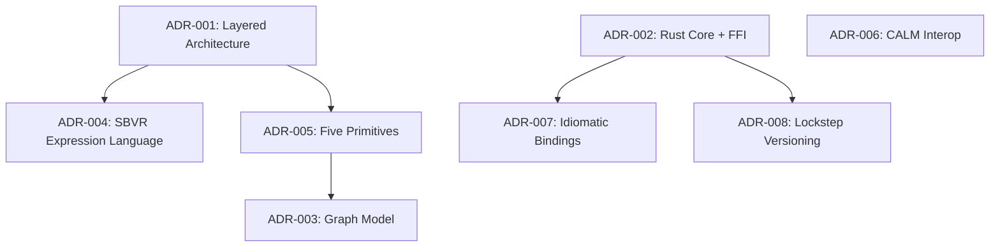
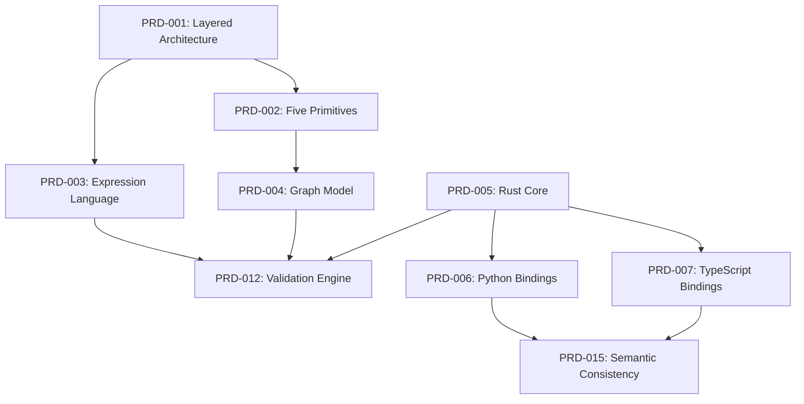

# Traceability Matrix

## Overview

This document provides bidirectional traceability between Architectural Decision Records (ADRs), Product Requirements (PRDs), Software Design Specifications (SDS), and Technical Specifications. It enables impact analysis, ensures requirements coverage, and supports compliance auditing.

---

## ADR → PRD Mapping

| ADR ID  | Decision Title                                  | Related PRD Items                          | Impact Description                                                                 |
|---------|------------------------------------------------|-------------------------------------------|------------------------------------------------------------------------------------|
| ADR-001 | Layered Architecture: Vocabulary, Facts, Rules | PRD-001, PRD-010                          | Enables modular model organization with clear dependency hierarchy                 |
| ADR-002 | Rust Core with Multi-Language FFI Bindings     | PRD-005, PRD-006, PRD-007, PRD-008, PRD-015, PRD-016 | Core technology choice enabling performance targets and multi-language support     |
| ADR-003 | Graph-Based Domain Model Representation        | PRD-004, PRD-012                          | Enables efficient traversal queries and policy evaluation over relationships       |
| ADR-004 | SBVR-Aligned Rule Expression Language          | PRD-003, PRD-012                          | Provides formal semantics for business rules with controlled natural language      |
| ADR-005 | Five Core Primitives Design Pattern           | PRD-002, PRD-009, PRD-011                 | Establishes universal modeling vocabulary aligned with ERP5 UBM                    |
| ADR-006 | CALM Interoperability for Architecture-as-Code | PRD-014                                   | Enables integration with FINOS architecture-as-code tooling (post-MVP)             |
| ADR-007 | Idiomatic Language-Specific Bindings           | PRD-006, PRD-007, PRD-008, PRD-015, PRD-017 | Ensures native developer experience in each language ecosystem                     |
| ADR-008 | Lockstep Versioning Strategy                   | PRD-016                                   | Simplifies version management and guarantees cross-language compatibility          |

---

## PRD → SDS Mapping

### Core Domain Model (MVP)

| PRD ID   | Requirement Title                    | Related SDS Items         | Implementation Status |
|----------|-------------------------------------|---------------------------|-----------------------|
| PRD-001  | Layered Domain Model Structure      | SDS-001, SDS-006          | Designed (MVP)        |
| PRD-002  | Five Universal Primitives           | SDS-002, SDS-003, SDS-004 | Designed (MVP)        |
| PRD-003  | SBVR-Aligned Expression Language    | SDS-006, SDS-007          | Designed (MVP)        |
| PRD-004  | Graph-Based Model Representation    | SDS-005                   | Designed (MVP)        |
| PRD-010  | Namespace and Import Support        | SDS-001                   | Designed (MVP)        |
| PRD-011  | Extensible Attributes and Relations | SDS-002, SDS-003, SDS-004 | Designed (MVP)        |

### Core Functionality (MVP)

| PRD ID   | Requirement Title                     | Related SDS Items | Implementation Status |
|----------|--------------------------------------|-------------------|-----------------------|
| PRD-012  | Policy Validation Engine             | SDS-006           | Designed (MVP)        |
| PRD-013  | Streaming Validation for Large Models| SDS-006           | Designed (MVP)        |

### Platform & Runtime (MVP)

| PRD ID   | Requirement Title                    | Related SDS Items | Implementation Status |
|----------|-------------------------------------|-------------------|-----------------------|
| PRD-005  | Rust Core Implementation            | SDS-008           | Designed (MVP)        |
| PRD-006  | Python FFI Bindings (PyO3)          | SDS-009           | Designed (MVP)        |
| PRD-007  | TypeScript/Node FFI Bindings (N-API)| SDS-010           | Designed (MVP)        |
| PRD-008  | WebAssembly Bindings (wit-bindgen)  | SDS-011           | Designed (MVP)        |

### Integration & Interoperability

| PRD ID   | Requirement Title                      | Related SDS Items | Implementation Status |
|----------|---------------------------------------|-------------------|-----------------------|
| PRD-009  | ERP5 UBM Alignment                    | SDS-012           | Designed (MVP)        |
| PRD-014  | CALM Interoperability (Post-MVP)      | SDS-013           | Designed (Post-MVP)   |

### Quality Attributes (MVP)

| PRD ID   | Requirement Title                       | Related SDS Items | Implementation Status |
|----------|-----------------------------------------|-------------------|-----------------------|
| PRD-015  | Cross-Language Semantic Consistency     | SDS-008, SDS-009, SDS-010, SDS-011 | Designed (MVP)        |
| PRD-016  | Lockstep Versioning and Release         | SDS-014           | Designed (MVP)        |
| PRD-017  | Rich Error Diagnostics                  | SDS-008, SDS-009, SDS-010 | Designed (MVP)        |
| PRD-018  | Performance Benchmarking Suite          | SDS-008           | Designed (MVP)        |
| PRD-019  | Documentation and Examples              | SDS-015           | Designed (MVP)        |

---

## SDS → Technical Specifications Mapping

### Component → Integration/Performance Specs

| SDS ID   | Component Name                        | Related Tech Specs                     | Coverage                                    |
|----------|--------------------------------------|----------------------------------------|---------------------------------------------|
| SDS-001  | Namespace and Import Resolution      | SEC-003 (Namespace Isolation)          | Security: Namespace scoping                 |
| SDS-002  | Entity Primitive Implementation      | PERF-003 (Memory Usage)                | Performance: Node storage efficiency        |
| SDS-003  | Resource Primitive Implementation    | PERF-003 (Memory Usage)                | Performance: Node storage efficiency        |
| SDS-004  | Flow Primitive Implementation        | PERF-004 (Graph Traversal)             | Performance: Upstream/downstream queries    |
| SDS-005  | Graph Data Structure and Indexes     | PERF-001, PERF-003, PERF-004           | Performance: All graph operations           |
| SDS-006  | Policy Evaluator and Expression Engine| PERF-001, SEC-002                     | Performance: Validation time; Security: DoS prevention |
| SDS-007  | SBVR Grammar Parser                  | None (foundational)                    | N/A                                         |
| SDS-008  | Rust Core API and Error Handling     | SEC-001, PERF-001, INT-001, INT-002, INT-003 | Security: Memory safety; Performance: Core runtime |
| SDS-009  | Python Bindings (PyO3)               | INT-001, PERF-002                      | Integration: Python FFI; Performance: FFI overhead |
| SDS-010  | TypeScript/Node Bindings (N-API)     | INT-002, PERF-002                      | Integration: TypeScript FFI; Performance: FFI overhead |
| SDS-011  | WebAssembly Bindings (wit-bindgen)   | INT-003                                | Integration: WASM runtime                   |
| SDS-012  | ERP5 UBM Migration Adapter           | INT-005                                | Integration: ERP5 migration                 |
| SDS-013  | CALM Serialization (Post-MVP)        | INT-004                                | Integration: CALM export                    |
| SDS-014  | Release Automation and CI/CD         | None (operational)                     | Operations: Multi-platform builds           |
| SDS-015  | Documentation Generation             | None (documentation)                   | N/A                                         |

---

## Comprehensive Requirements Coverage

### MVP Requirements Coverage

**Functional Requirements (MVP)**: 15 items

| Category                  | Count | Items                                                      | Coverage |
|---------------------------|-------|------------------------------------------------------------|----------|
| Core Domain Model         | 5     | PRD-001, PRD-002, PRD-003, PRD-004, PRD-010               | 100%     |
| Core Functionality        | 2     | PRD-012, PRD-013                                           | 100%     |
| Platform & Runtime        | 4     | PRD-005, PRD-006, PRD-007, PRD-008                        | 100%     |
| Integration               | 1     | PRD-009                                                    | 100%     |
| Extensibility             | 1     | PRD-011                                                    | 100%     |
| Quality Attributes        | 4     | PRD-015, PRD-016, PRD-017, PRD-018                        | 100%     |
| Documentation             | 1     | PRD-019                                                    | 100%     |

**Total MVP Requirements**: 18
**Covered by SDS**: 18
**Coverage**: 100%

### Post-MVP Requirements Coverage

| PRD ID   | Requirement Title             | Related SDS Items | Status      |
|----------|-------------------------------|-------------------|-------------|
| PRD-014  | CALM Interoperability         | SDS-013           | Designed    |

**Total Post-MVP Requirements**: 1
**Covered by SDS**: 1
**Coverage**: 100%

---

## MVP Scope Summary

### MVP ADRs

**Critical Path Decisions** (Must be implemented for MVP):

- **ADR-001**: Layered Architecture: Vocabulary, Facts, Rules
  - Rationale: Foundational separation of concerns
  - Blocks: Model organization, dependency management
  - Impact: ALL requirements depend on this structure

- **ADR-002**: Rust Core with Multi-Language FFI Bindings
  - Rationale: Performance and multi-platform support
  - Blocks: PRD-005, PRD-006, PRD-007, PRD-008
  - Impact: Core technology choice affecting all implementations

- **ADR-003**: Graph-Based Domain Model Representation
  - Rationale: Efficient queries and policy evaluation
  - Blocks: PRD-004, PRD-012
  - Impact: Data structure enabling <100ms validation target

- **ADR-004**: SBVR-Aligned Rule Expression Language
  - Rationale: Formal semantics for business rules
  - Blocks: PRD-003, PRD-012
  - Impact: Business analyst accessibility and rule correctness

- **ADR-005**: Five Core Primitives Design Pattern
  - Rationale: Universal modeling vocabulary
  - Blocks: PRD-002, PRD-009, PRD-011
  - Impact: Enables domain-independent modeling

- **ADR-007**: Idiomatic Language-Specific Bindings
  - Rationale: Developer experience in each ecosystem
  - Blocks: PRD-006, PRD-007, PRD-008
  - Impact: Adoption and ease of use

- **ADR-008**: Lockstep Versioning Strategy
  - Rationale: Simplified version management
  - Blocks: PRD-016
  - Impact: User clarity and bug reporting

### MVP Requirements (By Priority)

**Critical Priority** (Blockers for basic functionality):

1. **PRD-001**: Layered Domain Model Structure
2. **PRD-002**: Five Universal Primitives
3. **PRD-003**: SBVR-Aligned Expression Language
4. **PRD-004**: Graph-Based Model Representation
5. **PRD-005**: Rust Core Implementation
6. **PRD-012**: Policy Validation Engine
7. **PRD-015**: Cross-Language Semantic Consistency

**High Priority** (Essential for developer experience):

8. **PRD-006**: Python FFI Bindings
9. **PRD-007**: TypeScript/Node FFI Bindings
10. **PRD-009**: ERP5 UBM Alignment
11. **PRD-016**: Lockstep Versioning
12. **PRD-017**: Rich Error Diagnostics
13. **PRD-019**: Documentation and Examples

**Medium Priority** (Completes MVP feature set):

14. **PRD-008**: WebAssembly Bindings
15. **PRD-010**: Namespace and Import Support
16. **PRD-011**: Extensible Attributes and Relations
17. **PRD-013**: Streaming Validation
18. **PRD-018**: Performance Benchmarking Suite

### MVP Design Elements

**Core Components** (15 SDS items):

- SDS-001: Namespace and Import Resolution
- SDS-002: Entity Primitive Implementation
- SDS-003: Resource Primitive Implementation
- SDS-004: Flow Primitive Implementation
- SDS-005: Graph Data Structure and Indexes
- SDS-006: Policy Evaluator and Expression Engine
- SDS-007: SBVR Grammar Parser
- SDS-008: Rust Core API and Error Handling
- SDS-009: Python Bindings (PyO3)
- SDS-010: TypeScript/Node Bindings (N-API)
- SDS-011: WebAssembly Bindings (wit-bindgen)
- SDS-012: ERP5 UBM Migration Adapter
- SDS-014: Release Automation and CI/CD
- SDS-015: Documentation Generation

**Technical Specifications** (11 items):

- INT-001: Python FFI Integration
- INT-002: TypeScript/Node FFI Integration
- INT-003: WebAssembly Runtime Integration
- INT-005: ERP5 UBM Migration
- SEC-001: Memory Safety Guarantees
- SEC-002: Expression Evaluation Safety
- SEC-003: Namespace Isolation
- PERF-001: Validation Performance
- PERF-002: FFI Overhead
- PERF-003: Memory Usage
- PERF-004: Graph Traversal

### Post-MVP Items

**ADRs**:

- ADR-006: CALM Interoperability for Architecture-as-Code

**Requirements**:

- PRD-014: CALM Interoperability

**Design Elements**:

- SDS-013: CALM Serialization

**Technical Specifications**:

- INT-004: FINOS CALM Export

**Rationale for Post-MVP**:

- CALM integration enhances enterprise adoption but is not required for core functionality
- Allows MVP to focus on domain modeling and validation features
- CALM export can be added incrementally without architectural changes

---

## Unresolved Items

### Critical Unresolved

⚠️ **NONE** - All critical path items have finalized decisions

### Non-Critical Unresolved

⚠️ **Storage Adapters (SQL/RDF)** - Post-MVP feature mentioned in API specification but not specified in requirements

- **Impact**: Optional persistence; MVP uses in-memory models only
- **Recommendation**: Add PRD-020 for storage requirements in post-MVP planning
- **Blocks**: None (optional feature)

⚠️ **Parallel Policy Evaluation** - Mentioned as optimization but not specified

- **Impact**: Performance improvement for large policy sets
- **Recommendation**: Profile validation performance; add if needed to meet <100ms target
- **Blocks**: None (optimization, not required for correctness)

⚠️ **WASM Binary Size Optimization** - Target <500KB specified but optimization strategy undefined

- **Impact**: May affect edge deployment if target not met
- **Recommendation**: Measure actual size in implementation; use `wasm-opt` if needed
- **Blocks**: None (can be addressed post-MVP if target exceeded)

---

## Dependency Graph

### ADR Dependencies

### PRD Dependencies (Critical Path)

---

## Impact Analysis Matrix

### If ADR-002 (Rust Core) Changes

**Affected Requirements**:

- PRD-005: Rust Core Implementation (direct)
- PRD-006: Python FFI Bindings (FFI layer)
- PRD-007: TypeScript/Node FFI Bindings (FFI layer)
- PRD-008: WebAssembly Bindings (compilation target)
- PRD-015: Cross-Language Semantic Consistency (core behavior)
- PRD-016: Lockstep Versioning (build artifacts)

**Affected Design Elements**:

- SDS-008: Rust Core API (full redesign)
- SDS-009: Python Bindings (FFI interface)
- SDS-010: TypeScript/Node Bindings (FFI interface)
- SDS-011: WebAssembly Bindings (compilation)

**Risk**: **CRITICAL** - Core technology change affects entire system

### If ADR-003 (Graph Model) Changes

**Affected Requirements**:

- PRD-004: Graph-Based Model Representation (direct)
- PRD-012: Policy Validation Engine (evaluation substrate)

**Affected Design Elements**:

- SDS-005: Graph Data Structure (full redesign)
- SDS-006: Policy Evaluator (query interface)
- SDS-004: Flow Primitive (traversal methods)

**Risk**: **HIGH** - Major architectural change, but isolated to data layer

### If ADR-004 (SBVR Expression Language) Changes

**Affected Requirements**:

- PRD-003: SBVR-Aligned Expression Language (direct)
- PRD-012: Policy Validation Engine (evaluation logic)

**Affected Design Elements**:

- SDS-006: Policy Evaluator (expression semantics)
- SDS-007: SBVR Grammar Parser (parsing rules)

**Risk**: **HIGH** - Changes business rule semantics; requires business stakeholder approval

### If PRD-005 (Rust Core) Performance Target Changes

**Current Target**: <100ms validation for 10,000 nodes

**If Relaxed to <500ms**:

- Lower pressure on optimization
- May reduce Rust complexity
- Opens door to alternative implementations (Python core?)

**If Tightened to <50ms**:

- Requires aggressive optimization (parallel evaluation, memoization)
- May require specialized graph storage (e.g., external graph DB)
- Increases implementation risk

**Risk**: **MEDIUM** - Performance targets drive optimization strategy but don't change functionality

---

## Compliance and Audit Trail

### Standards Compliance

| Standard     | Related ADRs | Related PRDs | Compliance Mechanism                          |
|--------------|--------------|--------------|-----------------------------------------------|
| OMG SBVR     | ADR-001, ADR-004 | PRD-003      | Expression language and layered architecture  |
| ISO 24707    | ADR-004      | PRD-003      | SBVR semantics and modal logic                |
| FINOS CALM   | ADR-006      | PRD-014      | JSON export format (post-MVP)                 |
| ERP5 UBM     | ADR-005      | PRD-002, PRD-009 | Five primitives mapping to UBM concepts   |

### Audit Log References

All ADRs include audit log references in format `audit://adr-XXX/YYYY-MM-DD`

- ADR-001: `audit://adr-001/2025-10-31`
- ADR-002: `audit://adr-002/2025-10-31`
- ADR-003: `audit://adr-003/2025-10-31`
- ADR-004: `audit://adr-004/2025-10-31`
- ADR-005: `audit://adr-005/2025-10-31`
- ADR-006: `audit://adr-006/2025-10-31`
- ADR-007: `audit://adr-007/2025-10-31`
- ADR-008: `audit://adr-008/2025-10-31`

---

## Change Impact Template

When modifying any artifact (ADR, PRD, SDS, Tech Spec), use this checklist:

### Pre-Change Analysis

1. **Identify Artifact**: ADR/PRD/SDS/Tech Spec ID
2. **List Direct Dependencies**: Which items reference this artifact?
3. **List Transitive Dependencies**: What depends on the direct dependencies?
4. **Assess Scope**: MVP vs. Post-MVP
5. **Risk Level**: CRITICAL / HIGH / MEDIUM / LOW

### Change Documentation

1. **Update Source Artifact**: Modify ADR/PRD/SDS/Tech Spec
2. **Update Traceability Matrix**: Reflect new relationships
3. **Update Audit Logs**: Add revision entry with rationale
4. **Notify Stakeholders**: For CRITICAL/HIGH changes

### Post-Change Validation

1. **Verify Coverage**: All dependencies still satisfied?
2. **Run Tests**: Affected test suites pass?
3. **Update Documentation**: API docs, examples, migration guides
4. **Update Version**: Bump version if breaking change (per ADR-008)

---

## Summary Statistics

**Total Architectural Decisions**: 8 (7 MVP, 1 Post-MVP)
**Total Requirements**: 19 (18 MVP, 1 Post-MVP)
**Total Design Elements**: 15 SDS items (14 MVP, 1 Post-MVP)
**Total Technical Specifications**: 14 items (13 MVP, 1 Post-MVP)

**Coverage Metrics**:

- ADR → PRD Coverage: 100% (all ADRs traced to requirements)
- PRD → SDS Coverage: 100% (all requirements have design elements)
- SDS → Tech Spec Coverage: 93% (14/15 components have technical specs; SDS-007 and SDS-015 are foundational/doc-only)

**Unresolved Items**: 3 (all non-critical, post-MVP scope)

**MVP Readiness**: All critical path items defined with full traceability
