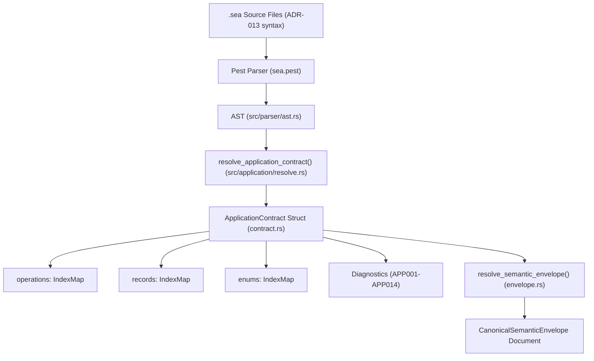

# Subsystem: Application Contracts & Operations (ADR-013)

The Application Contracts subsystem formalizes executable service boundaries. It equips the SEA DSL with typed entity state schemas, operation declarations, records, enums, idempotency constraints, and canonical semantic envelopes.

---

## 1. Purpose & Responsibilities

### Purpose
Before ADR-013, SEA models could describe flows and high-level policies, but lacked formal constructs for operational interfaces (input payloads, return types, concurrency models, error responses, and aggregate state schemas). Downstream code generators had to infer or guess these boundaries.

The Application Contract subsystem provides an unambiguous, machine-checkable operational specification that drives production DDD/CQRS domain code generation and API specification generation without guesswork.

### Responsibilities
- **Typed Entity State Bodies**: Enforces that entities can declare typed internal state fields with exactly one primary `key`.
- **Identityless Records**: Declares reusable data transfer structures (`record`) for operation inputs, outputs, and failure details.
- **Closed Enums**: Defines typed enumerations (`enum`) with explicit string values.
- **First-Class Operations**: Binds operation ID, intent, direction (`inbound`, `outbound`, `internal`), actor, access policies, state target, effect (`creates`, `mutates`, `reads`), transactional scope, canonical failures, idempotency, concurrency, and lifecycle into one contract.
- **Canonical Semantic Envelopes**: Bundles resolved application contracts, semantic pack closures, input fingerprints, and source hashes into a tamper-evident document.

### Non-Responsibilities
- **Transport Wire Implementation**: Application contracts specify interface contracts; they do not implement HTTP server routing or gRPC connection pools.

---

## 2. Position in the System



---

## 3. Core Abstractions

| Symbol | File | Responsibility |
|---|---|---|
| `ApplicationContract` | `domainforge-core/src/application/contract.rs` | Top-level contract holding resolved operations, records, enums, and entity schemas. |
| `OperationContract` | `domainforge-core/src/application/contract.rs` | Specification of an individual operation (actor, input, output, state effect, transaction, concurrency). |
| `RecordContract` | `domainforge-core/src/application/contract.rs` | Typed data structure with field constraints (`min_length`, `max`, `pattern`). |
| `EnumContract` | `domainforge-core/src/application/contract.rs` | Closed enumeration mapping variant names to string values. |
| `CanonicalSemanticEnvelope` | `domainforge-core/src/application/envelope.rs` | Sealed document containing resolved contract, pack closure, and cryptographic hashes. |
| `ApplicationDiagnostic` | `domainforge-core/src/application/diagnostic.rs` | Structured diagnostic errors with codes `APP001` through `APP014`. |

---

## 4. Example Operation Declaration

```sea
record CreateOrderRequest {
  customer_id: uuid,
  total_amount: quantity<Currency.USD>(min 0),
  items: list<string>(min_items 1)
}

record OrderResponse {
  order_id: uuid,
  status: string
}

operation CreateOrder {
  intent "Place a new customer order"
  direction inbound
  actor "Customer"
  access public
  input CreateOrderRequest
  output OrderResponse
  state "Order"
  effect creates "Order"
  transaction single_aggregate
  idempotency keyed_by order_id
  concurrency unique_key order_id
  failure InvalidOrder for input_validation "Invalid order items"
  evidence operation_trace
  lifecycle synchronous_request_response
}
```

---

## 5. Diagnostic Codes (APP001 – APP014)

| Diagnostic Code | Condition |
|---|---|
| `APP001` | Entity state body is missing a designated `key` field or has multiple keys. |
| `APP002` | Undefined symbol reference in field type or constraint. |
| `APP003` | Operation declares invalid or conflicting effect kind. |
| `APP004` | Operation input or output references an entity instead of a `record`. |
| `APP005` | Missing or invalid idempotency clause for non-read-only operation. |
| `APP006` | Concurrency strategy incompatible with declared transaction boundary. |
| `APP014` | Transitive import cycle or unexported symbol collision detected. |

---

## 6. Canonical Semantic Envelope & CEP Emission

`domainforge envelope` provides dual emission modes to support both internal compiler verification and external CEP-0008 integration:

### 1. Canonical Semantic Document ($D$) — `--emit representation` (Default)
Emits the pure, byte-level canonical semantic document ($D$) schema `domainforge-semantic-envelope/v1`:
- `schema_version`: Document schema version (`domainforge-semantic-envelope/v1`).
- `self_hash`: Tamper-evident SHA-256 digest over the entire canonical document excluding `self_hash`.
- `semantic_closure_hash`: Digest over transitive symbol declarations, concept references, and import edges.
- `inputs`: `source_set_hash`, `semantic_pack_set_hash`, `language_schema_version`, and `interpretation_version`.
- `envelope`: Complete serialized application declarations, symbol tables, and operation contracts.

### 2. CEP-0008 Canonical Full Profile — `--emit cep`
Synthesizes a schema-valid CEP-0008 envelope carrying:
- `boundary_record`: Explicit declaration of included sections and known omissions.
- `representations`: Inlines the verified representation document $D$, or omits it when unavailable.
- `omissions`: Explicit `OmissionRecord` (`omission_type: "representation_unavailable"`) whenever model validation fails (F-03).
- `extensions.domainforge`: Preserves `model_validation_status` (`valid` or `invalid`), `invalid_declared_checkpoint_hash`, diagnostics, and `semantics_version`.
- `conformance_status`: Emits `conformant` even when model declarations are invalid, provided the envelope itself conforms to the CEP wire contract.

### 3. Typed Model Identity (`DomainModelIdentity`)
Provides cryptographic identity over the canonical 10-tuple:
- `identity_scheme_version` (`v2-full-preimage`), `producer`, `producer_version`, `language_schema_version`, `compiler_interpretation_version`, `canonicalization_version`, `source_set_hash`, `content_hash`, `semantic_closure_hash`, and optional `registry_content_hash`.
- Computed via `DomainModelIdentity::canonical_digest()`.

---

## Source Trail
- `domainforge-core/src/application/contract.rs` — Contract, Operation, Record, and Enum structs
- `domainforge-core/src/application/resolve.rs` — Application contract resolution logic
- `domainforge-core/src/application/envelope.rs` — CanonicalSemanticEnvelope, CEP builders, and DomainModelIdentity
- `domainforge-core/src/application/verification_contract.rs` — Source-set verification and contract invariants
- `domainforge-core/src/application/diagnostic.rs` — Diagnostic error definitions (`APP001`–`APP014`)
- `domainforge-core/src/cli/envelope.rs` — CLI envelope runner with `--emit`, `--capabilities`, and `--pack`
- `domainforge-core/tests/application_contract_tests.rs` — Contract resolution test suite
- `domainforge-core/tests/envelope_emit_tests.rs` — Emission modes, golden fixtures, and failure synthesis tests
- `docs/specs/ADR-013-sea-application-contract.md` — Formal architectural decision record
