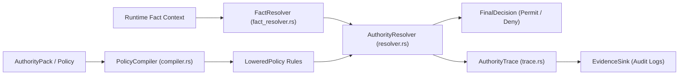

# Subsystem: Authority Engine

The Authority Engine evaluates high-level governance and access policies against runtime facts, emitting structured, cryptographically auditable evidence traces.

---

## 1. Purpose & Responsibilities

### Purpose
To bridge the gap between static architecture models and runtime compliance enforcement. While the Policy Engine checks that models are structurally valid, the Authority Engine verifies whether specific real-world events or operations are authorized given a set of runtime evidence facts.

### Responsibilities
- **Fact Resolution**: Extracts and normalizes contextual facts from input events or registered sources via `FactResolver`.
- **Policy Lowering & Auditing**: Compiles high-level SEA policy expressions into executable lowered evaluation rules (`LoweredPolicy`).
- **Decision Resolution**: Reaches a definitive `FinalDecision` (`Permit`, `Deny`, `Indeterminate`) based on policy modality, claim levels, and overrides.
- **Evidence Trace Emission**: Generates structured, tamper-evident audit traces (`AuthorityTrace`) documenting every fact examined and rule evaluated.

### Non-Responsibilities
- **Network Enforcement**: The engine produces authorization decisions and evidence; network proxies (Envoy, API gateways) execute the resulting block/permit action.

---

## 2. Position in the System

---

## 3. Core Abstractions

| Symbol | File | Responsibility |
|---|---|---|
| `AuthorityEnvironment` | `domainforge-core/src/authority/environment.rs` | Execution context configuring active authority policies, fact sources, and trace sinks. |
| `PolicyCompiler` | `domainforge-core/src/authority/compiler.rs` | Compiles SEA policies into lowered decision trees with explicit fact requirements. |
| `FactResolver` | `domainforge-core/src/authority/fact_resolver.rs` | Queries contextual sources (payloads, headers, external state) to satisfy fact requirements. |
| `AuthorityResolver` | `domainforge-core/src/authority/resolver.rs` | Evaluates lowered policies against resolved facts to compute the `FinalDecision`. |
| `AuthorityTrace` | `domainforge-core/src/authority/trace.rs` | Comprehensive audit trail containing evaluated rules, resolved facts, and intermediate verdicts. |

---

## 4. Internal Operation: From Fact to Decision

1. **Policy Lowering**: The `PolicyCompiler` converts a policy into a `LoweredPolicy`, extracting:
   - Structural predicates (actor role, resource type, flow direction)
   - Condition predicates (thresholds, temporal constraints)
   - Raw fact requirements (list of field paths required from runtime context)
2. **Fact Resolution**: When an operation arrives, the `FactResolver` populates required facts from the incoming context. If a required fact cannot be resolved, the fact resolution status becomes `MissingFact`.
3. **Evaluation**:
   - If conditions match and modality is `Obligation`, evaluates whether the obligation is satisfied.
   - If an override rule applies (e.g. emergency break-glass), the override supersedes standard rules.
4. **Trace Recording**: The `AuthorityTraceEmitter` records every evaluation step, creating a machine-readable JSON log that compliance auditors can verify independently.

---

## 5. Failure Modes

| Observable Symptom | Cause | Resolution |
|---|---|---|
| Decision is `Indeterminate` | A required runtime fact could not be resolved by `FactResolver`. | Provide the missing fact in the evaluation context payload. |
| Policy lowering failure | SEA policy expression contains unsupported runtime functions. | Run `CompatibilityLoweringAuditor` to check expression support. |
| Decision is `Deny` | One or more obligation conditions evaluated to `False`. | Inspect `AuthorityTrace` to identify the failing predicate. |

---

## Source Trail
- `domainforge-core/src/authority/mod.rs` — Subsystem facade and exports
- `domainforge-core/src/authority/compiler.rs` — Policy compiler and lowering auditor
- `domainforge-core/src/authority/resolver.rs` — Authority decision engine
- `domainforge-core/src/authority/fact_resolver.rs` — Fact resolution registry
- `domainforge-core/src/authority/trace.rs` — Audit trace data structures and emitter
- `domainforge-core/src/authority/types.rs` — FinalDecision, ClaimLevel, Modality types
- `domainforge-core/tests/authority_conformance_tests.rs` — Verification test suite
