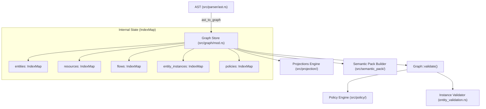

# Subsystem: Graph Store

The Graph Store is the central in-memory relational database and state holder for DomainForge. It stores validated entities, resources, flows, instances, relations, and policies, providing fast, deterministic lookups and traversal.

---

## 1. Purpose & Responsibilities

### Purpose
To act as the canonical, authoritative, in-memory repository of domain meaning. It links isolated AST declarations into a coherent semantic web where every reference is resolved to an immutable, content-addressed `ConceptId`.

### Responsibilities
- **In-Memory Collection Management**: Stores entities, roles, resources, flows, relations, instances, policies, patterns, and contracts in `IndexMap` collections.
- **Reference Resolution**: Resolves textual names and namespaces into canonical `ConceptId` keys.
- **Deterministic Storage Invariant**: Guarantees byte-for-byte reproducibility by preserving insertion order across all internal collections.
- **Entity Instance Validation**: Enforces schema contracts, scalar constraints, and enum member validity across declared `Instance` records.
- **Graph-Wide Validation Orchestration**: Executes policy evaluation and instance validation via `Graph::validate()`.

### Non-Responsibilities
- **Persistence to Disk**: The graph does not write to a database or filesystem directly; that is handled by external serializers, the CLI, or projection sinks.
- **Host Runtime Integration**: The graph is pure Rust; it does not know about Python or Node.js runtimes.

---

## 2. Position in the System



---

## 3. Core Abstractions

| Symbol | File | Responsibility |
|---|---|---|
| `Graph` | `domainforge-core/src/graph/mod.rs` | Central struct containing all entity, resource, flow, and policy collections. |
| `GraphConfig` | `domainforge-core/src/graph/mod.rs` | Configuration flags controlling evaluation behavior (e.g., `use_three_valued_logic`). |
| `ConceptId` | `domainforge-core/src/concept_id.rs` | Deterministic UUID v5 content address calculated from namespace + name. |
| `EntityContract` | `domainforge-core/src/application/contract.rs` | Type schema and field constraints for an entity's internal state. |
| `ValidationResult` | `domainforge-core/src/validation_result.rs` | Result container holding evaluated policy count and list of `Violation` records. |

---

## 4. Internal Operation & Determinism Guarantee

### The Non-Negotiable `IndexMap` Invariant
In the Rust standard library, `std::collections::HashMap` uses a randomized hash seed (SipHash) for DoS resistance. Iterating over a `HashMap` yields elements in arbitrary, non-deterministic order. If DomainForge used `HashMap`, generating an RDF graph, BPMN XML file, or domain code package would emit elements in different orders on each run, destroying reproducibility and breaking Git diffs.

Therefore, **`std::collections::HashMap` is strictly banned for all graph-stored collections**. All collections use `indexmap::IndexMap`, which preserves the exact declaration and insertion order.

### ConceptId Minting
A `ConceptId` is computed using UUID v5 (SHA-1 namespace hashing) with the standard DNS UUID:
```rust
let namespace_uuid = Uuid::parse_str("6ba7b810-9dad-11d1-80b4-00c04fd430c8").unwrap();
let data = format!("{}::{}", namespace, name);
let uuid = Uuid::new_v5(&namespace_uuid, data.as_bytes());
ConceptId(uuid)
```
This guarantees that two separate compilations of the same model produce identical 128-bit identifiers, regardless of machine architecture or operating system.

---

## 5. State Ownership & Invalidation Lifecycle

```mermaid
stateDiagram-v2
    [*] --> Uninitialized
    Uninitialized --> Ingesting: Graph::new() + add_entity() / add_flow()
    Ingesting --> Frozen: Ingestion Complete
    Frozen --> Validating: Graph::validate()
    Validating --> Validated: ValidationResult (0 Errors)
    Validating --> Rejected: ValidationResult (Errors Present)
    Validated --> Projecting: emit(graph, &mut sink)
```

1. **Ingestion**: AST declarations are inserted sequentially. Duplicate names within a category and namespace are rejected immediately with `E007_DuplicateDeclaration`.
2. **Instance Validation**: `validate_entity_instances()` checks all fields of every `Instance` against its entity's contract (type matching, mandatory field presence, scalar range bounds, regex patterns).
3. **Policy Evaluation**: `validate()` runs all policies against graph collections. Policies bound to specific operations (ADR-013) are excluded from the bare graph check and verified in their operation context instead.

---

## 6. Failure Modes

| Error Code | Symptom | Cause | Resolution |
|---|---|---|---|
| `E001_UndefinedEntity` | Validation error during flow or instance insertion. | Referenced entity `ConceptId` does not exist in `entities` map. | Define the entity before referencing it; check namespace. |
| `E002_UndefinedResource` | Flow references unknown resource. | Resource `ConceptId` not present in `resources` map. | Declare the resource with its unit in the model. |
| `E007_DuplicateDeclaration` | Model insertion rejected with error. | Two entities, resources, or policies share the same name in the same namespace. | Rename one of the conflicting declarations. |
| `entity_instance_schema` | Instance validation failure. | Instance field fails type check, violates min/max constraint, or references missing key. | Correct instance field values in source `.sea` file. |

---

## Source Trail
- `domainforge-core/src/graph/mod.rs` — Core `Graph` struct and public API
- `domainforge-core/src/graph/entity_validation.rs` — Entity instance schema verification
- `domainforge-core/src/concept_id.rs` — `ConceptId` UUID v5 content addressing
- `domainforge-core/src/validation_result.rs` — `ValidationResult` and `Violation` structures
- `domainforge-core/tests/graph_tests.rs` — Graph insertion and reference tests
- `domainforge-core/tests/phase_14_determinism_tests.rs` — Deterministic order verification
