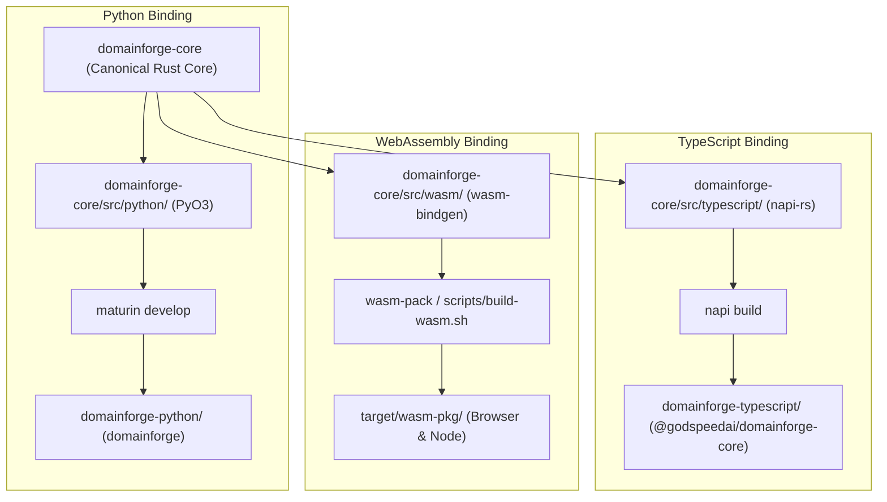

# Subsystem: Language Bindings Architecture

DomainForge exposes its Rust core to Python, TypeScript, and WebAssembly through native FFI bindings. The fundamental invariant is that **the Rust core is authoritative**: foreign language wrappers contain zero business logic.

---

## 1. Purpose & Responsibilities

### Purpose
To enable developers to use DomainForge seamlessly in their native development ecosystems (Python data pipelines, Node.js/TypeScript backend services, and interactive browser web apps) while guaranteeing 100% behavioral parity with the central Rust engine.

### Responsibilities
- **Type Marshalling**: Converts host language types (Python dictionaries, JS objects) into Rust primitives and vice-versa.
- **Memory Safety Across FFI**: Safely manages pointers and references crossing language boundaries without leaks or double-frees.
- **Zero-Logic Duplication**: Delegates all validation, graph mutations, and policy evaluation directly to the Rust core.
- **Cross-Language Parity**: Ensures that a model rejected by Rust CLI validation is identically rejected in Python, TypeScript, and WASM.

### Non-Responsibilities
- **Independent Business Logic**: Bindings never implement independent parsing or validation rules.

---

## 2. Binding Technologies & Topography

---

## 3. Technology Details

### 1. Python (`domainforge-python`)
- **Technology**: [PyO3](https://pyo3.rs/) v0.29 + `pythonize`.
- **Packaging**: Managed with [maturin](https://www.maturin.rs/) via `domainforge-python/pyproject.toml`.
- **API Surface**:
  - `Entity`, `Resource`, `Flow`, `Instance`, `Graph`
  - `evaluate_authority()`
  - Semantic pack functions: `build_semantic_pack()`, `validate_semantic_pack()`, `sign_pack()`, `diff_packs()`
- **Build Command**: `just python-setup`

### 2. TypeScript (`domainforge-typescript`)
- **Technology**: [napi-rs](https://napi.rs/) v2.16 (Node-API).
- **Packaging**: `domainforge-typescript/package.json`.
- **Runtime**: Works identically in Node.js and Bun.
- **API Surface**: Strongly typed TypeScript class wrappers mirroring Rust core structs.
- **Build Command**: `just bun-install && cd domainforge-typescript && bun run build`

### 3. WebAssembly (`wasm`)
- **Technology**: [wasm-bindgen](https://rustwasm.github.io/docs/wasm-bindgen/) + `serde-wasm-bindgen`.
- **Allocator**: Uses `lol_alloc` on `wasm32` targets to keep bundle size small.
- **API Surface**: `WasmGraph`, in-memory parsing, policy evaluation, and formatting functions.
- **Size Gate**: WASM bundle is gated to < 2.5 MB. Full projection export is excluded by default from the browser bundle (accessible via optional `--features wasm-projections`).

---

## 4. Cross-Binding Modification Rule (Non-Negotiable)

When you modify any domain primitive in `domainforge-core/src/primitives/*.rs`, you **must** update all four locations in lockstep:

1. Rust Core: `domainforge-core/src/primitives/` + tests
2. Python Bindings: `domainforge-core/src/python/primitives.rs` + tests in `tests/test_*.py`
3. TypeScript Bindings: `domainforge-core/src/typescript/primitives.rs` + tests in `typescript-tests/*.test.ts`
4. WASM Bindings: `domainforge-core/src/wasm/primitives.rs` + `tests/wasm_tests.rs`

Run `just all-tests` to verify that all three test suites pass before committing.

---

## 5. Failure Modes

| Symptom | Cause | Resolution |
|---|---|---|
| `ImportError: cannot import name 'domainforge'` | Python extension not compiled into active virtualenv. | Run `just python-setup` to recompile maturin extension. |
| `Cannot find module '@godspeedai/domainforge-core'` | Native `.node` binary missing in TypeScript package. | Run `bun run build` in `domainforge-typescript/`. |
| WASM memory panic | Passing non-serializable JavaScript objects across wasm boundary. | Ensure inputs conform to `serde-wasm-bindgen` schema. |

---

## Source Trail
- `domainforge-core/src/python/` — PyO3 module definition and class bindings
- `domainforge-core/src/typescript/` — napi-rs class wrappers and functions
- `domainforge-core/src/wasm/` — wasm-bindgen exports and WASM allocator
- `tests/` — Python integration test suite
- `typescript-tests/` — TypeScript Vitest test suite
- `domainforge-core/tests/wasm_tests.rs` — WASM integration tests
