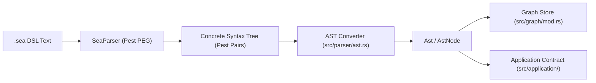

# Subsystem: Parser & Grammar

The Parser & Grammar subsystem is the ingestion front-end of DomainForge. It transforms human-authored SEA DSL source text into strongly typed, position-preserving Abstract Syntax Tree (AST) structures.

---

## 1. Purpose & Responsibilities

### Purpose
To provide an unambiguous, formally specified parsing expression grammar (PEG) for enterprise architecture and compile raw DSL text into an AST that captures all authored intent, comments, annotations, and exact source spans.

### Responsibilities
- **Grammar Authority**: Maintain the canonical syntax definition in `grammar/sea.pest`.
- **Lexical & Syntactic Analysis**: Parse text into concrete syntax tokens using [Pest](https://pest.rs/).
- **AST Generation**: Convert CST token pairs into strongly typed Rust AST structs (`AstNode`).
- **Source Range Tracking**: Preserve exact 1-indexed line and column spans for every identifier, expression, and declaration to enable compiler-grade diagnostics.
- **Module & Import Syntax**: Parse file headers, `@namespace` metadata, and import declarations (`import { A, B as C } from "file.sea"`).

### Non-Responsibilities
- **Semantic Resolution**: The parser does not verify whether an entity referenced in a flow actually exists; that is owned by the [Graph Store](graph-store.md) and [Module Resolver](graph-store.md).
- **Policy Evaluation**: The parser only constructs the expression tree; it does not evaluate policies.

---

## 2. Position in the System



The parser is invoked directly by CLI subcommands (`parse`, `validate`, `project`, `format`) and language binding entry points (`parse_to_graph`).

---

## 3. Core Abstractions

| Symbol | File | Role |
|---|---|---|
| `SeaParser` | `domainforge-core/src/parser/mod.rs` | Pest-derived parser generated from `sea.pest`. |
| `Rule` | Generated by `pest_derive` | Enum of every grammar rule defined in `sea.pest`. |
| `Ast` | `domainforge-core/src/parser/ast.rs` | Top-level container holding file `metadata` and a `Vec<Declaration>`. |
| `AstNode` | `domainforge-core/src/parser/ast.rs` | Enum representing declarations (`Entity`, `Resource`, `Flow`, `Policy`, `Record`, etc.). |
| `Expression` | `domainforge-core/src/parser/ast.rs` | Recursive AST enum representing policy conditions, quantifiers, and arithmetic. |
| `SourceRange` | `domainforge-core/src/validation_error.rs` | 1-indexed `start` and `end` `Position` (line and column). |
| `PrettyPrinter` | `domainforge-core/src/parser/printer.rs` | Canonical formatter reconstructing normalized SEA DSL text from an AST. |

---

## 4. Internal Operation & Grammar Architecture

The grammar (`sea.pest`) is structured hierarchically:

1. **Top-Level Program**:
   ```pest
   program = { SOI ~ file_header? ~ declaration* ~ EOI }
   file_header = { annotation* ~ import_decl* }
   ```
2. **Contextual Lookahead Guards**:
   To allow modern keywords like `record`, `enum`, and `operation` (introduced in ADR-013) without breaking legacy identifier positions, the grammar uses negative lookahead guards (`application_decl_prefix` and `declaration_keyword`):
   ```pest
   declaration_keyword = @{
       (^"entity" | ^"resource" | ^"flow" | ^"policy" | ^"instance" | ...) ~ !(LETTER | NUMBER | "_")
   }
   ```
3. **Expression Precedence Climbing**:
   Policy expressions are parsed with strict operator precedence:
   - Level 1: `or` (logical disjunction)
   - Level 2: `and` (logical conjunction)
   - Level 3: `not` (logical negation)
   - Level 4: Comparison (`=`, `!=`, `<`, `<=`, `>`, `>=`, `matches`, `before`, `after`)
   - Level 5: Additive (`+`, `-`)
   - Level 6: Multiplicative (`*`, `/`)
   - Level 7: Unary negation and type casts (`as "USD"`)
   - Level 8: Primary expressions (literals, quantifiers, aggregations, member access)

---

## 5. Failure Modes

| Symptom | Cause | Subsystem Diagnosis | Recovery Action |
|---|---|---|---|
| `ParseError::PestError` | Unterminated string, missing bracket, or unexpected token. | Pest highlights line and column of parsing failure. | Check syntax around reported line; ensure keywords are spelled correctly. |
| `E005_SyntaxError` | Syntax does not conform to `sea.pest` PEG rules. | Emits line and column span. | Check language grammar specification. |
| Profile Warning | Declaration violates active profile constraints. | `ParseOptions::active_profile` checks AST nodes. | Adjust model or pass `--tolerate-profile-warnings`. |

---

## 6. Extension Points (Grammar-First Workflow)

When extending the language with new syntax, you **must** follow the 5-step grammar-first process:
1. Edit `domainforge-core/grammar/sea.pest` to declare the new syntax rules.
2. Update `domainforge-core/src/parser/ast.rs` to represent the node in `AstNode`.
3. Update `domainforge-core/src/parser/ast_convert.rs` to lower the AST into `Graph` primitives.
4. Add parser tests in `domainforge-core/tests/parser_tests.rs`.
5. Update pretty printer in `domainforge-core/src/parser/printer.rs`.

---

## Source Trail
- `domainforge-core/grammar/sea.pest` — Authoritative PEG grammar
- `domainforge-core/src/parser/mod.rs` — Parser facade and entry functions
- `domainforge-core/src/parser/ast.rs` — Complete AST struct and enum definitions
- `domainforge-core/src/parser/ast_convert.rs` — AST-to-Graph conversion logic
- `domainforge-core/src/parser/printer.rs` — PrettyPrinter and formatter implementation
- `domainforge-core/tests/parser_tests.rs` — Syntax test suite
