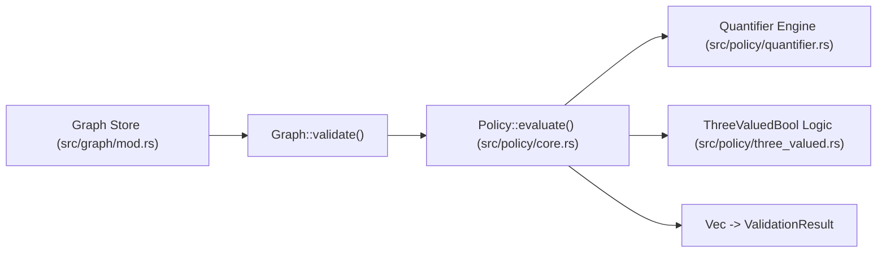

# Subsystem: Policy Engine

The Policy Engine evaluates business rules, regulatory obligations, and structural constraints over the in-memory semantic graph using SQL-like Kleene three-valued logic.

---

## 1. Purpose & Responsibilities

### Purpose
To provide executable, mathematically sound verification of organizational rules. Rather than leaving policies as inert documentation or informal team memory, the policy engine evaluates constraints over domain entities, resources, flows, and instances at compile time and in CI pipelines.

### Responsibilities
- **Three-Valued Evaluation**: Evaluates logical expressions returning `ThreeValuedBool::True`, `ThreeValuedBool::False`, or `ThreeValuedBool::Null`.
- **Collection Quantification**: Evaluates `forall`, `exists`, and `exists_unique` across collections (`flows`, `entities`, `resources`, `instances`, `entity_instances`).
- **Aggregation Functions**: Computes `count()`, `sum()`, `min()`, `max()`, and `avg()` over collections with optional `where` filters and time windows.
- **Expression Normalization**: Normalizes expressions into simplified forms to remove redundant conjunctions/disjunctions.
- **Violation Reporting**: Emits structured `Violation` objects carrying policy names, rationale, and severity (`Error`, `Warning`, `Info`).

### Non-Responsibilities
- **Enforcement Action**: The policy engine does not abort runtime network packets or block database writes directly; it yields diagnostics and validation results for host applications to act on.

---

## 2. Position in the System

---

## 3. Core Abstractions

| Symbol | File | Responsibility |
|---|---|---|
| `Policy` | `domainforge-core/src/policy/core.rs` | Struct representing a declared policy with its kind, modality, priority, and expression AST. |
| `ThreeValuedBool` | `domainforge-core/src/policy/three_valued.rs` | Enum representing Kleene three-valued truth: `True`, `False`, and `Null`. |
| `PolicyModality` | `domainforge-core/src/policy/core.rs` | Normative stance: `Obligation` (must be), `Prohibition` (must not be), `Permission` (may be). |
| `PolicyKind` | `domainforge-core/src/policy/core.rs` | Categorization: `Constraint`, `Derivation`, `Obligation`. |
| `Violation` | `domainforge-core/src/policy/violation.rs` | Record of a failed policy evaluation with message, rule name, and severity. |

---

## 4. Internal Operation & Kleene Truth Algebra

Policy evaluation operates over `ThreeValuedBool`. The algebraic operations follow Kleene three-valued logic:

### Conjunction (`and`)
| A | B | A and B |
|---|---|---|
| True | True | **True** |
| True | False | **False** |
| True | Null | **Null** |
| False | Anything | **False** (short-circuits) |
| Null | Null | **Null** |

### Disjunction (`or`)
| A | B | A or B |
|---|---|---|
| True | Anything | **True** (short-circuits) |
| False | False | **False** |
| False | Null | **Null** |
| Null | Null | **Null** |

### Negation (`not`)
- `not True` $\rightarrow$ `False`
- `not False` $\rightarrow$ `True`
- `not Null` $\rightarrow$ `Null`

### Quantifier Evaluation over Collections
- **`forall x in Collection: (condition)`**: Folds conditions using `and`. If any item evaluates to `False`, the entire quantifier returns `False` immediately. If all evaluate to `True`, returns `True`. If some items return `Null` and none return `False`, returns `Null`.
- **`exists x in Collection: (condition)`**: Folds conditions using `or`. If any item evaluates to `True`, returns `True` immediately.
- **`exists_unique x in Collection: (condition)`**: Returns `True` if exactly one element evaluates to `True` and no elements evaluate to `Null` that could alter the outcome.

---

## 5. Expression Normalization

The `normalize` module (`domainforge-core/src/policy/normalize.rs`) applies algebraic rewrite rules to simplify expressions before evaluation:
- Double negation elimination: `not (not A)` $\rightarrow$ `A`
- Identity laws: `A and true` $\rightarrow$ `A`, `A or false` $\rightarrow$ `A`
- Annihilation laws: `A and false` $\rightarrow$ `false`, `A or true` $\rightarrow$ `true`
- De Morgan's laws: `not (A and B)` $\rightarrow$ `(not A) or (not B)`

CLI command `domainforge normalize "not (not (x > 5))"` executes this module and prints the normalized AST.

---

## 6. Failure Modes

| Observable Symptom | Cause | Diagnostic Strategy |
|---|---|---|
| Validation fails with `Severity::Error` | Expression evaluated to `False` against graph state. | Inspect `violation.message` for the failing constraint expression and current values. |
| Evaluation yields `Unknown` | An attribute or relationship was missing (`Null`). | Run with `--allow-unknown` to accept incomplete models, or populate the missing field. |
| Policy evaluation panic or crash | Type inference mismatch in unvalidated expression. | Check `tests/policy_tests.rs` for expression type rules. |

---

## Source Trail
- `domainforge-core/src/policy/core.rs` — Policy struct and evaluation implementation
- `domainforge-core/src/policy/three_valued.rs` — `ThreeValuedBool` Kleene truth operators
- `domainforge-core/src/policy/quantifier.rs` — `forall`, `exists`, `exists_unique` logic
- `domainforge-core/src/policy/normalize.rs` — Expression AST simplifier
- `domainforge-core/tests/policy_tests.rs` — Integration test suite
- `domainforge-core/tests/three_valued_quantifiers_tests.rs` — Truth table tests
