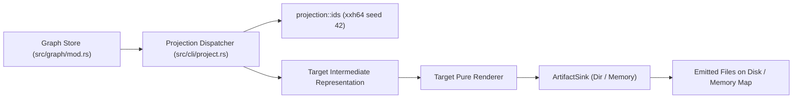

# Subsystem: Projections Engine & Operator Families

The Projections Engine compiles the canonical in-memory semantic graph into external formats across 17+ ecosystems following the **Operator Family Pattern** ([ADR-011](../specs/ADR-011-operator-backed-projection-families.md)).

---

## 1. Purpose & Responsibilities

### Purpose
To translate abstract enterprise architecture models into concrete, executable artifacts without human transcription errors. Rather than treating external formats as ad-hoc text dumps, the projections engine models each external toolchain as an **operator family** that operates over a mathematically sound semantic projection.

### Responsibilities
- **Projection Dispatch**: Routes CLI `--format` requests to the appropriate operator family renderer.
- **Deterministic ID Minting**: Mints uniform, collision-free element identifiers and QNames across all targets via `projection::ids`.
- **Path-Safe Artifact Emission**: Routes all file writes through `ArtifactSink`, enforcing directory containment and preventing path traversal.
- **Byte-Level Determinism**: Ensures identical inputs with a pinned `--created-at` timestamp generate byte-identical output files across runs.
- **Decoupled Architecture**: Keeps renderers completely pure; projection targets never mutate graph state.

### Non-Responsibilities
- **Runtime Execution**: The projection engine generates target artifacts (such as Python packages or BPMN XML); it does not run the Python interpreter or execute the BPMN process engine.

---

## 2. Position in the System



---

## 3. Core Abstractions

| Symbol | File | Responsibility |
|---|---|---|
| `ArtifactSink` | `domainforge-core/src/projection/sink.rs` | Abstraction over directory writes (`Dir`) and in-memory test maps (`Memory`). |
| `projection::ids` | `domainforge-core/src/projection/ids.rs` | Deterministic ID hashing: `content_hash()`, `element_id()`, `sanitize_qname()`, `slug()`. |
| `ProjectFormat` | `domainforge-core/src/cli/project.rs` | Enum of all supported `--format` CLI targets. |
| `DomainModel` (Domain IR) | `domainforge-core/src/projection/domain/ir.rs` | Common DDD/CQRS intermediate representation shared by Python, TypeScript, and Rust code generators. |

---

## 4. The Operator Families Catalog

The engine categorizes projections into three groups:

### Group A: The 9 Core Operator Families (ADR-011)

| Operator Family | Target Output | CLI Format | Reference | Toolchain Gate |
|---|---|---|---|---|
| **Semantic Graph** | RDF / OWL (Turtle, JSON-LD, OWL XML) | `--format rdf` | [RDF Projections](../rdf-projections.md) | Oxigraph / Turtle parser |
| **Ordered Process** | BPMN 2.0 XML | `--format bpmn` | [BPMN Projections](../bpmn-projections.md) | `roxmltree` schema validation |
| **Adaptive Case** | CMMN 1.1 XML | `--format cmmn` | [CMMN Projections](../cmmn-projections.md) | XML well-formedness |
| **Enterprise Arch** | ArchiMate 3.0 Exchange XML | `--format archimate` | [ArchiMate Projections](../archimate-projections.md) | ArchiMate schema |
| **Runtime Observability** | OpenTelemetry SemConv | `--format otel-semconv` | [OTel Projections](../otel-projections.md) | YAML schema validation |
| **AI Prompting** | BAML (`.baml`) templates | `--format baml` | [BAML Projections](../baml-projections.md) | BAML structural check |
| **AI Optimization** | DSPy program (Python) | `--format dspy` | [DSPy Projections](../dspy-projections.md) | `py_compile` syntax check |
| **Learning Loop** | ZenML pipeline (Python) | `--format zenml` | [ZenML Projections](../zenml-projections.md) | `py_compile` syntax check |
| **Formal Verification** | Lean 4 Lake package | `--format lean` | [Lean Projections](../lean-projections.md) | Lean 4 syntax check |

### Group B: Event, Authority & Verification Targets

| Operator Family | Target Output | CLI Format | Native Toolchain Verification |
|---|---|---|---|
| **Event Stream** | CloudEvents 1.0 JSONL | `--format cloudevents` | Strict JSONL parse + RFC 3339 timestamp check |
| **Event API** | AsyncAPI 3.0 YAML | `--format asyncapi` | Official vendored 3.0.0 JSON Schema validation |
| **Formal Model** | TLA+ (`.tla` + `.cfg`) | `--format tla` | **Native SANY parse + TLC model-checker** (CI) |
| **Relational Model** | Alloy (`.als`) | `--format alloy` | Structural fact/flow check |
| **Specification** | Gauge Markdown specs | `--format gauge` | Scenario count and sanitization check |
| **Authority** | Cedar schema + policies | `--format cedar` | Strict Cedar JSON schema parse |
| **Dev Environment** | Devbox manifest (`devbox.json`) | `--format devbox` | JSONC parse check |
| **Activation** | Dagger Python module | `--format dagger` | `python3 -m py_compile` |
| **Hermetic Cell** | Cell Env (`cell.lock`, Devbox, Mise) | `--format cell` | Byte-determinism + structural JSON check |

### Group C: DDD/CQRS Domain Code Packages

The code projections generate complete, production-grade domain packages up to the **port boundary** (no infrastructure adapters):
- `--format domain-python`: Python package verified by `compileall` + `mypy --strict` + `unittest`.
- `--format domain-typescript`: TypeScript package with zero runtime dependencies verified by `tsc --noEmit` (strict).
- `--format domain-rust`: Zero-dependency Rust crate verified by `cargo check` and `cargo test`.

---

## 5. Deterministic ID Minting Convention

Every element ID across all targets is computed using `projection::ids::element_id(family, parts)`:
```rust
pub fn element_id(family: &str, parts: &[&str]) -> String {
    let mut all = Vec::with_capacity(parts.len() + 1);
    all.push(family);
    all.extend_from_slice(parts);
    content_hash(&all)
}
```
- Uses **xxh64 with seed 42**, output as 16 lowercase hexadecimal characters.
- Parts are joined with the non-printable ASCII separator `U+0001` (`\u{1}`). Because `U+0001` cannot appear in user-authored names, tuple elements can never collide.
- Prefixing the family name ensures an RDF IRI and a BPMN Task ID never share the same identifier, even if derived from the same source concept.

---

## 6. Failure Modes & Path Safety

| Failure | Cause | Protection Mechanism |
|---|---|---|
| Path Traversal Error | Target output path attempts to write outside designated directory (e.g. `../../out`). | `ArtifactSink` calls `protobuf::validate_output_path()`, canonicalizing paths and aborting on traversal. |
| Non-Deterministic Diff | Rerunning projection produces different file content or hash. | Verify `--created-at` is pinned; ensure `IndexMap` iteration was used in renderer. |
| Schema Rejection | Emitted XML or YAML fails target schema validation. | Run corresponding test script in `scripts/verify/projection-targets/`. |

---

## Source Trail
- `domainforge-core/src/projection/mod.rs` — Projections module entry point
- `domainforge-core/src/projection/ids.rs` — Deterministic ID hashing and slug functions
- `domainforge-core/src/projection/sink.rs` — Path-safe `ArtifactSink` implementation
- `domainforge-core/src/cli/project.rs` — CLI `project` subcommand dispatch
- `domainforge-core/src/projection/domain/ir.rs` — Shared Domain IR for code generation
- `PROOFS.md` — Machine-checked proof ledger for all projection targets
