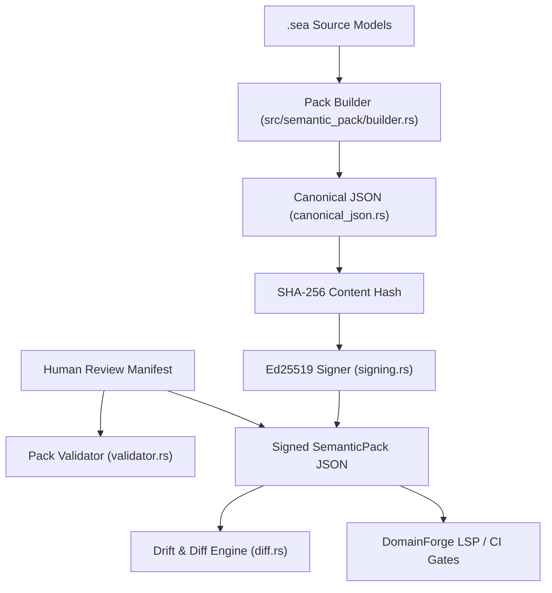
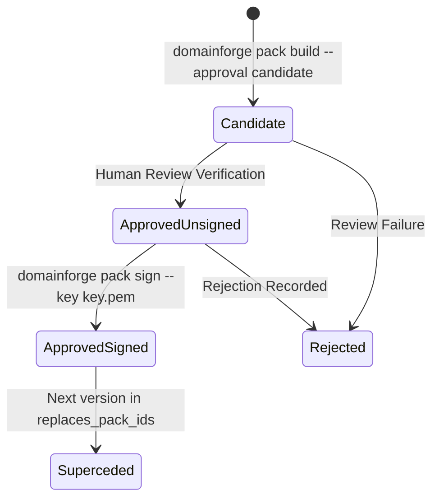

# Subsystem: Semantic Packs & Vocabulary Governance

The Semantic Packs subsystem provides deterministic, human-reviewed, cryptographically signed vocabulary contracts that govern enterprise terminology across repositories, CI/CD pipelines, and language servers.

---

## 1. Purpose & Responsibilities

### Purpose
To solve the "semantic drift" problem in enterprise software. Different teams frequently invent slightly different names for identical concepts (e.g., `client`, `customer`, `account_holder`, `buyer`). Semantic Packs freeze an organization's approved business vocabulary into an immutable, versioned, signed JSON artifact that tooling (including the DomainForge Language Server) enforces.

### Responsibilities
- **Pack Construction**: Extracts concepts, relations, metrics, dimensions, units, and aliases from SEA models into a canonical JSON schema.
- **Canonical Serialization**: Emits deterministic, key-sorted JSON with normalized UTF-8 encoding.
- **Cryptographic Signing**: Signs the SHA-256 content hash using Ed25519 detached signatures.
- **Approval Verification**: Enforces that packs transitioned to `approved` state have valid human review records for all active concepts.
- **Drift Detection**: Computes semantic diffs between pack versions to detect breaking changes (concept deletions, type modifications) and ensure `meaning_version` increments.

### Non-Responsibilities
- **Vector Search / RAG**: Semantic packs are exact structural contracts; they are not vector embeddings.
- **Governance Workflow UI**: Semantic packs are the artifact produced by governance tooling, not a web UI itself.

---

## 2. Position in the System

---

## 3. Core Abstractions

| Symbol | File | Responsibility |
|---|---|---|
| `SemanticPack` | `domainforge-core/src/semantic_pack/schema.rs` | Root JSON schema struct holding metadata, concepts, relations, and trust state. |
| `ApprovalState` | `domainforge-core/src/semantic_pack/schema.rs` | Enum: `Candidate` (unreviewed), `Approved` (verified), `Rejected`. |
| `SignatureState` | `domainforge-core/src/semantic_pack/schema.rs` | Enum: `Unsigned`, `Signed`, `Tampered`. |
| `ConceptDefinition` | `domainforge-core/src/semantic_pack/schema.rs` | Declared concept carrying definition text, owner, status, and content hash. |
| `SemanticDiffKind` | `domainforge-core/src/semantic_pack/diff.rs` | Classification: `Breaking`, `NonBreakingAdditive`, `MetadataOnly`. |

---

## 4. Pack Authority Lifecycle

1. **Candidate**: Built from `.sea` source files. Suitable for local prototyping and IDE exploration.
2. **Approved (Unsigned)**: Every active concept has a verified review record (`approve` or `minor_amendment_no_semantic_change`). `meaning_version` must be incremented if `meaning_fingerprint` changed.
3. **Approved (Signed)**: Signed with an Ed25519 private key. Signature covers `<content_hash>:<pack_id>:<schema_version>`.
4. **Superceded / Retired**: Listed in the `replaces_pack_ids` array of a successor pack.

---

## 5. Drift Detection & The Meaning Fingerprint

Every concept definition record produces a definition hash. The combined hash of all active concept definitions constitutes the **`meaning_fingerprint`**.

When a new pack version is built:
- If `meaning_fingerprint` differs from the previous release, the builder requires an incremented `meaning_version`.
- `domainforge pack diff --old v1.json --new v2.json --format json` performs structural comparison:
  - **Breaking**: Any concept, field, or relation removed or renamed. Exits with non-zero code to block CI.
  - **Additive**: New concepts or optional fields added.
  - **Metadata**: Documentation, rationale, or owner changes.

---

## 6. Failure Modes

| Symptom | Cause | Diagnostic Command | Resolution |
|---|---|---|---|
| `meaning_version_not_bumped` | The `meaning_fingerprint` changed but `--meaning-version` was not incremented. | `domainforge pack build` error output | Increment `--meaning-version` (e.g. `1.0.0` $\rightarrow$ `1.1.0`). |
| `missing_review_record` | Building as `approved`, but some concepts lack an `approve` review decision. | Check error list of unreviewed concept IDs | Complete review manifest or build as `--approval candidate`. |
| `signature_invalid` | Pack content modified after Ed25519 signing. | `domainforge pack validate` | Re-sign the pack using `domainforge pack sign`. |

---

## Source Trail
- `domainforge-core/src/semantic_pack/schema.rs` — JSON schema types and enums
- `domainforge-core/src/semantic_pack/builder.rs` — Concept extraction and fingerprint calculation
- `domainforge-core/src/semantic_pack/canonical_json.rs` — Deterministic JSON serialization
- `domainforge-core/src/semantic_pack/signing.rs` — Ed25519 digital signature functions
- `domainforge-core/src/semantic_pack/diff.rs` — Semantic drift detection and classification
- `domainforge-core/src/semantic_pack/validator.rs` — Pack validation rules
- `domainforge-core/tests/semantic_pack_build.rs` — Pack generation tests
- `domainforge-core/tests/semantic_pack_signing.rs` — Signature verification tests
