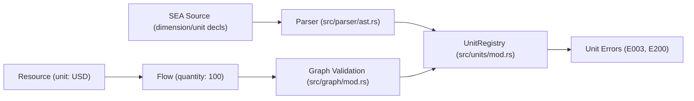

# Subsystem: Units & Dimensions

The Units & Dimensions subsystem provides dimensional analysis and unit validation for quantities, resources, and flows in DomainForge.

---

## 1. Purpose & Responsibilities

### Purpose
To prevent catastrophic unit confusion errors (such as mixing currency types or combining mass and length) by providing a strongly typed, mathematically sound dimensional algebra.

### Responsibilities
- **Dimension & Unit Management**: Registers fundamental physical and economic dimensions (Currency, Mass, Time, Count, Digital Storage) and their derived units.
- **Unit Conversions**: Calculates scaling factors relative to a base unit (e.g., `1 EUR = 1.08 USD` or `1 kg = 1000 g`).
- **Dimensional Verification**: Enforces that operations, flows, and aggregations combine only dimensionally compatible quantities.
- **Dynamic Declaration**: Parses and registers user-defined dimensions and units authored directly in SEA DSL files.

### Non-Responsibilities
- **Live Forex Feeds**: The unit engine uses declared or configured static conversion factors; it does not query live financial exchange rate APIs at runtime.

---

## 2. Position in the System



---

## 3. Core Abstractions

| Symbol | File | Responsibility |
|---|---|---|
| `Dimension` | `domainforge-core/src/units/mod.rs` | Abstract fundamental category of measurement (e.g., Currency, Length, Mass). |
| `Unit` | `domainforge-core/src/units/mod.rs` | Concrete unit of measure belonging to a dimension, carrying a scaling factor. |
| `UnitRegistry` | `domainforge-core/src/units/mod.rs` | Registry mapping unit names to their parent dimensions and base conversion factors. |
| `Quantity` | `domainforge-core/src/primitives/quantity.rs` | Pair of `rust_decimal::Decimal` magnitude and associated `Unit`. |

---

## 4. Internal Operation & Built-In Dimensions

### 1. Built-in Dimensions
DomainForge initializes a standard unit registry with common fundamental dimensions:
- **Count**: Base unit `units` (factor 1)
- **Currency**: Base unit `USD` (factor 1), with `EUR`, `GBP`, etc.
- **Mass**: Base unit `g` (factor 1), with `kg` (factor 1000), `mg` (factor 0.001)
- **Time**: Base unit `s` (factor 1), with `min` (factor 60), `h` (factor 3600), `d` (factor 86400)
- **Data**: Base unit `B` (factor 1), with `KB` (factor 1024), `MB` (factor 1048576)

### 2. DSL Syntax for Custom Units
Users can declare domain-specific dimensions and units directly in `.sea` files:
```sea
// Declare dimension
dimension "CloudCompute"

// Declare base unit
unit "vCPU" of "CloudCompute" factor 1 base "vCPU"

// Declare derived unit
unit "CoreHour" of "CloudCompute" factor 3600 base "vCPU"
```

### 3. Dimensional Compatibility Checks
When a Flow is constructed or validated, the engine verifies that the flow's assigned quantity matches the unit of the transferred Resource:
- If `Resource "ServerTime" CoreHour` is moved by `Flow ... quantity 100 CoreHour`, validation succeeds.
- If `Resource "ServerTime" CoreHour` is moved by `Flow ... quantity 100 "USD"`, validation halts with `E003_UnitMismatch`.

---

## 5. Failure Modes

| Error Code | Diagnostic Message | Cause | Resolution |
|---|---|---|---|
| `E003_UnitMismatch` | Unit mismatch: expected X, got Y | A flow or instance assigned a unit differing from the resource's declared unit. | Update flow quantity unit to match resource unit. |
| `E200_DimensionMismatch` | Incompatible dimensions: X cannot be converted to Y | Arithmetic expression attempted to add or compare two incompatible dimensions (e.g. Mass + Currency). | Check policy expression logic for dimensional consistency. |
| `UnitError::UndefinedUnit` | Unknown unit: Z | A resource or literal references a unit not declared in built-ins or model. | Declare the unit using `unit "Z" of "Dimension" ...`. |

---

## Source Trail
- `domainforge-core/src/units/mod.rs` — `UnitRegistry`, `Unit`, `Dimension` implementation
- `domainforge-core/src/primitives/quantity.rs` — `Quantity` decimal magnitude wrapper
- `domainforge-core/src/validation_error.rs` — `ErrorCode::E003_UnitMismatch` and `E200_DimensionMismatch`
- `domainforge-core/tests/dimension_unit_tests.rs` — Unit tests and conversion tests
- `domainforge-core/tests/validation_unit_mismatch_tests.rs` — Rejection tests for unit errors
