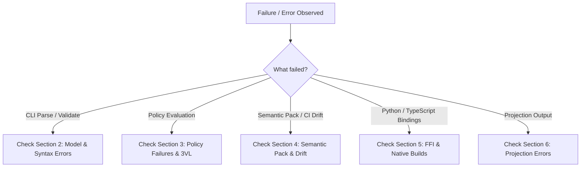

# Troubleshooting Guide & Operational Runbook

This runbook helps engineers and operators diagnose, isolate, and resolve common failures across DomainForge CLI commands, policy evaluations, semantic pack workflows, and native language bindings.

---

## 1. Quick Diagnostic Flowchart



---

## 2. Model & Syntax Errors

### Symptom: `ParseError: PestError` at Line X, Column Y
- **Cause**: The input `.sea` file contains a syntax error violating the PEG grammar in `sea.pest` (such as unclosed quotes, missing brackets, or misspelled keywords).
- **Diagnosis**: Examine the highlighted line and column in the terminal output.
- **Fix**: Check `docs/reference/dsl-grammar-reference.md` for exact syntax. Verify that keywords are lowercase (`entity`, `resource`, `flow`, `policy`).

### Symptom: `E001_UndefinedEntity: Entity "X" is not defined`
- **Cause**: A flow, relation, or instance references an entity that was not declared in the model.
- **Diagnosis**: Look at the error message; fuzzy matching will suggest similar entity names if a typo was made.
- **Fix**: Declare `Entity "X"` before referencing it, or ensure both files are in the same namespace or imported via `import { X } from "..."`.

### Symptom: `E003_UnitMismatch: Expected unit "USD", got "kg"`
- **Cause**: A flow transfer quantity unit does not match the unit declared on the moved resource.
- **Fix**: Update the flow quantity unit to match the resource's unit:
  ```sea
  // Resource declared with USD:
  Resource "Payment" USD
  // Flow must use USD:
  Flow "Payment" from "Buyer" to "Supplier" quantity 100 USD
  ```

---

## 3. Policy Failures & Three-Valued Logic

### Symptom: Validation reports policy violation with `Severity::Error`
- **Cause**: The policy expression evaluated to `False` against the current graph collections.
- **Diagnosis**:
  1. Inspect the violation message for the failing constraint.
  2. Run `domainforge normalize "<EXPRESSION>"` to inspect the simplified boolean tree.
  3. Inspect current entities and flows using `domainforge parse model.sea --format json`.
- **Fix**: Adjust model instances/quantities or modify the policy threshold.

### Symptom: Policy yields `Unknown` (`Null`) outcome
- **Cause**: One or more fields, relations, or values required by the policy evaluated to `Null` (missing data).
- **Diagnosis**:
  - Run with `domainforge validate model.sea --allow-unknown`.
  - If the model now passes, the issue is missing optional attributes rather than an explicit rule failure.
- **Fix**: Populate the missing instance attributes or scope collection quantifiers (`forall i in entity_instances of "EntityType": ...`).

---

## 4. Semantic Packs & CI Drift

### Symptom: `meaning_version_not_bumped` during `pack build`
- **Cause**: The semantic content of one or more concepts changed (altering the `meaning_fingerprint`), but `--meaning-version` was not incremented.
- **Fix**: Increment the `--meaning-version` argument (e.g. from `1.0.0` to `1.1.0` or `2.0.0`):
  ```bash
  domainforge pack build ... --meaning-version 1.1.0
  ```

### Symptom: `pack diff` fails in CI with `diff_kind: "breaking"`
- **Cause**: A concept or field present in the production base pack was removed or renamed in the pull request branch.
- **Diagnosis**: Inspect the JSON diff output:
  ```bash
  domainforge pack diff --old base.json --new candidate.json --format json
  ```
- **Fix**: If the deletion was accidental, restore the concept. If the breaking change is intentional, follow the semantic versioning policy and deprecate the concept using alias mappings before deletion.

### Symptom: `Signature: TAMPERED`
- **Cause**: The pack JSON content was edited manually after running `domainforge pack sign`.
- **Fix**: Re-sign the pack using `domainforge pack sign --in pack.json --key private_key.pem --out pack.json`.

---

## 5. Native Bindings & Build Failures

### Symptom: Python `ImportError: cannot import name 'domainforge'`
- **Cause**: The PyO3 extension is not compiled into your active virtual environment.
- **Fix**: Run:
  ```bash
  just python-setup
  ```
  This creates/updates `.venv` and runs `maturin develop` inside `domainforge-python/`.

### Symptom: TypeScript `Cannot find module '@godspeedai/domainforge-core'` or `.node` binary missing
- **Cause**: Native napi-rs binary is missing from `domainforge-typescript/`.
- **Fix**:
  ```bash
  just bun-install
  cd domainforge-typescript && bun run build
  ```

---

## 6. Projections & Path Safety

### Symptom: `Path traversal detected: ...`
- **Cause**: A projection target or custom renderer attempted to write a file outside the designated output directory (e.g. referencing `../../`).
- **Fix**: Ensure all relative output paths in custom projection renderers stay inside the root directory.

---

## Source Trail
- `domainforge-core/src/validation_error.rs` — Error codes and messages
- `domainforge-core/src/semantic_pack/diff.rs` — Breaking drift classification
- `domainforge-core/src/projection/sink.rs` — Path traversal prevention
- `justfile` — Automated task definitions for builds and tests
