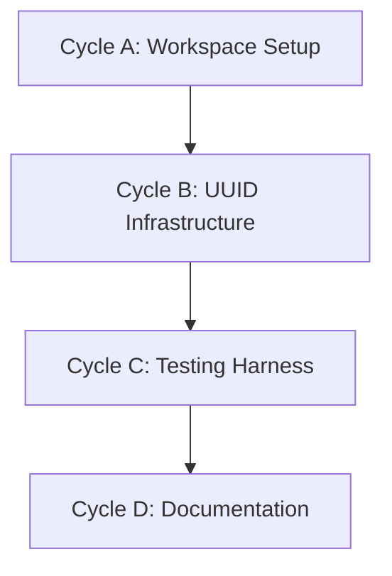

# 🧭 DomainForge Phase 0: Foundation Bootstrap

**Status:** Ready for Execution
**Revision Date:** 2025-11-07
**Aligned With:** ADR-002 (Rust Core), ADR-005 (Five Primitives), PRD-005 (Rust Implementation)

---

## 1. Objectives and Context

**Goal:** Establish the absolute minimum viable Rust project infrastructure without getting overwhelmed by the full scope.

**Philosophy: Crawl → Walk → Run**

- **PHASE-000** (This Plan): Basic Rust workspace + UUID-based primitive foundation
- **PHASE-001**: Single primitive type (Entity) with complete testing
- **PHASE-002**: Graph storage and relationships
- **PHASE-003**: Policy engine basics
- **Later Phases**: Parser, language bindings, CALM integration

**Traceability:**

- Ensure every commit links to ADR/PRD/SDS
- Build audit trail from day one
- Deterministic test behavior

**Key Constraints:**

- Start with ZERO dependencies beyond std + uuid + serde + serde_json
- No parser yet (hand-construct models in tests)
- No FFI bindings yet (pure Rust)
- Focus: Get something working that we can test

---

## 2. Global Parallelization & Dependencies Overview

### Parallelization Matrix

| Component | Can Run Parallel With | Shared Artifacts | Coordination Notes |
|-----------|---------------------|------------------|-------------------|
| PHASE-000 | None (sequential foundation) | Cargo workspace | N/A - must complete first |

### High-Level Dependency Map



---

## 3. Global Dependencies Table

| Dependency Type | Depends On | Description | Resolution Trigger |
|----------------|-----------|-------------|-------------------|
| Workspace Init | None | Cargo workspace creation | `cargo init` success |
| UUID Foundation | Workspace Init | UUID v7 generation | Tests pass |
| Test Harness | UUID Foundation | Property-based testing setup | `cargo test` green |

---

## 4. Cycles Overview (MECE)

### Phase 000: Foundation Bootstrap

**Objective:** Create minimal Rust workspace with UUID-based primitive foundation
**Coordinator:** Single developer (no parallel work yet)
**Traceability Goal:** Working `cargo build` and `cargo test` with basic infrastructure

#### ✅ Phase Checklist

- [ ] Initialize Cargo workspace — _Updated By:_ <Agent / Date>
- [ ] Set up UUID infrastructure — _Updated By:_ <Pending>
- [ ] Configure testing harness — _Updated By:_ <Pending>
- [ ] Generate documentation scaffold — _Updated By:_ <Pending>
- [ ] **Mark Phase as Complete** once all cycles are GREEN

#### Cycle Summary Table

| Cycle | Owner | Branch | Depends On | Parallel | Audit Artifacts |
|-------|-------|--------|------------|----------|-----------------|
| A | Foundation | `feat/phase0-workspace` | None | None | Cargo.toml + .gitignore |
| B | Foundation | `feat/phase0-uuid` | A | None | UUID tests GREEN |
| C | Foundation | `feat/phase0-testing` | B | None | Test framework validated |
| D | Docs | `feat/phase0-docs` | C | None | README + rustdoc scaffold |

---

### Cycle A — Workspace Initialization

**Owner:** Foundation Team
**Branch:** `feat/phase0-workspace`
**Upstream Dependency:** None (starting point)
**Parallel With:** None

#### ✅ Cycle Checklist

- [ ] RED Phase: Verify no Rust project exists
- [ ] GREEN Phase: Initialize Cargo workspace
- [ ] REFACTOR Phase: Configure project metadata
- [ ] VALIDATE Phase: Build succeeds

#### Cycle A — RED Phase

**Expected State:** No Rust project exists in repository

```bash
# This should fail
cargo build
# Expected: "could not find `Cargo.toml`"
```

#### Cycle A — GREEN Phase

**Create Cargo workspace:**

```bash
# From repository root
cargo init --lib sea-core
cd sea-core
```

**Configure `Cargo.toml`:**

```toml
[package]
name = "sea-core"
version = "0.1.0"
edition = "2021"
rust-version = "1.75"
authors = ["DomainForge Team"]
license = "MIT"
description = "SEA DSL - Semantic Enterprise Architecture Domain Modeling"
repository = "https://github.com/GodSpeedAI/DomainForge"
keywords = ["dsl", "domain-modeling", "enterprise-architecture", "sbvr"]
categories = ["development-tools", "data-structures"]

[dependencies]
uuid = { version = "1.6", features = ["v4", "serde"] }
serde = { version = "1.0", features = ["derive"] }
serde_json = "1.0"

[dev-dependencies]
# Testing dependencies to be added in Cycle C
```

**Create `src/lib.rs`:**

```rust
//! SEA DSL Core Library
//!
//! Implements the Semantic Enterprise Architecture domain modeling primitives.
//!
//! # Overview
//!
//! SEA DSL provides five universal primitives for enterprise modeling:
//! - **Entity**: Business actors and locations
//! - **Resource**: Quantifiable subjects of value
//! - **Flow**: Transfers of resources between entities
//! - **Instance**: Physical resource instances at locations
//! - **Policy**: Business rules and constraints

#![warn(missing_docs)]
#![warn(clippy::all)]
#![deny(unsafe_code)]

/// Core library version
pub const VERSION: &str = env!("CARGO_PKG_VERSION");

#[cfg(test)]
mod tests {
    use super::*;

    #[test]
    fn test_version_exists() {
        assert!(!VERSION.is_empty());
        assert!(VERSION.starts_with("0."));
    }
}
```

**Create `.gitignore`:**

```gitignore
/target
Cargo.lock
*.swp
*.swo
*~
.DS_Store
```

#### VALIDATE Phase

```bash
cargo build
cargo test
cargo clippy
cargo fmt -- --check
```

**Expected:** All commands succeed

**Label:** → **A-GREEN**

---

### Cycle B — UUID Infrastructure

**Owner:** Foundation Team
**Branch:** `feat/phase0-uuid`
**Upstream Dependency:** Cycle A

#### Cycle B — RED Phase

**Create failing tests** (in `src/lib.rs` or `tests/uuid_tests.rs`):

```rust
#[cfg(test)]
mod uuid_tests {
    use uuid::Uuid;

    #[test]
    fn test_uuid_v4_generation() {
        let id1 = Uuid::new_v4();
        let id2 = Uuid::new_v4();
        assert_ne!(id1, id2, "UUIDs should be unique");
    }

    #[test]
    fn test_uuid_to_string_format() {
        let id = Uuid::new_v4();
        let id_string = id.to_string();
        assert_eq!(id_string.len(), 36, "UUID string should be 36 chars");
        assert!(id_string.contains('-'), "UUID should contain hyphens");
    }

    #[test]
    fn test_uuid_round_trip() {
        let original = Uuid::new_v4();
        let as_string = original.to_string();
        let parsed = Uuid::parse_str(&as_string).unwrap();
        assert_eq!(original, parsed, "UUID round-trip should preserve value");
    }
}
```

#### Cycle B — GREEN Phase

Tests should pass with existing `uuid` dependency. Verify:

```bash
cargo test uuid_tests
```

**Label:** → **B-GREEN**

---

### Cycle C — Testing Harness

**Owner:** Foundation Team
**Branch:** `feat/phase0-testing`
**Upstream Dependency:** Cycle B

#### Cycle C — GREEN Phase

**Update `Cargo.toml` dev-dependencies:**

```toml
[dev-dependencies]
```

**Create `tests/` directory structure:**

```bash
mkdir -p tests
touch tests/integration_tests.rs
```

**Add basic integration test** (`tests/integration_tests.rs`):

```rust
//! Integration tests for SEA Core
//!
//! These tests verify that the library can be used as intended
//! from an external crate perspective.

use sea_core::VERSION;

#[test]
fn test_library_version_accessible() {
    assert!(!VERSION.is_empty());
    println!("SEA Core version: {}", VERSION);
}
```

#### VALIDATE Phase

```bash
cargo test
cargo test --test integration_tests
```

**Expected:** All tests pass

**Label:** → **C-GREEN**

---

### Cycle D — Documentation Scaffold

**Owner:** Documentation Team
**Branch:** `feat/phase0-docs`
**Upstream Dependency:** Cycle C

#### Deliverables

**Create `sea-core/README.md`:**

```markdown
# SEA Core - Semantic Enterprise Architecture DSL

Rust core library implementing the SEA DSL primitives and validation engine.

## Status

⚠️ **Phase 0: Foundation Bootstrap** - Workspace infrastructure only

## Building

```bash
cargo build
cargo test
cargo doc --no-deps --open
```

## Next Steps

- Phase 1: Entity Primitive
- Phase 2: Resource Primitive
- Phase 3: Flow & Instance Primitives

```

**Generate rustdoc:**

```bash
cargo doc --no-deps --open
```

**Verify documentation:**

- [ ] Library-level documentation visible
- [ ] Version constant documented
- [ ] README renders correctly

**Label:** → **D-GREEN**

---

## 5. Regression & Validation Safeguards

| Category | Command | Purpose | Evidence |
|----------|---------|---------|----------|
| Build | `cargo build` | Compilation succeeds | Binary in `target/debug/` |
| Unit Tests | `cargo test` | All tests pass | Test output log |
| Integration Tests | `cargo test --test integration_tests` | Integration verified | Test output log |
| Linting | `cargo clippy -- -D warnings` | Zero warnings | Clippy output |
| Formatting | `cargo fmt -- --check` | Code style | Format check |
| Documentation | `cargo doc --no-deps` | Docs generate | `target/doc/` |

---

## 6. Risk & Rollback

| Risk | Trigger | Mitigation | Rollback |
|------|---------|------------|----------|
| Rust version incompatibility | Cargo build fails | Pin rust-version in Cargo.toml | Remove version constraint |
| UUID dependency issue | Tests fail | Pin uuid version | Downgrade to uuid 1.5 |
| Git repository corruption | Git errors | Use `.gitignore` properly | Re-init git if needed |

---

## 7. Deliverables & Evidence

| Deliverable | Evidence | Status |
|------------|----------|--------|
| Cargo workspace | `sea-core/Cargo.toml` exists | [ ] |
| UUID infrastructure | `cargo test uuid_tests` GREEN | [ ] |
| Testing harness | `cargo test` GREEN | [ ] |
| Documentation | `cargo doc` succeeds | [ ] |

---

## 8. Validation Checklist

- [ ] Cargo workspace initialized — **Evidence:** `cargo build` succeeds
- [ ] UUID generation tested — **Evidence:** `cargo test uuid_tests` GREEN
- [ ] Testing framework configured — **Evidence:** `cargo test` GREEN
- [ ] Documentation scaffold created — **Evidence:** README exists + rustdoc renders

---

## 9. Audit Trail

| Artifact | Location | Retention |
|----------|----------|-----------|
| Source | `sea-core/src/` | Permanent (Git) |
| Tests | `sea-core/tests/` | Permanent (Git) |
| Build output | `sea-core/target/` | Temporary (gitignored) |
| Documentation | `sea-core/target/doc/` | Regenerated on demand |

---

## 10. Summary

**Phase 0** establishes the foundational Rust workspace infrastructure:

✅ **Achieved:**

- Cargo workspace with proper metadata
- UUID generation infrastructure tested
- Testing harness configured
- Documentation scaffold created

✅ **Validation:**

- All commands (`build`, `test`, `clippy`, `doc`) succeed
- Zero external primitives implemented (intentional - foundation only)
- Ready for Phase 1 (Entity primitive implementation)

✅ **Next Phase:** [Phase 1 - Entity Primitive](./Phase%201:%20Entity%20Primitive.md)

**Traceability:** ADR-002 ✓ | ADR-005 ✓ | PRD-005 ✓
