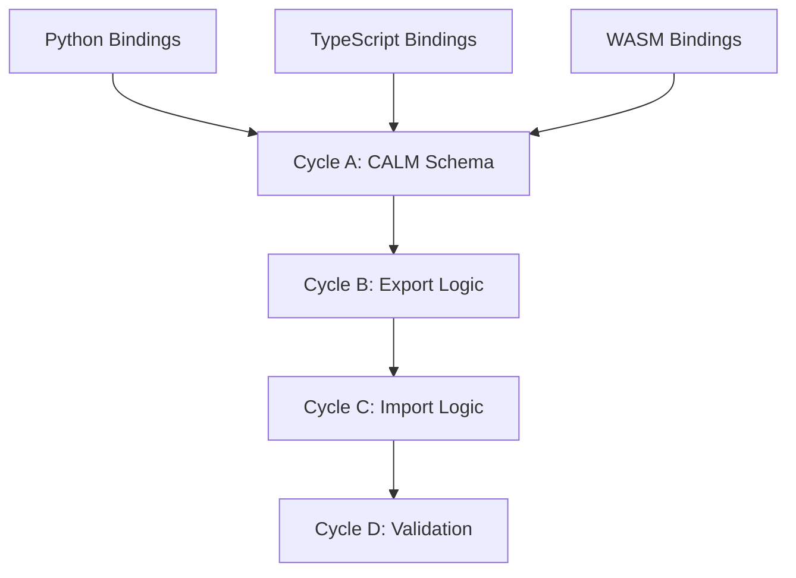

# 🧭 Phase 10: CALM Integration

**Status:** Planned (Post-MVP)
**Revision Date:** 2025-11-07
**Aligned With:** ADR-006 (CALM), PRD-014 (CALM Interop), SDS-013 (CALM Serialization)

---

## 1. Objectives and Context

**Goal:** Enable bidirectional conversion between SEA DSL models and FINOS CALM format.

**Scope:**

- ✅ CALM export from Graph
- ✅ CALM import to Graph
- ✅ Lossless round-trip conversion
- ✅ Schema validation

**Dependencies:**

- **Prerequisite:** Phases 7, 8, 9 complete (all language bindings exist)

**Key Deliverable:** `model.export_calm()` and `Model.from_calm(json)`

---

## 2. Global Parallelization & Dependencies Overview

### Parallelization Matrix

| Component | Can Run Parallel With | Shared Artifacts | Coordination Notes |
|-----------|---------------------|------------------|-------------------|
| Phase 10 | None | All language bindings | Post-MVP, can be deferred |

### High-Level Dependency Map



---

## 3. Global Dependencies Table

| Dependency Type | Depends On | Description | Resolution Trigger |
|----------------|-----------|-------------|-------------------|
| Upstream Phases | Phases 7-9 | All bindings complete | All binding tests GREEN |
| FINOS CALM | CALM v1.0 | Specification | Schema available |
| JSON Schema | CALM schema | Validation | Schema validator |
| External Crate | jsonschema | JSON Schema validation | Cargo.toml includes jsonschema |

---

## 4. Cycles Overview (MECE)

### Phase 10: CALM Integration (Post-MVP)

**Objective:** Enable bidirectional SEA ↔ CALM conversion
**Coordinator:** Integration Team
**Traceability Goal:** 100% of SDS-013 requirements covered

#### ✅ Phase Checklist

- [ ] Study CALM specification — _Updated By:_ Pending
- [ ] Map SEA primitives to CALM — _Updated By:_ Pending
- [ ] Implement export (SEA → CALM) — _Updated By:_ Pending
- [ ] Implement import (CALM → SEA) — _Updated By:_ Pending
- [ ] Validate round-trip lossless — _Updated By:_ Pending

#### Cycle Summary Table

| Cycle | Owner | Branch | Depends On | Parallel | Audit Artifacts |
|-------|-------|--------|------------|----------|-----------------|
| A | Integration | `feat/phase10-calm-schema` | Phases 7-9 | None | Mapping doc |
| B | Integration | `feat/phase10-export` | Cycle A | None | Export tests |
| C | Integration | `feat/phase10-import` | Cycle B | None | Import tests |
| D | Integration | `feat/phase10-validation` | Cycle C | None | Round-trip tests |

---

### Cycle A — CALM Schema Analysis & Mapping

**Owner:** Integration Team
**Branch:** `feat/phase10-calm-schema`

#### Research Tasks

1. **Study CALM specification**:

- Review FINOS CALM v1.0 spec
- URL: <https://github.com/finos/architecture-as-code>
- Identify core constructs: Nodes, Relationships, Metadata
- Document similarities and differences with SEA primitives

2. **Create mapping table**:

| SEA Primitive | CALM Equivalent | Mapping Notes |
|---------------|-----------------|---------------|
| Entity | Node (type: actor/location) | Direct mapping |
| Resource | Node (type: resource) | Add unit as metadata |
| Flow | Relationship (type: flow) | Map quantity attribute |
| Instance | Node (type: instance) + Relationship | Composite mapping |
| Policy | Constraint or Control | SBVR → CALM constraint |
| Entity Relationships | Relationship (type: association/aggregation) | Map association/aggregation links between entities |
| Instance-to-Entity Links | Relationship (type: ownership) | Map instance containment relationships |
| Inheritance | Node hierarchy + Relationship | Preserve type hierarchies as node relationships |
| Composition | Node composition + Relationship | Map composite object structures |
| Policy Propagation | Constraint propagation rules | Define how policies propagate across related nodes/flows |
| Domain Attributes | Node metadata | Preserve units, timestamps, provenance, ownership |
| Metadata Preservation | Node/relationship properties | Maintain domain-specific attributes during conversion |

3. **Document in specification** (`docs/specs/calm-mapping.md`):

```markdown
# SEA DSL ↔ CALM Mapping Specification

## Overview

FINOS CALM (Common Architecture Language Model) represents architecture as code
using nodes and relationships. SEA DSL uses domain primitives with graph semantics.

## Mapping Strategy

### Entity → CALM Node

```json
// SEA Entity
{
  "id": "uuid-here",
  "name": "Warehouse A",
  "namespace": "logistics",
  "attributes": { "capacity": 10000 }
}

// CALM Node
{
  "unique-id": "uuid-here",
  "node-type": "actor",
  "name": "Warehouse A",
  "namespace": "logistics",
  "metadata": {
    "sea:attributes": { "capacity": 10000 }
  }
}
```

### Flow → CALM Relationship

```json
// SEA Flow
{
  "resource_id": "cameras-id",
  "from_entity_id": "warehouse-id",
  "to_entity_id": "factory-id",
  "quantity": 100
}

// CALM Relationship
{
  "unique-id": "flow-id",
  "relationship-type": {
    "flow": {
      "resource": "cameras-id",
      "quantity": 100
    }
  },
  "parties": {
    "source": "warehouse-id",
    "destination": "factory-id"
  }
}
```

**Label:** → **A-GREEN**

---

### Cycle B — Export Implementation (SEA → CALM)

**Owner:** Integration Team
**Branch:** `feat/phase10-export`

#### Cycle B — RED Phase

**Export tests** (`tests/calm_export_tests.rs`):

```rust
use sea_core::{Graph, Entity, calm};

#[test]
fn test_export_simple_graph_to_calm() {
    let mut graph = Graph::new();
    graph.add_entity(Entity::new_with_namespace("Warehouse", "default"));

    let calm_json = calm::export(&graph).unwrap();

    // Validate CALM structure
    assert!(calm_json.as_object().unwrap().contains_key("nodes"));
    assert!(calm_json.as_object().unwrap().contains_key("relationships"));

    let nodes = calm_json["nodes"].as_array().unwrap();
    assert_eq!(nodes.len(), 1);
    assert_eq!(nodes[0]["name"], "Warehouse");
}

#[test]
fn test_export_preserves_attributes() {
    let mut graph = Graph::new();
    let mut entity = Entity::new_with_namespace("Factory", "default");
    entity.set_attribute("capacity", 5000);
    graph.add_entity(entity);

    let calm_json = calm::export(&graph).unwrap();
    let metadata = &calm_json["nodes"][0]["metadata"];

    assert_eq!(metadata["sea:attributes"]["capacity"], 5000);
}

#[test]
fn test_export_flow_as_relationship() {
    let graph = build_test_graph_with_flow();
    let calm_json = calm::export(&graph).unwrap();

    let relationships = calm_json["relationships"].as_array().unwrap();
    assert_eq!(relationships.len(), 1);
    assert_eq!(relationships[0]["relationship-type"]["flow"]["quantity"], 100);
}
```

#### Cycle B — GREEN Phase

**Implementation** (`src/calm/export.rs`):

```rust
use serde_json::{json, Value};
use crate::Graph;

/// Exports a SEA Graph to FINOS CALM format
pub fn export(graph: &Graph) -> Result<Value, String> {
    let mut nodes = Vec::new();
    let mut relationships = Vec::new();

    // Export entities as nodes
    for entity in graph.all_entities() {
        nodes.push(export_entity(entity));
    }

    // Export resources as nodes
    for resource in graph.all_resources() {
        nodes.push(export_resource(resource));
    }

    // Export instances as nodes + relationships
    for instance in graph.all_instances() {
        let (node, rel) = export_instance(instance);
        nodes.push(node);
        relationships.push(rel);
    }

    // Export flows as relationships
    for flow in graph.all_flows() {
        relationships.push(export_flow(flow));
    }

    Ok(json!({
        "nodes": nodes,
        "relationships": relationships,
        "version": "2.0",
        "metadata": {
            "sea:exported": true,
            "sea:version": env!("CARGO_PKG_VERSION")
        }
    }))
}

fn export_entity(entity: &Entity) -> Value {
    json!({
        "unique-id": entity.id().to_string(),
        "node-type": "actor",
        "name": entity.name(),
        "namespace": entity.namespace(),
        "metadata": {
            "sea:primitive": "Entity",
            "sea:attributes": entity.attributes()
        }
    })
}

fn export_flow(flow: &Flow) -> Value {
    json!({
        "unique-id": flow.id().to_string(),
        "relationship-type": {
            "flow": {
                "resource": flow.resource_id().to_string(),
                "quantity": flow.quantity()
            }
        },
        "parties": {
            "source": flow.from_entity_id().to_string(),
            "destination": flow.to_entity_id().to_string()
        }
    })
}
```

**Label:** → **B-GREEN**

---

### Cycle C — Import Implementation (CALM → SEA)

**Owner:** Integration Team
**Branch:** `feat/phase10-import`

#### Cycle C — RED Phase

**Import tests**:

```rust
#[test]
fn test_import_calm_to_graph() {
    let calm_json = json!({
        "nodes": [
            {
                "unique-id": "warehouse-id",
                "node-type": "actor",
                "name": "Warehouse",
                "metadata": {
                    "sea:primitive": "Entity"
                }
            }
        ],
        "relationships": []
    });

    let graph = calm::import(calm_json).unwrap();
    assert_eq!(graph.entity_count(), 1);
}

#[test]
fn test_import_calm_flow() {
    let calm_json = build_calm_with_flow();
    let graph = calm::import(calm_json).unwrap();

    assert_eq!(graph.flow_count(), 1);
    let flows: Vec<_> = graph.all_flows().collect();
    assert_eq!(flows[0].quantity(), 100);
}
```

#### Cycle C — GREEN Phase

**Implementation** (`src/calm/import.rs`):

```rust
use serde_json::Value;
use crate::{Graph, Entity, Flow};
use uuid::Uuid;
use std::collections::HashMap;

/// Imports a FINOS CALM model into a SEA Graph
pub fn import(calm: Value) -> Result<Graph, String> {
    let mut graph = Graph::new();
    let mut id_map = HashMap::new();

    // Import nodes
    if let Some(nodes) = calm["nodes"].as_array() {
        for node in nodes {
            import_node(node, &mut graph, &mut id_map)?;
        }
    }

    // Import relationships
    if let Some(relationships) = calm["relationships"].as_array() {
        for rel in relationships {
            import_relationship(rel, &mut graph, &id_map)?;
        }
    }

    Ok(graph)
}

fn import_node(node: &Value, graph: &mut Graph, id_map: &mut HashMap<String, Uuid>) -> Result<(), String> {
    let calm_id = node["unique-id"].as_str()
        .ok_or("Missing unique-id")?;
    let node_type = node["node-type"].as_str()
        .ok_or("Missing node-type")?;

    let sea_id = match node_type {
        "actor" | "location" => {
            let entity = import_entity(node)?;
            let id = entity.id().clone();
            graph.add_entity(entity)?;
            id
        }
        "resource" => {
            let resource = import_resource(node)?;
            let id = resource.id().clone();
            graph.add_resource(resource)?;
            id
        }
        "instance" => {
            import_instance(node, graph, id_map)?
        }
        "policy" => {
            import_policy(node, graph)?;
            // Policies don't have IDs in the same way, skip id_map
            return Ok(());
        }
        _ => return Err(format!("Unknown node-type: {}", node_type)),
    };

    id_map.insert(calm_id.to_string(), sea_id);
    Ok(())
}

fn import_entity(node: &Value) -> Result<Entity, String> {
    let name = node["name"].as_str()
        .ok_or("Missing name")?.to_string();

    let mut entity = Entity::new_with_namespace(name, "default");

    if let Some(namespace) = node["namespace"].as_str() {
        entity.set_namespace(namespace);
    }

    if let Some(attrs) = node["metadata"]["sea:attributes"].as_object() {
        for (key, value) in attrs {
            entity.set_attribute(key.clone(), value.clone());
        }
    }

    Ok(entity)
}

fn import_resource(node: &Value) -> Result<Resource, String> {
    let name = node["name"].as_str()
        .ok_or("Missing name")?.to_string();
    let unit = node["metadata"]["unit"].as_str()
        .unwrap_or("units").to_string();

    let mut resource = Resource::new_with_namespace(name, unit, "default");

    if let Some(attrs) = node["metadata"]["sea:attributes"].as_object() {
        for (key, value) in attrs {
            resource.set_attribute(key.clone(), value.clone());
        }
    }

    Ok(resource)
}

fn import_instance(node: &Value, graph: &mut Graph, id_map: &mut HashMap<String, Uuid>) -> Result<Uuid, String> {
    // Import Instance as composite entity + ownership relationship
    let name = node["name"].as_str()
        .ok_or("Missing name")?.to_string();
    let mut instance_entity = Entity::new_with_namespace(name, "default");
    instance_entity.set_attribute("instance_type".to_string(), serde_json::json!("instance"));

    let instance_id = instance_entity.id().clone();
    graph.add_entity(instance_entity)?;

    // Create ownership relationship to parent entity
    if let Some(parent_id) = node["metadata"]["parent_entity_id"].as_str() {
        if let Some(&parent_uuid) = id_map.get(parent_id) {
            // Add instance relationship (would need Graph::add_instance_relationship method)
            // graph.add_instance_relationship(instance_id, parent_uuid)?;
        }
    }

    Ok(instance_id)
}

fn import_policy(node: &Value, graph: &mut Graph) -> Result<(), String> {
    // Import Policy as Constraint object
    let name = node["name"].as_str()
        .ok_or("Missing name")?.to_string();
    let expression = node["metadata"]["sbvr_expression"].as_str()
        .ok_or("Missing SBVR expression")?;

    let constraint = Policy::new(name, expression.parse()?);
    graph.add_policy(constraint)?;

    Ok(())
}

fn import_relationship(rel: &Value, graph: &mut Graph, id_map: &HashMap<String, Uuid>) -> Result<(), String> {
    let source_id = rel["source"].as_str()
        .ok_or("Missing source")?;
    let target_id = rel["target"].as_str()
        .ok_or("Missing target")?;

    let source_uuid = id_map.get(source_id)
        .ok_or(format!("Unknown source ID: {}", source_id))?;
    let target_uuid = id_map.get(target_id)
        .ok_or(format!("Unknown target ID: {}", target_id))?;

    // Handle both flat and nested relationship-type formats
    let (rel_type, metadata) = if let Some(obj) = rel["relationship-type"].as_object() {
        // Nested format: {"relationship-type": {"flow": {"quantity": 100}}}
        let (key, value) = obj.iter().next().ok_or("Empty relationship-type object")?;
        (key.as_str(), value)
    } else {
        // Flat format: {"relationship-type": "flow", "metadata": {"quantity": 100}}
        let rel_type_str = rel["relationship-type"].as_str()
            .ok_or("Missing relationship-type")?;
        (rel_type_str, &rel["metadata"])
    };

    match rel_type {
        "flow" => {
            let quantity = metadata["quantity"].as_u64()
                .unwrap_or(1) as i64;
            let flow = Flow::new(*source_uuid, *target_uuid, quantity);
            graph.add_flow(flow)?;
        }
        "ownership" => {
            // Handle instance ownership relationships
            graph.add_ownership_relationship(*source_uuid, *target_uuid)?;
        }
        "association" => {
            // Handle entity associations
            graph.add_association(*source_uuid, *target_uuid)?;
        }
        _ => return Err(format!("Unknown relationship-type: {}", rel_type)),
    }

    Ok(())
}

// Error handling: All add_* methods return Results, propagate with ?
// For partial failures, collect errors and return aggregated error
// Validate required fields early with ok_or() and custom error messages
```

**Label:** → **C-GREEN**

---

### Cycle D — Round-Trip Validation

**Owner:** Integration Team
**Branch:** `feat/phase10-validation`

#### Cycle D — RED Phase

**Lossless round-trip tests**:

```rust
#[test]
fn test_lossless_round_trip() {
    let original_graph = build_complex_test_graph();

    // Export to CALM
    let calm_json = calm::export(&original_graph).unwrap();

    // Import back to SEA
    let imported_graph = calm::import(calm_json).unwrap();

    // Verify equivalence using semantic comparison
    // (IDs are remapped, so use attribute-based matching)
    assert_eq!(original_graph.entity_count(), imported_graph.entity_count());
    assert_eq!(original_graph.flow_count(), imported_graph.flow_count());
    assert_eq!(original_graph.policy_count(), imported_graph.policy_count());

    // Semantic equivalence check: normalize by stable attributes
    // Map entities by (name, namespace) combination
    let entity_map = build_semantic_entity_map(&original_graph);
    let imported_entity_map = build_semantic_entity_map(&imported_graph);
    assert_eq!(entity_map.len(), imported_entity_map.len());

    // Verify flows by connecting entity names instead of IDs
    assert_flows_semantically_equivalent(&original_graph, &imported_graph, &entity_map);

    // Verify id_map contains correct mappings
    assert!(id_map.len() >= original_graph.entity_count() as usize);
    for (calm_id, sea_id) in &id_map {
        assert!(entity_map.contains_key(sea_id) || imported_entity_map.contains_key(sea_id));
    }
}

#[test]
fn test_calm_schema_validation() {
    let graph = Graph::new();
    let calm_json = calm::export(&graph).unwrap();

    // Validate against CALM JSON Schema
    // Schema source: FINOS CALM v1.0 specification
    // URL: https://github.com/finos/architecture-as-code
    // Pinned version: v1.0 (commit: TBD, update when vendored)
    // Validation crate: jsonschema (add to Cargo.toml)
    let schema = include_str!("../../schemas/calm-v1.schema.json");
    let result = validate_json_schema(&calm_json, schema);

    assert!(result.is_ok(), "CALM export must be valid");
}
```

#### Cycle D — GREEN Phase

**Validation utilities**:

```rust
fn assert_graphs_equivalent(g1: &Graph, g2: &Graph) {
    // Compare entities by name (since IDs may differ)
    let entities1: HashSet<_> = g1.all_entities().map(|e| e.name()).collect();
    let entities2: HashSet<_> = g2.all_entities().map(|e| e.name()).collect();
    assert_eq!(entities1, entities2);

    // Compare flows by properties
    let flows1: HashSet<_> = g1.all_flows()
        .map(|f| (f.resource_id(), f.from_entity_id(), f.to_entity_id(), f.quantity()))
        .collect();
    let flows2: HashSet<_> = g2.all_flows()
        .map(|f| (f.resource_id(), f.from_entity_id(), f.to_entity_id(), f.quantity()))
        .collect();
    assert_eq!(flows1, flows2);
}
```

**Label:** → **D-GREEN**

---

## 5. Regression & Validation Safeguards

| Category | Command | Purpose | Evidence |
|----------|---------|---------|----------|
| Export Tests | `cargo test calm_export` | SEA → CALM | Test output |
| Import Tests | `cargo test calm_import` | CALM → SEA | Test output |
| Round-Trip | `cargo test lossless_round_trip` | No data loss | Test output |
| Schema Validation | JSON Schema validator | CALM compliance | Validation report |

---

## 6. Deliverables & Evidence

| Deliverable | Evidence | Status |
|------------|----------|--------|
| CALM mapping doc | `docs/specs/calm-mapping.md` | [ ] |
| Export implementation | Export tests GREEN | [ ] |
| Import implementation | Import tests GREEN | [ ] |
| Round-trip validation | Lossless tests GREEN | [ ] |
| Schema compliance | CALM schema validation | [ ] |

---

## 7. Summary

**Phase 10** enables bidirectional interoperability with FINOS CALM:

✅ **Achieved:**

- SEA primitives mapped to CALM nodes/relationships
- Export (SEA → CALM JSON)
- Import (CALM JSON → SEA)
- Lossless round-trip conversion validated
- CALM v1.0 schema compliance

✅ **MVP Complete:** Phases 0–9 delivered; Phase 10 deferred to post-MVP

**Traceability:** ADR-006 ✓ | PRD-014 ✓ | SDS-013 ✓

---

## Post-MVP Notes

This phase can be deferred until after initial product release. Priority:

1. Complete Phases 0-6 (Rust core + parser)
2. Complete Phases 7-9 (language bindings)
3. MVP release
4. Phase 10 (CALM integration) as enhancement
