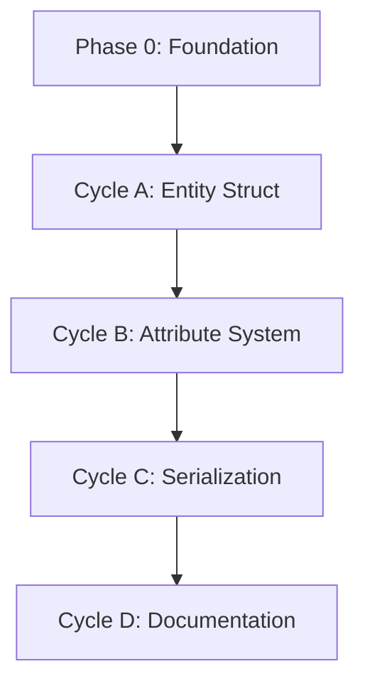

# 🧭 Phase 1: Entity Primitive Implementation

**Status:** Draft
**Revision Date:** 2025-11-07
**Aligned With:** ADR-005 (Five Primitives), PRD-002 (Universal Primitives), SDS-002 (Entity Specification)

---

## 1. Objectives and Context

**Goal:** Implement the Entity primitive as the first of five universal building blocks, validating the TDD approach and establishing patterns for subsequent primitives.

**Scope Boundaries:**
- ✅ Entity struct with UUID, name, namespace, attributes
- ✅ Complete test coverage (>80%)
- ✅ Serialization/deserialization (serde)
- ✅ Documentation with examples
- ❌ NO relationships yet (Phase 4)
- ❌ NO validation rules (Phase 5)
- ❌ NO parser integration (Phase 6)

**Dependencies:**
- **Prerequisite:** Phase 0 complete (Cargo workspace exists)
- **Blocks:** Phase 2 (Resource primitive pattern follows Entity)

**Key Deliverable:** Working `Entity::new_with_namespace()` with full test suite (use `"default"` when no namespace intended)

---

## 2. Global Parallelization & Dependencies Overview

### Parallelization Matrix

| Component | Can Run Parallel With | Shared Artifacts | Coordination Notes |
|-----------|---------------------|------------------|-------------------|
| Phase 1 | None (sequential) | `sea-core` crate | Must complete before Phase 2 |

### High-Level Dependency Map



---

## 3. Global Dependencies Table

| Dependency Type | Depends On | Description | Resolution Trigger |
|----------------|-----------|-------------|-------------------|
| Upstream Phase | Phase 0 | Cargo workspace must exist | `cargo build` succeeds |
| External Crate | uuid | UUID generation | Cargo.toml includes uuid |
| External Crate | serde | Serialization | Cargo.toml includes serde |
| External Crate | serde_json | JSON serialization/deserialization | Cargo.toml includes serde_json |

---

## 4. Cycles Overview (MECE)

### Phase 1: Entity Primitive

**Objective:** Implement Entity primitive following SDS-002 specification
**Coordinator:** Core Development Team
**Traceability Goal:** 100% of SDS-002 requirements covered

#### ✅ Phase Checklist

*Note: This is a living checklist for tracking progress. Update status as work is completed.*

- [ ] Define Entity struct
- [ ] Implement attribute system
- [ ] Add serialization support
- [ ] Generate documentation
- [ ] Validate test coverage >80%

#### Cycle Summary Table

| Cycle | Owner | Branch | Depends On | Parallel | Audit Artifacts |
|-------|-------|--------|------------|----------|-----------------|
| A | Core Dev | `feat/phase1-entity-struct` | Phase 0 | None | Test coverage report |
| B | Core Dev | `feat/phase1-attributes` | Cycle A | None | Attribute tests |
| C | Core Dev | `feat/phase1-serde` | Cycle B | None | Serialization tests |
| D | Docs | `feat/phase1-docs` | Cycle C | None | Generated rustdoc |

---

### Cycle A — Entity Struct Definition

**Owner:** Core Development
**Branch:** `feat/phase1-entity-struct`
**Upstream Dependency:** Phase 0
**Parallel With:** None

#### ✅ Cycle Checklist

- [ ] RED Phase: Write failing tests
- [ ] GREEN Phase: Minimal implementation
- [ ] REFACTOR Phase: Code quality improvements
- [ ] VALIDATE Phase: Regression testing

#### 🧠 Intelligence Gathering Phase

```yaml
Documentation Foundation:
  - https://docs.rs/uuid/latest/uuid/: UUID crate best practices for UUID v4
  - SDS-002: Entity primitive technical specification
  - ADR-005: Five primitives design rationale

Pattern Research:
  - https://rust-unofficial.github.io/patterns/patterns/creational/builder.html: Rust struct with UUID best practices
  - https://rust-unofficial.github.io/patterns/patterns/creational/builder.html: Rust builder pattern simple structs
  - https://serde.rs/: Serde patterns in popular Rust projects

Test Strategy:
  - Focus: Creation, getters, basic validation
  - No mutation yet (Cycle B handles attributes)
```

#### Cycle A — RED Phase

**Tests to create** (in `sea-core/tests/entity_tests.rs`):

```rust
use sea_core::primitives::Entity;
use uuid::Uuid;

#[test]
fn test_entity_new_creates_valid_uuid() {
    let entity = Entity::new_with_namespace("Test Entity", "default");
    assert!(Uuid::parse_str(&entity.id().to_string()).is_ok());
}

#[test]
fn test_entity_name_is_stored() {
    let entity = Entity::new_with_namespace("Assembly Line A", "default");
    assert_eq!(entity.name(), "Assembly Line A");
}

#[test]
fn test_entity_with_namespace() {
    let entity = Entity::new_with_namespace("Warehouse", "logistics");
    assert_eq!(entity.namespace(), Some("logistics"));
}

#[test]
fn test_entity_without_namespace_returns_none() {
    let entity = Entity::new_with_namespace("Factory", "default");
    assert_eq!(entity.namespace(), None);
}
```

**Expected:** All tests fail (Entity doesn't exist)

#### Cycle A — GREEN Phase

**Minimal implementation** (in `sea-core/src/primitives/entity.rs`):

```rust
use serde::{Deserialize, Serialize};
use uuid::Uuid;

/// Represents a business actor, location, or organizational unit.
///
/// Entities are the "WHO" in enterprise models - the actors that perform
/// actions, hold resources, or participate in flows.
///
/// # Examples
///
/// ```
/// use sea_core::primitives::Entity;
///
/// let warehouse = Entity::new_with_namespace("Main Warehouse", "default");
/// assert_eq!(warehouse.name(), "Main Warehouse");
/// assert_eq!(warehouse.namespace(), None);
/// ```
#[derive(Debug, Clone, PartialEq, Serialize, Deserialize)]
pub struct Entity {
    id: Uuid,
    name: String,
    namespace: Option<String>,
}

impl Entity {
    /// Creates a new Entity with a generated UUID.
    pub fn new(name: impl Into<String>) -> Self {
        Self {
            id: Uuid::new_v4(),
            name: name.into(),
            namespace: None,
        }
    }

    /// Creates a new Entity with a specific namespace.
    pub fn new_with_namespace(name: impl Into<String>, namespace: impl Into<String>) -> Self {
        Self {
            id: Uuid::new_v4(),
            name: name.into(),
            namespace: Some(namespace.into()),
        }
    }

    /// Returns the entity's unique identifier.
    pub fn id(&self) -> &Uuid {
        &self.id
    }

    /// Returns the entity's name.
    pub fn name(&self) -> &str {
        &self.name
    }

    /// Returns the entity's namespace, if any.
    pub fn namespace(&self) -> Option<&str> {
        self.namespace.as_deref()
    }
}
```

**Update `sea-core/src/primitives/mod.rs`:**

```rust
pub mod entity;
pub use entity::Entity;
```

**Update `sea-core/src/lib.rs`:**

```rust
//! SEA DSL Core Library

pub mod primitives;
```

#### REFACTOR Phase

(Minimal for this cycle - main refactor happens in Cycle B with attributes)

- Extract validation into separate method (future)
- Consider builder pattern (deferred to later phases)

#### VALIDATE Phase

```bash
cargo test --test entity_tests
cargo clippy -- -D warnings
cargo fmt -- --check
```

**Evidence:**
- All tests GREEN
- Zero clippy warnings
- Code formatted correctly

**Label:** → **A-GREEN**

---

### Cycle B — Attribute System

**Owner:** Core Development
**Branch:** `feat/phase1-attributes`
**Upstream Dependency:** Cycle A
**Parallel With:** None

#### Cycle B — RED Phase

**Additional tests:**

```rust
use serde_json::json;

#[test]
fn test_entity_set_attribute() {
    let mut entity = Entity::new_with_namespace("Factory", "default");
    entity.set_attribute("capacity", json!(5000));
    assert_eq!(entity.get_attribute("capacity"), Some(&json!(5000)));
}

#[test]
fn test_entity_multiple_attributes() {
    let mut entity = Entity::new_with_namespace("Warehouse", "default");
    entity.set_attribute("capacity_sqft", json!(50000));
    entity.set_attribute("climate_controlled", json!(true));

    assert_eq!(entity.get_attribute("capacity_sqft"), Some(&json!(50000)));
    assert_eq!(entity.get_attribute("climate_controlled"), Some(&json!(true)));
}

#[test]
fn test_entity_get_nonexistent_attribute() {
    let entity = Entity::new_with_namespace("Entity", "default");
    assert_eq!(entity.get_attribute("missing"), None);
}
```

#### Cycle B — GREEN Phase

**Add to Entity struct:**

```rust
use std::collections::HashMap;
use serde_json::Value;

#[derive(Debug, Clone, PartialEq, Serialize, Deserialize)]
pub struct Entity {
    id: Uuid,
    name: String,
    namespace: Option<String>,
    attributes: HashMap<String, Value>,  // NEW
}

impl Entity {
    // Update constructors to initialize empty HashMap
    pub fn new(name: impl Into<String>) -> Self {
        Self {
            id: Uuid::new_v4(),
            name: name.into(),
            namespace: None,
            attributes: HashMap::new(),
        }
    }

    pub fn new_with_namespace(name: impl Into<String>, namespace: impl Into<String>) -> Self {
        Self {
            id: Uuid::new_v4(),
            name: name.into(),
            namespace: Some(namespace.into()),
            attributes: HashMap::new(),
        }
    }

    /// Sets a custom attribute.
    pub fn set_attribute(&mut self, key: impl Into<String>, value: Value) {
        self.attributes.insert(key.into(), value);
    }

    /// Gets a custom attribute.
    pub fn get_attribute(&self, key: &str) -> Option<&Value> {
        self.attributes.get(key)
    }
}
```

#### VALIDATE Phase

```bash
cargo test
cargo clippy
```

**Label:** → **B-GREEN**

---

### Cycle C — Serialization Support

**Owner:** Core Development
**Branch:** `feat/phase1-serde`
**Upstream Dependency:** Cycle B

#### Cycle C — RED Phase

```rust
#[test]
fn test_entity_serializes_to_json() {
    let entity = Entity::new_with_namespace("Test", "default");
    let json = serde_json::to_string(&entity).unwrap();
    assert!(json.contains("Test"));
    assert!(json.contains("id"));
}

#[test]
fn test_entity_deserializes_from_json() {
    let entity = Entity::new_with_namespace("Original", "default");
    let json = serde_json::to_string(&entity).unwrap();
    let deserialized: Entity = serde_json::from_str(&json).unwrap();
    assert_eq!(deserialized.name(), "Original");
}
```

#### Cycle C — GREEN Phase

(Already implemented via `#[derive(Serialize, Deserialize)]`)

Verify tests pass, add edge cases if needed.

**Label:** → **C-GREEN**

---

### Cycle D — Documentation

**Owner:** Documentation Team
**Branch:** `feat/phase1-docs`
**Upstream Dependency:** Cycle C

#### Deliverables

- [ ] Comprehensive rustdoc comments
- [ ] Usage examples in doc comments
- [ ] README section for Entity primitive
- [ ] Generated HTML documentation

```bash
cargo doc --no-deps --open
```

**Label:** → **D-GREEN**

---

## 5. Regression & Validation Safeguards

| Category | Command | Evidence |
|----------|---------|----------|
| Unit Tests | `cargo test` | All GREEN |
| Linting | `cargo clippy -- -D warnings` | Zero warnings |
| Formatting | `cargo fmt -- --check` | No changes |
| Documentation | `cargo doc --no-deps` | HTML generated |
| Coverage | `cargo tarpaulin` | >80% |

---

## 6. Risk & Rollback

| Risk | Mitigation | Rollback |
|------|------------|----------|
| UUID version conflicts | Pin uuid = "1.6" | Revert Cargo.toml |
| Attribute type complexity | Use serde_json::Value | Simplify to String |
| Performance overhead | Benchmark HashMap | Consider Vec for small attribute sets |

---

## 7. Deliverables & Evidence

| Deliverable | Evidence | Status |
|------------|----------|--------|
| Entity struct | `cargo build` succeeds | [ ] |
| Test suite | `cargo test` GREEN | [ ] |
| Documentation | Rustdoc online | [ ] |

---

## 8. Validation Checklist

- [ ] Entity struct matches SDS-002 specification
- [ ] All tests pass with >80% coverage
- [ ] Documentation includes examples
- [ ] Zero clippy warnings
- [ ] ADR-005 requirements validated

---

## 9. Audit Trail

| Artifact | Location | Retention |
|----------|----------|-----------|
| Source | `sea-core/src/primitives/entity.rs` | Permanent |
| Tests | `sea-core/tests/entity_tests.rs` | Permanent |
| Coverage | `target/tarpaulin/` | 90 days |

---

## 10. Summary

**Phase 1** delivers the Entity primitive as the first validated implementation of the five-primitive model:

✅ **Achieved:**
- Entity struct with UUID, name, namespace
- Extensible attribute system
- Full serde support
- Comprehensive test coverage
- Documentation with examples

✅ **Validates:**
- TDD workflow effectiveness
- Primitive design pattern
- Test infrastructure adequacy

✅ **Next Phase:** Phase 2 - Resource Primitive (reuses Entity pattern)

**Traceability:** ADR-005 ✓ | PRD-002 ✓ | SDS-002 ✓
