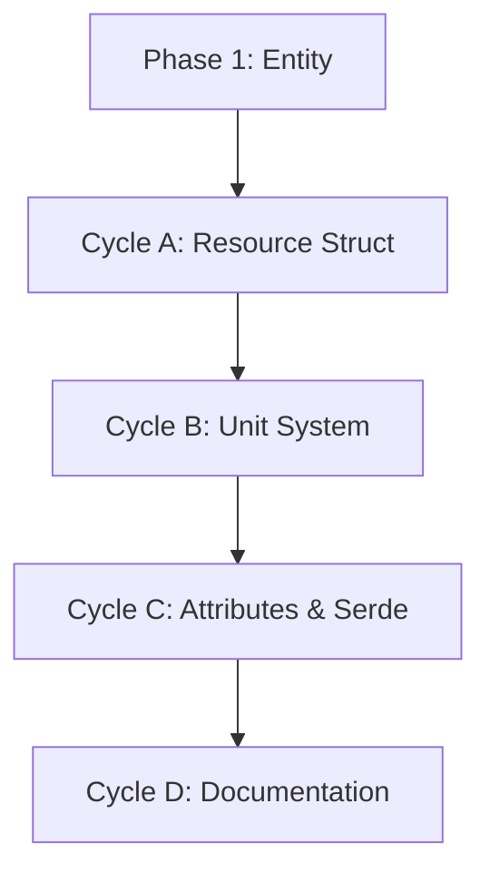

# 🧭 Phase 2: Resource Primitive Implementation

**Status:** Draft
**Revision Date:** 2025-11-07
**Aligned With:** ADR-005 (Five Primitives), PRD-002 (Universal Primitives), SDS-003 (Resource Specification)

---

## 1. Objectives and Context

**Goal:** Implement the Resource primitive as the second universal building block, representing quantifiable subjects of value that flow through the enterprise.

**Scope Boundaries:**

- ✅ Resource struct with UUID, name, namespace, unit, attributes
- ✅ Unit of measurement field (string, e.g., "units", "kg", "USD")
- ✅ Complete test coverage (>80%)
- ✅ Serialization/deserialization (serde)
- ✅ Documentation with examples
- ❌ NO flow relationships yet (Phase 3)
- ❌ NO validation rules (Phase 5)
- ❌ NO parser integration (Phase 6)

**Dependencies:**

- **Prerequisite:** Phase 1 complete (Entity pattern established)
- **Blocks:** Phase 3 (Flow requires Resource)

**Key Deliverable:** Working `Resource::new_with_namespace()` with unit tracking (use `"default"` when no namespace intended)

---

## 2. Global Parallelization & Dependencies Overview

### Parallelization Matrix

| Component | Can Run Parallel With | Shared Artifacts | Coordination Notes |
|-----------|---------------------|------------------|-------------------|
| Phase 2 | None (sequential) | `sea-core` crate | Must complete before Phase 3 |

### High-Level Dependency Map



---

## 3. Global Dependencies Table

| Dependency Type | Depends On | Description | Resolution Trigger |
|----------------|-----------|-------------|-------------------|
| Upstream Phase | Phase 1 | Entity pattern established | Phase 1 tests GREEN |
| Pattern Reuse | Entity impl | Reuse struct pattern | Copy Entity approach |

---

## 4. Cycles Overview (MECE)

### Phase 2: Resource Primitive

**Objective:** Implement Resource primitive following SDS-003 specification
**Coordinator:** Core Development Team
**Traceability Goal:** 100% of SDS-003 requirements covered

#### ✅ Phase Checklist

- [ ] Define Resource struct — _Updated By:_ <Agent / Date>
- [ ] Implement unit tracking — _Updated By:_ <Pending>
- [ ] Add attribute system — _Updated By:_ <Pending>
- [ ] Add serialization support — _Updated By:_ <Pending>
- [ ] Generate documentation — _Updated By:_ <Pending>

#### Cycle Summary Table

| Cycle | Owner | Branch | Depends On | Parallel | Audit Artifacts |
|-------|-------|--------|------------|----------|-----------------|
| A | Core Dev | `feat/phase2-resource-struct` | Phase 1 | None | Test coverage report |
| B | Core Dev | `feat/phase2-unit-system` | Cycle A | None | Unit tests |
| C | Core Dev | `feat/phase2-attributes-serde` | Cycle B | None | Serialization tests |
| D | Docs | `feat/phase2-docs` | Cycle C | None | Generated rustdoc |

---

### Cycle A — Resource Struct Definition

**Owner:** Core Development
**Branch:** `feat/phase2-resource-struct`
**Upstream Dependency:** Phase 1
**Parallel With:** None

#### Cycle A — RED Phase

**Tests to create** (in `sea-core/tests/resource_tests.rs`):

```rust
use sea_core::primitives::Resource;
use uuid::Uuid;

#[test]
fn test_resource_new_creates_valid_uuid() {
    let resource = Resource::new_with_namespace("Camera", "units", "default");
    assert!(Uuid::parse_str(&resource.id().to_string()).is_ok());
}

#[test]
fn test_resource_name_and_unit_stored() {
    let resource = Resource::new_with_namespace("Steel Beam", "kg", "default");
    assert_eq!(resource.name(), "Steel Beam");
    assert_eq!(resource.unit(), "kg");
}

#[test]
fn test_resource_with_namespace() {
    let resource = Resource::new_with_namespace("USD", "currency", "finance");
    assert_eq!(resource.namespace(), Some("finance"));
}
```

#### Cycle A — GREEN Phase

**Implementation** (in `sea-core/src/primitives/resource.rs`):

```rust
use serde::{Deserialize, Serialize};
use uuid::Uuid;

/// Represents a quantifiable subject of value in enterprise models.
///
/// Resources are the "WHAT" - things that flow between entities,
/// measured in specific units (units, kg, USD, etc.)
///
/// # Examples
///
/// ```
/// use sea_core::primitives::Resource;
///
/// let product = Resource::new_with_namespace("Camera", "units", "default");
/// assert_eq!(product.unit(), "units");
/// ```
#[derive(Debug, Clone, PartialEq, Serialize, Deserialize)]
pub struct Resource {
    id: Uuid,
    name: String,
    unit: String,
    namespace: Option<String>,
}

impl Resource {
    /// Creates a new Resource with a generated UUID.
    pub fn new(name: impl Into<String>, unit: impl Into<String>) -> Self {
        Self {
            id: Uuid::new_v4(),
            name: name.into(),
            unit: unit.into(),
            namespace: None,
        }
    }

    /// Creates a new Resource with a specific namespace.
    pub fn new_with_namespace(
        name: impl Into<String>,
        unit: impl Into<String>,
        namespace: impl Into<String>
    ) -> Self {
        Self {
            id: Uuid::new_v4(),
            name: name.into(),
            unit: unit.into(),
            namespace: Some(namespace.into()),
        }
    }

    /// Returns the resource's unique identifier.
    pub fn id(&self) -> &Uuid {
        &self.id
    }

    /// Returns the resource's name.
    pub fn name(&self) -> &str {
        &self.name
    }

    /// Returns the resource's unit of measurement.
    pub fn unit(&self) -> &str {
        &self.unit
    }

    /// Returns the resource's namespace, if any.
    pub fn namespace(&self) -> Option<&str> {
        self.namespace.as_deref()
    }
}
```

**Update `sea-core/src/primitives/mod.rs`:**

```rust
pub mod entity;
pub mod resource;

pub use entity::Entity;
pub use resource::Resource;
```

**Label:** → **A-GREEN**

---

### Cycle B — Unit System Validation

**Owner:** Core Development
**Branch:** `feat/phase2-unit-system`

#### Cycle B — RED Phase

(Basic validation deferred to Phase 5 - just document the field for now)

#### Cycle B — GREEN Phase

(Basic validation deferred to Phase 5 - just document the field for now)

**Label:** → **B-GREEN**

---

### Cycle C — Attributes & Serialization

**Owner:** Core Development
**Branch:** `feat/phase2-attributes-serde`

#### Cycle C — RED Phase

```rust
use serde_json::json;

#[test]
fn test_resource_set_attribute() {
    let mut resource = Resource::new_with_namespace("Gold", "kg", "default");
    resource.set_attribute("purity", json!(0.999));
    assert_eq!(resource.get_attribute("purity"), Some(&json!(0.999)));
}

#[test]
fn test_resource_serializes() {
    let resource = Resource::new_with_namespace("Silver", "oz", "default");
    let json = serde_json::to_string(&resource).unwrap();
    assert!(json.contains("Silver"));
    assert!(json.contains("oz"));
}
```

#### Cycle C — GREEN Phase

**Add attributes field** (same pattern as Entity):

```rust
use std::collections::HashMap;
use serde_json::Value;

#[derive(Debug, Clone, PartialEq, Serialize, Deserialize)]
pub struct Resource {
    id: Uuid,
    name: String,
    unit: String,
    namespace: Option<String>,
    attributes: HashMap<String, Value>,
}

// Add methods: set_attribute(), get_attribute()
```

**Label:** → **C-GREEN**

---

### Cycle D — Documentation

**Owner:** Documentation Team
**Branch:** `feat/phase2-docs`

```bash
cargo doc --no-deps --open
```

**Label:** → **D-GREEN**

---

## 5. Regression & Validation Safeguards

| Category | Command | Evidence |
|----------|---------|----------|
| Unit Tests | `cargo test` | All GREEN |
| Linting | `cargo clippy -- -D warnings` | Zero warnings |
| Documentation | `cargo doc --no-deps` | HTML generated |

---

## 6. Risk & Rollback

| Risk | Mitigation | Rollback |
|------|------------|----------|
| Unit standardization | Use free-form string for MVP | Future: enum or validation |

---

## 7. Summary

**Phase 2** delivers the Resource primitive:

✅ **Achieved:**

- Resource struct with unit tracking
- Attribute system (matching Entity pattern)
- Full serde support
- Documentation

✅ **Next Phase:** Phase 3 - Flow & Instance Primitives

**Traceability:** ADR-005 ✓ | PRD-002 ✓ | SDS-003 ✓
