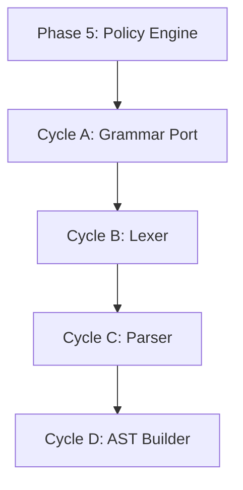

# 🧭 Phase 6: Parser Implementation

**Status:** Planned
**Revision Date:** 2025-11-07
**Aligned With:** ADR-004 (SBVR), PRD-003 (Expression Language), SDS-007 (Parser)

---

## 1. Objectives and Context

**Goal:** Implement DSL parser to convert text syntax to primitives and policies.

**Scope:**

- ✅ Grammar definition (port from TypeScript Ohm-JS reference)
- ✅ Parser implementation (Pest or nom)
- ✅ AST construction
- ✅ Primitive declarations
- ✅ Policy expressions
- ❌ NO FFI yet (Phase 7-9)

**Dependencies:**

- **Prerequisite:** Phase 5 complete (all core functionality exists)

**Key Deliverable:** `parse(source_text)` returns Graph with Policies

---

## 2. Global Parallelization & Dependencies Overview

### Parallelization Matrix

| Component | Can Run Parallel With | Shared Artifacts | Coordination Notes |
|-----------|---------------------|------------------|-------------------|
| Phase 6 | None (sequential) | `sea-core` crate | Completes Rust core |

### High-Level Dependency Map



---

## 3. Global Dependencies Table

| Dependency Type | Depends On | Description | Resolution Trigger |
|----------------|-----------|-------------|-------------------|
| Upstream Phase | Phase 5 | All core functionality exists | Phase 5 tests GREEN |
| Reference Impl | Ohm-JS Grammar | TypeScript parser is reference | Port semantics exactly |
| Parser Library | pest or nom | Rust parsing framework | Cargo dependency |

---

## 4. Cycles Overview (MECE)

### Phase 6: Parser Implementation

**Objective:** Port TypeScript Ohm-JS parser to Rust with exact semantic equivalence
**Coordinator:** Core Development Team
**Traceability Goal:** 100% of SDS-007 requirements covered

#### ✅ Phase Checklist

- [ ] Port grammar from Ohm-JS — _Updated By:_ Pending
- [ ] Implement lexer — _Updated By:_ Pending
- [ ] Build parser — _Updated By:_ Pending
- [ ] Create AST builder — _Updated By:_ Pending
- [ ] Validate semantic equivalence — _Updated By:_ Pending

#### Cycle Summary Table

| Cycle | Owner | Branch | Depends On | Parallel | Audit Artifacts |
|-------|-------|--------|------------|----------|-----------------|
| A | Core Dev | `feat/phase6-grammar` | Phase 5 | None | Grammar file |
| B | Core Dev | `feat/phase6-lexer` | Cycle A | None | Lexer tests |
| C | Core Dev | `feat/phase6-parser` | Cycle B | None | Parser tests |
| D | Core Dev | `feat/phase6-ast` | Cycle C | None | AST tests |

---

### Cycle A — Grammar Definition

**Owner:** Core Development
**Branch:** `feat/phase6-grammar`
**Upstream Dependency:** Phase 5

#### Cycle A — RED Phase

**Grammar compliance tests:**

```rust
#[test]
fn test_entity_declaration_syntax() {
    let source = r#"
        Entity "Warehouse A" in logistics
    "#;

    let result = parse(source);
    assert!(result.is_ok());
}

#[test]
fn test_resource_declaration_syntax() {
    let source = r#"
        Resource "Camera Units" units in inventory
    "#;

    let result = parse(source);
    assert!(result.is_ok());
}

#[test]
fn test_flow_declaration_syntax() {
    let source = r#"
        Flow "Camera Units" from "Warehouse" to "Factory" quantity 100
    "#;

    let result = parse(source);
    assert!(result.is_ok());
}
```

#### Cycle A — GREEN Phase

**Create PEG grammar** (using `pest`, in `sea-core/grammar/sea.pest`):

```pest
// SEA DSL Grammar (ported from Ohm-JS reference implementation)

model = { SOI ~ declaration* ~ EOI }

declaration = {
    entity_decl
  | resource_decl
  | flow_decl
  | instance_decl
  | policy_decl
}

entity_decl = {
    "Entity" ~ string_literal ~ namespace? ~ attributes?
}

resource_decl = {
    "Resource" ~ string_literal ~ unit ~ namespace? ~ attributes?
}

flow_decl = {
    "Flow" ~ resource_ref ~ "from" ~ entity_ref ~ "to" ~ entity_ref ~ "quantity" ~ number
}

instance_decl = {
    "Instance" ~ resource_ref ~ "at" ~ entity_ref
}

policy_decl = {
    "Policy" ~ string_literal ~ modality? ~ ":" ~ expression
}

// Expressions (SBVR-aligned)
expression = { quantifier_expr | or_expr | primary_expr }

quantifier_expr = {
    quantifier ~ identifier ~ "in" ~ expression ~ ":" ~ expression
}

quantifier = { "forall" | "exists" | "exists!" }

or_expr = { and_expr ~ ("OR" ~ and_expr)* }

and_expr = { comparison_expr ~ ("AND" ~ comparison_expr)* }

comparison_expr = { primary_expr ~ ((">" | "<" | ">=" | "<=" | "==" | "!=") ~ primary_expr)* }

primary_expr = {
    "(" ~ expression ~ ")"
  | number
  | string_literal
  | identifier
}

// Modality
modality = { "must" | "must not" | "may" }

// Namespace
namespace = { "in" ~ identifier }

// Attributes
attributes = { "{" ~ (attribute ~ ("," ~ attribute)*)? ~ "}" }
attribute = { identifier ~ ":" ~ value }
value = { number | string_literal | boolean }

// Primitives
identifier = @{ ASCII_ALPHA ~ (ASCII_ALPHANUMERIC | "_")* }
string_literal = @{ "\"" ~ ((!"\"" ~ !"\\" ~ ANY) | ("\\" ~ ("\"" | "\\")))* ~ "\"" }
number = @{ "-"? ~ ASCII_DIGIT+ ~ ("." ~ ASCII_DIGIT+)? }
boolean = { "true" | "false" }
unit = { identifier }

// References
resource_ref = { string_literal }
entity_ref = { string_literal }

// Whitespace
WHITESPACE = _{ " " | "\t" | "\r" | "\n" }
```

**Add pest dependency** (`Cargo.toml`):

```toml
[dependencies]
pest = "2.8.3"
pest_derive = "2.8.3"
```

_Note: Upgraded to pest 2.8.3 (current stable) for latest features and bug fixes._

**Label:** → **A-GREEN**

---

### Cycle B — Lexer & Token Stream

**Owner:** Core Development
**Branch:** `feat/phase6-lexer`
**Upstream Dependency:** Cycle A

#### Cycle B — RED Phase

**Tokenization tests:**

```rust
use pest::Parser;

#[test]
fn test_tokenize_entity() {
    let source = r#"Entity "Warehouse""#;
    let pairs = SeaParser::parse(Rule::entity_decl, source);
    assert!(pairs.is_ok());

    let mut pairs = pairs.unwrap();
    let entity = pairs.next().unwrap();
    assert_eq!(entity.as_rule(), Rule::entity_decl);
}

#[test]
fn test_tokenize_policy() {
    let source = r#"Policy "Positive Flows" must: forall flow in flows : flow.quantity > 0"#;
    let pairs = SeaParser::parse(Rule::policy_decl, source);
    assert!(pairs.is_ok());
}
```

#### Cycle B — GREEN Phase

**Implement parser** (in `sea-core/src/parser/mod.rs`):

```rust
use pest::Parser;
use pest_derive::Parser;

#[derive(Parser)]
#[grammar = "grammar/sea.pest"]
pub struct SeaParser;

#[cfg(test)]
mod tests {
    use super::*;

    #[test]
    fn test_parse_simple_model() {
        let source = r#"
            Entity "Warehouse"
            Resource "Cameras" units
        "#;

        let result = SeaParser::parse(Rule::model, source);
        assert!(result.is_ok());
    }
}
```

**Label:** → **B-GREEN**

---

### Cycle C — Parser Implementation

**Owner:** Core Development
**Branch:** `feat/phase6-parser`
**Upstream Dependency:** Cycle B

#### Cycle C — RED Phase

**Complete parsing tests:**

```rust
#[test]
fn test_parse_complex_model() {
    let source = r#"
        Entity "Warehouse" in logistics {
            capacity: 10000
        }

        Entity "Factory" in manufacturing

        Resource "Camera Units" units in inventory

        Flow "Camera Units" from "Warehouse" to "Factory" quantity 100

        Policy "Positive Quantities" must:
            forall flow in flows : flow.quantity > 0
    "#;

    let graph = parse_to_graph(source).unwrap();
    assert_eq!(graph.entity_count(), 2);
    assert_eq!(graph.resource_count(), 1);
    assert_eq!(graph.flow_count(), 1);
    assert_eq!(graph.policy_count(), 1);
}
```

#### Cycle C — GREEN Phase

**Implement parse_to_graph:**

```rust
pub fn parse(source: &str) -> Result<Graph, ParseError> {
    let pairs = SeaParser::parse(Rule::model, source)
        .map_err(|e| ParseError::SyntaxError(e.to_string()))?;

    let mut graph = Graph::new();

    for pair in pairs {
        match pair.as_rule() {
            Rule::entity_decl => {
                let entity = parse_entity(pair)?;
                graph.add_entity(entity)?;
            }
            Rule::resource_decl => {
                let resource = parse_resource(pair)?;
                graph.add_resource(resource)?;
            }
            Rule::flow_decl => {
                let flow = parse_flow(pair)?;
                graph.add_flow(flow)?;
            }
            Rule::policy_decl => {
                let policy = parse_policy(pair)?;
                graph.add_policy(policy)?;
            }
            _ => {}
        }
    }

    Ok(graph)
}

fn parse_entity(pair: Pair<Rule>) -> Result<Entity, ParseError> {
    let mut inner = pair.into_inner();
    let name_pair = inner.next().ok_or_else(|| ParseError::new("Expected name in entity"))?;
    let name = parse_string_literal(name_pair)?;

    let mut entity = Entity::new_with_namespace(name, "default");

    // Parse optional namespace and attributes
    for pair in inner {
        match pair.as_rule() {
            Rule::namespace => {
                let ns_pair = pair.into_inner().next().ok_or_else(|| ParseError::new("Expected namespace value"))?;
                let ns = ns_pair.as_str();
                entity.set_namespace(ns);
            }
            Rule::attributes => {
                parse_attributes(pair, &mut entity)?;
            }
            _ => {}
        }
    }

    Ok(entity)
}
```

**Label:** → **C-GREEN**

---

### Cycle D — AST Builder & Validation

**Owner:** Core Development
**Branch:** `feat/phase6-ast`
**Upstream Dependency:** Cycle C

#### Cycle D — RED Phase

**Semantic validation tests:**

```rust
#[test]
fn test_parse_error_undefined_entity() {
    let source = r#"
        Flow "Cameras" from "NonexistentWarehouse" to "Factory" quantity 100
    "#;

    let result = parse_to_graph(source);
    assert!(result.is_err());
    assert!(result.unwrap_err().to_string().contains("undefined entity"));
}

#[test]
fn test_parse_semantic_equivalence_with_typescript() {
    // Test case from TypeScript reference implementation
    let source = include_str!("../../tests/fixtures/reference_model.sea");

    let rust_graph = parse(source).unwrap();
    let expected_json = include_str!("../../tests/fixtures/reference_model.json");
    let expected: serde_json::Value = serde_json::from_str(expected_json).unwrap();

    let rust_json = serde_json::to_value(&rust_graph).unwrap();
    assert_eq!(rust_json, expected);
}
```

#### Cycle D — GREEN Phase

**Add semantic validation:**

```rust
pub fn parse_to_graph(source: &str) -> Result<Graph, ParseError> {
    let mut graph = parse(source)?;

    // Semantic validation
    validate_references(&graph)?;
    validate_types(&graph)?;

    Ok(graph)
}

fn validate_references(graph: &Graph) -> Result<(), ParseError> {
    // Check all flow references point to existing entities/resources
    for flow in graph.all_flows() {
        if !graph.has_entity(flow.from_entity_id()) {
            return Err(ParseError::UndefinedEntity(
                format!("Flow references undefined from_entity: {}", flow.from_entity_id())
            ));
        }
        if !graph.has_entity(flow.to_entity_id()) {
            return Err(ParseError::UndefinedEntity(
                format!("Flow references undefined to_entity: {}", flow.to_entity_id())
            ));
        }
        if !graph.has_resource(flow.resource_id()) {
            return Err(ParseError::UndefinedResource(
                format!("Flow references undefined resource: {}", flow.resource_id())
            ));
        }
    }

    Ok(())
}

fn validate_types(graph: &Graph) -> Result<(), ParseError> {
    // Type checking for expressions, quantities, etc.
    for policy in graph.all_policies() {
        validate_expression_types(policy.expression(), graph)?;
    }

    Ok(())
}
```

**Label:** → **D-GREEN**

---

## 5. Regression & Validation Safeguards

| Category | Command | Purpose | Evidence |
|----------|---------|---------|----------|
| Unit Tests | `cargo test parser_tests` | Parser correctness | Test output |
| Grammar Tests | `cargo test grammar` | Pest grammar validity | Test output |
| Equivalence Tests | `cargo test semantic_equivalence` | Match TypeScript impl | Test output |
| Fuzzing | `cargo fuzz parse` | Parser robustness | Fuzzing report |

---

## 6. Risk & Rollback

| Risk | Trigger | Mitigation | Rollback |
|------|---------|------------|----------|
| Grammar divergence | Semantic mismatch | Cross-validate with Ohm-JS | Update grammar |
| Performance | Parsing >100ms | Profile and optimize | Accept slower parsing |
| Error messages | Unclear errors | Improve diagnostics | Basic error reporting |

---

## 7. Deliverables & Evidence

| Deliverable | Evidence | Status |
|------------|----------|--------|
| PEG grammar | Grammar file exists | [ ] |
| Lexer | Tokenization tests GREEN | [ ] |
| Parser | Parsing tests GREEN | [ ] |
| Semantic validation | Validation tests GREEN | [ ] |
| TypeScript equivalence | Equivalence tests GREEN | [ ] |

---

## 8. Validation Checklist

- [ ] Grammar ported — **Evidence:** `sea.pest` file exists
- [ ] Lexer working — **Evidence:** Tokenization tests GREEN
- [ ] Parser functional — **Evidence:** Parsing tests GREEN
- [ ] AST builder complete — **Evidence:** AST tests GREEN
- [ ] Semantic equivalence verified — **Evidence:** Cross-language tests GREEN

---

## 9. Audit Trail

| Artifact | Location | Retention |
|----------|----------|-----------|
| Grammar | `sea-core/grammar/sea.pest` | Permanent (Git) |
| Parser | `sea-core/src/parser/` | Permanent (Git) |
| Parser tests | `sea-core/tests/parser_tests.rs` | Permanent (Git) |
| Reference fixtures | `sea-core/tests/fixtures/` | Permanent (Git) |

---

## 10. Summary

**Phase 6** completes the Rust core by implementing the DSL parser:

✅ **Achieved:**

- PEG grammar ported from TypeScript Ohm-JS reference
- Full lexer and parser implementation (pest)
- AST builder with semantic validation
- Cross-language semantic equivalence verified

✅ **Next Phase:** [Phase 7 - Python Bindings](./Phase%207:%20Python%20Bindings.md) _(can run in parallel with Phases 8 & 9)_

**Traceability:** ADR-004 ✓ | PRD-003 ✓ | SDS-007 ✓
