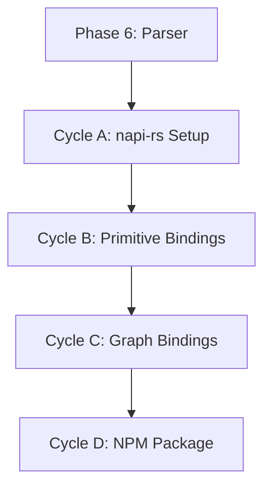

# 🧭 Phase 8: TypeScript Bindings (napi-rs)

**Status:** Planned
**Revision Date:** 2025-11-07
**Aligned With:** ADR-002 (FFI), ADR-007 (Idiomatic Bindings), PRD-007 (TypeScript API), SDS-010 (napi-rs)

---

## 1. Objectives and Context

**Goal:** Create idiomatic TypeScript API wrapping Rust core via napi-rs.

**Scope:**

- ✅ napi-rs bindings for all primitives
- ✅ Native Node.js objects
- ✅ TypeScript type definitions
- ✅ Camel-case naming conventions
- ✅ Promise-based async API

**Dependencies:**

- **Prerequisite:** Phase 6 complete (full Rust core exists)

**Key Deliverable:** `npm install @domainforge/sea` works, API matches README examples

---

## 2. Global Parallelization & Dependencies Overview

### Parallelization Matrix

| Component | Can Run Parallel With | Shared Artifacts | Coordination Notes |
|-----------|---------------------|------------------|-------------------|
| Phase 8 | Phases 7, 9 | Rust core API | Independent FFI implementations |

### High-Level Dependency Map



---

## 3. Global Dependencies Table

| Dependency Type | Depends On | Description | Resolution Trigger |
|----------------|-----------|-------------|-------------------|
| Upstream Phase | Phase 6 | Rust core complete | Phase 6 tests GREEN |
| FFI Framework | napi-rs | Node.js bindings | Cargo dependency |
| Node.js | Node 18+ | Runtime | `node --version` |

---

## 4. Cycles Overview (MECE)

### Phase 8: TypeScript Bindings (napi-rs)

**Objective:** Create idiomatic TypeScript/Node.js API
**Coordinator:** TypeScript Team
**Traceability Goal:** 100% of SDS-010 requirements covered

#### ✅ Phase Checklist

- [ ] Configure napi-rs build — _Updated By:_ Pending
- [ ] Bind all primitives — _Updated By:_ Pending
- [ ] Expose graph operations — _Updated By:_ Pending
- [ ] Generate TypeScript types — _Updated By:_ Pending
- [ ] Package for npm — _Updated By:_ Pending

#### Cycle Summary Table

| Cycle | Owner | Branch | Depends On | Parallel | Audit Artifacts |
|-------|-------|--------|------------|----------|-----------------|
| A | TypeScript | `feat/phase8-napi-setup` | Phase 6 | None | Build config |
| B | TypeScript | `feat/phase8-primitives` | Cycle A | None | TS tests |
| C | TypeScript | `feat/phase8-graph` | Cycle B | None | Integration tests |
| D | TypeScript | `feat/phase8-package` | Cycle C | None | npm package |

---

### Cycle A — napi-rs Project Setup

**Owner:** TypeScript Team
**Branch:** `feat/phase8-napi-setup`

#### Key Tasks

1. **Add napi-rs dependencies** (`Cargo.toml`):

```toml
[dependencies]
napi = { version = "2.16.17", features = ["async"] }
napi-derive = "2.16.17"

[build-dependencies]
napi-build = "2.1"
```

2. **Configure npm package** (`package.json`):

```json
{
  "name": "@domainforge/sea",
  "version": "0.1.0",
  "main": "index.js",
  "types": "index.d.ts",
  "scripts": {
    "build": "napi build --platform --release",
    "test": "vitest"
  },
  "devDependencies": {
    "@napi-rs/cli": "3.1.5",
    "typescript": "^5.3.0",
    "vitest": "^1.0.0"
  }
}
```

3. **Test build**:

```bash
npm run build
node -e "const sea = require('.'); console.log(sea)"
```

**Label:** → **A-GREEN**

---

### Cycle B — Primitive Bindings

**Owner:** TypeScript Team
**Branch:** `feat/phase8-primitives`

#### Implementation Pattern

**Rust side** (`src/typescript/primitives.rs`):

```rust
use napi::bindgen_prelude::*;
use napi_derive::napi;
use crate::primitives::Entity as RustEntity;

#[napi]
pub struct Entity {
    inner: RustEntity,
}

#[napi]
impl Entity {
    #[napi(constructor)]
    pub fn new(name: String, namespace: Option<String>) -> Self {
        let mut entity = RustEntity::new_with_namespace(name, "default");
        if let Some(ns) = namespace {
            entity.set_namespace(ns);
        }
        Self { inner: entity }
    }

    #[napi(getter)]
    pub fn id(&self) -> String {
        self.inner.id().to_string()
    }

    #[napi(getter)]
    pub fn name(&self) -> String {
        self.inner.name().to_string()
    }

    #[napi(getter)]
    pub fn namespace(&self) -> Option<String> {
        self.inner.namespace().map(|s| s.to_string())
    }

    #[napi]
    pub fn set_attribute(&mut self, key: String, value: serde_json::Value) {
        self.inner.set_attribute(key, value);
    }

    #[napi]
    pub fn get_attribute(&self, key: String) -> Option<serde_json::Value> {
        self.inner.get_attribute(&key).cloned()
    }
}
```

**TypeScript tests** (`tests/primitives.test.ts`):

```typescript
import { describe, it, expect } from 'vitest';
import { Entity, Resource, Flow } from '../index';

describe('Entity', () => {
  it('creates entity with name', () => {
    const entity = new Entity('Warehouse A');
    expect(entity.name).toBe('Warehouse A');
    expect(entity.id).toHaveLength(36);
  });

  it('supports namespaces', () => {
    const entity = new Entity('Factory', 'manufacturing');
    expect(entity.namespace).toBe('manufacturing');
  });

  it('manages attributes', () => {
    const entity = new Entity('Warehouse');
    entity.setAttribute('capacity', 10000);
    expect(entity.getAttribute('capacity')).toBe(10000);
  });
});

describe('Resource', () => {
  it('creates resource with unit', () => {
    const resource = new Resource('Cameras', 'units');
    expect(resource.name).toBe('Cameras');
    expect(resource.unit).toBe('units');
  });
});
```

**Generated types** (`index.d.ts`):

```typescript
export class Entity {
  constructor(name: string, namespace?: string);
  readonly id: string;
  readonly name: string;
  readonly namespace?: string;
  setAttribute(key: string, value: any): void;
  getAttribute(key: string): any;
}

export class Resource {
  constructor(name: string, unit: string, namespace?: string);
  readonly id: string;
  readonly name: string;
  readonly unit: string;
  readonly namespace?: string;
}

export class Flow {
  constructor(resourceId: string, fromEntityId: string, toEntityId: string, quantity: number);
  readonly id: string;
  readonly resourceId: string;
  readonly fromEntityId: string;
  readonly toEntityId: string;
  readonly quantity: number;
}
```

**Label:** → **B-GREEN**

---

### Cycle C — Graph & Parser Bindings

**Owner:** TypeScript Team
**Branch:** `feat/phase8-graph`

#### Key Bindings

**Graph class** (`src/typescript/graph.rs`):

```rust
#[napi]
pub struct Graph {
    inner: RustGraph,
}

#[napi]
impl Graph {
    #[napi(constructor)]
    pub fn new() -> Self {
        Self { inner: RustGraph::new() }
    }

    #[napi]
    pub fn add_entity(&mut self, entity: &Entity) -> Result<()> {
        self.inner.add_entity(entity.inner.clone())
            .map_err(|e| Error::from_reason(e))
    }

    #[napi]
    pub fn entity_count(&self) -> u32 {
        self.inner.entity_count() as u32
    }

    #[napi]
    pub fn flow_count(&self) -> u32 {
        self.inner.flow_count() as u32
    }

    #[napi]
    pub fn flows_from(&self, entity_id: String) -> Result<Vec<Flow>> {
        let uuid = Uuid::parse_str(&entity_id)
            .map_err(|e| Error::from_reason(e.to_string()))?;

        Ok(self.inner.flows_from(&uuid)
            .into_iter()
            .map(|f| Flow { inner: f.clone() })
            .collect())
    }

    #[napi(factory)]
    pub fn parse(source: String) -> Result<Self> {
        let graph = crate::parser::parse(&source)
            .map_err(|e| Error::from_reason(e.to_string()))?;

        Ok(Self { inner: graph })
    }

    #[napi]
    pub async fn evaluate_policies(&self) -> Result<Vec<PolicyResult>> {
        // Async policy evaluation
        tokio::task::spawn_blocking({
            let graph = self.inner.clone();
            move || {
                graph.all_policies()
                    .map(|p| p.evaluate(&graph))
                    .collect::<Result<Vec<_>, _>>()
            }
        })
        .await
        .map_err(|e| Error::from_reason(e.to_string()))?
        .map_err(|e| Error::from_reason(e))?
    }
}
```

**TypeScript integration tests**:

```typescript
describe('Graph', () => {
  it('parses and queries model', () => {
    const source = `
      Entity "Warehouse"
      Entity "Factory"
      Resource "Cameras" units
      Flow "Cameras" from "Warehouse" to "Factory" quantity 100
    `;

    const graph = Graph.parse(source);
    expect(graph.entityCount()).toBe(2);
    expect(graph.flowCount()).toBe(1);
  });

  it('evaluates policies asynchronously', async () => {
    const graph = Graph.parse(`
      Entity "Warehouse"
      Policy "Valid" must: forall e in entities : true
    `);

    const results = await graph.evaluatePolicies();
    expect(results.every(r => r.satisfied)).toBe(true);
  });
});
```

**Label:** → **C-GREEN**

---

### Cycle D — NPM Package Distribution

**Owner:** TypeScript Team
**Branch:** `feat/phase8-package`

#### Deliverables

1. **Build for multiple platforms**:

```bash
npm run build -- --target x86_64-unknown-linux-gnu
npm run build -- --target aarch64-apple-darwin
npm run build -- --target x86_64-pc-windows-msvc
```

2. **Publish to npm**:

```bash
npm publish --access public
```

3. **Documentation** (`README.md`):

```markdown
## Installation

```bash
npm install @domainforge/sea
```

## Quick Start

```typescript
import { Graph } from '@domainforge/sea';

const graph = Graph.parse(`
  Entity "Warehouse" in logistics
  Resource "Cameras" units
`);

console.log(`Entities: ${graph.entityCount()}`);
```
```

**Label:** → **D-GREEN**

## 5. Regression & Validation Safeguards

| Category | Command | Purpose | Evidence |
|----------|---------|---------|----------|
| TypeScript Tests | `npm test` | API correctness | Test output |
| Type Checking | `tsc --noEmit` | Type safety | TSC report |
| Cross-Language | `cargo test typescript_equivalence` | Rust ≡ TS | Test output |

---

## 6. Deliverables & Evidence

| Deliverable | Evidence | Status |
|------------|----------|--------|
| napi-rs bindings | `npm run build` works | [ ] |
| TypeScript tests | `npm test` GREEN | [ ] |
| Type definitions | `.d.ts` files exist | [ ] |
| npm package | `npm install @domainforge/sea` works | [ ] |

---

## 7. Summary

**Phase 8** creates idiomatic TypeScript/Node.js bindings:

✅ **Achieved:**
- Camel-case naming conventions
- Promise-based async API
- Full type definitions
- Multi-platform npm package

✅ **Next Phase:** [Phase 9 - WASM Bindings](./Phase%209:%20WASM%20Bindings.md) _(runs in parallel)_

**Traceability:** ADR-002 ✓ | ADR-007 ✓ | PRD-007 ✓ | SDS-010 ✓
