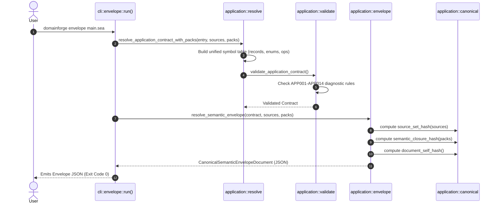

# Execution Trace: Application Contract & Envelope Resolution

This document traces how DomainForge resolves modular SEA application source files into an unambiguous `ApplicationContract` and seals them into a `CanonicalSemanticEnvelope` (ADR-013).

---

## 1. Summary

The application resolution workflow parses multi-module SEA sources, populates a shared symbol table for entities, records, enums, and operations, validates operational constraints (input/output records, state effects, transaction boundaries, idempotency keys), calculates cryptographic source set hashes, and emits a sealed `CanonicalSemanticEnvelope` document.

---

## 2. Sequence Diagram

---

## 3. Step-by-Step Execution Trace

### Step 1: Input Ingestion
- **File**: `domainforge-core/src/cli/envelope.rs:18`
- **Action**: Reads the entry file path and any associated semantic pack paths. Loads all source text into a JSON map `{ "filename.sea": "content" }`.

### Step 2: Symbol Resolution
- **File**: `domainforge-core/src/application/resolve.rs:42`
- **Function**: `resolve_application_contract_with_packs()`
- **Action**:
  - Parses each source file into AST nodes.
  - Registers all `record`, `enum`, `operation`, and entity state bodies in an internal `ResolvedModuleSet`.
  - Resolves cross-file type references (e.g. `input CreateOrderRequest` where `CreateOrderRequest` was imported from another file).

### Step 3: Contract Validation & Diagnostic Gating
- **File**: `domainforge-core/src/application/validate.rs:20`
- **Action**: Enforces the ADR-013 normative rules:
  - **Entity Keys**: Verifies that every entity declaring a state body has exactly one `key` field (`APP001`).
  - **Operation Input/Output**: Verifies that operation inputs and outputs reference identityless `record` declarations, not entities (`APP004`).
  - **Transaction & Concurrency**: Verifies that non-read-only operations declare valid idempotency keys and optimistic or unique concurrency controls (`APP005`, `APP006`).
  - **Failure Branch**: If any rule fails, returns `Err(Vec<ApplicationDiagnostic>)` and terminates.

### Step 4: Cryptographic Hashing & Envelope Sealing
- **File**: `domainforge-core/src/application/envelope.rs:55`
- **Function**: `resolve_semantic_envelope()`
- **Action**:
  - **`source_set_hash`**: Computes SHA-256 over all canonicalized source text in alphabetical order of filename.
  - **`semantic_closure_hash`**: Computes SHA-256 over all resolved semantic packs and concept bindings.
  - **`input_fingerprint`**: Hashes compiler flags and active options.
  - **`document_self_hash`**: Hashes the entire envelope document (excluding the hash field itself) to ensure tamper-evidence.

### Step 5: Document Output
- Emits formatted JSON conforming to `schemas/application-contract.schema.json` and `schemas/canonical-semantic-envelope.schema.json`.

---

## Source Trail
- `domainforge-core/src/cli/envelope.rs` — CLI envelope runner
- `domainforge-core/src/application/resolve.rs` — Contract resolution engine
- `domainforge-core/src/application/validate.rs` — Operational constraint validator
- `domainforge-core/src/application/envelope.rs` — Canonical envelope sealer
- `domainforge-core/src/application/canonical.rs` — Hash calculation functions
- `domainforge-core/tests/application_contract_tests.rs` — Application contract tests
