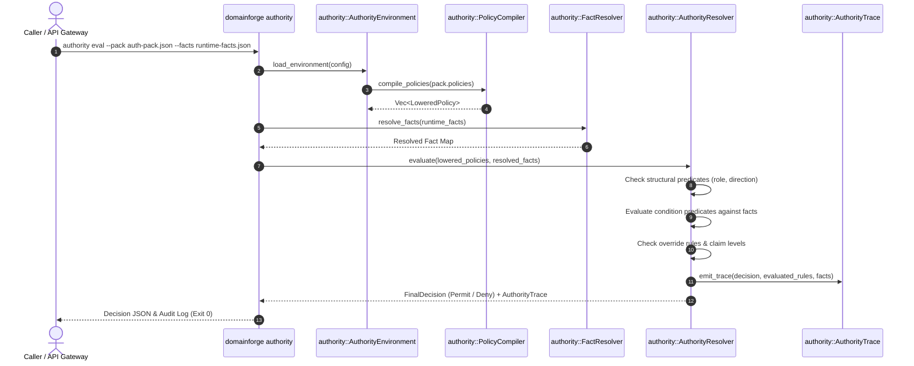

# Execution Trace: Authority Evaluation & Evidence Tracing

This document traces how DomainForge audits and evaluates runtime compliance and access decisions using the Authority Engine, producing a structured `AuthorityTrace`.

---

## 1. Summary

The authority evaluation workflow compiles high-level SEA policy definitions into lowered execution rules, queries registered fact sources to extract context from runtime payloads, resolves obligations and overrides, reaches a definitive `FinalDecision` (`Permit`, `Deny`, `Indeterminate`), and emits a tamper-evident audit trace.

---

## 2. Sequence Diagram

---

## 3. Step-by-Step Execution Trace

### Step 1: Ingestion of Policies and Facts
- **File**: `domainforge-core/src/cli/authority.rs:25`
- **Action**: Loads an `AuthorityPack` (or SEA source model) and a JSON file containing runtime context facts (e.g. user ID, requested amount, time of day, approval signatures).

### Step 2: Policy Compilation & Lowering
- **File**: `domainforge-core/src/authority/compiler.rs:38`
- **Function**: `PolicyCompiler::compile()`
- **Action**: Converts high-level policy expressions into `LoweredPolicy` objects. Maps expressions to required fact keys (e.g., requires `transaction.amount` and `user.roles`).

### Step 3: Fact Resolution
- **File**: `domainforge-core/src/authority/fact_resolver.rs:40`
- **Function**: `FactResolver::resolve()`
- **Action**: Traverses the context payload to satisfy the fact requirements of each active policy:
  - If a required fact is absent from the input payload, marks that fact's status as `MissingFact`.

### Step 4: Decision Resolution
- **File**: `domainforge-core/src/authority/resolver.rs:65`
- **Function**: `AuthorityResolver::evaluate()`
- **Action**:
  - Matches policies whose structural predicates match the event (e.g. actor role = "Manager").
  - Evaluates condition expressions against resolved fact values.
  - If any obligation is unmet, the tentative decision is `Deny`.
  - Checks if an authorized override rule applies.
  - **Verdict**: Computes `FinalDecision::Permit` or `FinalDecision::Deny`. If essential facts are missing, returns `FinalDecision::Indeterminate`.

### Step 5: Trace Recording
- **File**: `domainforge-core/src/authority/trace.rs:30`
- **Action**: Assembles the `AuthorityTrace` struct:
  - Timestamp (ISO 8601 UTC)
  - Evaluated rule IDs and names
  - List of resolved facts and their values
  - Final decision and rationale
  - Emits trace to stdout or configured `EvidenceSink`.

---

## Source Trail
- `domainforge-core/src/cli/authority.rs` — CLI authority evaluator
- `domainforge-core/src/authority/compiler.rs` — Policy compiler and lowering logic
- `domainforge-core/src/authority/resolver.rs` — Authority decision engine
- `domainforge-core/src/authority/fact_resolver.rs` — Context fact resolver
- `domainforge-core/src/authority/trace.rs` — Evidence trace data structures
- `domainforge-core/tests/authority_conformance_tests.rs` — Conformance verification suite
