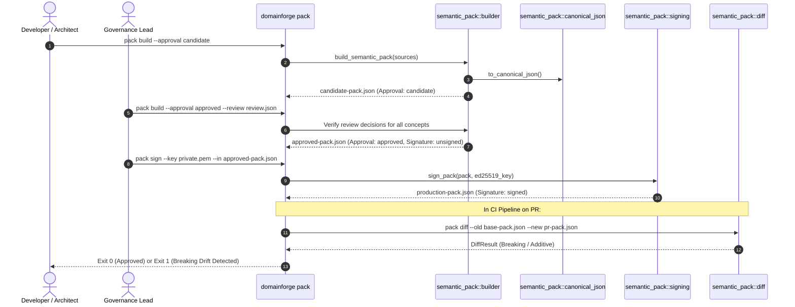

# Execution Trace: Semantic Pack Lifecycle & Signing

This document traces the complete operational lifecycle of a Semantic Pack—from authoring concepts in `.sea` files to candidate building, human review verification, Ed25519 cryptographic signing, and semantic drift detection.

---

## 1. Summary

A Semantic Pack is the contract an enterprise uses to eliminate vocabulary drift across systems and teams. The lifecycle proceeds sequentially: source extraction into a candidate pack $\rightarrow$ human review verification into an approved pack $\rightarrow$ Ed25519 signing into an immutable production pack $\rightarrow$ continuous semantic diffing in CI to catch breaking changes.

---

## 2. Sequence Diagram



---

## 3. Step-by-Step Execution Trace

### Phase 1: Build Candidate Pack
```bash
domainforge pack build \
  --source "models/**/*.sea" \
  --org acme \
  --domain logistics \
  --version 1.0.0 \
  --meaning-version 1.0.0 \
  --approval candidate \
  --out candidate.json
```
- **File**: `domainforge-core/src/semantic_pack/builder.rs:45`
- **Function**: `build_semantic_pack()`
- **Action**:
  - Parses all matching `.sea` files and merges them into a unified graph.
  - Extracts all entities, resources, flows, relations, metrics, units, and aliases.
  - Generates a definition hash for each concept and combines them into the `meaning_fingerprint`.
  - Emits JSON with `approval: "candidate"` and `signature: { "state": "unsigned" }`.

### Phase 2: Review Verification
```bash
domainforge pack build \
  --source "models/**/*.sea" \
  --org acme \
  --domain logistics \
  --version 1.0.0 \
  --meaning-version 1.0.0 \
  --approval approved \
  --review review-records.json \
  --out approved.json
```
- **File**: `domainforge-core/src/semantic_pack/validator.rs:32`
- **Action**:
  - Verifies that every concept in the pack has a corresponding entry in `review-records.json`.
  - Verifies that each decision is either `approve` or `minor_amendment_no_semantic_change`.
  - **Failure Branch**: If any active concept is unreviewed or has a `reject` decision, build fails immediately with `missing_review_record`.

### Phase 3: Cryptographic Signing
```bash
domainforge pack sign \
  --in approved.json \
  --key secrets/ed25519_private.pem \
  --out production-pack.json
```
- **File**: `domainforge-core/src/semantic_pack/signing.rs:24`
- **Function**: `sign_pack()`
- **Action**:
  - Computes the canonical SHA-256 hash of the pack payload.
  - Constructs the signature payload: `<content_hash>:<pack_id>:<schema_version>`.
  - Signs the payload using the Ed25519 private key.
  - Inserts the signature and public key into `trust.signature` with `state: "signed"`.

### Phase 4: Drift Detection in CI
```bash
domainforge pack diff \
  --old current-production.json \
  --new pr-candidate.json \
  --format json
```
- **File**: `domainforge-core/src/semantic_pack/diff.rs:18`
- **Function**: `diff_packs()`
- **Action**:
  - Compares concepts between the two pack versions.
  - If any concept was deleted or field was removed, categorizes change as `SemanticDiffKind::Breaking`.
  - **Failure Branch**: If breaking changes exist and `--fail-on-breaking` is set, exits with code 1, blocking PR merge.

---

## Source Trail
- `domainforge-core/src/cli/pack.rs` — CLI pack command handler
- `domainforge-core/src/semantic_pack/builder.rs` — Pack construction and hashing
- `domainforge-core/src/semantic_pack/signing.rs` — Ed25519 cryptographic signing
- `domainforge-core/src/semantic_pack/diff.rs` — Semantic drift detection
- `domainforge-core/tests/semantic_pack_signing.rs` — Signing verification tests
